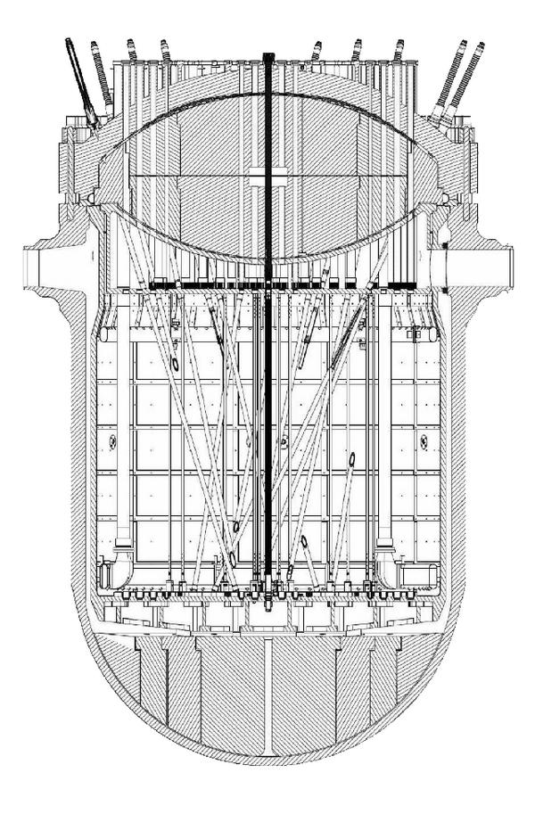
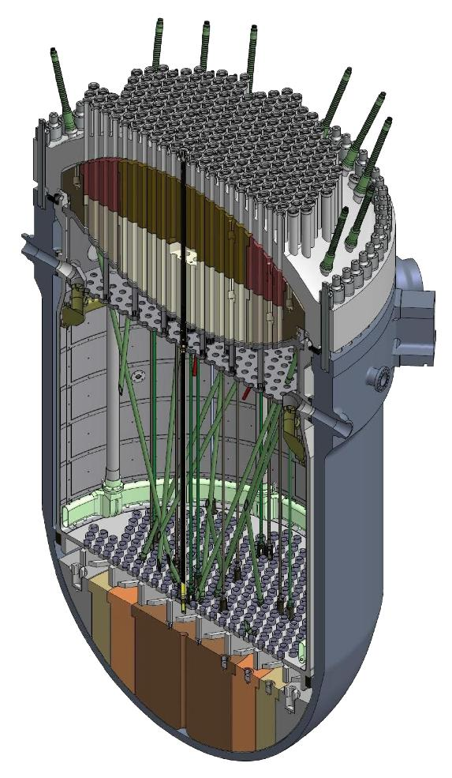
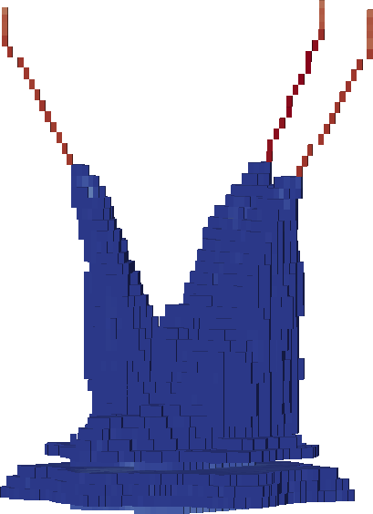

# Introducción {#sec-introduccion}

::: {.chapterquote .raggedright data-latex=""}
> | En su programa de televisión junto a Antonio Carrizo, el personaje de “El Contra” le pregunta a un invitado DT:
> | --- Supongamos que van 45’ del segundo tiempo y su equipo está atacando. ¿Qué prefiere? ¿Que le den un córner o un lateral?
> | --- ¿Qué pregunta es esa? Un córner, porque tengo una chance de llegar al área.
> | --- Con el lateral también. Nosotros allá en Villa Dálmine, durante la semana entrenamos laterales con sandías. Cuando llega el domingo, (lo mira a Antonio Carrizo) ¿sabés hasta dónde tiramos la pelota?
> 
> _Juan Carlos Calabró, 1993_

> Lo que yo daba por obvio dejó de serlo de un día para otro, concretando un choque que
> ---debo admitir--- ha vuelto a sucederme muchas veces desde entonces.
> Si hoy no me detengo a pensar un momento, vivo  convencido de que todo el mundo es ingeniero nuclear o doctor en física.
>
> _Germán Theler, La Singularidad, 2006_
:::


 1. En los congresos académicos sobre métodos numéricos y aplicaciones, muchas veces uno puede ver un esquema similar al siguiente:

    a. Se muestra el estado del arte y se describen las falencias de un cierto algoritmo tradicional.
    b. Se propone una nueva idea o metodología para mejorar dicho estado del arte.
    c. Se aplican las novedades a un caso sencillo donde, efectivamente, la eficiencia o la precisión mejoran sensiblemente.
    d. Se indica que los próximos pasos serán resolver no ya problemas canónicos sino problemas de interés industrial.

    Pero también muchas veces, el nuevo desarrollo nunca llega efectivamente a la industria.
    El ímpetu de la investigación se va difundiendo a lo ancho de nuevas asignaciones de fondos de investigación que se enfocan en otras áreas, de gente que cambia de ideas, se jubila, etc. Las aplicaciones quedan en una lista de tareas "por hacer" ([TO-DOs]{lang=en-US}).

 2. Los proyectos de ingeniería industriales están indefectiblemente restringidos por los tres vértices del triángulo de gerenciamiento de proyectos costos-alcance-calidad.
 Cualquier tarea de tipo de I+D+i en temas de modelado numérico debe necesariamente 

    ```{=latex}
    \label{puntodos}
    ```
    
    a. Ser pagada por el cliente.
    b. Ser aprobada por el cliente (o por quien el cliente designe, incluyendo agencias de regulación).
    c. Ser gerenciada de forma tal que los costos sean menores a los precios de venta.
 
    Durante el desarrollo de este tipo de proyectos se suelen identificar muchas ideas y tareas que podrían llevarse a cabo para generar nuevas oportunidades técnicas y comerciales. Pero la mayoría de las veces vienen nuevos proyectos con clientes diferentes y necesidades ortogonales. Las ideas quedan en una lista de [TO-DOs]{lang=en-US}.

 3. En el ambiente de emprendedurismo, hay [start ups]{lang=en-US} relacionadas a temas de modelado numéricos de fenómenos complejos con interés en ingeniería. A menos que los fundadores tengan habilidades excepcionales como las de Henry Ford que en lugar de desarrollar "caballos más rápidos" creó una industria global desde cero, los casos de éxito están relacionados a tecnologías no muy disruptivas en sí mismas que termina en una adquisición por parte de una gran compañía existente, con sus inercias e idiosincrasias corporativas. Más aún, en el ámbito nuclear las regulaciones y la financiación de nuevas instalaciones es tan complicada que necesariamente deben involucrarse entidades oficiales que complican mucho más aún la dinámica característica de las [start-ups]{lang=en-US}. El ímpetu se va difundiendo en organigramas rígidos poco amenos a la innovación. La mayoría de las ideas quedan en una lista de [TO-DOs]{lang=en-US}.
 
Habiendo explorado profesionalmente con bastante detalle cada uno de estos tres puntos durante los últimos quince años, he decido escribir esta tesis de doctorado en forma atípica y excepcional---en el sentido de "excepción". Empezando por mi edad al momento de entregar y defender esta tesis y siguiendo por la forma de encarar los trabajos (como por ejemplo el propuesto en la presentación @garcar2022).
Los desarrollos aquí descriptos han sido claramente inspirados por estos tres puntos, pero fueron realizados en forma completamente independiente de estos tres ámbitos.
Es esta una tesis escrita durante los fines de semana por un profesional de la industria del software de cálculo numérico sin los condicionamientos particulares de la academia, la industria ni el emprendedurismo.
Representa entonces, una manera de poder evaluar---dentro de las capacidades y responsabilidades que me atañen---la diferencia entre lo urgente y lo importante como propone Mafalda (@fig-mafalda).


{#fig-mafalda}

El objetivo principal es entonces sentar las bases para que las tareas identificadas como potenciales generadoras de nuevas oportunidades técnicas y comerciales, mencionadas explícitamente en la @sec-trabajos-futuros, no queden solamente en una lista de puntos ["nice to have"]{lang=en-US}.
 
El contenido general de esta tesis es una mezcla de 

 i. física de neutrones y reactores a nivel de núcleo
 ii. programación en computación de alto rendimiento
 
que son justamente las dos mitades del título y los temas profesionales en los que me desempeñé en la academia, en la industria y en el mundo del emprendedurismo. Este contenido está distribuido en seis capítulos, incluido este, ordenados según el orden de presentación "por qué", "cómo" y "qué":

 a. ¿Por qué?
 
   * [@sec-introduccion]: Introducción

 b. ¿Cómo?
 
   * [@sec-transporte-difusion]: Transporte y difusión de neutrones
   * [@sec-esquemas]: Esquemas de discretización numérica

 c. ¿Qué?
 
   * [@sec-implementacion]: Implementación computacional
   * [@sec-resultados]: Resultados

Debo reconocer que la extensión de esta tesis es mayor que la que me hubiese gustado que tenga.
Pero también es cierto que he necesitado escribir todo este texto (y ecuaciones) ya que de esta forma he podido entender y procesar toda la información necesaria para hacer aportes originales a mis cuarenta años.
El primer capítulo ([why]{lang=en-US}) contiene apreciaciones un tanto subjetivas pero basadas en experiencia sólida.
Los siguientes dos capítulos ([how]{lang=en-US}) contienen desarrollos matemáticos harto conocidos pero, como allí se menciona, funcionan como una amalgama uniforme de varias fuentes de forma tal de generar una base teórica del desarrollo en sí mismo, y de permitirme "digerir" el cuerpo teórico detrás de los métodos numéricos relacionados al transporte de neutrones a nivel de núcleo.
Los últimos dos capítulos ([what]{lang=en-US}) contienen el núcleo de la contribución original.

## Cien años de programación {#sec-cien-anios}

Durante mi paso por la industria nuclear en el completamiento de la Central Nuclear Atucha II (el punto 2 `de la página~\pageref{puntodos}`{=latex}) he tenido la experiencia de emplear herramientas computacionales de cálculo neutrónico, termohidráulico y de control @dypra-stni.
Por razones que no viene al caso analizar, aún en la década de 2010, mucho del software empleado había sido diseñado originalmente varias décadas antes cuando los paradigmas computacionales eran radicalmente diferentes.
Por ejemplo, la @tbl-1965-intro muestra un punto central de este paradigma: el costo de la hora de CPU de las computadoras usualmente utilizadas para cálculos nucleares en 1965 @computadoras65.


::: {#tbl-1965-intro}
 Computer | Monthly Rental  | Relative Speed | First Delivery 
:----------------|:------------------------:|:-----------:|:-----------:
 CDC 3800        |         $ 50,000         |     1       |  Jan 66
 CDC 6600        |         $ 80,000         |     6       |  Sep 64
 CDC 6800        |         $ 85,000         |     20      |  Jul 67
 GE 635          |         $ 55,000         |     1       |  Nov 64
 IBM 360/62      |         $ 58,000         |     1       |  Nov 65
 IBM 360/70      |         $ 80,000         |     2       |  Nov 65
 IBM 360/92      |         $ 142,000        |     20      |  Nov 66
 PHILCO 213      |         $ 78,000         |     2       |  Sep 65
 UNIVAC 1108     |         $ 45,000         |     2       |  Aug 65

: [Relative speed is expressed with reference to IBM 7030. Data for computers expected to appear after 1965 was estimated.]{lang=en-US} {#tbl-1965a-intro}

Tabla "Las nuevas computadoras de alta velocidad de 1965" de la referencia @computadoras65. Los costos están expresados en dólares americanos de 1965 y pueden variar en un factor de dos. Un dólar de 1965 equivale a USD 10 de 2024.
:::


Cuando el sistema operativo Unix fue introducido a principios de la década de 1970 @unix, los diseñadores ya habían previsto un gran descenso en los costos del [hardware]{lang=en-US} y un corrimiento de costos de CPU a ingeniería.
De hecho una de las 17 reglas de la filosofía de Unix en las que se basa largamente el diseño de la herramienta computacional objeto de esta tesis (@sec-unix) se denomina "Regla de Economía" que indica que el [software]{lang=en-US} debe ser diseñado pensando en que el tiempo de la persona que usa el programa es mucho más valioso que el del [hardware]{lang=en-US} que lo ejecuta.
Hoy en día, alquilar una hora de CPU de una computadora razonablemente rápida y con suficiente memoria para realizar cálculos nucleares estándar sale menos de 0,15 USD. Un servidor con 16Gb de RAM disponible 100% del tiempo se puede conseguir por veinte dólares al mes.

La forma de diseñar software de cálculo hoy en día debe ser, entonces, radicalmente diferente a la usada media docena de décadas atrás.
En el [capítulo @sec-implementacion] discutimos en detalle todas estas particularidades, pero el ejemplo clásico se reduce a aquellos programas de cálculo (sobretodo termohidráulicos) en los que la salida está compuesta exactamente por todos y cada una de los resultados calculados, incluyendo distribuciones espaciales y temporales. Esta decisión de diseño tiene sentido cuando es muy caro tener que volver a realizar un cálculo porque un cierto valor requerido no forma parte de la salida.
Pero esto implica que el ingeniero a cargo del cálculo debe buscar y filtrar solamente aquellos resultados necesarios en medio de un pajar de información a un costo horario miles de veces superior a tener que volver a realizar el cálculo pidiendo explícitamente el resultado requerido, y nada más.

El diseño del sistema operativo Unix (y del lenguaje de programación C, estrechamente relacionado) ha dado en el clavo en muchos aspectos técnicos que hacen que su tecnología esté vigente como nunca más de cincuenta años después de las decisiones de diseño. Tanto es así que prácticamente todos los servidores públicos de Internet funcionan sobre alguna variante de este diseño. Más aún, la arquitectura es tan sólida que aunque en las décadas de 1990 y 2000 hayan aparecido muchas herramientas de cálculo basadas en Windows (la invasión del ["X for Windows"]{lang=en-US} que, en mi humilde opinión, ha sido perjudicial para la salud de la comunidad de la mecánica computacional), se ha probado que es técnica y económicamente  mucho más eficiente recurrir a un esquema de alquiler de recursos computacionales (la nube pública) en lugar de recurrir a comprar y mantener servidores propios ([on premise]{lang=en-US}). Desde el punto de vista económico, lo segundo implica costos de capital mientras que lo primero son costos de operación. Desde el punto de vista técnico, no tiene ningún sentido comprar hardware cuyo nivel de utilización será menor al 100%.
En terminología de [start ups]{lang=en-US}: "[rent, don't buy]{lang=en-US}".

En este sentido, la herramienta computacional de cálculo desarrollada desde cero en esta tesis para resolver ecuaciones diferenciales en derivadas parciales fue diseñada para ser ejecutada _nativamente_ en la nube. Como explicamos en detalle en la @sec-cloud, haciendo un paralelismo con la nomenclatura de interfaces web donde hay diseños [mobile friendly]{lang=en-US} y [mobile first]{lang=en-US}, decimos que la herramienta es [cloud first]{lang=en-US} y no solamente [cloud friendly]{lang=en-US}.

A lo largo de otro paso profesional por el punto 2 en la industria de la consultoría y del desarrollo de software, aprendí que un esquema usual de contratación entre un cliente y un proveedor de software consiste en que el primero prepara un documento titulado ["Software Requirements Specification"]{lang=en-US} listando justamente los requerimientos técnicos que el software a comprar debe cumplir como una especie de pliego técnico particular. Entonces los potenciales proveedores preparan un documento de ["Software Design Specification"]{lang=en-US} en el que explican técnicamente cómo planean cumplir con los requerimientos. Una especie de oferta técnica al pliego.
Teniendo en cuenta estas consideraciones (más la experiencia de los tres puntos del comienzo del capítulo), he decidido entonces organizar el diseño de una nueva herramienta partiendo primero de un SRS ficticio (pero plausible), pidiendo lo que me gustaría que una herramienta computacional [cloud first]{lang=en-US} cumpla.
A partir de estos requerimientos, empecé a estudiar la forma de cumplirlos, implementarlos y documentarlos en un SDS.
Ambos documentos forman parte de los apéndices de esta tesis ([apéndices @sec-srs] y [-@sec-sds]).

Además del requerimiento de que la herramienta desarrollada corra en la nube, se requiere también que el software desarrollado sea libre y abierto. Este punto es de especial importancia tanto en la academia como en la industria (por diferentes razones en cada caso) y sus implicaciones son usualmente ignoradas, especialmente en la industria nuclear. En la @sec-licencia explicamos las razones de dicha importancia.

Otra característica, explicada en detalle en el [capítulo @sec-implementacion], es que la arquitectura del código fue diseñada en forma tal que sea extensible en el sentido de poder agregar nuevas formulaciones de ecuaciones a resolver en forma razonablemente sencilla sin necesidad de tener que escribir un nuevo [solver]{lang=en-US} para cada ecuación.
La forma de implementar esta característica se basa en un esquema de apuntadores a función resueltos en tiempo de ejecución según el tipo de problema que se requiere resolver definido en el archivo de entrada.

Un requerimiento importante es que la herramienta sea escalable en paralelo para permitir resolver problemas relativamente grandes con discretizaciones relativamente finas.
En forma abstracta, la idea de paralelización de un código de cálculo se suele asociar a la posibilidad de obtener resultados en forma más rápida que en el caso serie sin paralelizar ya que, en principio, al disponer de más unidades de procesamiento es posible realizar más operaciones de coma flotante por unidad de tiempo.
Pero desde el punto de vista de esta tesis, el principal objetivo _no_ es el tiempo de cálculo sino la cantidad de memoria necesaria para poder resolver un cierto problema, como explicamos a continuación.
En forma particular, y sin entrar en detalles técnicos, existen esencialmente tres tipos de paralelismo @intro-parallel:

Sistemas de memoria compartida (OpenMP)

:   múltiples unidades de procesamiento vinculadas a un único espacio de direcciones de memoria.

Sistemas distribuidos (MPI)

:   múltiples unidades computacionales, cada una con sus unidades de procesamiento y memoria, conectadas entre sí a través de redes de alta velocidad.

Unidades de procesamiento gráfico (GPU)

:   utilizadas como co-procesadores para resolver problemas numéricamente intensivos.


Tanto en el caso OpenMP como GPU, los [threads]{lang=en-US} que corren en paralelo comparten la memoria física de acceso aleatorio (RAM). Entonces mientras mayor sea el problema, más memoria se necesitará. Eventualmente, para algún cierto tamaño de problema crítico, se llegará a un límite de memoria  que no se podrá franquear.
Pero en el caso de MPI @mpi, como los procesos paralelos pueden estar en diferentes computadoras físicas (o no), la memoria total disponible se puede hacer arbitrariamente grande agregando nuevos [hosts]{lang=en-US} al sistema distribuido. En efecto, en el [capítulo @sec-resultados] mostramos que para un tamaño de problema fijo la memoria por proceso MPI disminuye monótonamente con la cantidad de procesos.
Al combinar esta capacidad con el requerimiento de que la herramienta pueda correr en la nube, en principio se podrían resolver problemas de tamaño arbitrario si se pudieran alquilar suficientes instancias [cloud]{lang=en-US}.

::: {.remark}
La biblioteca PETSc @petsc-user-ref, que es la que usa la herramienta desarrollada en esta tesis para resolver los problemas ralos que resultan de discretizar ecuaciones diferenciales en derivadas parciales, basa su esquema de paralelización en el paradigma MPI. Sus desarrolladores manifiestan expresamente---tanto en forma escrita a través de correos electrónicos como en forma oral en las reuniones anuales de usuarios @reflex-petsc---que no hay ninguna razón técnica para preferir el paradigma OpenMP sobre el MPI. Si bien hay esfuerzos para soportar OpenMP en PETSc, éstos apuntan solamente a dar soporte a código existente para que pueda aprovechar las ventajas de PETSc. Los desarrolladores recomiendan diseñar código nuevo basando en MPI por sobre OpenMP.
:::

::: {.remark}
Con respecto a GPU, PETSc provee interfaces para los SDKs más comunes (CUDA, HIP, SYCL, Kokkos, etc.) que pueden  descargar^[En el sentido del inglés [*offload*]{lang=en-US}.] operaciones de álgebra elemental en tiempo de ejecución con opciones de línea de comando. Una de las ventajas particulares de la filosofía Unix de hacer una sola cosa bien y re-utilizar las cosas que ya están bien hechas es que la herramienta desarrollada en esta tesis tiene soporte para GPU "gratis" aprovechando estas interfaces.
:::

 
Combinando estos requerimientos del SRS ([apéndice @sec-srs]) y la forma en la que se abordan desde el punto de vista del diseño en el SDS ([apéndice @sec-sds]) e implementación ([capítulo @sec-implementacion]), considero que la contribución de esta tesis es original ya que no tengo conocimiento de la existencia de un software similar que cubra las mismas características requeridas. Tal vez existan algunas que cumplan un par de los requerimientos, o incluso alguna que cumpla una cierta fracción significativa. Pero ninguna el 100%.
Esto es más notable aún teniendo en cuenta que el objeto principal de estudio de esta tesis es la neutrónica a nivel de núcleo, resuelta tanto con difusión como con ordenadas discretas sobre mallas no estructuradas. 
A modo de ejemplo de la clase de contribución que propongo, consideremos el [Benchmark PWR 3D]{lang=en-US} propuesto por la IAEA en 1976 @anl7416. La @fig-iaea-3dpwr-eighth-circular-flux-s4 muestra el resultado de haber resuelto el problema pero...

::: {#fig-iaea-3dpwr-eighth-circular-flux-s4 layout="[1,1]"}
{#fig-iaea-3dpwr-orig-top}

{#fig-iaea-3dpwr-orig-side}

{#fig-iaea-3dpwr-eighth-flux-s4-1}

{#fig-iaea-3dpwr-eighth-flux-s4-2}

Benchmark PWR 3D de IAEA @anl7416 para ilustrar las características distintivas de la formulación propuesta. Resolvemos en detalle este problema en la @sec-2dpwr.
:::

 1. con una simetría 1/8 en lugar de la simetría 1/4 original,
 2. con un reflector cilíndrico en lugar de un reflector compuesto por planos perpendiculares a los ejes cartesianos,
 3. resuelto con una formulación S$_4$ de ordenadas discretas en lugar de la original de difusión, y
 4. en paralelo utilizando cuatro procesos independientes.


Cada uno de estos cuatro puntos está detalladamente explicado en el cuerpo de la tesis y, junto con
 
  i. la capacidad de extender el área de los problemas a resolver agregando nuevas formulaciones de ecuaciones discretizadas con el método de elementos finitos (ver el [apéndice @sec-sds] para ejemplos por fuera de la neutrónica de núcleo)
  ii. el diseño [cloud first]{lang=en-US} que permite realizar lo que se conoce como "simulación programática" sin necesidad de interactuar
  iii. la discretización del dominio utilizando mallas no estructuradas, potencialmente realizando descomposición de dominio
  iv. la posibilidad de escalar en paralelo mediante y poder resolver problemas de tamaño arbitrario
  
constituyen el [unfair advantage]{lang=en-US}---en el sentido del [canvas]{lang=en-US} de modelo de negocios---de la herramienta desarrollada @feenox-2024.

Pero es la combinación de todos ellos la que configura la propuesta de la tesis, minuciosamente explicada en la @sec-propuestas: poder disponer de una herramienta computacional que permita resolver problemas de neutrónica a nivel de núcleo de tamaño arbitrario a través de la escalabilidad en paralelo basado en el estándar MPI. Lo importante es que, como mostramos en el [capítulo @sec-resultados], hacemos una descomposición del dominio y de "repartimos" la carga computacional---especialmente la memoria RAM que usualmente es el recurso limitante---en varios procesos. Esto hace posible resolver problemas formulados con S$_N$ en mallas no estructuradas en principio de tamaño arbitrario y, eventualmente, poder compararlos con la aproximación de difusión que es computacionalmente mucho menos demandante. Para ello se necesita sobrepasar las limitaciones de las herramientas neutrónicas tradicionales (@sec-limitaciones), que es la idea central de esta tesis.

::: {.remark}
Este trabajo sólo se enfoca en el desarrollo de la herramienta necesaria para realizar la comparación.
Un estudio cuantitativo de la eficiencia de diferentes esquemas numéricos para hacer ingeniería neutrónica de núcleo implicaría un proyecto de ingeniería de varios hombre-años más sus costos indirectos asociados.
En la @sec-trabajos-futuros listamos algunos de los trabajos futuros que podría derivar de las bases sentadas en esta tesis.
:::


Finalmente, a modo personal debo notar que en el Proyecto Integrador de mi Carerra de Ingeniería Nuclear traté temas de control en [loops]{lang=en-US} de convección natural caóticos [@theler2007] y en la Tesis de Maestría en Ingeniería traté temas de inestabilidades termohidráulicas en presencia de una fuente de potencia de origen neutrónico [@theler2008].
Poder realizar una tesis de doctorado en temas de neutrónica de nivel de núcleo me permite cerrar en forma académica el lazo termohidráulica-neutrónica-control, que fue también el eje de mi participación profesional en el completamiento de la Central Nuclear Atucha II.


## Historia de dos reactores {#sec-neutronica-phwr}

El reactor de la Central Nuclear Atucha I fue puesto en condición crítica el 13 de enero de 1974, constituyendo así la primera planta de generación nucleoeléctrica instalada en América Latina. Es un reactor térmico de 357 MWe brutos, moderado por agua pesada con canales combustibles verticales refrigerados también por agua pesada a la misma presión que el moderador pero a diferente temperatura. Debido a que el combustible es uranio natural, la poca reactividad en exceso hace que el reactor deba tener un recambio de combustible continuo. Para ello existe una máquina de recambio que opera verticalmente sobre la tapa superior del reactor extrayendo elementos combustibles gastados e introduciendo frescos a un ritmo aproximado de uno por día. El resto del tiempo la máquina opera haciendo un mezclado^[En el sentido del inglés [*shuffling*]{lang=en-US}.] para homogeneizar el quemado de los combustibles y optimizar el quemado de extracción final. Dado que la parte superior del recipiente de presión debe quedar libre para que trabaje la máquina de recambio, los mecanismos de control de reactividad tanto primarios (las barras de control) como secundarios (sistema de inyección de boro de emergencia) deben entrar el núcleo en forma oblicua a los canales combustibles, configurando un diseño esencialmente único en el mundo.

Atucha II tiene un diseño similar aunque genera más del doble de potencia, 745 MWe brutos. Debido a una combinación de causas que quedan fuera del alcance de cualquier análisis, el contrato de construcción se firmó en 1980 pero la obra no se terminó hasta 2014. Detalles más detalles menos, el diseño del reactor es similar al de Atucha I (@fig-rpv).

::: {#fig-rpv layout="[50,50]" layout-valign="bottom"}

{#fig-rpv2d}

{#fig-rpv3d}

[Layout]{lang=en-US} de canales y tubos guía de barras de control en el reactor de presión de la Central Nuclear Atucha II @dypra-stni.
:::


### Neutrones contantes y sonantes

El martes 3 de junio de 2014 a las 9:03 el núcleo^[En el sentido del inglés [*core*]{lang=en-US}.] de la Central
Nuclear Atucha II logró mantener por primera vez una reacción nuclear de
fisión en cadena autosostenida. Este suceso marcó un hito no sólo en la
industria nuclear argentina sino también en mi carrera profesional.
Durante cinco años y medio estuve trabajando desde TECNA S.A. junto a un
equipo ingenieros de Nucleoeléctrica Argentina S.A. en el desarrollo de
modelos y códigos de cálculo acoplados para predecir, estudiar y
analizar el comportamiento de la central teniendo en cuenta neutrónica
espacial, realimentaciones termohidráulicas y acciones del sistema de
control, limitación y protección del reactor.
Esa mañana pude presenciar de primera mano las indicaciones
de los instrumentos que mostraban un incremento lineal en el tiempo de
la señal de nivel de flujo neutrónico en el núcleo del reactor, que es
lo que yo había leído en los libros de texto que debía suceder en un
reactor crítico en presencia de una fuente independiente de neutrones.
Para terminar de despejar cualquier clase de dudas (incluyendo físicas,
tecnológicas e industriales), durante los siguientes meses continué
dando soporte de ingeniería a las tareas de aumento escalonado de
potencia hasta el cien por ciento, obteniendo evidencia experimental a
prueba de escépticos de que realmente el reactor era capaz de generar
potencia térmica a partir de la fisión del uranio mediante reacciones
inducidas por neutrones.

### Más de una rueda de auxilio

Aún cuando no son deseados, los imprevistos existen. Es por eso que todos
nos aseguramos de que la rueda de auxilio de nuestro auto esté en
condiciones antes de emprender un viaje más o menos largo ya que existe
una probabilidad $p_1$ no nula de que se nos pinche una cubierta en el camino.
¿Pero por qué decimos *la* rueda de auxilio y no *las* ruedas de auxilio?
¿Acaso la probabilidad $p_2 \approx p_1^2$ de pinchar no una sino *dos* cubiertas en sucesos independientes no es también diferente de cero al fin y al cabo?
Sí, claro, pero esa probabilidad $p_2 \ll 1$ es tan pequeña que no vale la pena el
esfuerzo y el costo que implica llevar dos ruedas de auxilio en nuestro
automóvil. Llegado el caso, llamamos a la grúa. En el diseño de
centrales nucleares usamos un razonamiento similar: para todos los
eventos cuyas probabilidades $p_i$ de ocurrencia sean significativas
(accidentes de base de diseño) debemos tomar precauciones; para el resto
(accidentes fuera de la base de diseño), preparamos soluciones de contingencia.

En general, los reactores nucleares de potencia necesitan más de un
único mecanismo de extinción de las reacciones de fisión. El primero consiste en
las mismas barras de control, que son insertadas rápidamente dentro del
núcleo para absorber neutrones y no permitir que las fisiones se
auto-sostengan en el tiempo. Si bien la probabilidad de que este
mecanismo falle es pequeña en términos absolutos, debemos incluir al
menos un sistema más de extinción del reactor redundante, diverso e
independiente. En el caso de las Centrales Nucleares tipo Atucha, el
segundo sistema de extinción del reactor consiste en inyectar
rápidamente una solución de ácido deuterobórico en el tanque del
moderador. De esta forma, como los núcleos^[En el sentido del inglés [*nuclei*]{lang=en-US}.] de $^{10}$Bo son grandes
absorbentes de neutrones, las reacciones de fisión se extinguen a medida
que el boro ingresa a la zona del núcleo del reactor.


### La conexión europea

Fue condición necesaria para la puesta a crítico de la central, la
preparación del Informe Final de Seguridad (FSAR) y su presentación a la
Autoridad Regulatoria Nuclear. Si bien la mayor parte de la ingeniería
necesaria para su elaboración fue realizada en el país, debido a ciertas
características del proyecto Atucha II---tanto técnicas como de gerenciamiento, con las que coincido completamente---
para la evaluación de algunos
aspectos relacionados al Capítulo 15 de Análisis de Accidentes fueron
contratados consultores del exterior. En particular, el modelado de la
actuación del sistema de inyección de boro de emergencia y su efecto
sobre la neutrónica durante casos accidentales fue uno de estos
aspectos. Por un lado, este estudio involucraba cierto know-how y técnicas que no
estaban completamente desarrolladas en el país al momento de comenzar
los trabajos de licenciamento de la central. Por otro lado, suele ser
una buena práctica involucrar a grupos internacionales especializados,
sobretodo en temas complejos, delicados y sensibles.


### Aprendiendo de los que saben

::: {#fig-acopleboro layout-ncol=1}

{#fig-esquema-dos-pasos width=80%}

{#fig-esquema-full width=80%}

Esquema de acople propuesto para el modelado de accidentes que involucran la actuación del sistema de inyección de boro de emergencia en la Central Nuclear Atucha I. La primera alternativa es calcular la reactividad negativa debida a la inyección de boro y luego incorporar $\rho_b(t)$ a la reactividad total de las ecuaciones de cinética puntual. La segunda consiste en un esquema completamente acoplado utilizando cinética neutrónica espacial. En cualquier caso, la forma de incorporar la distribución espacio-temporal de concentración de boro en el moderador al código neutrónico es la misma.
:::

A partir de la experiencia ganada desde la interacción con estos
expertos y de las capacidades propias desarrolladas durante el proceso
de licenciamento de Atucha II, que han servido incluso para que los
consultores externos mejoren tanto sus propias capacidades como los
resultados provistos, es que a comienzos de 2014 Nucleoeléctrica decidió
que las tareas de actualización del Informe Final de Seguridad de la
Central Nuclear Atucha I utilizando modelos, métodos y códigos según el
estado del arte actual (i.e. los modelos, métodos y códigos usados para
licenciar Atucha II) sean realizadas íntegramente en el país por
ingenieros argentinos. En particular, la evaluación de la reactividad
negativa insertada por el sistema de inyección de emergencia y de los
efectos espaciales de la interacción neutrónica-termohidráulica durante
accidentes recayó sobre nuestro equipo de trabajo, cuando anteriormente se habían contratado
consultores europeos para realizar
dichas tareas de ingeniería [@ing2014-boro]. Durante 2014 hemos
trabajado en el diseño de un esquema de cálculo acoplado basado en recursos
de memoria compartida para permitir que durante el 2015 se realicen los
estudios necesarios para analizar una treintena de accidentes de base de
diseño que componen el Capítulo 15 del FSAR de la Central Nuclear
Atucha I @fig-acopleboro.


### Claro como el agua pesada

::: {#fig-arrays layout="[50,50]"}

{#fig-arrayatucha}

{#fig-arraycandu}

Arreglo de canales en el plano perpendicular a la dirección axial en los reactores de agua pesada que operan en la Argentina. En ambos casos los canales están inmersos en un tanque que contiene agua pesada que actúa como moderador de los neutrones que nacen en los elementos combustibles alojados en los canales. Ambas figuras están representadas en la misma escala espacial, por lo que se puede observar la diferencia en los pasos y en los radios de los canales.
:::


En los reactores de agua pesada presurizada, si bien las funciones de
refrigeración del combustible y moderación de los neutrones son
realizadas por el mismo material (justamente agua pesada), las
condiciones de temperatura a las que se encuentran refrigerante y
moderador son diferentes. Incluso en ciertos diseños y/o condiciones
operacionales, la presión puede ser diferente. Por lo tanto, desde el
punto de vista neutrónico se deben considerar como materiales
diferentes. El núcleo consiste en un arreglo periódico de canales
refrigerantes con sus ejes paralelos entre sí. En los reactores tipo
Atucha los canales se encuentran en forma vertical y con un arreglo
sobre el plano transversal basado en triángulos equiláteros, mientras
que éstos son horizontales y distribuidos como vértices de cuadrados en
reactores tipo CANDU (@fig-arrays). Los canales están inmersos en un gran tanque
que contiene el moderador líquido, que usualmente se mantiene más frío
que el refrigerante con el objetivo de mejorar la moderación y aumentar
así el factor de multiplicación infinito $k_\infty$ del núcleo. El
elemento combustible está compuesto por un arreglo de 37 barras
individuales que contienen las pastillas de
dióxido de uranio recubiertas por un [cladding]{lang=en-US} de [zircalloy]{lang=en-US}.

En los reactores de agua pesada la parada rápida del reactor se realiza
mediante la inserción de las barras de control por gravedad tal como en los reactores de agua liviana.
Pero el segundo sistema de extinción consiste en la inyección rápida de una solución
líquida absorbente de neutrones en el tanque del moderador, que es un componente único de este tipo de reactores.
En particular, para el caso de Atucha I y II se emplea ácido deuterobórico.


### Dos son compañía, tres son multitud

Podemos estudiar la mayoría de los casos que componen el Capítulo 15
"Análisis de accidentes" del FSAR utilizando cinética neutrónica puntual
separando las contribuciones individuales $\rho_x(t)$ debido al
efecto $x$ (barras de control, temperaturas, densidades, xenón, etc.) y
luego sumándolas algebráicamente para obtener una reactividad
total $\rho(t)$. Sin embargo, en algunos casos tales como los accidentes
con pérdida de refrigerante, es importante que consideremos efectos
espaciales al presentarse una retroalimentación compleja debido tanto a
las características termohidráulicas como neutrónicas de este tipo de
reactores. Ambas situaciones son tenidas en cuenta en el esquema
acoplado propuesto, que ilustramos en la @fig-acopleboro.
En él se involucra a un código de planta, a
un modelo de la lógica de control y protección del reactor y a un código
de cinética espacial capaz de incorporar distribuciones
espacio-temporales de propiedades, en particular concentración de boro
en el moderador, calculadas a partir de técnicas de dinámica de fluidos computacional,^[Del inglés [*Computational Fluid Dynamics*]{lang=en-US}.] conocidas por sus siglas como CFD.

### La gloriosa discretitud del alfabeto

El punto principal de esta tesis es que las herramientas de neutrónica de núcleo al final del día lo que hacen es utilizar computadores digitales para resolver ecuaciones diferenciales en derivadas parciales. Para ello es necesario discretizar el dominio espacial de la ecuación diferencial en derivadas parciales para obtener una cantidad finita de ecuaciones diferenciales ordinarias. La forma de discretizar el dominio depende de la formulación espacial discretizada. Los tres esquemas más comunes son

 1. diferencias finitas (FDM)
 2. volúmenes finitos (FVM)
 3. elementos finitos (FEM)

Dado un dominio espacial continuo (@fig-dominio-continuo), esencialmente se puede proceder de dos maneras diferentes.
O bien se superpone una grilla cartesiana (@fig-dominio-continuo-estructurado) y luego se ajusta el dominio a la grilla para obtener una malla estructurada (@fig-dominio-estructurado).
O bien se aplican técnicas de mallado no estructurado para obtener una malla que permita representar la geometría original con mucha mayor precisión para la misma cantidad de entidades discretas (@fig-dominio-no-estructurado).


::: {#fig-dominio layout="[45,-10,45]"}

{#fig-dominio-continuo}

{#fig-dominio-continuo-estructurado}

{#fig-dominio-estructurado}

{#fig-dominio-no-estructurado}

Discretizaciones estructurada y no estructurada de un dominio espacial arbitrario.
:::

La principal diferencia técnica entre estas dos clases de mallas reside en que en el primer caso la topología se da implícitamente con una cantidad mínima de información, como  por ejemplo número de celdas en cada dirección cartesiana o un vector de tamaños de celdas en cada dirección si la malla no es uniforme. En cambio, en el caso de mallas no estructuradas es necesario dar una lista explícita y completa indicando qué nodos definen qué celdas para poder obtener la topología y saber, por ejemplo, cómo es la conectividad de las celdas. Una forma eficiente de proveer esta conectividad es construir un grafo dirigido acíclico^[Del inglés [*directed acyclic graph*]{lang=en-US}.] (DAG) [@petsc-user-ref;@dmplex].

La mayoría de las herramientas de neutrónica a nivel de núcleo utilizadas en la industria nuclear mundial soportan solamente mallas estructuradas @fig-mallaspce.
En particular, todas las herramientas de neutrónica a nivel de núcleo empleadas en el análisis de seguridad de reactores tipo Atucha utilizan mallas estructuradas para resolver la ecuación de difusión de neutrones.
Por lo tanto, cuando hablemos de neutrónica en lo que resta del capítulo solamente aparecerán mallas estructuradas hasta que discutamos las propuestas de esta tesis de doctorado en la @sec-propuestas.

::: {#fig-mallaspce layout="[50,50]"}

{#fig-mallareprpce}

{#fig-mallacalcpce}

Mallas _estructuradas_ del código neutrónico utilizado en el esquema acoplado propuesto de la @fig-acopleboro para Atucha II @aatn-pumita-2014.
::: 


### Multi-física multi-escala

En cualquiera de los dos casos ilustrados en la @fig-acopleboro
para la evaluación de la neutrónica asociada
a la actuación del sistema de inyección de boro de emergencia, el código
neutrónico resuelve la ecuación de difusión de neutrones en el núcleo
con secciones eficaces macroscópicas homogeneizadas espacialmente a
nivel de canal refrigerante individual y condensadas a dos grupos de
energía. Es decir, la celda unitaria que se resuelve en el nivel de
cálculo de celda en el esquema multi-escala usual (@sec-multiescala) contiene un canal refrigerante con las
barras que componen el elemento combustible y una porción de moderador
asociada a dicho canal (@fig-celdacna1).


{#fig-celdacna1 width=55%}

\medskip

El código de núcleo trabaja con dos mallas (o retículas según la
nomenclatura propuesta por el autor original del código), ambas
_completamente estructuradas_: una de representación y una de cálculo como ilustramos en la @fig-mallaspce.
En la primera es donde se definen las
secciones eficaces macroscópicas que dependen de las propiedades medias
de la celda: quemado y temperatura de combustible, temperaturas y
densidades de moderador y refrigerante, concentración de boro en
moderador y refrigerante, concentración de xenón 135 en el combustible,
etc. En la segunda, que es una subdivisión de la primera, es donde se
resuelve numéricamente la ecuación de difusión de neutrones a partir de
las secciones eficaces definidas sobre la malla de representación.

Para el caso particular de Atucha I, en la malla de representación se
define la ubicación espacial de los 253 canales. La malla de cálculo
resulta de dividir sobre el plano $x$-$y$ el rectángulo asociado a cada
celda en $n\times n$ rectángulos más pequeños (por la geometría del
arreglo de canales $n$ debe ser una potencia de dos) y la longitud
activa $h$ del núcleo en una cantidad $m$ de celdas axiales. En el
equipo de trabajo entonces se dice que un cálculo se realiza con una
malla de $2\times 2 \times 20$, $4\times 4 \times 80$, etc. La @fig-mallacalcpce
muestra una malla de cálculo de $4 \times 4 \times 20$.

![Efecto de dilución geométrica de secciones eficaces. Una pequeña gota de absorbente al ser diluida en el volumen de una celda mucho mayor utilizando sólo relaciones geométricas resulta en secciones eficaces homogeneizadas excesivamente absorbentes. Un absorbente negro del 5% del volumen de una celda transforma la celda completa en un absorbente casi negro.
Esto es, una absorción total de los neutrones que llegan a una fracción del volumen se transforma en una absorción "casi" total pero ahora de los neutrones que aparecen en la celda. Si el mundo fuese lineal esto no importaría, pero la dependencia de la absorción de neutrones es muy diferente a 0 ppm que a 100 o 2.000 ppm.](gota){#fig-gota}


{#fig-cfd}

{#fig-boropce width=75%}


### Dos por uno en D$_2$O

Durante la interacción con los consultores extranjeros en la etapa de
evaluación de la inyección de boro en Atucha II hemos identificado que
una discretización espacial gruesa tiende a sobrestimar la reactividad
negativa introducida de forma inaceptable debido al efecto de dilución
de secciones eficaces que repasamos en el capítulo de resultados (ver @sec-slab). En efecto,
consideremos una pequeña gota de ácido deuterobórico con una gran
concentración de boro, digamos 2000 partes por millón, que en algún
instante se encuentra dentro de una de las celdas sobre las cuales se
homogeneizan las secciones eficaces macroscópicas, como ilustramos en la @fig-gota, y
supongamos que la gota ocupa el 5% del volumen de la celda. Para poder
avanzar un paso del cálculo cinético-espacial de núcleo debemos
asignarle secciones eficaces mascroscópicas a la celda que contiene la
pequeña gota de boro, a partir de cálculos paramétricos de nivel de
celda en los cuales conocemos cómo varían las secciones eficaces en
función de los parámetros termohidráulicos (temperaturas y densidades) y
de la concentración de venenos (xenón y boro) de la celda. Como el boro
no está uniformemente distribuido, debemos obtener un valor medio que
proponemos calcular como un promedio de las concentraciones de boro de
la gota y del resto de la celda pesado con los volúmenes relativos.
Esta propuesta no conserva ritmos de reacción, pero no hay mejores alternativas dado que existe un único parámetro de boro para toda la celda.
Para
el caso de la @fig-gota, la concentración media de boro de la celda
sería 100 ppm, resultando en una absorción casi negra para toda la celda en
lugar de una absorción completamente negra sólo en el 5% del volumen. La
alternativa a la dilución geométrica sería homogeneizar de forma tal no
de mantener la relación de volúmenes sino los ritmos de reacción. Esto
implicaría tener que realizar un nuevo cálculo de celda para cada una de
las celdas de la malla de representación para cada instante de tiempo
teniendo en cuenta la geometría real de la gota, lo que de hecho está
fuera de las posibilidades de las cadenas de cálculo actuales, pero
podría llegar a ser un esquema alternativo. Sin embargo, como discutimos
más adelante, aún existen otros inconvenientes en la formulación que no
pueden ser salvados de esta forma.

::: {#fig-4x4 layout="[50,50]"}

{#fig-4x4-40}

{#fig-4x4-60}

Distribución de boro para un cierto instante mapeada desde la malla de CFD a la malla de cálculo neutrónico de $4 \times 4$ con (a) 40 celdas axiales y (b) 60 celdas axiales @aatn-aet-2014. En el segundo caso con las celdas más pequeñas, el mapeo de malla no estructurada (CFD) a malla estructurada (neutrónica) no puede reproducir los resultados en las zonas donde la malla de CFD no está suficientemente refinada. El resultado es que en forma espuria se remueve boro del tanque del moderador para mallas de cálculo neutrónico demasiado finas.
:::


Para reducir este efecto y además poder realizar un estudio de convergencia
de malla hemos decidido extender el código de núcleo para permitir que
la definición de la distribución instantánea de boro pueda realizarse
también sobre la malla de cálculo, en lugar de hacerlo sólo sobre la de
representación como el resto de los parámetros (temperaturas,
densidades, etc.) @aatn-pumita-2014. En este caso, a partir de
resultados fluidodinámicos es que incorporamos la pluma de boro al
esquema de cálculo acoplado mapeando explícitamente (con un código desarrollado _ad-hoc_) la malla del código CFD
(@fig-cfd, $\sim$ 4.5 millones de celdas) a la malla de
cálculo del código neutrónico (@fig-boropce, $\sim$ 200.000 celdas para
$4\times 4 \times 20$).

::: {.remark}
En la @sec-non-conformal-mapping del [capítulo @sec-resultados] mostramos el enfoque propuesto para tratar mallas no conformes a partir de las lecciones aprendidas.
En la @sec-non-conformal resolvemos un problema termo-mecánico usando el mismo esquema.
:::

### Celdas refinadas

Dado que el efecto de dilución de secciones eficaces macroscópicas se
reduce drásticamente con el tamaño de la celda, hemos realizado estudios
de convergencia de malla @aatn-aet-2014 con el doble objetivo de
estimar los errores cometidos y para extrapolar las reactividades
obtenidas a una discretización espacial infinitesimal. Sin embargo,
hemos encontrado que no siempre es conveniente trabajar con mallas de
cálculo neutrónico demasiado finas. En la @fig-4x4
mostramos el resultado de mapear una cierta distribución de
concentración de boro para dos mallas de cálculo similares, una con 40
celdas axiales y otra con 60. Debido a que el cálculo CFD se realiza
sobre una malla no estructurada, ésta se ha diseñado de forma tal de ser
más refinada en ciertas ubicaciones de interés dentro del tanque del
moderador. En algunas zonas donde esta malla es más gruesa, sucede que
las celdas de CFD son más grandes que las celdas de cálculo neutrónico.
El resultado es que, para mallas neutrónicas demasiado finas, pueden
quedar algunas celdas sin tener asignada una concentración de boro ya
que todo el boro de la celda CFD podría asignarse a una celda neutrónica
vecina. De esta manera, a partir de un cierto tamaño de malla
neutrónica, si bien se disminuye el efecto de la dilución de secciones
eficaces sucede que en forma numérica se remueve boro del tanque del
moderador. Estos dos efectos tienen consecuencias opuestas, y su
magnitud no es fácil de evaluar. Una alternativa para paliar este
problema sería plantear un método de conversión entre la celda de CFD y
la de cálculo neutrónico que tenga en cuenta estos casos particulares.
Sin embargo, como discutimos más, aún existen otros inconvenientes en la
formulación que no pueden ser salvados de esta forma.

{#fig-4x4ref width=100%}


En la @fig-cfd, podemos observar que la nube de boro calculada en
la malla de CFD avanza sólo en el tanque del moderador. Es decir, los
canales individuales forman parte de la frontera del dominio
fluidodinámico. En la malla neutrónica, los canales están embebidos en
un arreglo de paralelepípedos que no son capaces de reproducir su
geometría cilíndrica. 
En efecto, en la @fig-4x4ref ilustramos este concepto suponiendo que el
frente de la pluma de boro hace contacto con un canal refrigerante. Al
homogeneizar geométricamente, la celda 1 tendrá asignada una
concentración de boro $c_{b1} = 1000~\text{ppm}$ ya que se encuentra en
su totalidad dentro de la nube. Las celdas 2 y 3 tendrán alguna cierta
concentración de boro entre 0 y 1000 ppm. Estas celdas sufrirán en
alguna medida el efecto de dilución de secciones eficaces ya discutido.
Pero la situación en la celda 4 es más compleja aún, porque la
concentración $c_{b4}$ asignada supone que todo el volumen de la celda
está compuesto por moderador, cuando la mayor parte consiste en una
mezcla de combustible y refrigerante. Más aún, el hecho de que la
concentración $c_{b1}$ sea diferente de la nominal (i.e. $c_b=0$) hará
que el código de núcleo modifique todas las secciones eficaces
macroscópicas de la celda 1, incluso las relacionadas a la fisión cuando
en realidad no hay materiales fisibles ni fisionables en ella por el simple hecho de tener secciones eficaces macroscópicas homogeneizadas teniendo en cuenta una celda con "un poco de combustible y un poco de moderador".

### Neutrones difundidos

Tanto el código neutrónico de núcleo empleado en el esquema acoplado
propuesto para actualizar los transitorios del Capítulo 15 del FSAR de
Atucha I ilustrado en la @fig-acopleboro como el código utilizado por los expertos
internacionales para estudiar la inyección de boro durante el
licenciamiento de Atucha II resuelven la ecuación de difusión de
neutrones a dos grupos de energía. En esta formulación, se supone que la
corriente neta de neutrones es proporcional al gradiente del flujo
escalar a través de un cierto coeficiente de difusión. Esta ecuación es
una aproximación que podemos deducir a partir de la ecuación de
transporte de neutrones (de hecho la deducimos matemáticamente en esta
tesis en la @sec-difusion). La validez de la aproximación es tanto mejor
mientras más ciertas sean las famosas seis suposiciones de la
página 125 del libro clásico de Lamarsh @lamarsh:

 1. el medio es infinito
 2. el medio es uniforme, de forma tal que todas las secciones eficaces son constantes, independientemente de la posición
 3. no hay fuentes de neutrones
 4. el [scattering]{lang=en-US}^[El término castellano "dispersión" nos parece menos apropiado que el original en inglés [scattering]{lang=en-US}.] es isotrópico en el sistema de coordenadas del *laboratorio*^[De *la planta* o *la central* serían mejores términos para el caso tratado en este trabajo.]
 5. el flujo neutrónico es una función levemente dependiente de la posición
 6. el flujo neutrónico no es un función del tiempo.

Si bien estas hipótesis pueden ser relajadas y aún así poder suponer que
la corriente neta de neutrones es proporcional al gradiente del flujo
escalar, esto deja de ser cierto en presencia de materiales muy
absorbentes. Este hecho es especialmente importante cuando hay
interfaces entre materiales en donde se dan grandes discontinuidades en las
secciones eficaces, que es justamente el objetivo de la evaluación del
segundo sistema de extinción: el avance de una pluma de un absorbente
neutrónico (ácido deuterobórico) a través de un
medio difusivo (el agua pesada contenida en el tanque del moderador).

En el [capítulo @sec-transporte-difusion] derivamos primeramente la ecuación de transporte de neutrones a partir de la conservación de neutrones. Luego derivamos la ecuación de difusión a partir de la de transporte y mostramos detalladamente las razones matemáticas de las aproximaciones necesarias para llegar a la ley de Fick para neutrones.
Pero este enfoque solamente involucra aproximaciones del orden de "el cociente $a/b \ll 1$" o "despreciando términos de orden superior" sin tener parámetros numéricos para su evaluación.
La implicación física de estas suposiciones y aproximaciones solamente puede ser evaluada resolviendo un mismo problema con las dos ecuaciones y evaluando la diferencia obtenida en las soluciones. Este es justamente uno de los aportes de esta tesis de doctorado.

\medskip

La condensación y homogeneización de secciones eficaces que realiza el
código de celda tiende a reducir las variaciones espaciales propias de
configuraciones heterogéneas de los núcleos de los reactores nucleares.
Pero tal como hemos discutido, para reducir los efectos de la dilución
del boro es necesario reducir los tamaños de las celdas de cálculo. Esta
solución, además de no ser completamente efectiva para contrarrestar la
demasiada inserción de reactividad negativa, configura una situación en
la cual la ecuación de difusión deja de ser válida. En particular, las
condiciones 2 y 5 dejan de cumplirse y no sólo no podemos evaluar
la magnitud sino que ni siquiera podemos conocer el signo del error
cometido.


## Limitaciones de la formulación actual {#sec-limitaciones}

El enfoque propuesto para evaluar la efectividad del segundo sistema de apagado de un reactor tipo Atucha involucra los siguientes pasos:

 1. Realizar un cálculo tipo CFD para obtener la distribución espacio-temporal de concentración de ácido deuterobórico sobre una malla detallada teniendo en cuenta la geometría de
 
     * el tanque del moderador
     * los canales combustibles
     * los tubos guía de barras de control
     * las lanzas de inyección de boro
 
 2. Convertir dicha distribución a una malla estructurada para que esa información pueda ser tenida en cuenta por las herramientas neutrónicas disponibles.
 
 3. Calcular la dependencia de las secciones eficaces macroscópicas del moderador en función de la concentración de boro compatibles con la aproximación de difusión.
 
 4. Realizar un cálculo de difusión de neutrones a nivel de núcleo tomando la información obtenida en los puntos 2 y 3 como entrada.

Tanto la metodología como los estudios propiamente dichos han sido aprobados por la Autoridad Regulatoria Nuclear para su aplicación a Atucha I y,
de hecho, es en varios aspectos técnicos superior al implementado por expertos internacionales para Atucha II.
Sin embargo, esta metodología presenta al menos tres inconvenientes:

 i. Una malla de cálculo neutrónico muy gruesa con respecto a la malla
    de CFD produce una dilución de secciones eficaces absorbentes que
    hace que se sobrestime la reactividad negativa introducida por el
    boro, aunque un refinamiento excesivo de la malla de cálculo
    neutrónico remueve boro numéricamente en forma espuria introduciendo
    un efecto opuesto.^[Estrictamente hablando este efecto puede ser corregido, pero el problema de la escalabilidad persiste.]

 ii. Los canales no se pueden representar en forma satisfactoria con un
    malla de cálculo neutrónico estructurada basada en paralelepípedos,
    y para tamaños de celda menores a la mitad de la distancia entre
    canales el código termina modificando secciones eficaces de fisión
    homogeneizadas en función de la concentración de boro en ubicaciones
    donde no hay combustible sino sólo moderador.

 iii. No se cumplen enteramente las condiciones de validez de la ecuación
    de difusión de neutrones, por lo que el cálculo neutrónico de núcleo
    tiene una incerteza demasiado grande.

Aún cuando es posible que los resultados de ingeniería obtenidos sean suficientemente exactos y precisos, no es posible determinar cuantitativamente dicha exactitud y precisión si no se dispone de un método objetivamente más exacto y preciso contra el cual poder comparar los resultados.

## Las propuestas de esta tesis {#sec-propuestas}

La motivación fundamental de esta tesis parte del tercer punto de la sección anterior, y luego continúa subiendo hacia los otros dos puntos, encadenando varias ideas en un mismo hilo conductor: desarrollar una herramienta objetivamente más precisa para poder verificar la precisión y exactitud de las aproximaciones involucradas en cálculos neutrónicos a nivel de núcleo.


Está claro que resolver una formulación de la ecuación de transporte basada en el método de ordenadas discretas $S_N$ arroja resultados más precisos que la ecuación de difusión.
Ahora bien, el principal problema de $S_N$ es que el tamaño del problema discretizado escala como el producto de

 a. la cantidad de grupos de energía (@sec-multigrupo),
 b. la cantidad $N \cdot (N+2)$ de direcciones de vuelo de los neutrones en la formulación $S_N$ (@sec-sn),
 c. la cantidad de incógnitas espaciales, es decir el número de nodos o celdas de la malla espacial (@sec-discretizacion-espacial),

A su vez, los recursos computacionales necesarios para resolver el problema, esencialmente tiempo de procesador y memoria, escalan con una velocidad más que lineal con el producto de los tres puntos mencionados, usualmente entre $O(n \log n)$ y $O(n^2)$. Esto hace que para casos con mallas de interés de ingeniería sea imposible emplear una única computadora digital para resolver el problema.
En efecto, aún cuando un tiempo de procesamiento arbitrariamente grande pueda ser aceptado desde un punto de vista de gerenciamiento de proyectos, la escala de la memoria requerida no permitiría la flexibilidad suficiente para realizar los estudios de convergencia de malla, de energía y de direcciones necesarios para estudiar la verificación tanto de la herramienta de transporte por $S_N$ en sí como de la comparación con formulaciones más simplificadas basadas en difusión. Es necesario entonces diseñar un esquema numérico de resolución de ecuaciones diferenciales que pueda escalar con el tamaño del problema a resolver. Es decir, la memoria le impone un límite técnico al proyecto.
Para ello, la herramienta computacional utilizada en el proyecto debe ser paralelizable, flexible y extensible:^[El símbolo $\rightarrow$ quiere decir "implica" y el símbolo $\Rightarrow$ quiere decir "luego se necesita".]

$$
\text{difusión} \rightarrow \text{muy simplificado} \Rightarrow S_N \rightarrow \text{escala muy rápido} \Rightarrow \text{esquema}
\begin{cases}
 \text{paralelizable} \\
 \text{flexible} \\
 \text{extensible}
\end{cases}
$$

Paralelizable

:   de forma que el problema se pueda resolver con un cierto número de computadoras digitales trabajando en conjunto de forma tal que los recursos computacionales (esencialmente la memoria) sean suficientes para que cada una de estas computadoras pueda tratar una parte del problema.
 
    Una condición necesaria para poder implementar este tipo de paralelización es poder dividir el dominio espacial de forma tal de minimizar la cantidad de información que deben compartir cada una de las computadoras con el resto. Esto implica resolver un problema de descomposición de dominio (DDM) que involucra teoría de grafos (DAG), lo que a su vez necesita la topología explícita de la malla.
    
    Este requerimiento concuerda con la necesidad de utilizar mallas no estructuradas para poder modelar geometrías complejas en reactores PHWR, a saber

     * moderador separado de refrigerante en canales circulares
     * barras de control inclinadas
     * lanzas de inyección de boro inclinadas
     * plumas de ácido deuterobórico transitorias no triviales 

    Las mallas no estructuradas incluso permiten también

     * modelar reactores de investigación sin sufrir el “efecto escalera” de la @fig-dominio-estructurado
     * evitar efectos numéricos tales como la dilución de secciones eficaces en los extremos de las barras de control
     * facilitar la resolución de problemas tipo [benchmark]{lang=en-US} en geometrías cilíndricas o esféricas
     * resolver problemas abstractos tales como dominios con forma de conejo o una transición entre un cubo y una esfera
     * utilizar la misma malla para CFD y para neutrónica

Flexible

:   en el número de computadoras a utilizar dependiendo del tamaño del problema y en la forma de definir tanto la entrada como la salida de datos, haciendo especial énfasis en la necesidad de trabajar en entornos de nube pública.

    Un problema de tamaño arbitrario en principio requeriría una cantidad también arbitraria de computadoras para ser resuelto.
    Una herramienta computacional diseñada para correr en un [cluster]{lang=en-US} de cálculo de tamaño fijo no cumpliría esta condición, por lo que debe ser posible explotar la oferta de servidores públicos en la nube. Luego la herramienta computacional debe ser diseñada desde el comienzo para operar en la nube (i.e. [cloud-first]{lang=en-US}) en lugar de que sea solamente "posible" su ejecución en la nube (i.e. [cloud-friendly]{lang=en-US}). Hay sutiles pero importantes diferencias entre estos dos conceptos, discutidos en la @sec-cloud, tales como

     * necesidad de proveer una interfaz pública tipo RESTful API 
     * capacidad de definir, lanzar y post-procesar cálculos con interfaces web
     * posibilidad de reportar el estado del cálculo y, eventualmente, errores en forma remota
 

Extensible

:   para poder modificar o agregar modelos matemáticos que eventualmente ayuden a mejorar la calidad, precisión y exactitud de los resultados obtenidos.
 
    Está claro que teniendo acceso al código fuente de una herramienta computacional, en principio siempre es posible modificar y/o agregar nuevas formulaciones y/o modelos matemáticos. Sin embargo, el concepto de extensibilidad implica que se hayan tenido en cuenta posibles mecanismos de extensión en el diseño de la arquitectura del código de forma tal que el esfuerzo necesario para lograr extender la funcionalidad sea razonable. 
    Más aún, bajo el espíritu académico de un trabajo de doctorado, la herramienta debe calificar como _software libre_ en el concepto de la [Free Software Foundation]{lang=en-US} de forma tal de que cualquier investigador o profesional pueda modificarla y/o extenderla para poder resolver problemas planteados como ecuaciones diferenciales parciales de la mejor manera posible.
      

      

La propuesta de esta tesis es entonces desarrollar una herramienta computacional que esencialmente satisfaga estas condiciones.
Es por eso que:

 1. Los esquemas numéricos desarrollados a lo largo del @sec-esquemas para resolver las ecuaciones de transporte y difusión de neutrones introducidas en el [capítulo @sec-transporte-difusion] se basan en formulaciones basadas en elementos finitos, que son intrínsecamente compatibles con mallas no estructuradas. 
 
 2. Tal como discutimos en la @sec-cien-anios, el primer requerimiento de la herramienta computacional desarrollada es que sea [cloud first]{lang=en-US}. Los apéndices [-@sec-srs] y [-@sec-sds] describen los requerimientos y las especificaciones desde el punto de vista de desarrollo de software. En resumen, la herramienta...
 
    * es libre y abierta distribuida bajo licencia GPLv3+ (@sec-introduction)
    * sigue la filosofía de programación Unix @raymond. Estrictamente hablando es un filtro de Unix que funciona como una función de transferencia (@sec-scope) entre

      ```include
      110-sds/transfer.md
      ```

      a. uno o más archivos de entrada de texto plano que definen completamente la entrada, y
      b. cero o más archivos de salida (posiblemente incluyendo `stdout`) con los resultados solicitados:
      
    * no escribe (y muy probablemente ni siquiera calcule) un resultado si éste no se pide explícitamente como una salida (@sec-output)
    * los archivos de entrada (@sec-input) deben...
       - reproducir la estructura de la definición del problema a resolver que haría un profesional humano.
       - ser simples para problemas simples.
       - ser parecidos para problemas parecidos.
       - separar la definición del problema continuo a resolver de la discretización espacial particular utilizada para resolverlo.
       - permitir una dependencia espacial no trivial de las propiedades de los materiales, por ejemplo
          * quemado
          * de concentración de venenos neutrónicos
          * posición de barras de control
          
         a través de
         
          * expresiones algebraicas, y/o
          * funciones definidas por puntos
            - a partir de una distribución unidimensional
            - definidos sobre una malla con topología explícita
            - dispersos en varias dimensiones sin topología
       - ser amigables con...
          * los sistemas de control de versiones distribuidos como Git
          * lenguajes de expansión de macros como M4
          * interfaces gráficas de usuario, especialmente basadas en web

 3. El [capítulo @sec-implementacion] describe en detalle la arquitectura elegida para permitir resolver ecuaciones diferenciales en derivadas parciales arbitrarias con una arquitectura donde existe un _framework_ (ver @def-framework) general y un esquema de apuntadores a función con [_entry points_]{lang=en-US} particulares para las diferentes ecuaciones a resolver. De hecho las ecuaciones de difusión de neutrones y transporte por el método $S_N$ son casos particulares de otras formulaciones que la herramienta también puede resolver:

     * ecuación de Laplace/Poisson (tanto estado estacionario como transitorio)
     * conducción de calor (tanto estado estacionario como transitorio, incluyendo conductividad no lineal dependiente de la temperatura)
     * elasticidad lineal (sólo estado estacionario)
     * análisis modal

    La resolución de todas estas ecuaciones en derivadas parciales siguen la misma metodología con respecto al manejo de
    
     * mallas no estructuradas
     * expresiones algebraicas
     * propiedades de materiales
     * condiciones de contorno
     * resolución de sistemas de ecuaciones
       - lineales
       - no lineales
       - transitorias
       - de autovalores
     * escritura de resultados
       - generación de archivos de post-procesamiento (VTK, Gmsh)
       - evaluación de distribuciones en puntos arbitrarios del dominio
       - cálculo de escalares a partir de distribuciones
          - integrales sobre el espacio
          - cálculo de extremos y valores medios
    
    Todos estos puntos están manejados por un [framework]{lang=en-US} de matemática general de la herramienta (@def-framework).
    Cada ecuación diferencial particular a resolver debe ser "provista" como un subdirectorio dentro de `src/pdes` conteniendo ciertas funciones en C capaces de generar las matrices y vectores elementales de la formulación de la ecuación diferencial según el método de elementos finitos.

Finalmente, el [capítulo @sec-resultados] muestra algunos resultados que no podrían ser obtenidos por herramientas que no tengan al menos una de estas cuatro características distintivas del código desarrollado:

 a. Filosofía Unix, integración en scripts y simulación programática
 b. Mallas no estructuradas
 c. Ordenadas discretas (además de difusión)
 d. Paralelización en varios nodos de cálculo con MPI

Siguiendo una metodología que apunta a explicitar las especificaciones para reducir las incertezas en cuanto al alcance de proyectos de desarrollo de software industriales, el [apéndice @sec-srs] contiene un [Software Requirements Specification]{lang=en-US}, que es un documento estándar en la industria del software, ficticio pero razonable que actúa como un pliego de especificaciones técnicas para una herramienta computacional genérica que bien podría haber sido escrito por una entidad pública o privada que necesite realizar cálculos de ingeniería en la nube.
El [apéndice @sec-sds] contiene el [Software Design Specification]{lang=en-US} de la herramienta desarrollada en esta tesis, que es el documento que de alguna manera "resuelve" las especificaciones del SRS con una propuesta en particular. Este apéndice actúa como una propuesta básica al pliego planteado por el SDS. 

Terminada la explicación del _por qué_ ([why]{lang=en-US}) pasemos entonces al _cómo_ ([how]{lang=en-US}).
