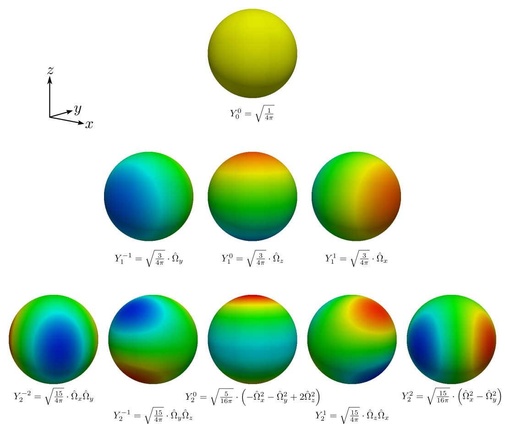

# Transporte y difusión de neutrones {#sec-transporte-difusion}

```{=latex}
\begin{chapterquote}
```
::: {lang=en-US}
In an enterprise such as the development nuclear physics  
the difference between ideas, hopes, suggestions and theoretical  
calculations, and solid numbers based on measurement, is paramount.  
All the committees, the politicking and the plans would have come  
to naught if a few unpredictable nuclear cross sections  
had been different from what they are by a factor of two.
:::

*Emilio Segré*
```{=latex}
\end{chapterquote}
```

```{=latex}
% los vectores son en bold, no con una flecha maraca arriba
\renewcommand{\vec}[1]{\ensuremath\mathbf{#1}}
% las matrices son asi
\renewcommand{\mat}[1]{\ensuremath\mathsf{#1}}
```

En este capítulo introducimos las ecuaciones que modelan el transporte
de neutrones en el núcleo de un reactor nuclear con los siguientes
objetivos:

 a. fijar las ideas sobre las que se basa la implementación computacional detallada en el @sec-implementacion de las ecuaciones neutrónica discretizadas derivadas en el @sec-esquemas,
 b. declarar las suposiciones, aproximaciones y limitaciones de los modelos matemáticos utilizados, y
 c. definir una nomenclatura consistente para el resto de la tesis, incluyendo los nombres de las variables en el código fuente.

No buscamos explicar los fundamentos físicos de los modelos matemáticos
ni realizar una introducción para el lector lego. Para estos casos
referimos al artículo [@enief-2013-cpl] y a la
monografía [@monografia]---ambos trabajos escritos por el autor de esta
tesis---y a la literatura clásica de física de
reactores [@henry; @lamarsh; @duderstadt; @glasstone; @lewis; @stammler].
Si bien gran parte del material aquí expuesto ha sido tomado de estas
referencias, hay algunos desarrollos matemáticos propios que ayudan a
homogeneizar los diferentes enfoques y nomenclaturas existentes en la literature para poder sentar
las bases de los esquemas numéricos implementados en el código de manera consistente.
Para eso desarrollamos lógica y matemáticamente algunas ideas partiendo de
definiciones básicas para arribar a expresiones integro-diferenciales que
describen el problema de ingeniería que queremos resolver.

Está claro los desarrolos y  ecuaciones expuestos en este capítulo
son conocidos desde los albores de la física de reactores allá por
mediados del siglo XX.
Sin embargo, he decidido volver a deducir una vez más las ecuaciones de transporte y difusión a partir de conceptos de conservación de neutrones manteniendo muchos pasos matemáticos intermedios por dos razones:

 i. para que un profesional con conocimientos promedios de física de neutrones pueda seguir el hilo y entender las ideas que forman la base de esta tesis, y
 ii. como un recordatorio para mi propio yo del futuro, que seguramente olvidará todos los detalles aquí expuestos.


\medskip

Para modelar matemáticamente el comportamiento de reactores nucleares de
fisión debemos primero poder caracterizar campos de neutrones
arbitrarios a través de distribuciones matemáticas sobre un dominio
espacial $U$ de tres dimensiones. Más adelante veremos cómo reducir el
problema para casos particulares de dominios de una y dos dimensiones.
Para ello, vamos a suponer que [@lewis]

 #. podemos considerar a los neutrones como puntos geométricos
 #. los neutrones viajan en línea recta entre colisiones
 #. las interacciones neutrón-neutrón pueden ser despreciadas
 #. podemos considerar a las colisiones entre neutrones y núcleos como instantáneas
 #. las propiedades de los materiales son isotrópicas
 #. conocemos las propiedades de los núcleos y la composición de los materiales y éstas no dependen del tiempo
 #. es suficiente que consideremos sólo el valor medio de la distribución de densidad espacial de neutrones y no sus   fluctuaciones estadísticas

 
{#fig-neutron}


En la @fig-neutron ilustramos un neutrón puntual que a un cierto
tiempo $t$ está ubicado en una posición espacial $\vec{x}$ y se mueve en
línea recta en una dirección $\omegaversor$ con una
energía $E=1/2 \cdot m v^2$.

## Secciones eficaces

::: {#def-sigmat}
La *sección eficaz macroscópica total* $\Sigma_t$ de un medio es tal que

$$
\Sigma_t \cdot dx
$$
es la probabilidad de que un neutrón tenga una
colisión con el núcleo de algún átomo del material por el que viaja una
distancia $dx$ en línea recta. Es decir, la sección eficaz macroscópica
es el número de colisiones esperadas por neutrón y por unidad de
longitud lineal. Sus unidades son inversa de longitud, es decir m$^{-1}$ o cm$^{-1}$.
:::

Además de referirnos a la sección eficaz (o XS por su terminología en
inglés) total, podemos particularizar el concepto al tipo de
reacción $k$, es decir, $\Sigma_k \cdot dx$ es la probabilidad de que un
neutrón tenga una reacción de tipo $k$ en el intervalo $dx$. En nuestro
caso particular, la reacción genérica $k$ puede ser particularizada según el subíndice a

\rowcolors{1}{black!10}{black!0}

|  Subíndice  | Reacción
|:-----------:|:--------------------------------------------------|
      $t$     | total
      $c$     | captura radiativa
      $f$     | fisión
      $a$     | absorción ($\Sigma_c + \Sigma_f$)
      $s$     | dispersión ([scattering]{lang=en-US})

Las secciones eficaces macroscópicas dependen de la energía del neutrón
incidente y de las propiedades del medio que provee los núcleos blanco.
Como éstas dependen del espacio (usualmente a través de otras
propiedades intermedias como por ejemplo temperaturas, densidades o
concentraciones de impurezas), en general las secciones eficaces
macroscópicas son funciones tanto del espacio $\vec{x}$ como de la
energía $E$, es decir $\Sigma_k = \Sigma_k(\vec{x}, E)$.

Una forma de incorporar el concepto de sección eficaz macroscópica es
pensar que ésta proviene del producto de una sección eficaz
microscópica $\sigma_k$ (con unidades de área) y una densidad atómica $n$ (con unidades de inversa de volúmen) del medio

$$
\Sigma_k [\text{cm}^{-1}] = \sigma_k [\text{cm}^2] \cdot n [\text{cm}^{-3}]
$$

{#fig-xsmicro width=90%}

{#fig-sigmas}


La sección eficaz microscópica $\sigma_k$ tiene efectivamente unidades de área (típicamente del orden de
$10^{-24}~\text{cm}^2$, unidad que llamamos
[*barn*]{lang=en-US}^[Se dice que durante las primeras mediciones experimentales de
    secciones eficaces los físicos americanos esperaban encontrar
    resultados del orden de las áreas transversales asociadas a los
    tamaños geométricos de los núcleos. Pero encontraron valores mucho
    más grandes, por lo que decían a modo de broma [“this
    cross section is as big as a barn.”]{lang=en-US}]) y se interpreta
como el área asociada a un núcleo transversal a la dirección de viaje de
un neutrón tal que si este neutrón pasara a través de dicha área, se
llevaría a cabo una reacción de tipo $k$ (@fig-xsmicro).
Las secciones eficaces microscópicas dependen
no solamente de las propiedades nucleares de los núcleo blanco sino que
también dependen fuertemente de la energía $E$ del neutrón incidente,
llegando a cambiar varios órdenes de magnitud debido a efectos de
resonancias como podemos observar en la @fig-sigmas.
Además, $\sigma_k$ depende de la temperatura $T$ del medio que define la
forma en la cual los átomos se mueven por agitación térmica alrededor de
su posición de equilibrio ya que se produce un efecto tipo Doppler entre
el neutrón y el núcleo blanco que modifica la sección eficaz
microscópica [@aatn-doppler-2013; @aatn-doppler-2014]. Por lo tanto,
para un cierto isótopo, $\sigma_k = \sigma_k(E,T)$.

Por otro lado, la densidad atómica $n$ del medio depende de la densidad
termodinámica $\rho$, que a su vez depende de su estado termodinámico
usualmente definido por la presión $p$ y la temperatura $T$. Como estas
variables pueden depender de forma arbitraria del espacio $\vec{x}$,
podemos escribir efectivamente

$$
\Sigma_k = n \cdot \sigma_k = n \Big( p(\vec{x}), T(\vec{x}) \Big) \cdot \sigma_k \Big(E, T(\vec{x}) \Big) = \Sigma_k (\vec{x}, E)
$$

Las ideas presentadas son válidas para un único isótopo libre de
cualquier influencia externa. En los reactores nucleares reales, por un
lado existen efectos no lineales como por ejemplo el hecho de los átomos
de hidrógeno o deuterio y los de oxígeno no están libres en la molécula
de agua, que hacen que las secciones eficaces de el todo (i.e. de un
conjunto de átomos enlazados covalentemente) no sean iguales a la suma
algebraica de las partes y debamos calcular las secciones eficaces
macroscópicas con una metodología más apropiada (ver @sec-evaluacionxs y referencia [@methods]). Por otro lado,
justamente en los reactores nucleares las reacciones que interesan son
las que dan como resultado la transmutación de materiales por lo que
continuamente la densidad atómica $n$ de todos los isótopos varía con el
tiempo. En este trabajo, no vamos a tratar con la dependencia de las
secciones eficaces con el tiempo explícitamente sino que llegado el
caso, como discutimos en la @sec-multiescala, daremos la dependencia implícitamente a
través de otras propiedades intermedias tales como la evolución del
quemado del combustible y/o la concentración de xenón 135 en las pastillas de de dióxido de uranio.

A partir de este momento suponemos que conocemos las secciones eficaces
macroscópicas en función del vector posición $\vec{x}$ para todos los
problemas que planteamos.

### Dispersión de neutrones {#sec-scattering}

Cuando un neutrón que viaja en una cierta dirección $\omegaversor$ con
una energía $E$ colisiona con un núcleo blanco en una reacción de
dispersión o [*scattering*]{lang=en-US}, tanto el neutrón como el núcleo blanco
intercambian energía. En este caso podemos pensar que luego de la
colisión, el neutrón incidente se ha transformado en otro neutrón
emitido en una nueva dirección $\omegaprimaversor$ con una nueva
energía $E^\prime$. Para tener este efecto en cuenta, utilizamos el
concepto que sigue.

::: {#def-sigmasdif}
La *sección eficaz de scattering diferencial* $\Sigma_s$ tal que

$$
\Sigma_s(\vec{x}, \omegaversor \rightarrow \omegaprimaversor, E \rightarrow E^\prime) \, d\omegaprimaversor \, dE^\prime
$$
es la probabilidad por unidad de longitud lineal que un neutrón de
energía $E$ viajando en la dirección $\omegaversor$ sea dispersado hacia
un intervalo de energía entre $E^\prime$ y $E^\prime + dE^\prime$ y a un
cono $d\omegaprimaversor$ alrededor de la dirección $\omegaprimaversor$.
:::

Utilizando argumentos de simetría, podemos demostrar que la sección
eficaz diferencial de scattering $\Sigma_s$ sólo puede depender del producto
interno $\mu = \omegaversor \cdot \omegaprimaversor$ y no separadamente
de $\omegaversor$ y de $\omegaprimaversor$ (@fig-omegamu).
Entonces podemos escribir la dependencia
como $\Sigma_s(\vec{x}, \omegaversor \rightarrow \omegaprimaversor, E \rightarrow E^\prime)$
o como $\Sigma_s(\vec{x}, \mu, E \rightarrow E^\prime)$, siempre y
cuando tengamos en cuenta que

$$
\int_{4\pi} \Sigma_s(\vec{x}, \omegaversor \rightarrow \omegaprimaversor, E \rightarrow E^\prime) \, d\omegaprimaversor = 
\int_{-1}^{1} \Sigma_s(\vec{x}, \mu, E \rightarrow E^\prime) \, d\mu
$$
lo que implica que

$$
\Sigma_s(\vec{x}, \mu, E \rightarrow E^\prime) = 2\pi \, \Sigma_s(\vec{x}, \omegaversor \rightarrow \omegaprimaversor, E \rightarrow E^\prime)
$$

Este abuso de notación es histórico y susceptible de provocar
confusiones. Al escribir la probabilidad de scattering de $\omegaversor$
hacia $\omegaprimaversor$ sólo en función del producto interno $\mu$
estamos teniendo en cuenta todas las posibles direcciones de salida
tales que $\mu  = \omegaversor \cdot \omegaprimaversor$. Como podemos
observar en la @fig-omegamu, esto es $2\pi$ veces la probabilidad de que el
neutrón sea dispersado en la dirección $\omegaprimaversor$ solamente.
En los párrafos siguientes explícitamente diferenciamos uno de otro caso.

{#fig-omegamu width=60%}

En general podemos separar a la sección eficaz diferencial en una
sección eficaz total $\Sigma_{s_t}$ y en una probabilidad de
distribución angular y energética $f_s$ tal que

$$
 \Sigma_s(\vec{x}, \omegaversor \rightarrow \omegaprimaversor, E \rightarrow E^\prime) = \Sigma_{s_t}(\vec{x}, E) \cdot f_s(\omegaversor \rightarrow \omegaprimaversor, E \rightarrow E^\prime)
$$ {#eq-sigmastomega}
o bien

$$
 \Sigma_s(\vec{x}, \mu, E \rightarrow E^\prime) = \Sigma_{s_t}(\vec{x}, E) \cdot f_s(\mu, E \rightarrow E^\prime)
$$ {#eq-sigmastmu}

En ambos casos, $\Sigma_{s_t}$ es la sección eficaz macroscópica *total*
de scattering, que da la probabilidad por unidad de longitud de que un
neutrón de energía $E$ inicie un proceso de scattering.
La función $f_s$ describe la distribución de neutrones emergentes. Podemos integrar ambos
miembros de las @eq-sigmastomega y @eq-sigmastmu con respecto a $E^\prime$, y
a $\omegaprimaversor$ y a $\mu$ respectivamente, y
despejar $\Sigma_{s_t}$ para obtener su definición

$$
\Sigma_{s_t}(\vec{x}, E) =
\frac{\displaystyle \int_{0}^\infty \int_{4\pi} \Sigma_s(\vec{x}, \omegaversor \rightarrow \omegaprimaversor, E \rightarrow E^\prime) \, d\omegaprimaversor \, dE^\prime}
{\displaystyle \int_{0}^\infty \int_{4\pi} f_s(\omegaversor \rightarrow \omegaprimaversor, E \rightarrow E^\prime) \, d\omegaprimaversor \, dE^\prime} 
=
\frac{\displaystyle \int_{0}^\infty \int_{-1}^{1} \Sigma_s(\vec{x}, \mu, E \rightarrow E^\prime) \, d\mu \, dE^\prime}
{\displaystyle \int_{0}^\infty \int_{-1}^{1} f_s(\mu, E \rightarrow E^\prime) \, d\mu \, dE^\prime}
$$

El denominador es igual a la cantidad de partículas emitidas luego de la
reacción, que para el caso del scattering es igual a uno. Luego

$$
 \Sigma_{s_t}(\vec{x}, E) =
 \int_{0}^\infty \int_{4\pi} \Sigma_s(\vec{x}, \omegaversor \rightarrow \omegaprimaversor, E \rightarrow E^\prime) \, d\omegaprimaversor \, dE^\prime
 =
 \int_{0}^\infty \int_{-1}^{1} \Sigma_s(\vec{x}, \mu, E \rightarrow E^\prime) \, d\mu \, dE^\prime
$$ {#eq-sigmast}

\medskip

{#fig-legendre}


Para tener en cuenta la dependencia de $\Sigma_s$ con $\mu$ (en realidad
de $f_s$ con $\mu$) podemos recurrir a una expansión en polinomios de
Legendre (@fig-legendre). En efecto, para dos energías $E$
y $E^\prime$ fijas, $\Sigma_s$ depende de un único
escalar $-1 \leq \mu \leq 1$ sin presentar singularidades, es decir es una
función de cuadrado integrable, por lo que podemos escribir en una base
ortogonal de polinomios^[La definición particular de la expansión en polinomios de Legendre
de la @eq-sigmalegendremu es tal que sea consistente con los
usos y costumbres históricos de la evaluación de secciones eficaces
(sec-evaluacionxs) y de códigos de celda (@sec-celda).
Es posible dar otra definición y
desarrollar consistentemente la matemática para llegar a las mismas
ecuaciones finales, pero ello modificaría la definición de los
coeficientes de la expansión dados por la @eq-coeflegendreomega y haría que las secciones eficaces
calculadas a nivel de celda no puedan ser introducidas directamente
en la entrada del código de núcleo que describimos en el @sec-implementacion.
En particular, arribar a la @eq-sigmas0 es de interés para la consistencia de las
secciones eficaces entre códigos de diferente nivel. Por ejemplo, la
referencia [@lewis] utiliza otra forma de expandir el kernel de
scattering que resulta en un factor dos de diferencia con respecto a
la @eq-coeflegendreomega.]


$$
\Sigma_s(\vec{x}, \mu, E \rightarrow E^\prime) = \sum_{\ell=0}^{\infty} \frac{2\ell + 1}{2} \, \Sigma_{s_\ell}(\vec{x}, E \rightarrow E^{\prime}) \cdot P_\ell(\mu)
$$ {#eq-sigmalegendremu}
donde los coeficientes resultan ser

$$
\Sigma_{s_\ell}(\vec{x}, E\rightarrow E^{\prime}) =
\int_{-1}^{1} \Sigma_s(\vec{x}, \mu, E\rightarrow E^\prime) \cdot P_\ell(\mu) \, d\mu
$$ {#eq-coeflegendremu} 
dada la propiedad de ortogonalidad de la base de Legendre según la cual

$$
\int_{-1}^{1} P_\ell(\mu) \cdot P_{\ell^\prime}(\mu) \, d\mu = \frac{2}{2\ell + 1} \cdot \delta_{\ell \ell^\prime}
$$
siendo $\delta_{\ell \ell^\prime}$ la Delta de Kronecker

\rowcolors{3}{black!0}{black!0}
$$
\delta_{\ell \ell^\prime} =
\begin{cases}
 1 & \text{si $\ell = \ell^\prime$} \\
 0 & \text{si $\ell \neq \ell^\prime$} \\
\end{cases}
$$

Para la dependencia con $\omegaversor$ y $\omegaprimaversor$, la expansión en polinomios de Legendre sobre el escalar $\mu = \omegaversor \cdot \omegaprimaversor$ es 

$$
\Sigma_s(\vec{x}, \omegaversor \rightarrow \omegaprimaversor, E \rightarrow E^\prime) = \sum_{\ell=0}^{\infty} \frac{2\ell + 1}{4\pi} \, \Sigma_{s_\ell}(\vec{x}, E \rightarrow E^{\prime}) \cdot P_\ell(\omegaversor \cdot \omegaprimaversor)
$$ {#eq-sigmalegendreomega}
donde los coeficientes $\Sigma_{s_\ell}$ para $\ell=1,dots$ son

$$
 \Sigma_{s_\ell}(\vec{x}, E\rightarrow E^{\prime}) =
 2\pi \int_{4\pi} \Sigma_s(\vec{x}, \omegaversor \rightarrow \omegaprimaversor, E\rightarrow E^\prime) \cdot P_\ell(\omegaversor \cdot \omegaprimaversor) \, d\omegaprimaversor
$$ {#eq-coeflegendreomega}

Es interesante notar que $\Sigma_{s_t}$ sólo depende de $\Sigma_{s_0}$.
En efecto, reemplazando la expansión dada por la @eq-sigmalegendremu en la @eq-sigmast tenemos

$$
\begin{aligned}
 \Sigma_{s_t}(\vec{x}, E) &=
 \int_{0}^{\infty} \int_{-1}^{1} \sum_{\ell=0}^{\infty} \frac{2\ell + 1}{2} \, \Sigma_{s_\ell}(\vec{x}, E \rightarrow E^{\prime}) \cdot P_\ell(\mu) \, d\mu \, dE^\prime \\
 &= 
\bigintsss_{0}^{\infty} \left[ \sum_{\ell=0}^{\infty} \frac{2\ell + 1}{2} \, \Sigma_{s_\ell}(\vec{x}, E \rightarrow E^{\prime}) \cdot \int_{-1}^{1} P_\ell(\mu) \, d\mu \right] \, dE^\prime 
\end{aligned}
$$

Como todos los polinomios de Legendre son impares con respecto al
argumento $\mu$ excepto para el índice $\ell = 0$ donde $P_0(\mu)=1$,
la integral sobre $\mu$ es cero para todo $\ell >0$.
Luego

$$
 \Sigma_{s_t}(\vec{x}, E) = 
\int_{0}^{\infty} \left[ \frac{2 \cdot 0 + 1}{2} \cdot \Sigma_{s_0}(\vec{x}, E \rightarrow E^{\prime}) \cdot 2 \right] dE^\prime
=
\int_{0}^{\infty} \Sigma_{s_0}(\vec{x}, E \rightarrow E^{\prime}) dE^\prime
$$ {#eq-sigmastys0}

Para fijar ideas, supongamos que tenemos scattering isotrópico en el
marco de referencia del laboratorio.^[Como ya dijimos, esta nomenclatura es puramente académica. Una expresión más apropiada según la potencial aplicación industrial de los conceptos desarrollados en esta tesis sería "marco de referencia de *la central nuclear*".]
Entonces $\Sigma_s$ no dependede $\mu$ y el único término diferente de cero en la @eq-sigmalegendreomega es $\Sigma_{s_0}$ que contiene información sólo sobre el cambio de energía del neutrón con respecto a las condiciones de incidencia:

$$
\Sigma_s(\vec{x}, \omegaversor \rightarrow \omegaprimaversor, E \rightarrow E^\prime) = \sum_{\ell=0}^{\infty} \frac{2\ell + 1}{4\pi} \, \Sigma_{s_\ell}(\vec{x}, E \rightarrow E^{\prime}) \cdot P_\ell(\omegaversor \cdot \omegaprimaversor)  
= 
\frac{1}{4\pi} \cdot \Sigma_{s_0}(\vec{x}, E\rightarrow E^\prime)
$$ {#eq-sigmas0}

Si en cambio el scattering resulta ser completamente elástico e
isotrópico en el marco de referencia del centro de masa del sistema
compuesto por el neutrón incidente y el núcleo blanco (condición que se
da si el blanco está fijo en el marco de referencia del reactor sin
posibilidad de moverse por efectos térmicos), entonces a cada energía de
salida $E^\prime$ le corresponde un único ángulo de scattering $\mu$ a
través de las leyes clásicas de conservación de energía y momento
lineal. Para la dependencia en ángulos de entrada y salida [@stammler]
es

\rowcolors{3}{black!0}{black!0}
$$
\Sigma_s(\vec{x}, \mu, E \rightarrow E^\prime) =
\begin{cases}
 \displaystyle \Sigma_{s_t}(\vec{x}, E) \cdot \frac{\delta(\mu - \mu_0)}{(1-\alpha)E}  & \text{para}~\alpha E < E^\prime < E \\
\hfill 0 \hfil & \text{de otra manera}
\end{cases}
$$
mientras que para la dependencia del coseno del ángulo de scattering [@lewis] es

\rowcolors{3}{black!0}{black!0}
$$\Sigma_s(\vec{x}, \omegaversor \rightarrow \omegaprimaversor, E \rightarrow E^\prime) =
\begin{cases}
 \displaystyle \Sigma_{s_t}(\vec{x}, E) \cdot \frac{\delta(\mu - \mu_0)}{2\pi(1-\alpha)E}  & \text{para}~\alpha E < E^\prime < E \\
\hfill 0 \hfil & \text{de otra manera}
\end{cases}
$$
donde ahora $\delta(x)$ es la distribución Delta de Dirac (no confundir con Kronecker) y

$$
\begin{aligned}
 \alpha(A) &= \frac{(A-1)^2}{(A+1)^2} \\
 \mu_0(A,E,E^\prime) &= \frac{1}{2} \left[ (A+1)\sqrt{\frac{E^\prime}{E}} - (A-1) \sqrt{\frac{E}{E^\prime}} \right]
\end{aligned}
$$
siendo $A$ es el número de masa del núcleo blanco.
Llamamos a la magnitud $\mu_0$ coseno medio de la dispersión. Esta
nomenclatura $\mu_0$ es general pero la expresión matemática es
particular para el caso de scattering elástico e isotrópico en el marco
de referencia del centro de masa. En la @eq-mu0 generalizamos la definición para cualquier tipo de
scattering.

La expresión para el $\ell$-ésimo coeficiente de la expansión en
polinomios de Legendre para $\alpha E < E^\prime < E$ según la @eq-coeflegendremu es

$$
\Sigma_{s_\ell}(\vec{x}, E \rightarrow E^\prime) = \frac{\Sigma_{s_t}(\vec{x}, E)}{(1-\alpha) E} \int_{-1}^{1} \delta(\mu - \mu_0) \cdot P_\ell(\mu) \, d\mu = \frac{\Sigma_{s_t}(\vec{x}, E) }{(1-\alpha) E} \cdot P_\ell(\mu_0)
$$
por lo que

$$\Sigma_s(\vec{x}, \mu, E \rightarrow E^\prime) =
\frac{\Sigma_{s_t}(\vec{x},E)}{(1 - \alpha) E} \cdot \sum_{\ell=0}^{\infty} \frac{2\ell + 1}{2} \cdot P_\ell(\mu_0) \cdot P_\ell(\mu)
$$

Tomando los dos primeros términos, podemos aproximar

\rowcolors{3}{black!0}{black!0}
$$
\Sigma_s(\vec{x}, \mu, E \rightarrow E^\prime) \approx
\begin{cases}
\frac{\Sigma_{s_t}(\vec{x},E)}{(1 - \alpha) E} \cdot \left(1 + \frac{3 \cdot \mu_0 \cdot \mu}{2}\right) & \text{para~$\alpha E < E^\prime < E$} \\
\hfill 0 \hfil & \text{para~$E^{\prime} < \alpha E$}
\end{cases}
$$

Estas dos ideas nos permiten introducir los siguientes conceptos.

::: {#def-scattering-isotropico}
Decimos que hay *scattering isotrópico* (a partir de ahora siempre nos
vamos a referir al marco de referencia del reactor) cuando los
coeficientes de la expansión de la sección eficaz diferencial de
scattering $\Sigma_s(\vec{x}, \mu,  E \rightarrow E^\prime)$ en
polinomios de Legendre son todos nulos excepto el correpondiente
a $\ell=0$. En este caso, la sección eficaz diferencial no depende del
ángulo y vale la [@eq-sigmas0]:

$$\tag{\ref{eq-sigmas0}}
 \Sigma_s(\vec{x}, \omegaversor \rightarrow \omegaprimaversor, E \rightarrow E^{\prime}) = \frac{1}{4\pi} \cdot \Sigma_{s_0}(\vec{x}, E \rightarrow E^{\prime})
$$
:::


::: {#def-scattering-linealmente-isotropico}
Si además de $\Sigma_{s_0}$ resulta que el único otro coeficiente diferente de cero es $\Sigma_{s_1}$
correspondiente a $\ell=1$ entonces decimos que el scattering es *linealmente anisotrópico*, y la
sección eficaz diferencial es la suma de la sección eficaz total más un
coeficiente multiplicado por el coseno del ángulo de scattering:

$$
 \Sigma_s(\vec{x}, \omegaversor \rightarrow \omegaprimaversor, E \rightarrow E^{\prime}) = \frac{1}{4\pi} \cdot \left[ \Sigma_{s_0}(\vec{x}, E \rightarrow E^{\prime}) + 3 \cdot  \Sigma_{s_1}(\vec{x}, E \rightarrow E^{\prime}) \cdot \left ( \omegaversor \cdot \omegaprimaversor \right) \right]
$$ {#eq-scatteringanisotropico}
:::

::: {#def-coseno-medio}
Definimos el *coseno medio de la dispersión* $\mu_0$ para una ley de dispersión general como

$$
 \mu_0(\vec{x}, E) =
\frac{\displaystyle \int_0^\infty \int_{-1}^{1} \mu \cdot \Sigma_{s}(\vec{x}, \mu, E \rightarrow E^{\prime}) \, d\mu \, dE^\prime}
     {\displaystyle \int_0^\infty \int_{-1}^{1}           \Sigma_{s}(\vec{x}, \mu, E \rightarrow E^{\prime}) \, d\mu \, dE^\prime}
=
\frac{\displaystyle \int_0^\infty           \Sigma_{s_1}(\vec{x}, E \rightarrow E^{\prime}) \, dE^\prime}
     {\displaystyle \int_0^\infty           \Sigma_{s_0}(\vec{x}, E \rightarrow E^{\prime}) \, dE^\prime}
$$ {#eq-mu0}
:::

En el caso de scattering general, i.e. no necesariamente isotrópico en
algún marco de referencia y no necesarimente elástico, debemos conocer o
bien la dependencia explícita de $\Sigma_s$
con $\omegaversor \cdot \omegaprimaversor$ (que puede ser aproximada
mediante evaluaciones discretas) o bien una cierta cantidad de
coeficientes $\Sigma_{s_\ell}$ de su desarrollo en polinomios de
Legendre sobre $\mu$. En esta tesis trabajamos a lo más con scattering
linealmente anisotrópico, es decir, la sección eficaz diferencial de
scattering está dada por la @eq-scatteringanisotropico y suponemos que conocemos
tanto $\Sigma_{s_0}$ como $\Sigma_{s_1}$ en función del espacio y de los grupos de energías discretizados
antes de resolver la ecuación de transporte a nivel de núcleo (ver @sec-multiescala).

### Fisión de neutrones {#sec-fision}

Cuando un núcleo pesado se fisiona en dos núcleos más pequeños, ya sea
debido a una fisión espontánea o a una fisión inducida por la absorción
de un neutrón, se liberan además de los productos de fisión propiamente
dichos y radiación $\gamma$ debida al reacomodamiento de los niveles
energéticos de los nucleones que intervienen en la reacción, entre dos y
tres neutrones. Llamamos $\nu(\vec{x}, E)$ a la cantidad promedio de
neutrones liberados por cada fisión.
El valor numérico de $2 < \nu < 3$ depende de la
energía $E$ del neutrón incidente y de la composición del material
combustible el punto $\vec{x}$.

Como ahora se emite más de un neutrón, utilizamos la
nomenclatura $\nu\Sigma_f$ para indicar, en el sentido de la @eq-sigmastomega
de la sección anterior, la sección eficaz
diferencial como un producto de una sección eficaz total y una
distribución angular

$$
\nu\Sigma_f(\vec{x}, \omegaversor \rightarrow \omegaprimaversor, E \rightarrow E^\prime) = \nu\Sigma_{f_t}(\vec{x}, E) \cdot f_f(\omegaversor \rightarrow \omegaprimaversor, E \rightarrow E^\prime)
$$

La distribución en energía de los neutrones nacidos por fisión está dada
por el espectro de fisión $\chi$, que definimos a continuación.

::: {#def-chi}
El *espectro de fisión* $\chi(E)$ es talque

$$
\chi(E) \, dE
$$
es la probabilidad de que un neutrón nacido en una
fisión lo haga con una energía dentro del intervalo $[E,E+dE]$.
El espectro de fisión está normalizado de forma tal que

$$
 \int_{0}^{\infty} \chi(E) \, dE = 1
$$ {#eq-chinorm}
:::

Los neutrones de fisión nacen isotrópicamente en el marco de referencia
del reactor independientemente de la energía $E$ del neutrón incidente
que la provocó (decimos que los neutrones de fisión no tienen *memoria*)
y además la energía $E^\prime$ con la que emergen tampoco depende de la
energía del $E$ neutrón incidente. Luego $f_f$ no depende ni
de $\omegaversor$ ni de $\omegaprimaversor$ y podemos separar la
función $f_t$ en una cierta dependencia de $E$ multiplicada
por $\chi(E^\prime)$

$$
f_f(\omegaversor \rightarrow \omegaprimaversor, E \rightarrow E^\prime) = A(E) \cdot \chi(E^\prime)
$$

Como la integral de $f_f$ sobre todas las posibles energías $E^\prime$ y
ángulos $\omegaprimaversor$ debe ser igual a la cantidad $\nu$ de
neutrones emitidos entonces

$$
\nu(E) = \int_0^\infty \int_{4\pi} f_f(\omegaversor \rightarrow \omegaprimaversor, E \rightarrow E^\prime) \, d\omegaprimaversor \, dE^\prime =
A(E) \cdot \int_0^\infty \int_{4\pi} \chi(E^\prime) \, d\omegaprimaversor \, dE^\prime
$$

Teniendo en cuenta la normalización de $\chi$ dada por la @eq-chinorm, resulta

$$
A(E) = \frac{\nu(E)}{4\pi}
$$
por lo que

$$
\nu\Sigma_f(\vec{x}, \omegaversor \rightarrow \omegaprimaversor, E \rightarrow E^\prime) = \frac{\chi(E^\prime)}{4\pi} \cdot \nu\Sigma_{f_t}(\vec{x}, E)
$$ {#eq-nusigmaf}

\medskip

Durante la operación de un reactor, no todos los neutrones provenientes
de la fisión aparecen en el mismo instante en el que se produce. Una
cierta fracción $\beta$ de todos los neutrones son producto del decaimiento radioactivo de

 a. los productos de fisión, o
 b. de los hijos de los productos de fisión.
 
En cualquier caso, en cálculos transitorios es necesario distinguir entre la
fracción $1-\beta$ de neutrones instantáneos ([*prompt*]{lang=en-US})) que aparecen en
el mismo momento de la fisión y la fracción $\beta$ de neutrones
retardados que aparecen más adelante. Para ello dividimos a los
neutrones retardados en $I$ grupos, les asignamos una fracción $\beta_i$
y una constante de tiempo $\lambda_i$, para $i=1,\dots,N$ y definimos un
mecanismo de aparición exponencial para cada uno de ellos.

En cálculos estacionarios no es necesario realizar esta división entre
neutrones instantáneos y retardados ya que eventualmente todos los
neutrones estarán contribuyendo a la reactividad neta del reactor. En el
caso particular en el que no haya una fuente externa de neutrones sino
que todas las fuentes se deban a fisiones la probabilidad de que el
reactor esté exactamente crítico es cero.
Para poder realizar cálculos estacionarios y
además tener una idea de la distancia a la criticidad debemos recurrir a
un reactor crítico asociado, cuya forma más usual es el *reactor crítico
asociado en $k$*. En este caso, dividimos las fuentes de fisión se
artificialmente por un número real $k_\text{eff} \sim 1$ que pasa a ser
una incógnita del problema y cuya diferencia con la unidad da una idea
de la distancia a la criticidad del reactor original.

## Flujos y ritmos de reacción

El problema central del cálculo de reactores es la determinación de la
distribución espacial y temporal de los neutrones dentro del núcleo de
un rector nuclear. En esta sección desarrollamos la matemática para el
caso de $\vec{x} \in \mathbb{R}^3$. En casos particulares aclaramos cómo
debemos proceder para problemas en una y en dos dimensiones.

Comenzamos con las siguientes definiciones.

::: {#def-N}
La *distribución de densidad de neutrones* $N$
en un espacio de las fases de siete
dimensiones $\vec{x} \in \mathbb{R}^3$, $\omegaversor \in \mathbb{R}^2$,^[Si bien la
dirección $\omegaversor = [ \Omega_x \, \Omega_y \, \Omega_z]^T$
tiene tres componentes, sólo dos son independientes (por ejemplo las
 coordenadas angulares cenital $\theta$ y azimutal $\varphi$) ya que
 debe cumplirse que $\Omega_x^2 + \Omega_y^2 + \Omega_z^2 = 1$.]
$E \in \mathbb{R}$ y $t \in \mathbb{R}$ tal que

$$
N(\vec{x}, \omegaversor, E, t) \, d^3\vec{x} \, d\omegaversor \, dE
$$

es el número de neutrones (en el sentido de la media estadística dada la
naturaleza estocástica del comportamiento de los neutrones) en un
elemento volumétrico $d^3\vec{x}$ ubicado alrededor del punto $\vec{x}$
del espacio viajando en el cono de direcciones de
magnitud $d\omegaversor$ alrededor de la dirección $\omegaversor$ con
energías entre $E$ y $E+dE$ en el tiempo $t$.
:::

::: {#def-flujoangular}
El *flujo angular* $\psi$ es el producto entre la velocidad $v$ y la distribución de densidad $N$ de los neutrones

$$
\begin{aligned}
 \psi(\vec{x}, \omegaversor, E, t) &= v(E) \cdot N(\vec{x}, \omegaversor, E, t)  \\
&= \sqrt{\frac{2E}{m}} \cdot N(\vec{x}, \omegaversor, E, t) 
\end{aligned}
$$ {#eq-flujoangular}
donde $v(E)$ es la velocidad clásica correspondiente a un neutrón de masa $m$ cuya energía cinética es $E$.
::: 

Esta magnitud es más útil para evaluar ritmos de colisiones y reacciones
que la densidad de neutrones $N$. En efecto, como $v \cdot dt$ es la
distancia que viaja un neutrón de velocidad $v$, entonces

$$
\psi(\vec{x}, \omegaversor, E, t) \, d^3\vec{x} \, d\omegaversor \, dE \, dt = v(E) \cdot N(\vec{x}, \omegaversor, E, t) \, dt \,\,\, d^3\vec{x} \, d\omegaversor \, dE
$$
es el número total de longitudes lineales que los neutrones han viajado
en la dirección $\omegaversor$ con energía $E$ que estaban en el
tiempo $t$ en la posición $\vec{x}$. Como además $\Sigma_k \cdot dx$ es
la probabilidad de que un nuetrón tenga una reacción de tipo $k$ en el
intervalo $dx$ (#def-sigma), entonces la expresión

$$
\Sigma_k(\vec{x}, E) \cdot \psi(\vec{x}, \omegaversor, E, t) \, d^3\vec{x} \, d\omegaversor \, dE
$$
es el número de reacciones de tipo $k$ en el diferencial de volumen de
fases $d^3\vec{x} \, d\omegaversor \, dE$ debido a neutrones de
energía $E$ viajando en la dirección $\omegaversor$ en el
punto $\vec{x}$ del espacio en el instante $t$.
Para obtener el número
total de reacciones de todos los neutrones independientemente de la
dirección $\omegaversor$ del neutrón incidente debemos integrar esta
cantidad sobre todos los posibles ángulos de incidencia. Para ello
utilizamos el siguiente concepto.

::: {#def-flujoescalar}
El *flujo escalar* $\phi$ es la integral del flujo angular sobre todas las posibles direcciones de
viaje de los neutrones:

$$
\phi(\vec{x}, E, t) = \int_{4\pi} \psi(\vec{x}, \omegaversor, E, t) \, d\omegaversor
$$ {#eq-flujoescalar}
:::

Con esta nomenclatura, el ritmo $R_k$ de reacciones de tipo $k$
en $d^3\vec{x}\,dE$ es

$$R_k (\vec{x}, E, t) \, d^3\vec{x} \, dE = \Sigma_k(\vec{x}, E) \cdot \phi(\vec{x}, E, t) \, d^3\vec{x} \, dE$$
con lo que el producto $R_t = \Sigma_t \phi$ da una expresión simple
para la distribución del ritmo de reacciones totales por unidad de
volúmen y de energía, que es lo que buscábamos al introducir las ideas
de flujo escalar y flujo angular.

::: {#def-corriente}
El *vector corriente* $\vec{J}$
es la integral del producto entre el flujo angular y el versor de
dirección de viaje de los neutrones $\omegaversor$ sobre todas las
direcciones de viaje:

$$
\vec{J}(\vec{x},E,t) = \int_{4\pi} \left[ \psi(\vec{x}, \omegaversor, E, t) \cdot \omegaversor \right] \, d\omegaversor
$$ {#eq-vectorcorriente}
:::

Debemos notar que es ésta una cantidad vectorial ya el integrando es un
vector cuya magnitud es igual al flujo angular y cuya dirección es la
del versor $\omegaversor$ sobre el cual estamos integrando. El producto
escalar entre el vector corriente $\vec{J}$ y un cierto versor
espacial $\hat{\vec{n}}$

$$
 J_n(\vec{x}, E, t) = \hat{\vec{n}} \cdot \vec{J}(\vec{x}, E, t) = \int_{4\pi} \psi(\vec{x}, \omegaversor, E, t) \cdot \left( \omegaversor \cdot \hat{\vec{n}} \right) \, d\omegaversor
$$ {#eq-jn}
da el número neto de neutrones que cruzan un área unitaria perpendicular
a $\hat{\vec{n}}$ en la dirección positiva (@fig-normal}. Este número neto es la resta
de dos contribuciones

$$
J_n(\vec{x}, E, t) = J_n^+(\vec{x}, E, t) - J_n^-(\vec{x}, E, t)
$$
donde

$$
\begin{aligned}
 J_n^+(\vec{x},E,t) &= \int_{\omegaversor \cdot \hat{\vec{n}} > 0} \psi(\vec{x}, \omegaversor, E, t) \left(\omegaversor \cdot \hat{\vec{n}}\right) d\omegaversor \\
\ J_n^-(\vec{x},E,t) &= \int_{\omegaversor \cdot \hat{\vec{n}} < 0} \psi(\vec{x}, \omegaversor, E, t) \left(\omegaversor \cdot \hat{\vec{n}}\right) d\omegaversor
\end{aligned}
$$ {#eq-jnegativa}

{#fig-normal width=50%}

## Transporte de neutrones

Introducidos los conceptos básicos de “contabilidad” de neutrones, pasemos ahora a deducir las ecuaciones que gobiernan sus ritmos de 

 * aparición,
 * desaparición, y
 * transporte.


### Operador de transporte

Consideremos un volumen finito $V\in \mathbb{R}^3$ arbitrario fijo en el
espacio y consideremos ahora otro
volumen $V^{\prime}(t)\in \mathbb{R}^3$ que se mueve en una
dirección $\omegaversor$ con una velocidad $v(E)$ correspondiente a una
energía $E$, de tal manera que en el instante $t$ ambos volúmenes
coinciden. En ese momento, la cantidad de neutrones con
dirección $\omegaversor$ en torno al cono definido por $d\omegaversor$ y
con energías entre $E$ y $E+dE$ en el volumen $V \equiv V^{\prime}(t)$
es

$$
 N_V(\omegaversor, E, t) \, d\omegaversor \, dE = \left[ \int_{V \equiv V^{\prime}(t)} N(\vec{x}, \omegaversor, E, t) \, d^3\vec{x} \right] \, d\omegaversor \, dE
$$ {#eq-nv}

Dado que la posición del dominio de integración cambia con el tiempo, la
derivada total de esta magnitud con respecto al tiempo es la suma de una
derivada parcial y una derivada material:

$$
 \frac{dN_V}{dt} = \frac{\partial N_V}{\partial t} +
\lim_{\Delta t \rightarrow 0} \frac{1}{\Delta t} \left[ \int_{V^{\prime}(t+\Delta t)} N(\vec{x}, \omegaversor, E, t) \, d^3\vec{x}  - \int_{V^{\prime}(t)} N(\vec{x}, \omegaversor, E, t) \, d^3\vec{x} \right]
$$ {#eq-integral_dos_dominios}

Ahora necesitamos que el dominio de integración de la segunda integral
sea igual al de la primera. Para ello, notamos que

$$
\lim_{\Delta t \rightarrow 0} V^{\prime}(t+\Delta t) = V^{\prime}(t) + v(E) \omegaversor \cdot \Delta t
$$
para cada punto $\vec{x} \in V^{\prime}(t)$. Además, como ni $v(E)$
ni $\hat{\Omega}_i$ para $i=x,y,z$ dependen de $\vec{x}$, entonces

$$
\frac{\partial}{\partial x_i} \Big[ x_i + v(E) \, \hat{\Omega}_i \cdot \Delta t \Big] = 1
$$
y podemos hacer un cambio de coordenadas unitario en la @eq-integral_dos_dominios para que el dominio de integración
de la primera integral coincida entonces con el de la segunda y obtener así

$$\frac{dN_V}{dt} =  \frac{\partial N_V}{\partial t} +
\int_{V^{\prime}(t)} \lim_{\Delta t \rightarrow 0} \frac{1}{\Delta t} \left[ N(\vec{x} + v(E)\omegaversor \cdot \Delta t, \omegaversor, E, t) - N(\vec{x}, \omegaversor, E, t) \right]  \, d^3\vec{x}$$

El término entre corchetes es igual a $v(E)$ veces la derivada
espacial de la función $N(\vec{x}, \omegaversor, E, t)$ en la
dirección $\omegaversor$. Entonces resulta

$$
\lim_{\Delta t \rightarrow 0} \frac{1}{\Delta t} \left[ N(\vec{x} + v(E)\omegaversor \cdot \Delta t, \omegaversor, E) - N(\vec{x}, \omegaversor, E)\right] \, d^3\vec{x}  = v(E) \left\{ \omegaversor \cdot \text{grad} \left[N(\vec{x}, \omegaversor, E)\right] \right\}
$$


Como $V^{\prime}(t) \equiv V$ entonces podemos escribir la derivada total
de la cantidad de neutrones en $V$ con respecto al tiempo como

$$
\frac{dN_V}{dt} = \frac{\partial N_V}{\partial t} + v(E) \left\{ \int_{V} \omegaversor \cdot \text{grad} \left[ N(\vec{x}, \omegaversor, E, t) \right]  d^3\vec{x} \right\}
$$

Teniendo en cuenta la @eq-nv

$$
 N_V(\omegaversor, E, t) = \int_{V \equiv V^{\prime}(t)} N(\vec{x}, \omegaversor, E, t) \, d^3\vec{x}
$$
y la @def-flujoangular de flujo angular $\psi$


$$
 \psi(\vec{x}, \omegaversor, E, t) = v(E) \cdot N(\vec{x}, \omegaversor, E, t)
$$
tenemos

$$
\frac{d}{dt} \int_{V} N(\vec{x}, \omegaversor, E, t) \, d^3\vec{x}  = \int_{V} \left\{ \frac{1}{v(E)} \frac{\partial \psi}{\partial t} + \omegaversor \cdot \text{grad} \left[ \psi(\vec{x}, \omegaversor, E, t) \right] \right\}  d^3\vec{x}
$$
donde notamos que el gradiente opera sólo sobre las componentes
espaciales, es decir

\rowcolors{6}{black!10}{black!0}
$$
\text{grad} \left[ \psi(\vec{x}, \omegaversor, E, t) \right] =
\begin{bmatrix}
 \displaystyle \frac{\partial \psi}{\partial x} \\ \\
 \displaystyle \frac{\partial \psi}{\partial y} \\ \\
 \displaystyle \frac{\partial \psi}{\partial z} \\
\end{bmatrix}
$$

### Operador de producciones

Habiendo estudiado la expresión matemática que describe el transporte de
neutrones, pasamos ahora a estudiar la forma en la que se producen. Los
neutrones pueden aparecer en un diferencial de espacio de las
fases $d\vec{x} \, d\omegaversor \, dE \, dt$ debido a uno de los
siguiente tres mecanismos, que analizamos a continuación:

 * [scattering]{lang=en-US},
 * fisión, o
 * fuentes externas.

#### Fuentes por [scattering]{lang=en-US}

Un neutrón que, viajando con una energía $E^\prime$ y una dirección $\omegaprimaversor$, sufre una colisión de [scattering]{lang=en-US} en el punto $\vec{x}$ y emerge con una energía $E$ y una dirección $\omegaversor$ es efectivamente una fuente de neutrones en $d\vec{x} \,  d\omegaversor \, dE \, dt$ debido a [scattering]{lang=en-US}. Esta
fuente $q_s$ debe ser entonces igual al producto de la probabilidad por unidad de longitud de recorrido de neutrones que viajando en con una energía $E^\prime$ en una dirección $\omegaprimaversor$ colisionen con un núcleo blanco en el punto $\vec{x}$ y como resultado adquieren una dirección de viaje $\omegaversor$ y una energía $E$ (ver @sec-scattering) por la cantidad de longitudes lineales viajadas, teniendo en cuenta todos los posibles valores
de $\omegaprimaversor$ y de $E^\prime$.
Es decir

$$
\int_V
q_s(\vec{x}, \omegaversor, E, t)
\, d^3\vec{x} = 
\int_V
 \int_{0}^{\infty} \int_{4\pi} \Sigma_s(\vec{x}, \omegaprimaversor  \rightarrow \omegaversor, E^\prime \rightarrow E) \cdot \psi(\vec{x}, \omegaprimaversor, E^\prime, t) \, d\omegaprimaversor \, dE^\prime
\, d^3\vec{x}
$$ {#eq-qs}

Debemos notar que en esta ecuación hemos invertido el índice de las
variables primadas con respecto a la @sec-scattering, inversión que mantenemos a lo largo de
esta sección.

#### Fuentes por fisiones

Los neutrones que nacen por fisiones de núcleos de materiales
combustibles en el punto $\vec{x}$ lo hacen isotrópicamente y con una
cierta distribución energética $\chi(E)$. Como también discutimos en la @sec-fision, debemos
calcular la fuente de fisión ligeramente diferente si estamos resolviendo problemas

 a. transitorios
 b. estacionarios
     i. con fuentes independientes
     ii. sólo con fuentes de fisión


Sin pérdida de generalidad, para fijar ideas supongamos que desde el
punto de vista de la fisión el problema es estacionario con fuentes independientes.
La tasa de generación de neutrones debidas a fisión es el producto del
número probable de nacimientos en $\vec{x}$ con energías entre $E$
y $E+dE$ por unidad de longitud de recorrido de neutrones que viajando
con dirección $\omegaversor$ y energía $E$ generan la fisión del núcleo
pesado en el punto $\vec{x}$ debido a neutrones incidentes con dirección
de viaje $\omegaprimaversor$ y energía incidente $E^\prime$,
multiplicada por la cantidad de longitudes lineales
viajadas, teniendo en cuenta todos los posibles valores
de $\omegaprimaversor$ y de $E^\prime$:

$$
\begin{aligned}
\int_V
q_f(\vec{x}, \omegaversor, E, t)
\, d^3\vec{x} &= 
\int_V
\frac{\chi(E)}{4\pi} \int_{0}^{\infty} \int_{4\pi} \nu\Sigma_f(\vec{x}, E^\prime) \cdot \psi(\vec{x}, \omegaprimaversor, E^\prime, t) \, d\omegaprimaversor \, dE^\prime
\, d^3\vec{x} \\
 &= 
\int_V
\frac{\chi(E)}{4\pi} \int_{0}^{\infty} \nu\Sigma_f(\vec{x}, E^\prime) \cdot \phi(\vec{x}, E^\prime, t) \, dE^\prime
\, d^3\vec{x}
\end{aligned}
$$ {#eq-qf}

#### Fuentes independientes

Por último, para no perder generalidad tenemos que tener en cuenta las
fuentes externas de neutrones, es decir aquellas que no provienen de la
fisión de materiales presentes en el núcleo sino de otras fuentes
totalmente independientes como por ejemplo una fuente de americio-berilio.
Matemáticamente, las modelamos como la integral sobre el volumen $V$ de
una función conocida $s(\vec{x}, \omegaversor, E, t)$ del espacio, la
dirección, la energía y el tiempo que representa la cantidad de
neutrones emitidos con energía $E$ en el punto $\vec{x}$ con
dirección $\omegaversor$ en el instante $t$.

### La ecuación de transporte {#sec-ecuacion-transporte}

La conservación de neutrones implica que la derivada temporal total de
cualquier magnitud relacionada a la distribución espacial de neutrones
debe ser igual a la diferencia entre la tasa de producciones y la tasa
de desapariciones. El ritmo de aparición de neutrones en el volumen $V$
con energías entre $E$ y $E+dE$ en un cono $d\omegaversor$ alrededor de
la dirección $\omegaversor$ es la suma de las fuentes por [scattering]{lang=en-US}, por fisión y por fuentes externas:

$$
\int_V  q(\vec{x}, \omegaversor, E, t)  \, dE \, d\omegaversor \, d^3\vec{x}
 =
\int_V  \left [q_s(\vec{x}, \omegaversor, E, t) + q_f(\vec{x}, \omegaversor, E, t) + s(\vec{x}, \omegaversor, E, t) \right]  \, dE \, d\omegaversor \, d^3\vec{x}
$$

El ritmo con el que desaparecen los neutrones de energía $E$ viajando en
la dirección $\omegaversor$ en el volumen $V$ es

$$
\int_V R_t(\vec{x}, \omegaversor, E, t)  \, dE \, d\omegaversor \, d^3\vec{x}
 =
\int_V \Sigma_t(\vec{x}, E) \cdot \psi(\vec{x}, \omegaversor, E, t) \, dE \, d\omegaversor \, d^3\vec{x}$$
por lo que

$$
\begin{gathered}
\left( \int_{V} \left\{ \frac{1}{v} \frac{\partial \psi}{\partial t} + \omegaversor \cdot \text{grad} \left[ \psi(\vec{x}, \omegaversor, E, t) \right] \right\}  d^3\vec{x} \right) \, dE \, d\omegaversor = \\
\left( \int_{V} q(\vec{x}, E, \omegaversor, t) \, d^3\vec{x} \right) \, dE \, d\omegaversor -
\left( \int_{V} \Sigma_t(\vec{x}, E) \cdot \psi(\vec{x}, \omegaversor, E, t) \, d^3\vec{x} \right) \, dE \, d\omegaversor
\end{gathered}
$$

Como tanto el dominio de integración $V$ como la energía $E$ y la dirección $\omegaversor$ son arbitrarior, la igualdad debe cumplirse punto a punto:

$$
 \frac{1}{v} \frac{\partial}{\partial t} \left[ \psi(\vec{x}, \omegaversor, E, t) \right]
 + \omegaversor \cdot \text{grad} \left[ \psi(\vec{x}, \omegaversor, E, t) \right]
 + \Sigma_t(\vec{x}, E) \cdot \psi(\vec{x}, \omegaversor, E, t)
 = q(\vec{x}, \omegaversor, E, t)
$$ {#eq-transporteq}

Desarrollando el término de fuente como suma de los tres términos antes mecionados y teniendo en
cuenta que la relación entre velocidad y energía es la
clásica $E=mv^2/2$, llegamos a la famosa *ecuación de transporte de neutrones*

$$
\begin{gathered}
 \sqrt{\frac{m}{2E}} \frac{\partial}{\partial t} \Big[ \psi(\vec{x}, \omegaversor, E, t) \Big]
 + \omegaversor \cdot \text{grad} \left[ \psi(\vec{x}, \omegaversor, E, t) \right]
 + \Sigma_t(\vec{x}, E) \cdot \psi(\vec{x}, \omegaversor, E, t) = \\
 \int_{0}^{\infty} \int_{4\pi} \Sigma_s(\vec{x}, \omegaprimaversor \rightarrow \omegaversor, E^\prime \rightarrow E) \cdot \psi(\vec{x}, \omegaprimaversor, E^\prime, t) \, d\omegaprimaversor \, dE^\prime \\
+ \frac{\chi(E)}{4\pi} \int_{0}^{\infty} \int_{4\pi} \nu\Sigma_f(\vec{x}, E^\prime) \cdot \psi(\vec{x}, \omegaprimaversor, E^\prime, t) \, d\omegaprimaversor \, dE^\prime 
+ s(\vec{x}, \omegaversor, E, t)
\end{gathered}
$$ {#eq-transporte}
que es una ecuación integro-diferencial hiperbólica en derivadas parciales de primer orden tanto sobre el espacio (notar que el operador gradiente opera sólo sobre las coordenadas espaciales) como sobre el tiempo para la incógnita $\psi$ sobre un dominio multidimensional que incluye

 1. el espacio $\vec{x}$,
 2. la dirección $\omegaversor$,
 3. la energía $E$, y
 4. el tiempo $t$.
 
Los datos son:

 * Las secciones eficaces $\Sigma_t$ y $\nu\Sigma_f$ como función del espacio $\vec{x}$ y de la energía $E$
 * El espectro de fisión\ $\Chi$ en función de la energía\ $E$
 * La sección eficaz diferencial de [scattering]{lang=en-US} $\Sigma_s$ como función tanto con la energía del neutron incidente $E^\prime$ como en la energía $E$ del neutrón saliente, y del coseno del ángulo de
[scattering]{lang=en-US} $\mu = \omegaprimaversor \cdot \omegaversor$. Ésta es usualmente dada como coeficientes $\Sigma_{s_\ell}$ de la expansión en polinomios de Legendre para $\ell=0,\dots,L$ sobre el escalar $\mu$. Para [scattering]{lang=en-US} isotrópico en el marco de referencia del reactor, el único coeficiente diferente de cero es $\Sigma_{s_0}$ correspondiente a $\ell = 0$.
 * La fuente independiente de neutrones opcional $s$ como función del espacio, la energía y la dirección  $\omegaversor$
 * El parámetro constante $m$, que es la masa en reposo del neutrón.

### Armónicos esféricos y polinomios de Legendre {#sec-armonicos}

Prestemos atención al término de fuente por [scattering]{lang=en-US} dado por la @eq-qs.
Dado que hemos supuesto que la dependencia angular de la sección eficaz diferencial de [scattering]{lang=en-US}
está definida por los coeficientes del desarrollo en polinomios de
Legendre $\Sigma_{s_\ell}$ introducidos en la @eq-sigmalegendreomega, entonces escribimos las fuentes 
[scattering]{lang=en-US} $q_s$ como

$$
q_s(\vec{x}, \omegaversor, E, t) =
 \sum_{\ell=0}^{\infty} \frac{ 2\ell + 1}{4\pi} \cdot
\int_{0}^{\infty} \left[ \Sigma_{s_\ell}(\vec{x}, E^{\prime} \rightarrow E) \int_{4\pi} P_\ell(\omegaversor \cdot \omegaprimaversor) \cdot \psi(\vec{x}, \omegaprimaversor, E^\prime,t)\, d\omegaprimaversor \right] \, dE^{\prime}
$${#eq-qs1}

Si bien esta expresión ya es suficiente para evaluar el término de [scattering]{lang=en-US} cuando tenemos su desarrollo de Legendre, podemos ahondar un poco más en la estructura de la ecuación de transporte desarrollando en
una base apropiada el flujo angular $\psi$, de la misma manera en la que desarrollamos $\Sigma_s$ en una serie de polinomios de Legendre sobre el parámetro $\mu = \omegaversor \cdot \omegaprimaversor$.

Para ello, notamos que $\psi$ depende angularmente de un versor
dirección $\omegaversor = [\hat{\Omega}_x \, \hat{\Omega}_y \, \hat{\Omega}_z]^T$
(u $\omegaprimaversor$ en el caso de la @eq-qs1).
Esta vez, la base de expansión apropiada no son los polinomios de Legrende (que toman un único argumento escalar $\mu$) sino la generada^[Del inglés [*span*]{lang=en-US}.] por los armónicos esféricos reales, ilustrados en la @fig-harmonics.


{#fig-harmonics width=100%}

::: {#thm-harmonics}

## Expansión en armónicos esféricos

Cualquier función $f(\hat{\Omega}_x, \hat{\Omega}_y, \hat{\Omega}_z)$ de cuadrado integrable con

$$\hat{\Omega}_x^2 + \hat{\Omega}_y^2 + \hat{\Omega}_z^2 = 1$$
puede ser escrita como la suma doble de un coeficiente $f_\ell^m$ por el armónico esférico normalizado real $Y_{\ell}^{m}\left(\omegaversor\right)$ de grado $\ell \geq 0$ y orden $m$:

$$
f(\hat{\Omega}_x, \hat{\Omega}_y, \hat{\Omega}_z) = \sum_{\ell=0}^\infty \sum_{m=-\ell}^\ell f_\ell^m \cdot Y_\ell^m(\hat{\Omega}_x, \hat{\Omega}_y, \hat{\Omega}_z)
$$
donde para cada grado $\ell$ el orden $m$ es tal que

$$
-\ell \leq m \leq \ell
$$
:::

::: {#def-y00}
Los primeros armónicos esféricos (@fig-harmonics) son

$$
\begin{aligned}
Y_0^0(\hat{\Omega}_x,\hat{\Omega}_y,\hat{\Omega}_z) &= \sqrt{\frac{1}{4\pi}} \\
\\
Y_1^{-1}(\hat{\Omega}_x,\hat{\Omega}_y,\hat{\Omega}_z) &= \sqrt{\frac{3}{4\pi}} \cdot \hat{\Omega}_y \\
Y_1^0(\hat{\Omega}_x,\hat{\Omega}_y,\hat{\Omega}_z)    &= \sqrt{\frac{3}{4\pi}} \cdot \hat{\Omega}_z \\
Y_1^{+1}(\hat{\Omega}_x,\hat{\Omega}_y,\hat{\Omega}_z) &= \sqrt{\frac{3}{4\pi}} \cdot \hat{\Omega}_x \\
\\
Y_2^{-2}(\hat{\Omega}_x,\hat{\Omega}_y,\hat{\Omega}_z)  &= \sqrt{\frac{15}{4\pi}} \cdot \hat{\Omega}_x\cdot\hat{\Omega}_y \\
Y_2^{-1}(\hat{\Omega}_x,\hat{\Omega}_y,\hat{\Omega}_z)  &= \sqrt{\frac{15}{4\pi}} \cdot \hat{\Omega}_y\cdot\hat{\Omega}_z \\
Y_2^0(\hat{\Omega}_x,\hat{\Omega}_y,\hat{\Omega}_z)     &= \sqrt{\frac{5}{16\pi}} \cdot \left(-\hat{\Omega}_x^2-\hat{\Omega}_y^2+2\cdot\hat{\Omega}_z^2\right) \\
Y_2^{+1}(\hat{\Omega}_x,\hat{\Omega}_y,\hat{\Omega}_z)  &= \sqrt{\frac{15}{4\pi}} \cdot \hat{\Omega}_z\cdot\hat{\Omega}_x \\
Y_2^{+2}(\hat{\Omega}_x,\hat{\Omega}_y,\hat{\Omega}_z)  &= \sqrt{\frac{15}{16\pi}} \cdot \left(\hat{\Omega}_x^2-\hat{\Omega}_y^2\right) 
\end{aligned}
$$
:::

::: {#thm-harmonic-orto}

## Ortonormalidad de los armónicos esféricos

Los armónicos esféricos reales son ortonormales, es decir

\rowcolors{3}{black!10}{black!0}
$$
 \int_{4\pi} Y_{\ell}^{m}(\omegaversor) \cdot Y_{\ell^\prime}^{m^\prime}(\omegaversor) \, d\omegaversor =
\begin{cases}
1 & \text{si $\ell=\ell^{\prime} \land m=m^{\prime}$} \\
0 & \text{si $\ell\neq\ell^{\prime} \lor m\neq m^{\prime}$}
\end{cases}
$$
:::
 
::: {#cor-psiellm}
Los coeficientes $\Psi_\ell^m$ son iguales a 

$$
 \Psi_\ell^m (\vec{x}, E, t) = \int_{4\pi} \psi(\vec{x}, \omegaversor, E, t) \cdot Y_{\ell}^{m}(\omegaversor) \, d\omegaversor
$$
:::

::: {#thm-adicion}

## de adición

Los armónicos esféricos se relacionan con los polinomios de Legendre como

$$
P_\ell(\omegaversor \cdot \omegaprimaversor) = \frac{4\pi}{2\ell + 1} 
\sum_{m=-\ell}^{\ell} Y_\ell^{m}(\omegaversor) \cdot Y_\ell^m(\omegaprimaversor)
$$
:::


Si en el @thm-harmonics hacemos $f$ igual al flujo angular $\psi$ entonces podemos escribirlo como una suma doble sobre $\ell$ y sobre $m$ del producto de un coeficiente que depende del espacio, de la energía y del tiempo (pero no de la dirección) por el armónico esférico de grado $\ell$ y orden $m$, que no depende ni del espacio ni de la energía ni del tiempo (pero sí de la dirección):

$$
\psi(\vec{x}, \omegaversor, E, t) = \sum_{\ell=0}^{\infty} \sum_{m=-\ell}^{\ell} \Psi_\ell^m (\vec{x}, E, t) \cdot Y_{\ell}^{m}\left(\omegaversor\right)
$$ {#eq-psiarmonicos}
 

Volvamos entonces al término de [scattering]{lang=en-US} $q_s$ dado por la @eq-qs1 y reemplacemos $P_\ell(\omegaversor \cdot \omegaprimaversor)$ en la integral sobre $\omegaprimaversor$ por el @thm-adicion:


$$
q_s(\vec{x}, \omegaversor, E, t) = 
\bigintsss_{0}^\infty
\sum_{\ell=0}^\infty
\left[ \Sigma_{s_\ell}(\vec{x}, E^{\prime} \rightarrow E) 
\sum_{m=-\ell}^{\ell} Y_\ell^{m}(\omegaversor) \int_{4\pi}
 Y_\ell^m(\omegaprimaversor) \cdot \psi(\vec{x}, \omegaprimaversor,E^\prime,t)\, d\omegaprimaversor \right] \, dE^{\prime}
$$

La última integral sobre $d\omegaprimaversor$ es justamente el coeficiente $\Psi_\ell^m$ de la expansión en armónicos esféricos del flujo angular $\psi$ dado por el @cor-psiellm. Luego

$$
q_s(\vec{x}, \omegaversor, E, t) =
\bigintsss_{0}^{\infty} \sum_{\ell=0}^\infty  \left[ \Sigma_{s_\ell}(\vec{x}, E^{\prime} \rightarrow E) 
\sum_{m=-\ell}^{\ell} \Psi_\ell^m (\vec{x}, E^{\prime}, t) \cdot Y_\ell^{m}(\omegaversor)  \right] \, dE^{\prime}
$${#eq-qs3}

Esta @eq-qs3 refleja la forma en la que incide la fuente de [scattering]{lang=en-US} en el balance global de neutrones: el modo $\ell$ de la expansión en polinomios de Legendre de la sección diferencial $\Sigma_s$ de [scattering]{lang=en-US} contribuye sólo a través de los modos de grado $\ell$ de la expansión en armónicos esféricos del flujo angular $\psi$. En particular, para [scattering]{lang=en-US} isotrópico sólo el término para $\ell=0$ y $m=0$ contribuye a la fuente de [scattering]{lang=en-US} $q_s$.
De la misma manera, para [scattering]{lang=en-US} linealmente anisotrópico además sólo contribuyen los términos
con $\ell=1$ y $m=-1,0,+1$.

\medskip

Prestemos atención ahora al coeficiente $\Psi_0^0$.
Ya que por un lado $Y_0^0 = \sqrt{1/4\pi}$ (@def-y00) mientras que por otro la integral del flujo angular $\psi$ con respecto a $\omegaversor$ sobre $4\pi$ es igual al flujo angular $\phi$ (@def-flujoangular),
entonces

$$
\Psi_0^0(\vec{x}, E, t) = \int_{4\pi} \psi(\vec{x}, \omegaversor, E,t) \cdot Y_0^0(\omegaversor) \, d\omegaversor = \sqrt{\frac{1}{4\pi}} \cdot \phi(\vec{x}, E, t)
$$

De esta manera, podemos escribir explícitamente el primer término de la expansión del flujo angular $\psi$ dada por la @eq-psiarmonicos como

$$\begin{aligned}
\psi(\vec{x}, \omegaversor, E, t) &= \sum_{\ell=0}^{\infty} \sum_{m=-\ell}^{\ell} \Psi_\ell^m (\vec{x}, E, t) \cdot Y_{\ell}^{m} ({\omegaversor}) \\
&=  \sqrt{\frac{1}{4\pi}} \cdot \phi(\vec{x}, E, t) \cdot  \sqrt{\frac{1}{4\pi}} + \sum_{\ell=1}^{\infty} \sum_{m=-\ell}^{\ell} \Psi_\ell^m (\vec{x}, E, t) \cdot Y_{\ell}^{m} ({\omegaversor}) \\
&= \frac{\phi(\vec{x}, E, t)}{4\pi} + \sum_{\ell=1}^{\infty} \sum_{m=-\ell}^{\ell} \Psi_\ell^m (\vec{x}, E, t) \cdot Y_{\ell}^{m} ({\omegaversor})
\end{aligned}$$

Más aún, los coeficientes de grado $\ell=1$ son

$$
\begin{aligned}
 \Psi_1^{-1}(\vec{x}, E, t) &= \int_{4\pi} \psi(\vec{x}, \omegaversor, E,t) \cdot \textstyle \sqrt{\frac{3}{4\pi}} \cdot \hat{\Omega}_y \, d\omegaversor = \sqrt{\frac{3}{4\pi}} \cdot J_y(\vec{x}, E, t) \\
 \Psi_1^{0}(\vec{x}, E, t) &= \int_{4\pi} \psi(\vec{x}, \omegaversor, E,t) \cdot \textstyle \sqrt{\frac{3}{4\pi}} \cdot \hat{\Omega}_z \, d\omegaversor = \sqrt{\frac{3}{4\pi}} \cdot J_z(\vec{x}, E, t) \\
 \Psi_1^{1+}(\vec{x}, E, t) &= \int_{4\pi} \psi(\vec{x}, \omegaversor, E,t) \cdot \textstyle \sqrt{\frac{3}{4\pi}} \cdot \hat{\Omega}_x \, d\omegaversor = \sqrt{\frac{3}{4\pi}} \cdot J_x(\vec{x}, E, t) \\
\end{aligned}
$$
donde en la última igualdad hemos empleado la @def-corriente del vector
corriente

\rowcolors{4}{black!0}{black!0}
$$
\vec{J} =
\begin{bmatrix}
J_x \\ J_y \\ J_z
\end{bmatrix}
$$
y la @eq-jn. Luego podemos escribir también el segundo término correspondiente a $\ell=1$ de la expansión del flujo angular $\psi$ explícitamente como tres veces (sobre $4\pi$) el producto interno entre el vector corriente $\vec{J}$ y la dirección $\omegaversor$ de forma tal que

$$
\begin{aligned}
\psi(\vec{x}, \omegaversor, E, t) &= \frac{\phi(\vec{x}, E, t)}{4\pi} + \sum_{\ell=1}^{\infty} \sum_{m=-\ell}^{\ell} \Psi_\ell^m (\vec{x}, E, t) \cdot Y_{\ell}^{m} ({\omegaversor}) \\
&= \frac{1}{4\pi} \left[ \phi(\vec{x}, E, t) + 3 \cdot \left(\vec{J}(\vec{x}, E, t) \cdot \omegaversor \right) \right] + \sum_{\ell=2}^{\infty} \sum_{m=-\ell}^{\ell} \Psi_\ell^m (\vec{x}, E, t) \cdot Y_{\ell}^{m} ({\omegaversor})
\end{aligned}
$${#eq-psi1}

Como comprobación, verificamos que a partir de esta expresión podemos recuperar el flujo escalar integrando con respecto a $\omegaversor$ sobre $4\pi$

$$
\begin{aligned}
 \phi(\vec{x},E,t) &= \int_{4\pi} \psi(\vec{x}, \omegaversor, E, t) \, d\omegaversor\\
&= \frac{1}{4\pi} \bigintsss_{4\pi} \left[ \phi(\vec{x},E,t) + \left( 3\cdot \vec{J}(\vec{x},E,t) \cdot \omegaversor \right) + \sum_{\ell=2}^{\infty} \sum_{m=-\ell}^{\ell} \Psi_\ell^m (\vec{x}, E, t) \cdot Y_{\ell}^{m} ({\omegaversor}) \right] \, d\omegaversor
\end{aligned}
$$ {#eq-recuperacion-phi}

Por un lado, el segundo término $3 (\vec{J} \cdot \omegaversor)$ es simétrico con respecto a la variable de integración $\omegaversor$ por lo que no contribuye a la integral sobre $4\pi$. Para analizar los siguientes términos para $\ell \geq 2$ necesitamos tener en cuenta el siguiente teorema.

::::: {#thm-integrales-armonicas}
La integral sobre la esfera unitaria del armónico esférico $Y_\ell^m$ de grado $\ell$ y orden $m$ es

\rowcolors{4}{black!0}{black!0}
$$
\int_{4\pi} Y_\ell^m(\omegaversor) \, \d\omegaversor =
\begin{cases}
\sqrt{4\pi} & \text{para $\ell=0 \land m=0$} \\
0           & \text{de otra manera}
\end{cases}
$$

::: {.proof}
En efecto, tomemos $\ell^\prime = 0$ y $m^\prime=0$ en el @thm-harmonic-orto y reemplacemos la @def-y00 para $Y_0^0 = 1/\sqrt{4\pi}$

$$
\begin{aligned}
\int_{4\pi} Y_{\ell}^{m}(\omegaversor) \cdot Y_{0}^{0}(\omegaversor) \, d\omegaversor &= \delta_{\ell 0} \delta_{m 0} \\
\int_{4\pi} Y_{\ell}^{m}(\omegaversor) \cdot \sqrt{\frac{1}{4\pi}}\, d\omegaversor &= \delta_{\ell 0} \delta_{m 0} \\
\int_{4\pi} Y_{\ell}^{m}(\omegaversor) \, d\omegaversor &= \sqrt{4\pi} \cdot \delta_{\ell 0} \cdot \delta_{m 0}
\end{aligned}
$$
:::
:::::

En virtud del @thm-integrales-armonicas, los términos de la sumatoria sobre $\ell \geq 2$ en la @eq-recuperacion-phi tampoco contribuyen a la integral por lo que

$$
\phi(\vec{x},E,t) = \int_{4\pi} \psi(\vec{x}, \omegaversor, E, t) \, d\omegaversor = 
\frac{1}{4\pi} \int_{4\pi} \phi(\vec{x},E,t) \, d\omegaversor = \phi(\vec{x},E,t)
$$


Podemos demostrar que se recupera además el vector corriente a partir de la @def-corriente

::: {.proof}
En efecto,

\rowcolors{4}{black!0}{black!0}
$$
\begin{aligned}
 \vec{J}(\vec{x},E,t) &= \int_{4\pi} \left[ \psi(\vec{x}, \omegaversor, E, t) \cdot \omegaversor \right] \, d\omegaversor\\
&= \frac{1}{4\pi} \int_{4\pi} \Big\{ \phi(\vec{x}, E,t) \cdot \omegaversor + 3 \cdot \left[ \vec{J}(\vec{x},E,t) \cdot \omegaversor\right] \cdot \omegaversor \\
& \quad\quad\quad\quad\quad\quad\quad + \sum_{\ell=2}^{\infty} \sum_{m=-\ell}^{\ell} \Psi_\ell^m (\vec{x}, E, t) \cdot 
\left[ Y_{\ell}^{m}(\omegaversor) \cdot \omegaversor \right]
 \Big\} \, d\omegaversor
\end{aligned}
$$ {#eq-recuperacion-j}

El primer término $\phi \cdot \omegaversor$ se anula por ser impar.
Pero además los factores $Y_\ell^m \cdot \omegaversor$ dentro de la sumatoria doble también se anulan porque cualquier armónico $Y_\ell^m$ con $\ell>1$ es ortogonal con respecto a los tres armónicos $Y_1^m$ de orden $\ell=1$, que a su vez son proporcionales a $\omegaversor$:

\rowcolors{5}{black!0}{black!0}
$$
\begin{bmatrix}
Y_1^{+1}(\omegaversor) \\
Y_1^{-1}(\omegaversor) \\
Y_1^{0}(\omegaversor) \\
\end{bmatrix}
=
\sqrt{\frac{3}{4\pi}} \cdot
\begin{bmatrix}
\hat{\Omega}_x \\
\hat{\Omega}_y \\
\hat{\Omega}_z \\
\end{bmatrix}
=
\sqrt{\frac{3}{4\pi}} \cdot
\omegaversor
$${#eq-omegapropy}

Entonces

$$
\begin{aligned}
\vec{J}(\vec{x},E,t) &= \frac{3}{4\pi} \bigintsss_{4\pi} \left( J_x \hat{\Omega}_x + J_y \hat{\Omega}_y + J_z \hat{\Omega}_z \right) \cdot
\begin{bmatrix}
 \hat{\Omega}_x \\ \hat{\Omega}_y \\ \hat{\Omega}_z
\end{bmatrix}
\, d\omegaversor \\
&= \frac{3}{4\pi} \bigintsss_{4\pi}
\begin{bmatrix}
 J_x \hat{\Omega}_x \hat{\Omega}_x +  J_y \hat{\Omega}_y \hat{\Omega}_x +  J_z \hat{\Omega}_z \hat{\Omega}_x \\
 J_x \hat{\Omega}_x \hat{\Omega}_y +  J_y \hat{\Omega}_y \hat{\Omega}_y +  J_z \hat{\Omega}_z \hat{\Omega}_y \\
 J_x \hat{\Omega}_x \hat{\Omega}_z +  J_y \hat{\Omega}_y \hat{\Omega}_z +  J_z \hat{\Omega}_z \hat{\Omega}_z
\end{bmatrix}
\, d\omegaversor \\
\end{aligned}
$$

Teniendo en cuenta que 

$$
 \int_{4\pi} \hat{\Omega}_i \cdot \hat{\Omega}_j \, d\omegaversor = \frac{4\pi}{3} \cdot \delta_{ij}
$$ {#eq-43pi}
para $i=x,y,z$ y $j=x,y,z$, finalmente obtenemos en efecto

$$
\begin{aligned}
\vec{J}(\vec{x},E,t) &= \frac{3}{4\pi} \bigintsss_{4\pi}
\begin{bmatrix}
 \frac{4\pi}{3} J_x \\
 \frac{4\pi}{3} J_y \\
 \frac{4\pi}{3} J_z \\
\end{bmatrix}
\, d\omegaversor \\
&= \vec{J}(\vec{x},E,t)
\end{aligned}
$$
que es lo que queríamos demostrar.
:::


Volviendo a la evaluación del término de [scattering]{lang=en-US}, aprovechando el hecho de que la @eq-psi1 nos da una forma particular para el flujo angular en función de los dos modos $\ell=0$ y $\ell=1$, podemos calcular la fuente de [scattering]{lang=en-US} $q_s$ dada por la @eq-qs3 como

$$
\begin{gathered}
 q_s(\vec{x}, \omegaversor, E, t) =
\frac{1}{4\pi} \int_{0}^{\infty} \Sigma_{s_0}(\vec{x}, E^{\prime} \rightarrow E) \cdot \phi(\vec{x}, E^{\prime}, t) \, dE^\prime \\
+ \frac{3}{4\pi} \int_{0}^{\infty} \Sigma_{s_1}(\vec{x}, E^{\prime} \rightarrow E) \cdot \left(\vec{J}(\vec{x},E^{\prime},t) \cdot \omegaversor\right) \, dE^\prime  \\
+ \sum_{\ell=2}^\infty \bigintsss_{0}^{\infty}   \left[ \Sigma_{s_\ell}(\vec{x}, E^{\prime} \rightarrow E) 
\sum_{m=-\ell}^{\ell} \Psi_\ell^m (\vec{x}, E^{\prime}, t) \cdot Y_\ell^{m}(\omegaversor)  \right] \, dE^{\prime}
\end{gathered}
$$ {#eq-qsfacil}
que es una ecuación mucho más útil---desde el punto de vista computacional---que la @eq-qs, que da un expresión demasiado general y muy difícil de evaluar.
Este hecho es especialmente importante si podemos despreciar los términos para $\ell>1$ y suponer a lo más [scattering]{lang=en-US} linealmente anisotrópico (@def-scattering-linealmente-isotropico)

$$
\begin{gathered}
 q_s(\vec{x}, \omegaversor, E, t) =
\frac{1}{4\pi}
\left\{ \int_{0}^{\infty} \Sigma_{s_0}(\vec{x}, E^{\prime} \rightarrow E) \cdot \phi(\vec{x}, E^{\prime}, t) \, dE^\prime \right. \\
\left. + 3 \cdot \int_{0}^{\infty} \Sigma_{s_1}(\vec{x}, E^{\prime} \rightarrow E) \cdot \left[\vec{J}(\vec{x},E^{\prime},t) \cdot \omegaversor \right] \, dE^\prime \right\}
\end{gathered}
$${#eq-qslinealaniso}

Más aún, para el caso particular de [scattering]{lang=en-US} isotrópico (@def-scattering-isotropico), $q_s$ se reduce a

$$
\begin{gathered}
 q_s(\vec{x}, \omegaversor, E, t) =
\frac{1}{4\pi}
\int_{0}^{\infty} \Sigma_{s_0}(\vec{x}, E^{\prime} \rightarrow E) \cdot \phi(\vec{x}, E^{\prime}, t) \, dE^\prime
\end{gathered}
$${#eq-qsiso}


Para completar la sección, notamos que dado que la fuente de neutrones debida a fisiones se asume isotrópica en el marco de referencia del reactor, su evaluación es similar a esta última @eq-qsiso. En efecto, el término de fisiones de la ecuación de transporte @eq-transporte es

$$
q_f(\vec{x}, \omegaversor, E, t) = \frac{\chi(E)}{4\pi} \int_{0}^{\infty} \int_{4\pi} \nu\Sigma_f(\vec{x}, E^\prime) \cdot \psi(\vec{x}, \omegaprimaversor, E^\prime, t) \, d\omegaprimaversor \, dE^\prime 
$$

El coeficiente $\nu\Sigma_f$ no depende de $\omegaprimaversor$ por lo que puede salir fuera de la integral sobre $4\pi$. Recordando la @def-flujoescalar de $\phi$ resulta

$$
\begin{aligned}
q_f(\vec{x}, \omegaversor, E, t) &= \frac{\chi(E)}{4\pi} \int_{0}^{\infty} \nu\Sigma_f(\vec{x}, E^\prime) \cdot \int_{4\pi} \psi(\vec{x}, \omegaprimaversor, E^\prime, t) \, d\omegaprimaversor \, dE^\prime \\
&= \frac{\chi(E)}{4\pi} \int_{0}^{\infty} \nu\Sigma_f(\vec{x}, E^\prime) \cdot \phi(\vec{x}, E^\prime, t) \, dE^\prime 
\end{aligned}
$${#eq-qfiso}

::: {.remark}
Ni la @eq-qsiso ni la @eq-qfiso dependen de la dirección $\omegaversor$.
:::

### Condiciones iniciales y de contorno {#sec-bctransporte}

Como ya hemos mencionado en la @sec-ecuacion-transporte luego de introducir la @eq-transporte, la ecuación de transporte  es una ecuación integro-diferencial en derivadas parciales de primer orden sobre las coordenadas espaciales $\vec{x}$ en un cierto dominio espacial $U \in \mathbf{R}^3$ y una derivada temporal de primer orden sobre $t \in [0,\infty]$.
Luego debemos dar

 1. un flujo escalar inicial $\psi(\vec{x},E,\omegaversor,t=0)$ sobre el dominio $U$ para todas las energías $E$ y para todas las direcciones $\omegaversor$, y
 2. condiciones de contorno $\psi(\vec{x}=\partial U,E,\omegaversor=\omegaversor^{*},t)$ sobre la frontera $\partial U$ del dominio $U$ también para todas las energías $E$ y tiempos $t$ pero no para todas las direcciones $\omegaversor$ sino para un subconjunto $\omegaversor^{*} \in 4\pi$ ya que la ecuación es de primer orden. Esto es, para cada punto $\vec{x} \in \partial U$ sólo se debe fijar el flujo angular $\psi$ correspondiente a las direcciones $\omegaversor^{*}$ que _entren_ al dominio $U$, es decir tal que el producto interno $\omegaversor^{*} \cdot \hat{\vec{n}} < 0$, donde $\hat{\vec{n}}$ es el vector normal externo a la frontera $\partial U$ en el punto $\vec{x}$. En forma equivalente, se puede pensar como que el flujo angular $\psi$ puede estar fijado, para cada dirección, a lo más en un único punto del espacio ya que la ecuación es de primer grado. Si estuviese fijado en dos puntos, el problema matemático estaría mal definido, como ilustramos en la @fig-bc-1st-order.
 
{#fig-bc-1st-order width=50%}
 

::: {#def-ccvacuum}

Llamamos *condición de contorno de vacío* a la situación en la cual todos los flujos angulares entrantes
a $U$ son nulos:

$$
\psi(\vec{x}, \omegaversor, E, t) = 0 \quad\quad \forall \vec{x} \in \Gamma_V \in \partial U \land \omegaversor \cdot \hat{\vec{n}}(\vec{x}) < 0
$$

Para cada dirección entrante $\omegaversor / \omegaversor \cdot \hat{\vec{n}} < 0$ definimos el
conjunto $\Gamma_V \in \partial U$ como el lugar geométrico de todos los puntos $\vec{x}$ donde imponemos esta condición de contorno.
:::

::: {#def-ccmirror}

Llamamos *condición de contorno de reflexión o de simetría o tipo espejo* cuando el flujo angular entrante en el
punto $\vec{x} \in \partial U$ es igual al flujo angular saliente en la dirección reflejada

$$
\omegaprimaversor = \omegaversor - 2 \left( \omegaversor \cdot \hat{\vec{n}} \right) \hat{\vec{n}}
$${#eq-reflexion}

con respecto a la normal exterior $\hat{\vec{n}}(\vec{x})$ (@fig-reflejado)


$$
\psi(\vec{x}, \omegaversor, E, t) =
\psi\left[\vec{x}, \omegaversor - 2 \left( \omegaversor \cdot \hat{\vec{n}} \right) \hat{\vec{n}}, E, t\right]  \quad\quad \forall \vec{x} \in \Gamma_M \land \omegaversor \cdot \hat{\vec{n}}(\vec{x}) < 0$$

Para cada dirección entrante $\omegaversor$ definimos el conjunto $\Gamma_M \in \partial U$ como el lugar geométrico de todos los puntos $\vec{x}$ donde imponemos esta condición de contorno.
:::

{#fig-reflejado width=60%}

Las dos condiciones de contorno dadas en la @def-ccvacuum y en la @def-ccmirror son de tipo Dirichlet ya que se fija el valor de la incógnita $\psi$. Además ambas son homogéneas porque el valor fijado es igual a cero.

::: {#def-ccinhomogenea}
Si

 a. las fuentes de fisión son idénticamente nulas, o
 b. las fuentes de fisión son no nulas *y* las fuentes independientes también son no nulas

entonces es posible tener una _condición de contorno general_ de Dirichlet no homogénea

$$
\psi(\vec{x}, \omegaversor, E, t) = \psi_\Gamma(\vec{x}, \omegaversor, E, t) \neq 0 \quad\quad \forall \vec{x} \notin \left(\Gamma_V \cup \Gamma_M\right) \land \omegaversor \cdot \hat{\vec{n}}(\vec{x}) < 0
$$
:::


Los problemas en los cuales la única fuente de neutrones proviene de fisiones no admiten condiciones de contorno inhomogéneas.


## Aproximación de difusión {#sec-difusion}

La ecuación de difusión de neutrones es una aproximación muy útil que permite 

 a. obtener soluciones analíticas aproximadas en algunas geometrías simples, y
 b. transformar una ecuación diferencial hiperbólica de primer orden en una elíptica de segundo orden sin dependencia angular explícita, simplificando sensiblemente las soluciones numéricas debido a que
    i. la ecuación de difusión discretizada presenta mucho menos grados de libertad que otras formulaciones, tales como ordenadas discretas, y
    ii. la discretización numérica del operador elíptico deviene en matrices simétricas y definidas positivas que permiten la aplicación de algoritmos de resolución muy eficientes, tales como los métodos multi-grid.
 
En esta sección derivamos la ecuación de difusión a partir de la ecuación de transporte. La segunda puede ser considerada _exacta_ en el sentido de que todas las deducciones lógicas e igualdades entre miembros han sido estrictas. La primera es una aproximación que, como mostramos, proviene de igualar la corriente $\vec{J}$ en forma aproximada a un coeficiente por el gradiente $\nabla \phi$ del flujo escalar despreciando la contribución de los términos con $\ell \geq 2$ en la expansión en armónicos esféricos del flujo angular $\psi$.
 
### Conservación de neutrones

Comenzamos integrando la @eq-transporteq de transporte de neutrones sobre todas los direcciones $\omegaversor$ para obtener

$$
\begin{gathered}
\int_{4\pi} \frac{1}{v} \frac{\partial}{\partial t} \Big[ \psi(\vec{x}, \omegaversor, E, t) \Big] \, d\omegaversor
 + \int_{4\pi} \omegaversor \cdot \text{grad} \left[ \psi(\vec{x}, \omegaversor, E, t) \right] \, d\omegaversor \\
 + \int_{4\pi} \Sigma_t(\vec{x}, E) \cdot \psi(\vec{x}, \omegaversor, E, t) \, d\omegaversor
 = \int_{4\pi} q(\vec{x}, \omegaversor, E, t)  \, d\omegaversor
\end{gathered}
$${#eq-transporte-integrada}

Utilizando la identidad de cálculo vectorial

$$
\text{div}\left(\omegaversor \cdot \psi \right) = \omegaversor \cdot \text{grad} \left( \psi \right) + \psi \cdot \text{div} ( \omegaversor )
$$
y notando que $\text{div} ( \omegaversor ) = 0$ ya que el operador diferencial actúa sólo sobre las coordenadas espaciales, podemos evaluar el segundo término de la @eq-transporte-integrada como la divergencia de la integral sobre $\omegaversor$ del producto escalar entre la dirección $\omegaversor$ por el flujo angular $\psi$

$$
\begin{gathered}
 \frac{1}{v} \frac{\partial}{\partial t} \left[ \int \psi(\vec{x}, \omegaversor, E, t) \, d\omegaversor \right]
 + \text{div} \left [ \int \left( \omegaversor  \cdot \psi(\vec{x}, \omegaversor, E, t)\right)\, d\omegaversor \right] \\
 + \Sigma_t(\vec{x}, E) \cdot \left[ \int \psi(\vec{x}, \omegaversor, E, t) \, d\omegaversor \right]
 = \int q(\vec{x}, \omegaversor, E, t) \, d\omegaversor
\end{gathered}
$$

Recordando una vez más la @def-flujoescalar del flujo escalar $\phi$ y @def-corriente del vector corriente $\vec{J}$,

$$
\begin{aligned}
\phi(\vec{x}, E, t) &= \int_{4\pi} \psi(\vec{x}, \omegaversor, E, t) \, d\omegaversor  \\
\vec{J}(\vec{x},E,t) &= \int_{4\pi} \left[ \psi(\vec{x}, \omegaversor, E, t) \cdot \omegaversor \right] \, d\omegaversor
\end{aligned}
$$
y definiendo una fuente de neutrones escalar que incluya [scattering]{lang=en-US}, fisiones y/o fuentes independientes

$$
 Q(\vec{x}, E, t) = \int_{4\pi} q(\vec{x}, \omegaversor, E, t) \, d\omegaversor
$$
podemos escribir

$$
 \frac{1}{v} \frac{\partial}{\partial t} \Big[ \phi(\vec{x}, E, t) \Big]
 + \text{div} \Big[ \vec{J}(\vec{x}, E, t) \Big]
 + \Sigma_t(\vec{x}, E) \cdot \phi(\vec{x}, E, t)
 = Q(\vec{x}, E, t)
$${#eq-conservacion}

::: {.remark}
Esta ecuación refleja la conservación del momento de orden cero del flujo angular $\psi$ de neutrones con respecto a las direcciones $\omegaversor$. Dado que proviene de integrar la ecuación de transporte sobre todas las direcciones posible, es exacta y no involucra ninguna aproximación.
:::

### Producciones

El miembro derecho de la @eq-conservacion representa las producciones de neutrones integradas sobre todas las direcciones y es igual a la integral de las tres contribuciones individuales debidas a [scattering]{lang=en-US}, fisión y fuentes
independientes:

$$
\begin{aligned}
 Q(\vec{x}, E, t) &= \int_{4\pi} q(\vec{x}, \omegaversor, E, t) \, d\omegaversor \\
&= \int_{4\pi} q_s(\vec{x}, \omegaversor, E, t) \, d\omegaversor
 + \int_{4\pi} q_f(\vec{x}, \omegaversor, E, t) \, d\omegaversor
 + \int_{4\pi} s(\vec{x}, \omegaversor, E, t) \, d\omegaversor \\
&= Q_s(\vec{x}, E, t) + Q_f(\vec{x}, E, t) + S(\vec{x}, E, t)
\end{aligned}
$$

#### Fuente por [scattering]{lang=en-US}

Para evaluar la contribución debida al [scattering]{lang=en-US} de neutrones podemos integrar la @eq-qsfacil sobre todas las direcciones emergentes $\omegaversor$:

$$
\begin{gathered}
 Q_s(\vec{x}, E, t) = \bigintsss_{4\pi} \Bigg\{
\frac{1}{4\pi} \int_{0}^{\infty} \Sigma_{s_0}(\vec{x}, E^{\prime} \rightarrow E) \cdot \phi(\vec{x}, E^{\prime}, t) \, dE^\prime \\
+ \frac{3}{4\pi} \int_{0}^{\infty} \Sigma_{s_1}(\vec{x}, E^{\prime} \rightarrow E) \cdot \left(\vec{J}(\vec{x},E^{\prime},t) \cdot \omegaversor\right) \, dE^\prime  \\
+ \sum_{\ell=2}^\infty \bigintsss_{0}^{\infty}   \left[ \Sigma_{s_\ell}(\vec{x}, E^{\prime} \rightarrow E) 
\sum_{m=-\ell}^{\ell} \Psi_\ell^m (\vec{x}, E^{\prime}, t) \cdot Y_\ell^{m}(\omegaversor)  \right] \, dE^{\prime} \Bigg\} \, d\omegaversor
\end{gathered}
$$

Por la mismas razones que las esgrimidas al analizar la @eq-recuperacion-phi, solamente el primer término del integrando sobre $\omegaversor$ resulta en una contribución diferente de cero. Luego la fuente de neutrones debido a [scattering]{lang=en-US} integrada en $4\pi$ se simplifica a

$$
Q_s(\vec{x}, E, t) = \int_{0}^{\infty} \Sigma_{s_0}(\vec{x}, E^{\prime} \rightarrow E)  \cdot \phi(\vec{x}, E^\prime, t) \, dE^\prime
$${#eq-Qs}

#### Fuente por fisión

El término que representa la fuente por fisión es la integral sobre todas las posibles direcciones del término de fuentes de fisión $q_f$. Para el caso de la @eq-qfiso, tenemos

$$
\begin{aligned}
Q_f(\vec{x},E,t) &= \bigintsss_{4\pi} \left[ \frac{\chi(E)}{4\pi} \int_{0}^{\infty} \nu\Sigma_f(\vec{x}, E^\prime) \cdot \phi(\vec{x}, E^\prime, t) \, dE^\prime \right] \, d\omegaversor  \\
&= \chi(E) \int_{0}^{\infty} \nu\Sigma_f(\vec{x}, E^\prime) \cdot \phi(\vec{x}, E^\prime, t) \, dE^\prime
\end{aligned}
$${#eq-Qf}

#### Fuente independiente

La fuente independiente integrada es directamente la integral sobre $\omegaversor$
de la fuente independiente angular $s(\vec{x}, \omegaversor, E, t)$:

$$
 S(\vec{x},E,t) = \int_{4\pi} s(\vec{x}, \omegaversor, E, t) \,  d\omegaversor
  = s_0(\vec{x},E,t)
$${#eq-S}
es decir, el momento de orden cero de la distribución angular de la fuente $s$.

### Ley de Fick {#sec-fick}

Como ya hemos mencionado, nuestro enfoque es antes que nada esencialmente matemático.
Dejamos para el final del capítulo el análisis de las implicaciones físicas que tienen las aproximaciones matemáticas
que introducimos en esta sección para arribar a los resultados y conclusiones expuestos.

Comencemos recordando la @eq-transporteq, explicitando los términos de fuentes por
[scattering]{lang=en-US} (@eq-qs3),
fisión (@eq-qf) y fuentes independientes:

$$
\begin{gathered}
 \frac{1}{v} \frac{\partial}{\partial t} \left[ \psi(\vec{x}, \omegaversor, E, t) \right]
 + \omegaversor \cdot \text{grad} \left[ \psi(\vec{x}, \omegaversor, E, t) \right]
 + \Sigma_t(\vec{x}, E) \cdot \psi(\vec{x}, \omegaversor, E, t)
 = \\
\bigintsss_{0}^{\infty} \sum_{\ell=0}^\infty \left[ \Sigma_{s_\ell}(\vec{x}, E^{\prime} \rightarrow E) 
\sum_{m=-\ell}^{\ell} \Psi_\ell^m (\vec{x}, E^{\prime}, t) \cdot Y_\ell^{m}(\omegaversor)  \right] \, dE^{\prime}
\\
+ \frac{\chi(E)}{4\pi} \int_{0}^{\infty} \nu\Sigma_f(\vec{x}, E^\prime) \cdot \phi(\vec{x}, E^\prime, t) \, dE^\prime
+ s(\vec{x}, \omegaversor, E, t)
\end{gathered}
$${#eq-fick1}

Multipliquemos esta ecuación escalar por el versor $\omegaversor$ e
integremos sobre todas las posibles direcciones para obtener una
ecuación vectorial de dimensión tres:

$$
\begin{gathered}
\int_{4\pi} \left( \frac{1}{v} \frac{\partial}{\partial t} \left[ \psi(\vec{x}, \omegaversor, E, t) \right] \cdot  \omegaversor \right) \, d\omegaversor
 +
\int_{4\pi} \left( \omegaversor \cdot \text{grad} \left[ \psi(\vec{x}, \omegaversor, E, t) \right] \cdot  \omegaversor \right) \, d\omegaversor
\\
 +
\int_{4\pi} \left( \Sigma_t(\vec{x}, E) \cdot \psi(\vec{x}, \omegaversor, E, t) \cdot  \omegaversor \right) \, d\omegaversor
 = 
\\
\bigintsss_{4\pi} \left( \int_{0}^{\infty} \sum_{\ell=0}^\infty  \left[ \Sigma_{s_\ell}(\vec{x}, E^{\prime} \rightarrow E) 
\sum_{m=-\ell}^{\ell} \Psi_\ell^m (\vec{x}, E^{\prime}, t) \cdot Y_\ell^{m}(\omegaversor)  \right] \, dE^{\prime}  \cdot  \omegaversor \right) \, d\omegaversor
\\
+ \int_{4\pi} \left( \frac{\chi(E)}{4\pi} \int_{0}^{\infty} \nu\Sigma_f(\vec{x}, E^\prime) \cdot \phi(\vec{x}, E^\prime, t) \, dE^\prime  \cdot  \omegaversor \right) \, d\omegaversor
+ \int_{4\pi} \left( s(\vec{x}, \omegaversor, E, t)  \cdot  \omegaversor \right) \, d\omegaversor
\end{gathered}
$${#eq-difusionporomega}

Analicemos término a término esta expresión, teniendo en cuenta los desarrollos matemáticos que hemos realizado a lo largo de todo el capítulo.
El primero corresponde a la derivada temporal de la corriente.
En efecto

$$
\begin{aligned}
\int_{4\pi} \left( \frac{1}{v} \frac{\partial}{\partial t} \left[ \psi(\vec{x}, \omegaversor, E, t) \right] \cdot  \omegaversor \right) \, d\omegaversor
& =
\frac{1}{v(E)} \frac{\partial}{\partial t}\left[ \int_{4\pi} \left( \psi(\vec{x}, \omegaversor, E, t) \cdot  \omegaversor \right) \, d\omegaversor \right] \\
& = \sqrt{\frac{m}{2E}} \frac{\partial}{\partial t}\Big[ \vec{J}(\vec{x}, E, t) \Big]
\end{aligned}
$$ {#eq-difusion1}


Dejemos para después el segundo término.
El siguiente es el término de absorciones totales escrito en forma vectorial con respecto a la corriente

$$
\begin{aligned}
\int_{4\pi} \left( \Sigma_t(\vec{x}, E) \cdot \psi(\vec{x}, \omegaversor, E, t) \cdot  \omegaversor \right) \, d\omegaversor
& =
\Sigma_t(\vec{x}, E) \cdot \int_{4\pi} \left( \psi(\vec{x}, \omegaversor, E, t) \cdot  \omegaversor \right) \, d\omegaversor \\
& =
\Sigma_t(\vec{x}, E) \cdot \vec{J}(\vec{x}, E, t)
\end{aligned}
$${#eq-difusion2}

El término de [scattering]{lang=en-US} parece complicado, pero en realidad ya lo hemos resuelto al derivar la ecuación @eq-recuperacion-j.
En primer lugar, partamos de la ecuación @eq-qsfacil multiplicada por $\omegaversor$ e integrada
en $4\pi$:

$$\begin{gathered}
\bigintsss_{4\pi} \left[ \frac{1}{4\pi} \int_{0}^{\infty} \Sigma_{s_0}(\vec{x}, E^{\prime} \rightarrow E) \cdot \phi(\vec{x}, E^{\prime}, t) \cdot \omegaversor  \, dE^\prime \right] \, d\omegaversor \\
+ \bigintsss_{4\pi} \left[ \frac{3}{4\pi} \int_{0}^{\infty} \Sigma_{s_1}(\vec{x}, E^{\prime} \rightarrow E) \cdot \left(\vec{J}(\vec{x},E^{\prime},t) \cdot \omegaversor\right) \cdot \omegaversor\, dE^\prime \right] \, d\omegaversor  \\
+ \bigintsss_{4\pi}  \left\{ \sum_{\ell=2}^\infty \bigintsss_{0}^{\infty}   \left[ \Sigma_{s_\ell}(\vec{x}, E^{\prime} \rightarrow E) 
\sum_{m=-\ell}^{\ell} \Psi_\ell^m (\vec{x}, E^{\prime}, t) \cdot Y_\ell^{m}(\omegaversor) \cdot \omegaversor \right] \, dE^{\prime} \right\} \, d\omegaversor
\end{gathered}$$

En forma similar al argumento planteado en la\ @sec-armonicos, el primer término se anula por ser
impar. Los términos de la sumatoria para $\ell \geq 2$ también se anulan por la propiedad
de ortogonalidad de los armónicos esféricos (@thm-harmonic-orto) y la @eq-omegapropy que indica que $\omegaversor$ es proporcional a $Y_1^m(\omegaversor)$.
Entonces el término de scattering queda

$$\begin{aligned}
&= \frac{3}{4\pi} \bigintsss_{4\pi} \left\{ \int_0^\infty \Sigma_{s_1}(\vec{x},E^\prime \rightarrow E) \cdot \left( J_x \hat{\Omega}_x + J_y \hat{\Omega}_y + J_z \hat{\Omega}_z \right) \cdot
\begin{bmatrix}
 \hat{\Omega}_x \\ \hat{\Omega}_y \\ \hat{\Omega}_z
\end{bmatrix}
\, dE^\prime \right\}  \, d\omegaversor \\
&= \frac{3}{4\pi} \bigintsss_{4\pi}
\left\{ \int_0^\infty \Sigma_{s_1}(\vec{x},E^\prime \rightarrow E) \cdot
\begin{bmatrix}
 J_x \hat{\Omega}_x \hat{\Omega}_x +  J_y \hat{\Omega}_y \hat{\Omega}_x +  J_z \hat{\Omega}_z \hat{\Omega}_x \\
 J_x \hat{\Omega}_x \hat{\Omega}_y +  J_y \hat{\Omega}_y \hat{\Omega}_y +  J_z \hat{\Omega}_z \hat{\Omega}_y \\
 J_x \hat{\Omega}_x \hat{\Omega}_z +  J_y \hat{\Omega}_y \hat{\Omega}_z +  J_z \hat{\Omega}_z \hat{\Omega}_z
\end{bmatrix}
\, dE^\prime \right\}  \, d\omegaversor
\end{aligned}
$$

Teniendo además en cuenta la @eq-43pi

$$\tag{\ref{eq-43pi}}
 \int_{4\pi} \hat{\Omega}_i \cdot \hat{\Omega}_j \, d\omegaversor = \frac{4\pi}{3} \cdot \delta_{ij}
$$
el término de [scattering]{lang=en-US} toma la inocua forma de

$$
 \int_0^\infty \Sigma_{s_1}(\vec{x},E^\prime \rightarrow E) \cdot \vec{J}(\vec{x}, E^\prime,t) \, dE^\prime
$${#eq-difusion3}

El siguiente es el término de fisiones, cuya integral se anula.
En efecto,

$$
\bigintsss_{4\pi} \left( \frac{\chi(E)}{4\pi} \int_{0}^{\infty} \nu\Sigma_f(\vec{x}, E^\prime) \cdot \phi(\vec{x}, E^\prime, t) \, dE^\prime  \cdot  \omegaversor \right) \, d\omegaversor = 0
$$ {#eq-difusion4}
ya que el integrando es una función impar de ${\omegaversor}$.
En forma equivalente, en distribuciones angulares isotrópicas el único momento diferente de cero es el de orden $\ell=0$.

El término de fuentes independientes es igual a un vector cuyas componentes son los tres coeficientes de la expansión de la fuente en armónicos esféricos sobre el ángulo $\omegaversor$:

$$\begin{aligned}
\int_{4\pi} s(\vec{x}, \omegaversor, E, t)  \cdot  \omegaversor \, d\omegaversor
& =
\sqrt{\frac{3}{4\pi}} \cdot 
\begin{bmatrix}
s_1^{+1}(\vec{x},E,t) \\
s_1^{-1}(\vec{x},E,t) \\
s_1^{0}(\vec{x},E,t) \\
\end{bmatrix} \\
& =
\sqrt{\frac{3}{4\pi}} \cdot \vec{s}_1(\vec{x},E,t)
\end{aligned}
$$ {#eq-difusion5}

Si las fuentes independientes son isotrópicas en el centro de masa del reactor, los tres coeficientes son cero y la integral es nula.

Es hora de analizar el término que involucra el gradiente, que hemos salteado antes y que parece sencillo pero es el más complicado de la @eq-difusionporomega. En efecto,

Hacer bien las cuentas, hay que suponer que $\psi = \phi + 3J +$
términos superiores.

$$
\int_{4\pi} \left( \omegaversor \cdot \text{grad} \left[ \psi(\vec{x}, \omegaversor, E, t) \right] \cdot  \omegaversor \right) \, d\omegaversor \simeq  \frac{1}{3}  \, \text{grad} \left[ \phi(\vec{x}, E,t ) \right]
$$ {#eq-difusion6}

Estamos entonces en condiciones de reunir todos estos términos:

 * @eq-difusion1,
 * @eq-difusion2,
 * @eq-difusion3,
 * @eq-difusion4,
 * @eq-difusion5, y
 * @eq-difusion6

y concluir que al multiplicar la @eq-fick1 por $\omegaversor$ e integrar en todas las
posibles direcciones, obtenemos

$$
\begin{gathered}
\frac{1}{v(E)} \frac{\partial}{\partial t}\Big[ \vec{J}(\vec{x}, E, t) \Big] + 
\frac{1}{3}  \, \text{grad} \left[ \phi(\vec{x}, E,t ) \right] +
\Sigma_t(\vec{x}, E) \cdot \vec{J}(\vec{x}, E, t)
= \\
\int_0^\infty \Sigma_{s_1}(\vec{x},E^\prime \rightarrow E) \cdot \vec{J}(\vec{x}, E^\prime,t) \, dE^\prime +
\sqrt{\frac{3}{4\pi}} \cdot \vec{s}_1(\vec{x},E,t) \label{eq:fickinterm1}
\end{gathered}
$$

A continuación vamos a hacer las siguientes tres suposiciones:

1.  que la fuente independiente es isotrópica por lo que los tres coeficientes\ $s_\ell^m$ de la\ @eq-difusion5 son nulos.

2.  que

    $$
    \frac{3}{v}  \frac{\partial}{\partial t}\Big[ \vec{J}(\vec{x}, E, t) \Big] \ll \text{grad} \left[ \phi(\vec{x}, E,t ) \right]
    $$
    lo que de hecho es cierto en el caso estacionario ya que\ $\partial \vec{J}/\partial t = 0$.

3.  que

    $$
    \int_0^\infty \Sigma_{s_1}(\vec{x}, E^\prime \rightarrow E) \cdot \vec{J}(\vec{x}, E^\prime, t) \, dE^\prime
    \simeq
    \int_0^\infty \Sigma_{s_1}(\vec{x}, E \rightarrow E^\prime) \cdot \vec{J}(\vec{x}, E, t) \, dE^\prime
    $$ {#eq-suposicionscattering}

    El miembro izquierdo representa el in-[scattering]{lang=en-US} de neutrones de
    todas las energías mientras que el miembro derecho es el
    out-[scattering]{lang=en-US} de neutrones de energía $E$ hacia todas las otras
    energías $E^\prime$.
    Si la absorción es pequeña, estas dos expresiones se deberían balancear aproximadamente.
    Por otra parte, si el scattering es isotrópico entonces\ $\Sigma_{s1} = 0$ y las dos integrales son iguales a cero.

Volviendo a la @eq-fickinterm1, tenemos

$$
\begin{aligned}
\frac{1}{3}  \, \text{grad} \left[ \phi(\vec{x}, E,t ) \right] +
\Sigma_t(\vec{x}, E) \cdot \vec{J}(\vec{x}, E, t)
& =
\int_0^\infty \Sigma_{s_1}(\vec{x}, E \rightarrow E^\prime) \cdot \vec{J}(\vec{x}, E, t) \, dE^\prime  \\
& =
\int_0^\infty \Sigma_{s_1}(\vec{x}, E \rightarrow E^\prime) \, dE^\prime \cdot \vec{J}(\vec{x}, E, t)  \\
& =
\mu_0(\vec{x}, E) \int_0^\infty \Sigma_{s_0}(\vec{x}, E \rightarrow E^\prime) \, dE^\prime \cdot \vec{J}(\vec{x}, E, t)  \\
& =
\mu_0(\vec{x}, E) \cdot \Sigma_s(\vec{x}, E) \cdot \vec{J}(\vec{x}, E, t)
\end{aligned}
$$
donde en los últimos dos pasos hemos utilizado la @eq-mu0 y la sección eficaz *total* de
[scattering]{lang=en-US} $\Sigma_s(\vec{x}, E)$. Con esta expresión podemos relacionar
la corriente $\vec{J}$ con el gradiente del flujo escalar $\phi$ como

$$\vec{J}(\vec{x}, E, t) = -\frac{1}{3 \left[ \Sigma_t(\vec{x}, E) - \mu_0(\vec{x}, E) \cdot \Sigma_s(\vec{x},E) \right] } \cdot \text{grad} \left[ \phi(\vec{x}, E,t ) \right]$$

::: {#def-D}
El *coeficiente de difusión* $D$ definido como

$$
D(\vec{x}, E) = \frac{1}{3 \left[ \Sigma_t(\vec{x}, E) - \mu_0(\vec{x}, E) \cdot \Sigma_s(\vec{x},E) \right]}
$$ {#eq-D}
es tal que, si

1.  la fuente independiente es isotrópica\ $\vec{s}_1(\vec{x}, E, t)=0$, y
2.  la variación temporal de la corriente dividida la velocidad de los neutrones es despreciable frente al gradiente del flujo escalar\ $3/v  \cdot \partial \vec{J}/\partial t \ll \nabla \phi$, y
3.  o bien

    a. el in-[scattering]{lang=en-US} es similar al out-[scattering]{lang=en-US},
    $\int \Sigma_{s_1}(E^\prime \rightarrow E) \cdot \vec{J}(E^\prime) \, dE^\prime
    \simeq
    \int \Sigma_{s_1}(E \rightarrow E^\prime) \cdot \vec{J}(E) \, dE^\prime$, o
    b. el [scattering]{lang=en-US} es isotrópico en el centro de masa del reactor, y
4.  el flujo angular es linealmente anisotrópico, $\psi \approx (\phi + 3\vec{J})/4\pi$

entonces se cumple la *Ley de Fick*

$$
 \vec{J}(\vec{x}, E, t) \simeq - D(\vec{x}, E) \cdot \text{grad} \left[ \phi(\vec{x}, E, t) \right]
$$ {#eq-fick}
según la cual el vector corriente $\vec{J}$ es proporcional a menos el gradiente del flujo escalar $\phi$ a través de un coeficiente de difusión $D$ dado por la\ @eq-D.

:::

::: {.remark}
La ley de Fick refleja, en forma aproximada, la conservación del momento de orden uno del flujo angular\ $\psi$.
:::

### La ecuación de difusión

Podemos combinar los dos resultados de las secciones anteriores
(conservación de momentos de orden cero y uno) teniendo en cuenta

 * @eq:conservacion,
 * @eq:Qs,
 * @eq:Qf,
 * @q:S, y
 * @eq:fick

para obtener finalmente la celebrada ecuación de difusión de neutrones

$$
\begin{gathered}
\label{eq:difusion}
 \sqrt{\frac{m}{2E}} \frac{\partial}{\partial t} \Big[ \phi(\vec{x}, E, t) \Big]
 - \text{div} \Big[ D(\vec{x}, E) \cdot \text{grad} \left[ \phi(\vec{x}, E, t) \right] \Big]
 + \Sigma_t(\vec{x}, E) \cdot \phi(\vec{x}, E, t)
 = \\
\int_{0}^{\infty} \Sigma_{s_0}(\vec{x}, E^{\prime} \rightarrow E)  \cdot \phi(\vec{x}, E^\prime, t) \, dE^\prime +
\chi(E) \int_{0}^{\infty} \nu\Sigma_f(\vec{x}, E^\prime) \cdot \phi(\vec{x}, E^\prime, t) \, dE^\prime
+ s_0(\vec{x}, E, t)
\end{gathered}
$$
que es una ecuación integro-diferencial elíptica en derivadas parciales de segundo orden sobre el espacio (los operadores divergencia y gradiente operan sólo sobre las coordenadas espaciales),( y de primer orden sobre el tiempo para la incógnita $\phi$ definida sobre

 1. el espacio $\vec{x}$,
 3. la energía $E$, y
 4. el tiempo $t$.

::: {.remark}
La incógnita de la ecuación de difusión es el fujo escalar\ $\phi$ que no depende de\ $\omegaversor$.
:::

Los datos son:

 * Las secciones eficaces $\Sigma_t$ y $\nu\Sigma_f$ como función del espacio $\vec{x}$ y de la energía $E$
 * El espectro de fisión\ $\Chi$ en función de la energía\ $E$
 * El coeficiente de difusión\ $D$ como función del espacio $\vec{x}$ y de la energía $E$
 * La fuente independiente de neutrones $s$, que debe ser isotrópica
 * El parámetro constante $m$, que es la masa en reposo del neutrón.


### Condiciones de contorno {#sec-bcdifusion}

La ecuación de difusión es elíptica sobre las coordenadas espaciales por
lo que debemos especificar, además de las condiciones iniciales
apropiadas en el caso transitorio, condiciones de contorno en toda la
frontera $\partial U$ del dominio espacial. Tal como discutimos en la
sección [1.3.5](#sec-bctransporte){reference-type="ref"
reference="sec-bctransporte"}, éstas pueden ser

1.  de Dirichlet donde especificamos el valor del flujo escalar $\phi$
    en $\Gamma_D \subset \partial U$;

2.  de Neumann donde fijamos el valor de la derivada
    normal $\partial \phi/\partial n$ en $\Gamma_N \subset \partial U$;
    o bien

3.  de Robin donde damos una combinación lineal del flujo y de la
    derivada normal en $\Gamma_R \subset \partial U$.

Debe cumplirse que $\Gamma_D \cap \Gamma_N \cap \Gamma_R = \emptyset$ y
que $\Gamma_D \cup \Gamma_N \cup \Gamma_R = \partial U$.

Dada una superficie diferencial cuya normal exterior es $\hat{\vec{n}}$,
tasa de neutrones entrante por unidad de área a través de dicha
superficie está dada por la
ecuación [\[eq:jnegativa\]](#eq:jnegativa){reference-type="eqref"
reference="eq:jnegativa"} de la
definición [\[def:corriente\]](#def:corriente){reference-type="ref"
reference="def:corriente"}:

$$\tag{\ref{eq:jnegativa}}
\ J_n^-(\vec{x},E,t) = \int_{\omegaversor \cdot \hat{\vec{n}} < 0} \psi(\vec{x}, \omegaversor, E, t) \left(\omegaversor \cdot \hat{\vec{n}}\right) d\omegaversor$$

Despreciando los términos para $\ell \geq 2$ en la
ecuación [\[eq:psi1\]](#eq:psi1){reference-type="eqref"
reference="eq:psi1"}, podemos estimar esta corriente como

$$\begin{aligned}
J_n^-(\vec{x},E,t) & \approx \int_{\omegaversor \cdot \hat{\vec{n}} < 0} \frac{1}{4\pi} \left [ \phi(\vec{x}, E, t) + 3 \, \vec{J}(\vec{x}, E, t) \cdot \omegaversor \right]  \left(\omegaversor \cdot \hat{\vec{n}}\right) d\omegaversor
\\
& \approx \frac{1}{4\pi} \phi(\vec{x}, E, t) \int_{0}^{-1} \mu^\prime \cdot 2\pi\, d\mu^\prime + 
\frac{3}{4\pi}  \int_{\omegaversor \cdot \hat{\vec{n}} < 0} \Big[ \vec{J}(\vec{x}, E, t) \cdot \omegaversor \Big] \cdot \left(\omegaversor \cdot \hat{\vec{n}}\right) d\omegaversor \\
& \approx \frac{1}{4\pi} \phi(\vec{x}, E, t) \cdot 2\pi \cdot \frac{1}{2} + \frac{3}{4\pi} \cdot \Big[ \vec{J}(\vec{x}, E, t) \cdot \hat{\vec{n}} \Big] \cdot \left(- \frac{2}{3} \pi \right)  \\
& \approx \frac{1}{4} \phi(\vec{x}, E, t) - \frac{1}{2} \Big[ \vec{J}(\vec{x}, E, t) \cdot \hat{\vec{n}} \Big]
\end{aligned}$$ donde hemos usado la
ecuación [\[eq:43pi\]](#eq:43pi){reference-type="eqref"
reference="eq:43pi"} sobre una semi-esfera unitaria para resolver la
segunda integral del miembro derecho. A la luz de la ley de Fick dada
por la ecuación [\[eq:fick\]](#eq:fick){reference-type="eqref"
reference="eq:fick"}, podemos escribir

$$\begin{aligned}
J_n^-(\vec{x},E,t) & \approx \frac{1}{4} \phi(\vec{x}, E, t) + \frac{1}{2} D(\vec{x}, E) \cdot \Big[ \text{grad} \big[ \phi(\vec{x}, E, t)\big]  \cdot \hat{\vec{n}} \Big] \\
& \approx \frac{\phi(\vec{x}, E, t)}{4}  + \frac{D(\vec{x}, E)}{2}  \cdot \frac{\partial \phi}{\partial n}
\end{aligned}$$ lo que nos da una expresión para definir las condiciones
de contorno de la ecuación de difusión.

::: {#def-}
[]{#def:ccvacuumdif label="def:ccvacuumdif"} En forma análoga a la
definición [\[def:ccvacuum\]](#def:ccvacuum){reference-type="ref"
reference="def:ccvacuum"}, llamamos *condición de contorno de vacío* a
la situación en la cual la corriente entrante a través de una porción de
la frontera $\partial U$ es cero, con lo que se debe cumplir:

$$\label{eq:ccvacuumdif}
\phi(\vec{x}, E, t)  + 2 \cdot D(\vec{x}, E) \cdot \frac{\partial \phi}{\partial n} = 0$$

Definimos el conjunto $\Gamma_V \in \partial U$ como el lugar geométrico
de todos los puntos $\vec{x} \in \partial U$ donde imponemos esta
condición de contorno. Esta condición es de tipo Robin ya que se da el
valor de una combinación lineal de la incógnita $\phi$ y de su derivada
normal $\partial \phi/\partial n$.
:::

::: {#def-}
[]{#def:ccmirrordif label="def:ccmirrordif"} En forma análoga a la
definición [\[def:ccmirror\]](#def:ccmirror){reference-type="ref"
reference="def:ccmirror"}, llamamos *condición de contorno de reflexión
o de simetría* cuando la corriente neta entrante en el
punto $\vec{x} \in \partial U$ es igual a cero. En este caso, por la ley
de Fick [\[eq:fick\]](#eq:fick){reference-type="eqref"
reference="eq:fick"}, debe anularse la derivada normal del flujo escalar
evaluada en $\vec{x}$:

$$\text{grad} \big[ \phi(\vec{x}, E, t)\big]  \cdot \hat{\vec{n}} = \frac{\partial \phi}{\partial n} = 0$$

Esta es una condición de tipo Neumann. Definimos el
conjunto $\Gamma_M \in \partial U$ como el lugar geométrico de todos los
puntos $\vec{x} \in \partial U$ donde imponemos esta condición de
contorno.
:::

Para el problema de difusión, a veces se suele utilizar una tercera
condición de contorno basada en la idea que sigue. Si extrapolamos
linealmente el flujo escalar $\phi$ una distancia $d$ en la dirección de
la normal externa $\hat{\vec{n}}$ en la frontera $\partial U$ mediante
una expansión de Taylor a primer orden, tenemos

$$\left. \phi \big(\vec{x} + d(\vec{x}, E) \cdot \hat{\vec{n}}, E, t \big) \right|_{\vec{x} \in \partial U} \approx \phi(\vec{x}, E, t) + \frac{\partial \phi}{\partial n} \cdot d(\vec{x}, E)$$

<figure id="fig:cc">
<div class="center">

</div>
<figcaption><span id="fig:cc" label="fig:cc"></span> El flujo
escalar <span
class="math inline"><em>ϕ</em>(<em>x⃗</em>,<em>E</em>,<em>t</em>)</span>
extrapolado linealmente se anula a una distancia <span
class="math inline"><em>d</em>(<em>x⃗</em>,<em>E</em>) = 2<em>D</em>(<em>x⃗</em>,<em>E</em>)</span>
en una condición de contorno tipo vacío de la ecuación de
difusión.</figcaption>
</figure>

Si se cumple la condición de
contorno [\[eq:ccvacuumdif\]](#eq:ccvacuumdif){reference-type="eqref"
reference="eq:ccvacuumdif"}, entonces el flujo escalar extrapolado se
anula en $\vec{x} + 2 \cdot D(\vec{x}, E) \cdot \hat{\vec{n}}$, como
ilustramos en la figura [1.9](#fig:cc){reference-type="ref"
reference="fig:cc"}. Si $D(\vec{x}, E)$ es mucho menor que el tamaño
característico del dominio $U$ entonces podemos aproximar $d \approx 0$.

::: {#def-}
[]{#def:ccnulldif label="def:ccnulldif"} Llamamos *condición de contorno
de flujo nulo* cuando el flujo escalar $\phi$ se anula un
punto $\vec{x} \in \partial U$:

$$\phi(\vec{x}, E, t) = 0$$

Definimos el conjunto $\Gamma_N \in \partial U$ como el lugar geométrico
de todos los puntos $\vec{x} \in \partial U$ donde imponemos esta
condición de contorno. Matemáticamente esta condición es de tipo
Dirichlet.
:::

La condición de contorno más general que podemos dar es una combinación
lineal del flujo más su derivada normal en la frontera del dominio:

$$a(\vec{x}) \cdot \phi(\vec{x},E,t) + b(\vec{x}) \cdot \frac{\partial \phi}{\partial n} = c(\vec{x})$$

Debemos notar que $c(\vec{x})$ sólo puede ser diferente de cero si el
término de fisión es nulo o si tanto el término de fisión como la fuente
independiente no son nulos. Para dar una condición de reflectividad de
un albedo $\beta(\vec{x}, E)$ debemos dar como condición de contorno

$$\begin{cases}
 a(\vec{x}) &= 1 \\
 b(\vec{x}) &= \displaystyle - \frac{1}{2\cdot D(\vec{x},E)} \cdot \frac{1 - \beta(\vec{x}, E)}{1 + \beta(\vec{x},E)} \\
 c(\vec{x}) &= 0 \\
\end{cases}$$

### Validez de las suposiciones y aproximaciones

Analicemos en esta sección qué implicaciones físicas tienen las
suposiciones y aproximaciones matemáticas que hemos utilizado para
arribar a la ecuación de
difusión [\[eq:difusion\]](#eq:difusion){reference-type="eqref"
reference="eq:difusion"}.

aún cuando no se cumplan todas, todavía se puede obtener una relación
entre el gradiente del flujo y la corriente

## Problemas de estado estacionario {#sec-problemas}

Si bien hasta el momento hemos mantenido por completitud la dependencia
temporal explícitamente en los flujos y corrientes, en este tesis
estamos interesado principalmente en problemas de estado estacionario.
Para ello, tenemos que anular los términos que involucren derivadas
parciales con respecto al tiempo en las ecuaciones tanto de transporte
como de difusión de neutrones. Esto cambia las propiedades matemáticas
de las ecuaciones y por lo tanto la forma en la cual debemos
resolverlas. Vamos a particularizar la ecuación de
transporte [\[eq:transporte\]](#eq:transporte){reference-type="eqref"
reference="eq:transporte"} y la de
difusión [\[eq:difusion\]](#eq:difusion){reference-type="eqref"
reference="eq:difusion"} para tres casos:

-   Medio no multiplicativo con fuentes independientes;

-   Medio multiplicativo con fuentes independientes; y

-   Medio multiplicativo sin fuentes independientes.

Debemos anular todos los términos de las derivadas temporales y eliminar
todas las dependencias con respecto a la variable $t$. En cada caso
discutimos las posibles condiciones de contorno necesarias para
completar la formulación matemática.

### Medio no multiplicativo con fuentes independientes

Un medio no multiplicativo es aquel que no contiene núcleos capaces de
fisionar. Cada neutrón que encontremos en el medio debe entonces
provenir de una fuente externa $s$. Además de eliminar la derivada
temporal y la dependencia con el tiempo, no tenemos en cuenta el término
de fisión. Luego la ecuación de
transporte [\[eq:transporte\]](#eq:transporte){reference-type="eqref"
reference="eq:transporte"} queda

$$\begin{gathered}
\label{eq:transportenmfi}
\omegaversor \cdot \text{grad} \left[ \psi(\vec{x}, \omegaversor, E) \right]
 + \Sigma_t(\vec{x}, E) \cdot \psi(\vec{x}, \omegaversor, E) = \\
\int_{0}^{\infty} \int_{4\pi} \Sigma_s(\vec{x}, \omegaprimaversor \rightarrow \omegaversor, E^\prime \rightarrow E) \cdot \psi(\vec{x}, \omegaprimaversor, E^\prime) \, d\omegaprimaversor \, dE^\prime
+ s(\vec{x}, \omegaversor, E)
\end{gathered}$$ y la de
difusión [\[eq:difusion\]](#eq:difusion){reference-type="eqref"
reference="eq:difusion"}

$$\begin{gathered}
\label{eq:difusionnmfi}
 - \text{div} \Big[ D(\vec{x}, E) \cdot \text{grad} \left[ \phi(\vec{x}, E) \right] \Big]
 + \Sigma_t(\vec{x}, E) \cdot \phi(\vec{x}, E)
 = \\
\int_{0}^{\infty} \Sigma_{s_0}(\vec{x}, E^{\prime} \rightarrow E)  \cdot \phi(\vec{x}, E^\prime) \, dE^\prime
+ s_0(\vec{x}, E)
\end{gathered}$$

Para obtener soluciones de flujo no nula o bien la fuente no se debe
anular idénticamente en el dominio o bien las condiciones de contorno
deben ser no homogéneas. Si las secciones eficaces (incluyendo el
coeficiente de difusión) dependen explícitamente de la
posición $\vec{x}$ y no dependen del flujo $\psi$ o $\phi$, entonces
ambas
ecuaciones [\[eq:transportenmfi\]](#eq:transportenmfi){reference-type="eqref"
reference="eq:transportenmfi"}
y [\[eq:difusionnmfi\]](#eq:difusionnmfi){reference-type="eqref"
reference="eq:difusionnmfi"} son lineales. Al reordenar términos y
discretizar el problema
(capítulo [\[cap:esquemas\]](#cap:esquemas){reference-type="ref"
reference="cap:esquemas"}) obtendremos un sistema de ecuaciones
algebraicas lineales que puede ser escrito en forma matricial como

$$A \vec{u} = \vec{b}$$ donde $A \in \mathbb{R}^{n \times n}$ es una
matriz cuadrada que contiene información sobre la discretización de los
operadores diferenciales e integrales de la ecuación,
$\vec{b} \in \mathbb{R}^n$ es un vector que contiene la versión
discretizada de la fuente independiente $s$. La información sobre las
condiciones de contorno pueden estar incluidas bien en $A$ o bien
en $\vec{b}$, dependiendo del tipo de condición. Incluso las condiciones
de tipo Robin tienen información tanto en $A$ como en $\vec{b}$. El
vector $\vec{u} \in \mathbb{R}^n$ es la incógnita, que luego de resolver
el sistema permitirá estimar la función $\psi$ ó $\phi$ en función
de $\vec{x}$, $E$ y eventualmente $\omegaversor$.

ejemplo problema de la sección XXX

caso no lineal (manual de milonga)

### Medio multiplicativo con fuentes independientes {#sec-multiplicativoconfuente}

Si además de contar con fuentes independientes de fisión el medio
contiene material multiplicativo, entonces los neutrones pueden provenir
tanto de las fuentes como de las fisiones. En este caso, tenemos que
tener en cuenta la fuente de fisión, cuyo valor en la posición $\vec{x}$
es proporcional al flujo escalar en $\vec{x}$. En la
sección [1.1.2](#sec-fision){reference-type="ref"
reference="sec-fision"} indicamos que debemos utilizar expresiones
diferentes para la fuente de fisión dependiendo de si estamos
resolviendo un problema transitorio o estacionario. Si bien sólo una
fracción $\beta$ de todos los netrones nacidos por fisión se generan en
forma instantánea, en en estado estacionario debemos también sumar el
resto de los $(1-\beta)$ como fuente de fisión ya que suponemos el
estado encontrado es un equilibrio instante a instante dado por
los $\beta$ neutrones prompt y $(1-\beta)$ neutrones retardados que
provienen de fisiones operando desde $t=-\infty$. La fuente de fisión
para un medio multiplicativo con fuente independiente por unidad de
ángulo sólido, recordando que la fisión es isotrópica, es

$$\label{eq:fisionconfuentes}
q_s(\vec{x}, \omegaversor, E) = \frac{\chi(E)}{4\pi} \int_{0}^{\infty} \int_{4\pi} \nu\Sigma_f(\vec{x}, E^\prime) \cdot \psi(\vec{x}, \omegaprimaversor, E^\prime) \, d\omegaprimaversor \, dE^\prime$$

La expresión matemática de la ecuación de
transporte [\[eq:transporte\]](#eq:transporte){reference-type="eqref"
reference="eq:transporte"} para este caso es

$$\begin{gathered}
\label{eq:transportemmfi}
 \omegaversor \cdot \text{grad} \left[ \psi(\vec{x}, \omegaversor, E) \right]
 + \Sigma_t(\vec{x}, E) \cdot \psi(\vec{x}, \omegaversor, E) = \\
 \int_{0}^{\infty} \int_{4\pi} \Sigma_s(\vec{x}, \omegaprimaversor \rightarrow \omegaversor, E^\prime \rightarrow E) \cdot \psi(\vec{x}, \omegaprimaversor, E^\prime) \, d\omegaprimaversor \, dE^\prime \\
+ \frac{\chi(E)}{4\pi} \int_{0}^{\infty} \int_{4\pi} \nu\Sigma_f(\vec{x}, E^\prime) \cdot \psi(\vec{x}, \omegaprimaversor, E^\prime) \, d\omegaprimaversor \, dE^\prime 
+ s(\vec{x}, \omegaversor, E)
\end{gathered}$$ y de la ecuación de
difusión [\[eq:difusion\]](#eq:difusion){reference-type="eqref"
reference="eq:difusion"} es

$$\begin{gathered}
\label{eq:difusionmmfi}
 - \text{div} \Big[ D(\vec{x}, E) \cdot \text{grad} \left[ \phi(\vec{x}, E) \right] \Big]
 + \Sigma_t(\vec{x}, E) \cdot \phi(\vec{x}, E)
 = \\
\int_{0}^{\infty} \Sigma_{s_0}(\vec{x}, E^{\prime} \rightarrow E)  \cdot \phi(\vec{x}, E^\prime) \, dE^\prime +
\chi(E) \int_{0}^{\infty} \nu\Sigma_f(\vec{x}, E^\prime) \cdot \phi(\vec{x}, E^\prime) \, dE^\prime
+ s_0(\vec{x}, E)
\end{gathered}$$

El tipo de problema discretizado es esencialmente similar a medio no
multiplicativo con fuentes de la sección anterior, sólo que ahora la
matriz $A$ tiene información sobre las fuentes de fisión. Estos casos se
encuentran al estudiar sistemas subcríticos como por ejemplo piletas de
almacenamiento de combustibles gastados o procedimientos de puesta a
crítico de reactores.

### Medio multiplicativo sin fuentes independientes

se puede escribir @stammler

$$
\frac{\partial \phi}{\partial t} = L(\phi)
$$

esto tiene solución exponencial, lo metemos ahí y nos quedan los modos $\alpha$
con $\alpha< 0$ y $\alpha > 0$.
Es mejor $k_\text{eff}$ haciendo $\nu \rightarrow \nu/k_\text{eff}$.

En el caso en que todos los neutrones provengan de fisiones y no existan
fuentes independientes, en principio deberíamos anular las fuentes $s$
y $s_0$ de las
ecuaciones [\[eq:transportemmfi\]](#eq:transportemmfi){reference-type="eqref"
reference="eq:transportemmfi"}
y [\[eq:difusionmmfi\]](#eq:difusionmmfi){reference-type="eqref"
reference="eq:difusionmmfi"}, respectivamente. Sin embargo esta
operación dejaría un problema matemático mal condicionado. En efecto,
sin fuentes externas la ecuación a resolver (sea transporte o difusión)
es homogénea. La probabilidad de que dada una geometría y un conjunto de
secciones eficaces macroscópicas (i.e. un modelo matemático de un
reactor) la ecuación arroje un flujo no trivial balanceando exactamente
todos los términos de la ecuación (i.e. que el reactor esté exactamente
crítico) es cero. Para tener una solución matemática (y físicamente)
razonable, debemos agregar al menos un parámetro real que permita
ajustar uno o más términos en forma continua. Por ejemplo podríamos
escribir las secciones eficaces en función de un parámetro geométrico
(la posición de una barra de control) y/o físico (la concentración media
de boro en el moderador).

Hay un parámetro real que además de permitir encontrar una solución no
trivial para cualquier conjunto físicamente razonable de geometrías y
secciones eficaces, nos da una idea de qué tan lejos se encuentra el
modelo de la criticidad. El procedimiento consiste en dividir el término
de fisiones por un número real $k_\text{eff}$, para obtener

$$\begin{gathered}
\label{eq:transportemm}
 \omegaversor \cdot \text{grad} \left[ \psi(\vec{x}, \omegaversor, E) \right]
 + \Sigma_t(\vec{x}, E) \cdot \psi(\vec{x}, \omegaversor, E) = \\
 \int_{0}^{\infty} \int_{4\pi} \Sigma_s(\vec{x}, \omegaprimaversor \rightarrow \omegaversor, E^\prime \rightarrow E) \cdot \psi(\vec{x}, \omegaprimaversor, E^\prime) \, d\omegaprimaversor \, dE^\prime \\
+ \frac{1}{k_\text{eff}} \cdot \frac{\chi(E)}{4\pi} \int_{0}^{\infty} \int_{4\pi} \nu\Sigma_f(\vec{x}, E^\prime) \cdot \psi(\vec{x}, \omegaprimaversor, E^\prime) \, d\omegaprimaversor \, dE^\prime 
\end{gathered}$$ y la de
difusión [\[eq:difusion\]](#eq:difusion){reference-type="eqref"
reference="eq:difusion"} como

$$\begin{gathered}
\label{eq:difusionmm}
 - \text{div} \Big[ D(\vec{x}, E) \cdot \text{grad} \left[ \phi(\vec{x}, E) \right] \Big]
 + \Sigma_t(\vec{x}, E) \cdot \phi(\vec{x}, E)
 = \\
\int_{0}^{\infty} \Sigma_{s_0}(\vec{x}, E^{\prime} \rightarrow E)  \cdot \phi(\vec{x}, E^\prime) \, dE^\prime +
\frac{1}{k_\text{eff}} \cdot \chi(E) \int_{0}^{\infty} \nu\Sigma_f(\vec{x}, E^\prime) \cdot \phi(\vec{x}, E^\prime) \, dE^\prime
\end{gathered}$$

La utilidad del factor $k_\text{eff}$ queda reflejada en la siguiente
definición.

::: {#def-}
Llamamos *factor de multiplicación efectivo* al número
real $k_\text{eff}$ por el cual dividimos la fuente de fisiones de las
ecuaciones que modelan un medio multiplicativo sin fuentes externas. Al
nuevo medio al cual se le han dividido sus fuentes de fisión
por $k_\text{eff}$ lo denominamos *reactor crítico asociado en $k$*.
Si $k_\text{eff}>1$ entonces el reactor original estaba supercrítico ya
que hubo que disminuir sus fisiones para encontrar una solución no
trivial, y viceversa. El flujo solución de las ecuaciones es el flujo
del reactor crítico asociado en $k$ y no del original, ya que si el
original no estaba crítico entonces éste no tiene solución estacionaria.
:::

En este caso, al no haber fuentes independientes sólo quedan términos
homogéneos. Sin embargo, ahora habrá algunos términos multiplicados por
le coeficiente $1/k_\text{eff}$ y otros no. Si las secciones eficaces
dependen sólo de la posición $\vec{x}$ en forma explícita y no a través
del flujo, entonces el problema es lineal y al separar en ambos miembros
estos dos tipos de términos obtendremos una formulación discretizada de
la forma

$$A \vec{u} = \lambda B \vec{u}$$ conformando un problema de autovalores
generalizado, donde el autovalor $\lambda$ dará una idea de la
criticidad del reactor y el autovector $\vec{u}$ la distribución de
flujo del reactor crítico asociado en $k$. Si $B$ contiene los términos
de fisión entonces $\lambda = 1/k_\text{eff}$ y si $A$ es la que
contiene los términos de fisión, entonces $\lambda = k_\text{eff}$. En
general, para matrices de $n \times n$ habrá $n$ pares
autovalor-autovector. Más aún, tanto el autovalor como los elementos del
autovector son en general complejos. Sin embargo se puede
probar [@henry] había una demostración del caso discretizado?
chaboncito? que, para el caso $\lambda=1/k_\text{eff}$
($\lambda=k_\text{eff}$),

1.  hay un único autovalor positivo real que es mayor (menor) en
    magnitud que el resto de los autovalores,

2.  todos los elementos del autovector correspondiente a dicho autovalor
    son reales y tienen el mismo signo, y

3.  todos los otros autovectores o bien tienen al menos un elemento
    igual a cero o tienen elementos que difieren en su signo

Debemos notar que éste un problema matemáticamente homogéneo. Esta
característica define dos propiedades importantes. La primera es que el
autovector (es decir el flujo) está definido a menos de una constante
multiplicativa y es independiente del factor de
multiplicación $k_\text{eff}$. Para poder comparar soluciones debemos
normalizar el flujo de alguna manera. Usualmente se define la potencia
térmica total $P$ del reactor y normalizamos el flujo de forma tal que

$$P = \int_{V} \int_0^\infty e\Sigma_f(\vec{x}, E) \cdot \phi(\vec{x}, E) \, dE \, d^3\vec{x}$$
donde $e\Sigma_f$ es el producto de la energía liberada en una fisión
individual por la sección eficaz de fisión. Debemos remarcar que si $P$
es la potencia térmica instantánea, entonces $e\Sigma_f$ debe incluir
sólo las contribuciones energéticas de los productos de fisión
instantáneos. Si $P$ es la potencia términca total, entonces $e\Sigma_f$
debe tener en cuenta todas las contribuciones, incluyendo aquellas
debidas a efectos retardados de los productos de fisión.

La segunda propiedad es que las condiciones de contorno también deben
ser homogéneas. Es decir, no es posible fijar valores de flujo o
corrientes diferentes de cero. De todas formas, las condiciones de
contorno definidas con nombre y apellido en las
secciones [1.3.5](#sec-bctransporte){reference-type="ref"
reference="sec-bctransporte"}
 [1.4.5](#sec-bcdifusion){reference-type="ref"
reference="sec-bcdifusion"} son homogéneas por lo que aplican
perfectamente para los medios multiplicativos sin fuentes externas.

no linealidades, ya no es cierto que el flujo es cualquier cosa

## Esquema de solución multiescala {#sec-multiescala}

Si bien la ecuación de
transporte [\[eq:transporte\]](#eq:transporte){reference-type="eqref"
reference="eq:transporte"} describe completamente la interacción de
neutrones con la materia, los cambios en las secciones eficaces con la
energía de los neutrones
(figura [\[fig:xs\]](#fig:xs){reference-type="ref" reference="fig:xs"})
Los coeficientes de la ecuación de transporte son esencialmente las
secciones eficaces macroscópicas.

### Evaluación y procesamiento de secciones eficaces {#sec-evaluacionxs}

### Cálculo a nivel celda {#sec-celda}

### Cálculo a nivel núcleo

$$R \cdot \mathbf{\phi} = \frac{1}{k_\text{eff}} F \cdot \mathbf{\phi}$$


