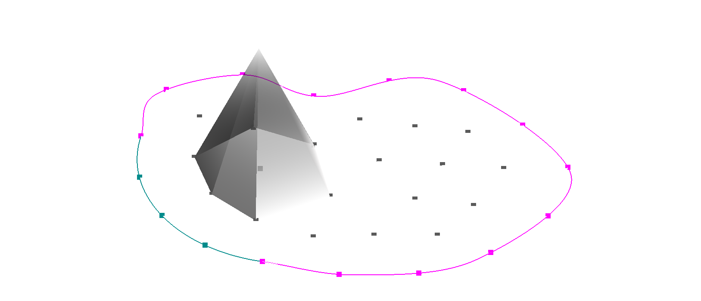

# Esquemas de discretización numérica {#sec-esquemas}

::::: {.chapterquote data-latex=""}
::: {lang=en-US}
> The miracle of the appropriateness of the language of mathematics for the formulation
> of the laws of physics is a wonderful gift which we neither understand nor deserve.
> We should be grateful for it and hope that it will remain valid in future research that
> it will extend, for better, or for worse, to our pleasure, even though perhaps also
> to our bafflement, to wide branches of learning.
>
> _Eugene Wigner_

> I don't believe in the idea that there are a few peculiar people capable of understanding math and the rest of the world is normal.
> Math is a human discovery, and it's no more complicated than humans can understand.
> I had a calculus book once that said, 'What one fool can do, another can'
> There's a tendency to pomposity in all this, to make it all [artificially] deep and profund.
> 
> _Richard Feynmann_

> Boundary conditions tend to make the theory of PDEs difficult.
>
> _Jürgen Jost, Partial Differential Equations, 2013_ @pdes
:::
:::::





En el capitulo anterior hemos arribado a formulaciones matemáticas que modelan los procesos físicos de transporte y difusión de neutrones en estado estacionario mediante ecuaciones integro-diferenciales.
Bajo las suposiciones que explicitamos al comienzo del [capítulo @sec-transporte-difusion] y asumiendo que las secciones eficaces macroscópicas son funciones del espacio y de la energía conocidas, estas ecuaciones son _exactas_.
Para la ecuación de difusión, que es de segundo orden pero más sencilla de resolver, llegamos a

$$ \tag{\ref{eq-difusion-ss}}
\begin{gathered}
 - \text{div} \Big[ D(\vec{x}, E) \cdot \text{grad} \left[ \phi(\vec{x}, E) \right] \Big]
 + \Sigma_t(\vec{x}, E) \cdot \phi(\vec{x}, E)
 = \\
\int_{0}^{\infty} \Sigma_{s_0}(\vec{x}, E^{\prime} \rightarrow E)  \cdot \phi(\vec{x}, E^\prime) \, dE^\prime +
\chi(E) \int_{0}^{\infty} \nu\Sigma_f(\vec{x}, E^\prime) \cdot \phi(\vec{x}, E^\prime) \, dE^\prime
+ s_0(\vec{x}, E)
\end{gathered}
$$


y para la ligeramente más compleja ecuación de transporte linealmente anisótropa obtuvimos

$$ \tag{\ref{eq-transporte-linealmente-anisotropica}}
\begin{gathered}
 \omegaversor \cdot \text{grad} \left[ \psi(\vec{x}, \omegaversor, E) \right]
 + \Sigma_t(\vec{x}, E) \cdot \psi(\vec{x}, \omegaversor, E) = \\
\frac{1}{4\pi} \cdot 
\int_{0}^{\infty} \Sigma_{s_0}(\vec{x}, E^{\prime} \rightarrow E) \cdot \int_{4\pi} \psi(\vec{x}, \omegaprimaversor, E^{\prime}) \, d\omegaprimaversor \, dE^\prime + \\
\frac{3 \cdot \omegaversor}{4\pi} \cdot
\int_{0}^{\infty} \Sigma_{s_1}(\vec{x}, E^{\prime} \rightarrow E) \cdot \int_{4\pi} \psi(\vec{x}, \omegaprimaversor, E^{\prime}) \cdot \omegaprimaversor \, d\omegaprimaversor \, dE^\prime  \\
+ \frac{\chi(E)}{4\pi} \int_{0}^{\infty} \nu\Sigma_f(\vec{x}, E^\prime) \cdot \int_{4\pi} \psi(\vec{x}, \omegaprimaversor, E^{\prime}) \, d\omegaprimaversor \, dE^\prime 
+ s(\vec{x}, \omegaversor, E)
\end{gathered}
$$ 

sobre un espacio de fases generado^[Del inglés [*spanned*]{lang=en-US}.] por seis escalares independientes:

 * tres para el espacio $\vec{x}$,
 * dos para la dirección $\omegaversor$ y
 * uno para la energía $E$.

 
El objetivo de este capítulo es transformar estas dos ecuaciones diferenciales en derivadas parciales en sistemas de ecuaciones algebraicas de tamaño finito de forma tal que las podamos resolver con una herramienta computacional, cuya implementación describimos en el [capítulo @sec-implementacion].
Este proceso involucra inherentemente aproximaciones relacionadas a la discretización de la energía $E$, la dirección $\omegaversor$ y el espacio $\vec{x}$, por lo que las soluciones a las ecuaciones diferenciales que podamos encontrar numéricamente serán solamente aproximaciones a las soluciones matemáticas reales.
Según discutimos en la @sec-metodos-numericos, estas aproximaciones serán mejores a medida que aumentemos la cantidad de entidades discretas. Pero al mismo tiempo aumentan los recursos y costos de ingeniería asociados.

Comenzamos primero entonces introduciendo algunas propiedades matemáticas de los métodos numéricos y discutiendo cuestiones a tener en cuenta para analizarlos desde el punto de vista del gerenciamiento de proyectos de ingeniería.
Pasamos luego a la discretización de las ecuaciones propiamente dicha.
Primeramente discretizamos la dependencia en energía aplicando la idea de grupos discretos de energías para obtener las llamadas “ecuaciones multigrupo”.
Continuamos luego por la dependencia angular de la ecuación de transporte aplicando el método de ordenadas discretas S$_N$.
Esencialmente la idea es transformar las integrales sobre $E^\prime$ y sobre $\omegaprimaversor$ en las dos ecuaciones [-@eq-difusion-ss] y [-@eq-transporte-linealmente-anisotropica] del principio del capítulo por sumatorias finitas.

El grueso del capítulo lo dedicamos a la discretización espacial de ambas ecuaciones, que es el aporte principal de esta tesis al problema de la resolución de las ecuaciones de transporte de neutrones a nivel de núcleo utilizando mallas no estructuradas y técnicas de descomposición de dominio para permitir la resolución de problemas de tamaño arbitrario.
En la monografía @monografia mostramos, para la ecuación de difusión, una derivación similar a la formulación propuesta en esta tesis basada en elementos finitos. Pero también se incluye una formulación espacial basada en volúmenes finitos. Por cuestiones de longitud, hemos decidido enfocarnos solamente en elementos finitos en esta tesis.
Dejamos la extensión a volúmenes finitos y su comparación con otros esquemas como trabajos futuros.

Finalmente analizamos la forma matricial/vectorial de los tres casos de problemas de estado estacionario que resolvemos en esta tesis según el medio se multiplicativo o no y según haya fuentes externas o no.


## Métodos numéricos {#sec-metodos-numericos}
 
En forma general, las ecuaciones [-@eq-difusion-ss] y [-@eq-transporte-linealmente-anisotropica] que derivamos en el capítulo anterior a partir de primeros principios están expresadas en una formulación fuerte (ver @def-formulacion-fuerte) y exacta

$$
\mathcal{F}(\varphi, \Sigma) = 0
$$
denotando con
  
 * $\varphi$ el flujo incógnita ($\psi$ o $\phi$) “exacto”^[En el sentido matemático de satisfacer exactamente la ecuación diferencial. El análisis de la exactitud física queda fuera del alcance de esta tesis.] que depende continuamente de $\vec{x}$, $E$ y $\omegaversor$,
 * $\Sigma$ todos los datos de entrada, incluyendo el dominio espacial de dimensión $D$ continuo $U \in \mathbb{R}^D$ y las secciones eficaces con sus dependencias continuas de $\vec{x}$, $E$ y $\omegaversor$,
 * $\mathcal{F}$ un operador integral sobre $E^\prime$ y $\omegaprimaversor$ y diferencial sobre $\vec{x}$
 
Esencialmente, en este capítulo aplicamos métodos numéricos @quarteroni para obtener una formulación débil (ver @def-formulacion-debil) y aproximada

$$
\mathcal{F}_N(\varphi_N, \Sigma_N) = 0
$$ {#eq-generica-numerica}
donde ahora

 * $\varphi_N$ es una aproximación discreta de tamaño $N$ del flujo incógnita,
 * $\Sigma_N$ es una aproximación de los datos de entrada, incluyendo una discretización $U_N$ del dominio espacial
 * $\mathcal{F}_N$ es un operador discreto de tamaño $N$
 
El tamaño $N$ del operador discreto $\mathcal{F}_N$ es el producto de

 a. la cantidad $G$ de grupos de energías (@sec-multigrupo),
 b. la cantidad $M$ de direcciones de vuelo discretas (@sec-sn), y
 c. la cantidad $J$ de incógnitas espaciales (@sec-discretizacion-espacial).
 

::: {#def-convergencia}
## Convergencia

Un método numérico es _convergente_ si

$$
\lim_{N\rightarrow \infty} || \varphi - \varphi_N || = 0
$$
para alguna norma apropiada $||\cdot||$.
Por ejemplo, para la norma $L_2$:

$$
\lim_{N\rightarrow \infty} \sqrt{\int_U \int_{4\pi} \int_{0}^{\infty} 
\left[ \varphi(\vec{x},\omegaversor,E) - \varphi_N(\vec{x},\omegaversor,E) \right]^2
\, dE \, d\omegaversor \, d^3\vec{x} }  = 0
$$
:::

La convergencia y, más aún, el orden con el cual el error $|| \varphi - \varphi_N ||$ converge a cero es importante al verificar la implementación computacional de un método numérico. Tanto es así que para que una herramienta computacional sea verificada en el sentido de “verificación y validación” de software, no sólo se tiene que mostrar que $\lim_{N\rightarrow \infty} || \varphi - \varphi_N || = 0$ sino que la tasa de disminución de este error con $1/N$ tiene que coincidir con el orden del método numérico (ver @sec-mms-dif).
De todas maneras, demostrar que un método numérico genérico es convergente no es sencillo y ni siquiera posible en la mayoría de los casos.
En forma equivalente, se prueban los conceptos de consistencia y estabilidad definidos a continuación y luego se utiliza el teorema de equivalencia que sigue.

::: {#def-consistencia}
## Consistencia

Un método numérico es _consistente_ si

$$
\lim_{N\rightarrow \infty} \mathcal{F}_N(\varphi, \Sigma) =
\lim_{N\rightarrow \infty} \left[ \mathcal{F}_N(\varphi, \Sigma) - \mathcal{F}(\varphi, \Sigma) \right] = 0
$$

Es decir, si el operador discreto $\mathcal{F}_N$ tiende al operador continuo $\mathcal{F}$ para $N\rightarrow \infty$.
Más aún, si

$$
\mathcal{F}_N(\varphi, \Sigma) =
\left[ \mathcal{F}_N(\varphi, \Sigma) - \mathcal{F}(\varphi, \Sigma) \right] = 0 \quad \forall N \geq 1
$$
entonces decimos que el método numérico es _fuertemente_^[Del inglés [*strongly*]{lang=en-US}.] o _completamente_^[Del inglés [*fully*]{lang=en-US}.] consistente.
:::


::: {#def-estabilidad}
## Estabilidad

Un método numérico es _estable_ si dada una perturbación pequeña $\delta \Sigma_N$ en los datos de entrada tal que

$$
\mathcal{F}_N(\varphi_N + \delta \varphi_N, \Sigma_N + \delta \Sigma_N) = 0
$$
entonces la perturbación $\delta \varphi_N$ causada en la solución también es pequeña.
Formalmente, un método numérico es estable si

$$
\forall \epsilon > 0, \exists \delta(\epsilon) > 0 : \forall \delta \Sigma_N~/~ || \delta \Sigma_N || < \delta(\epsilon) \Rightarrow || \delta \varphi_N || < \epsilon \quad \forall N \geq 1
$$
:::

La consistencia es relativamente sencilla de demostrar. La estabilidad es un poco más compleja, pero posible.
Finalmente, la convergencia queda demostrada a partir del siguiente resultado.

::: {#thm-lax}
##  de equivalencia de Lax-Richtmyer

Si un método numérico es consistente, entonces es convergente si y sólo si es estable.
Más aún, cualesquiera dos propiedades implica la tercera.
:::


### Comparaciones y evaluaciones económicas

Suponiendo que disponemos de varios métodos numéricos que nos permitan calcular $\varphi_N$ a partir de un conjunto de datos de entrada $\Sigma_N$ sobre un cierto espacio de fases discretizado, cabría preguntarnos cuál es el más eficiente para resolver un cierto problema de ingeniería nuclear. Está claro que en este sentido, la eficiencia depende de

 1. la exactitud de la solución $\varphi_N$ obtenida
 2. los recursos computacionales necesarios para obtener $\varphi_N$, medidos en
 
     a. tiempo total de procesamiento (CPU, GPU y/o APU)
     b. tiempo de pared,^[En el sentido del inglés [*wall time*]{lang=en-US}.] que es igual al del punto a en serie pero debería ser menor en cálculos en paralelo,
     c. memoria RAM,
     d. necesidades de almacenamiento, etc.
    
 3. los recursos humanos necesarios para 
 
     a. preparar $\Sigma_N$ (pre-procesar),
     b. analizar $\varphi_N$ (post-procesar), y
     c. llegar a conclusiones útiles.
     
    
     
Si bien con esta taxonomía pareciera ser que comparar métodos numéricos no debería ser muy difícil, hay detalles que deben ser tenidos en cuenta y que de hecho complican la evaluación.
Por ejemplo, dado un cierto problema de análisis de reactores a nivel de núcleo, el punto 1 incluye las siguiente preguntas:

 * ¿Es necesario resolver la ecuación de transporte o la ecuación de difusión es suficiente?
 * ¿Cuántas direcciones discretas hay que tener en cuenta para obtener una exactitud apropiada?
 
Por otro lado, el punto 2 abarca cuestiones como

 * ¿Es más eficiente discretizar el espacio con una formulación precisa como Galerkin que da lugar a matrices no simétricas usando pocos grados de libertad o conviene utilizar una formulación menos precisa como cuadrados mínimos que da lugar a matrices simétricas pero empleando más incógnitas espaciales?
 * ¿Es preferible usar métodos directos que son robustos pero poco escalables o métodos iterativos que son escalables pero sensibles a perturbaciones?

La determinación del valor de $N$ necesario para contar con una cierta exactitud apropiada para cada método numérico no es trivial e involucra estudios paramétricos para obtener $\varphi_N$ vs. $N$. Este proceso puede necesitar barrer valores de $N$ suficientemente grandes para los cuales haya discontinuidades en la evaluación. Por ejemplo, si se debe pasar de una sola computadora a más de una por limitaciones de recursos (usualmente memoria RAM) o si se debe pasar de una infra-estructura *on-premise* a una basada en la nube en un eventual caso donde se necesiten más nodos ([*hosts*]{lang=en-US}) de cálculo que los disponibles.
 
Finalmente, como en cualquier evaluación técnico-económica, intervienen situaciones particulares más blandas relacionadas al gerenciamiento de proyectos y a la tensión de los tres vértices del triángulo alcance-costos-tiempo, como por ejemplo:

 * ¿Se necesitan resultados precisos (caros y lentos) o resultados aproximados (baratos y rápidos) son suficientes?
 * ¿Se prioriza disminuir los costos (como en la mayoría de los proyectos de ingeniería) o se prioriza tener resultados en poco tiempo (e.g. Proyecto Manhattan @making)?
 * ¿Cómo dependen los tiempos y los costos de la infra-estructura de los recursos computacionales? 
   - Si es *on-premise*:
     * amortización de hardware
     * mantenimiento de hardware
     * licencias de software
     * administración de software
     * energía eléctrica
   - Si es *cloud*: 
     * alquiler de instancias
     * suscripciones a servicios
     * orquestación
 * ¿Cómo son los costos asociados a la capacitación de los ingenieros que tienen que obtener $\varphi$ con cada método numérico?

Está claro que el análisis de todas estas combinaciones están fuera del alcance de esta tesis.
De todas maneras, la herramienta computacional cuya implementación describimos en detalle en el [capítulo @sec-implementacion] permite evaluar todos estos aspectos y muchos otros ya que, en forma resumida

 1. Está diseñado para ser ejecutado nativamente en la nube.^[Del inglés [*cloud native*]{lang=en-US} como contrapartida a  [*cloud friendly*]{lang=en-US} o [*cloud enabled*]{lang=en-US}.]
 2. Permite discretizar el dominio espacial utilizando mallas no estructuradas.^[Del inglés [*unstructured grids*]{lang=en-US}.]
 3. Puede correr en paralelo en una cantidad arbitraria de computadoras.^[Del inglés [*hosts*]{lang=en-US}.]

En particular, permite a los ingenieros nucleares comparar las soluciones obtenidas con las formulaciones $S_N$ y de difusión al resolver un mismo problema de tamaño arbitrario.
De esta forma, es posible justificar ante gerencias superiores o entes regulatorios la factibilidad (o no) de encarar un proyecto para analizar un reactor nuclear con la ecuación de difusión utilizando

 a. datos objetivos, y
 b. juicio de ingeniería.


## Discretización en energía {#sec-multigrupo}

Vamos a discretizar el dominio de la energía $E \in \mathbb{R}$ utilizando el concepto clásico de física de reactores de *grupos de energías*, que llevado a conceptos más generales de matemática discreta es equivalente a integrar sobre volúmenes (intervalos en $\mathbb{R}$) de control y utilizar el valor medio sobre cada volumen como el valor discretizado.

En efecto, tomemos el intervalo de energías $[0,E_0]$ donde $E_0$ es la mayor energía esperada de un neutrón individual.
Como ilustramos en la @fig-multigroup, dividamos dicho intervalo en $G$ grupos (volúmenes) no necesariamente iguales, cada uno definido por energías de corte $0=E_G < E_{G-1} < \dots < E_2 < E_1 < E_0$, de forma tal que el grupo $g$ es el intervalo $[E_g,E_{g-1}]$.

::: {.remark}
Con esta notación, el grupo número uno siempre es el de mayor energía.
A medida que un neutrón va perdiendo energía, va aumentando el número de su grupo de energía.
:::

![Discretización del dominio energético en grupos (volúmenes) de energía. Tomamos la mayor energía esperada $E_0$ y dividimos el intervalo $[0,E_0]$ en $G$ grupos, no necesariamente iguales. El grupo uno es el de mayor energía.](multigroup-energy){#fig-multigroup width=95%}


::: {#def-psig}
El flujo angular $\psi_g$ del grupo $g$ es

$$
\psi_g(\vec{x}, \omegaversor) = \int_{E_g}^{E_{g-1}} \psi(\vec{x}, \omegaversor, E) \, dE
$$
:::

::: {#def-phig}
El flujo escalar $\phi_g$ del grupo $g$ es

$$
\phi_g(\vec{x}) = \int_{E_g}^{E_{g-1}} \phi(\vec{x}, E) \, dE
$$
:::

::: {#def-Jg}
El vector corriente $\vec{J}_g$  del grupo $g$ es

$$
\vec{J}_g(\vec{x}) =
\int_{E_g}^{E_{g-1}} \vec{J}(\vec{x},E) \, dE =
\int_{E_g}^{E_{g-1}} \int_{4\pi} \psi(\vec{x}, \omegaversor, E) \cdot \omegaversor \, d\omegaversor \, dE =
\int_{4\pi} \psi_g(\vec{x}, \omegaversor) \cdot \omegaversor \, d\omegaversor =
$$
:::


::: {.remark}
Los flujos $\psi(\vec{x}, \omegaversor, E)$ y $\psi_g(\vec{x}, \omegaversor)$ no tienen las mismas unidades.
La primera magnitud tiene unidades de inversa de área por inversa de ángulo sólido por inversa de energía por inversa de tiempo (por ejemplo $\text{cm}^{-2} \cdot \text{eV}^{-1} \cdot \text{s}^{-1}$), mientras que la segunda es un flujo integrado por lo que sus unidades son inversa de área por inversa de ángulo sólido por inversa de tiempo (por ejemplo $\text{cm}^{-2} \cdot \text{s}^{-1}$).
La misma idea aplica a $\phi(\vec{x}, E)$ y a $\phi_g(\vec{x})$.
:::

Los tres objetivos de discretizar la energía en $G$ grupos son

 1. transformar la dependencia continua del flujo angular $\psi(\vec{x}, \omegaversor, E)$ con la energía $E$ en $G$ funciones $\psi_g(\vec{x},\omegaversor)$ y del flujo escalar $\phi(\vec{x}, E)$ en $G$ funciones $\phi_g(\vec{x})$,
 2. reemplazar las integrales sobre la variable continua $E^\prime$ por sumatorias finitas sobre el índice $g^\prime$, y
 3. re-escribir las ecuaciones de difusión y transporte en función de los flujos de grupo ($\psi_g(\vec{x},\omegaversor)$ en transporte y $\phi_g(\vec{x})$ en difusión)
 
 
Para ilustrar la idea, prestemos atención al término de absorción total de la ecuación de transporte $\Sigma_t \cdot \psi$.
El objetivo es integrarlo con respecto a $E$ entre $E_g$ y $E_{g-1}$ y escribirlo como el producto de una sección eficaz total asociada al grupo $g$ por el flujo angular $\psi_g$ de la @def-psig:

$$
\int_{E_g}^{E_{g-1}} \Sigma_t(\vec{x}, E) \cdot \psi(\vec{x}, \omegaversor, E) \, dE =
\Sigma_{t g}(\vec{x}) \cdot \psi_g(\vec{x}, \omegaversor)
$$ {#eq-sigmatg-psig}

De la misma manera, para la ecuación de difusión quisiéramos que 

$$
\int_{E_g}^{E_{g-1}} \Sigma_t(\vec{x}, E) \cdot \phi(\vec{x}, E) \, dE =
\Sigma_{t g}(\vec{x}) \cdot \phi_g(\vec{x})
$$

Según la @def-psig, la sección eficaz total $\Sigma_{t g}$ media en el grupo $g$ debe ser

$$
\Sigma_{t g}(\vec{x}) =
\frac{\displaystyle \int_{E_g}^{E_{g-1}} \Sigma_t(\vec{x}, E) \cdot \phi(\vec{x}, E) \, dE}{\displaystyle \int_{E_g}^{E_{g-1}} \phi(\vec{x}, E) \, dE}
$$ 
con lo que no hemos ganado nada ya que llegamos a una condición tautológica donde el parámetro que necesitamos para no tener que conocer la dependencia explícita del flujo con la energía depende justamente de dicha dependencia.
Sin embargo ---y es ésta una de las ideas centrales del cálculo y análisis de reactores--- podemos suponer que el cálculo de celda (@sec-celda) es capaz de proveernos las secciones eficaz macroscópicas multigrupo para el reactor que estamos modelando de forma tal que, desde el punto de vista del cálculo de núcleo, $\Sigma_{t g}$ y todas las demás secciones eficaces macroscópicas son distribuciones conocidas del espacio $\vec{x}$.

Para analizar la sección eficaz de $\nu$-fisiones, integremos el término de fisión de la ecuación de transporte entre las energías $E_{g-1}$ y $E_g$ e igualémoslo a una sumatoria de productos $\nu\Sigma_{fg^\prime} \cdot \phi_{g^\prime}$^[Podríamos haber integrado la ecuación de difusión, en cuyo caso no tendríamos el denominador $4\pi$ en ambos miembros. En cualquier caso, el resultado sería el mismo.]


$$
\int_{E_{g-1}}^{E_g} \frac{\chi(E)}{4\pi} \cdot
\int_0^\infty \nu\Sigma_f(\vec{x},E^\prime) \cdot \phi(\vec{x}, E^\prime) \, dE^\prime \, dE
=
\frac{\chi_g}{4\pi} \cdot
\sum_{g^\prime=1}^G \nu\Sigma_{fg^\prime}(\vec{x}) \cdot \phi_{g^\prime}(\vec{x})
$$ {#eq-nusigmaf-phig}

entonces

$$
\chi_g = \int_{E_{g-1}}^{E_g} \chi(E) \, dE
$$ {#eq-chig}
y

$$
\nu\Sigma_{f g}(\vec{x}) = \frac{\displaystyle \int_{E^\prime_g}^{E^\prime_{g-1}} \nu\Sigma_f(\vec{x}, E^\prime) \cdot \phi(\vec{x}, E^\prime) \, dE^\prime}{\displaystyle \int_{E^\prime_g}^{E^\prime_{g-1}} \phi(\vec{x}, E^\prime) \, dE^\prime}
$$ 


Para el término de [scattering]{lang=en-US} isotrópico, requerimos que

$$
\int_{E_{g-1}}^{E_g} \frac{1}{4\pi} \cdot 
\int_{0}^{\infty} \Sigma_{s_0}(\vec{x}, E^{\prime} \rightarrow E) \cdot \phi(\vec{x},E^\prime) \, dE^\prime \, dE
=
\frac{1}{4\pi} \cdot \sum_{g^\prime=1}^G \Sigma_{s_0 g^\prime \rightarrow g}(\vec{x}) \cdot \phi_{g^\prime}(\vec{x})
$$ {#eq-sigmas0-phig}
entonces

$$
\Sigma_{s_0 g^\prime \rightarrow g}(\vec{x}) =
\frac{\displaystyle \int_{E_{g-1}}^{E_g} \int_{E^\prime_{g-1}}^{E^\prime_g} \Sigma_{s_0}(\vec{x}, E^{\prime} \rightarrow E) \cdot \phi(\vec{x},E^\prime) \,dE}{\displaystyle \int_{E^\prime_{g-1}}^{E^\prime_g} \phi(\vec{x},E^\prime) \, dE^\prime}
$$

::: {.remark}
Necesitamos una doble integral sobre $E$ y sobre $E^\prime$ porque $\Sigma_{s_0}(\vec{x}, E^{\prime} \rightarrow E)$ es una sección eficaz diferencial y tiene unidades de inversa de longitud por inversa de ángulo sólido por inversa de energía.
:::

Un análisis similar para el término de [scattering]{lang=en-US} linealmente anisótropo

$$
\int_{E_{g-1}}^{E_g} \frac{3 \cdot \omegaversor}{4\pi} \cdot 
\int_{0}^{\infty} \Sigma_{s_0}(\vec{x}, E^{\prime} \rightarrow E) \cdot \vec{J}(\vec{x},E^\prime) \, dE^\prime \, dE
=
\frac{3 \cdot \omegaversor}{4\pi} \cdot \sum_{g^\prime=1}^G \Sigma_{s_1 g^\prime \rightarrow g}(\vec{x}) \cdot \vec{J}_{g^\prime}(\vec{x})
$$ {#eq-sigmas1-Jg}
arrojaría la necesidad de pesar la sección eficaz diferencial con la corriente $\vec{J}$ en lugar de con el flujo escalar $\phi$, dejando una expresión sin sentido matemático como

$$
\Sigma_{s_1 g^\prime \rightarrow g}(\vec{x}) =
\frac{\displaystyle \int_{E_{g-1}}^{E_g} \int_{E^\prime_{g-1}}^{E^\prime_g} \Sigma_{s_1}(\vec{x}, E^{\prime} \rightarrow E) \cdot \vec{J}(\vec{x},E^\prime) \,dE}{\displaystyle \int_{E^\prime_{g-1}}^{E^\prime_g} \vec{J}(\vec{x},E^\prime) \, dE^\prime}
$$
a menos que tanto numerador como denominador tengan sus elementos proporcionales entre sí y la división se tome como elemento a elemento.
Usualmente se desprecia la diferencia entre corriente y flujo y podemos utilizar el flujo para pesar el término de [scattering]{lang=en-US} anisótropo:

$$
\Sigma_{s_1 g^\prime \rightarrow g}(\vec{x}) \approx
\frac{\displaystyle \int_{E_{g-1}}^{E_g} \int_{E^\prime_{g-1}}^{E^\prime_g} \Sigma_{s_1}(\vec{x}, E^{\prime} \rightarrow E) \cdot \phi(\vec{x},E^\prime) \,dE}{\displaystyle \int_{E^\prime_{g-1}}^{E^\prime_g} \phi(\vec{x},E^\prime) \, dE^\prime}
$$


Integremos ahora la ecuación de transporte @eq-transporte-linealmente-anisotropica con respecto a $E$ entre $E_g$ y $E_{g-1}$:

$$
\begin{gathered}
 \omegaversor \cdot \text{grad} \left[ \int_{E_g}^{E_{g-1}} \psi(\vec{x}, \omegaversor, E) \, dE \right]  +
 \int_{E_g}^{E_{g-1}} \Sigma_t(\vec{x}, E) \cdot \psi(\vec{x}, \omegaversor, E) \, dE = \\
 \int_{E_g}^{E_{g-1}} \frac{1}{4\pi} \cdot \int_{0}^{\infty} \Sigma_{s_0}(\vec{x}, E^{\prime} \rightarrow E) \cdot \phi(\vec{x}, E^{\prime}) \, dE^\prime + \\
 \int_{E_g}^{E_{g-1}} \frac{3 \cdot \omegaversor}{4\pi} \cdot \int_{0}^{\infty} \Sigma_{s_1}(\vec{x}, E^{\prime} \rightarrow E) \cdot \vec{J}(\vec{x}, E^{\prime}) \, dE^\prime + \\
 \int_{E_g}^{E_{g-1}} \frac{\chi(E)}{4\pi} \int_{0}^{\infty} \int_{4\pi} \nu\Sigma_f(\vec{x}, E^\prime) \cdot \phi(\vec{x}, E^\prime) \, dE^\prime \, dE +
 \int_{E_g}^{E_{g-1}} s(\vec{x}, \omegaversor, E) \, dE
\end{gathered}
$$

::: {#def-s-g}
Definimos la fuente de neutrones independientes del grupo $g$ como

$$
s_g(\vec{x}, \omegaversor) = \int_{E_g}^{E_{g-1}} s(\vec{x}, \omegaversor, E) \, dE
$$
:::

::: {#def-s0-g}
Definimos el momento de orden cero de las fuentes independientes del grupo $g$ como

$$
s_{0g}(\vec{x}) = \int_{E_g}^{E_{g-1}} s_0(\vec{x}, E) \, dE
$$
:::

Teniendo en cuenta las definiciones

 * [-@def-psig] (flujo angular del grupo $g$)
 * [-@def-phig] (flujo escalar del grupo $g$)
 * [-@def-Jg] (corriente del grupo $g$)
 * [-@def-s-g] (fuente del grupo $g$)
 
y las ecuaciones

 * [-@eq-sigmatg-psig] (ritmo de absorciones)
 * [-@eq-nusigmaf-phig] (ritmo de fisiones)
 * [-@eq-chig] (espectro de fisiones)
 * [-@eq-sigmas0-phig] (scattering isotrópico)
 * [-@eq-sigmas1-Jg] (scattering linealmente anisótropo)

obtenemos las $G$ ecuaciones de transporte multigrupo

$$
\begin{gathered}
 \omegaversor \cdot \text{grad} \left[ \psi_g(\vec{x}, \omegaversor) \right]  +
 \Sigma_{t g}(\vec{x}) \cdot \psi_g(\vec{x}, \omegaversor) = 
 \frac{1}{4\pi} \cdot \sum_{g^\prime=1}^G \Sigma_{s_0 g^\prime \rightarrow g}(\vec{x}) \cdot \phi_{g^\prime}(\vec{x}) + \\
 \frac{3 \cdot \omegaversor}{4\pi} \cdot \sum_{g^\prime=1}^G \Sigma_{s_1 g^\prime \rightarrow g}(\vec{x}) \cdot \vec{J}_{g^\prime}(\vec{x}) + 
 \frac{\chi_g}{4\pi} \sum_{g^\prime=1}^G \nu\Sigma_{fg^\prime}(\vec{x}) \cdot \phi_{g^\prime}(\vec{x})
+ s_g(\vec{x}, \omegaversor)
\end{gathered}
$$ {#eq-transportemultigrupo}
donde las incógnitas son $\psi_g(\vec{x}, \omegaversor)$ para $g=1,\dots,G$


Procediendo de forma análoga para la ecuación de difusión @eq-difusion-ss, primero integrándola con respecto a $E$ entre $E_{g-1}$ y $E_g$ y luego teniendo en cuenta las definiciones

 * [-@def-psig] (flujo angular del grupo $g$)
 * [-@def-phig] (flujo escalar del grupo $g$)
 * [-@def-s-g] (fuente del grupo $g$)
 
podemos obtener la ecuación de difusión multigrupo

$$
\begin{gathered}
 - \text{div} \Big[ D_g(\vec{x}) \cdot \text{grad} \left[ \phi_g(\vec{x}) \right] \Big]
 + \Sigma_{t g}(\vec{x}) \cdot \phi_g(\vec{x})
 = \\
\sum_{g^\prime = 1}^G \Sigma_{s_0 g^\prime \rightarrow g}(\vec{x})  \cdot \phi_{g^\prime}(\vec{x}) +
\chi_g \sum_{g^\prime = 1}^G \nu\Sigma_{fg^\prime}(\vec{x}) \cdot \phi_{g^\prime}(\vec{x})+ s_{0g}(\vec{x})
\end{gathered}
$$ {#eq-difusionmultigrupo}
donde ahora las incógnitas son $\phi_g(\vec{x})$ para $g=1,\dots,G$, 


::: {.remark}
El coeficiente de difusión $D_g$ del grupo $g$ proviene de calcular las secciones eficaces $\Sigma_{tg}$, $\Sigma_{st}$ y el coseno medio de [scattering]{lang=en-US} $\mu_{0g}$ del grupo $g$ y reemplazar la @def-D por

$$
D_g(\vec{x}) = \frac{1}{3 \left[ \Sigma_{tg}(\vec{x}) - \mu_{0g}(\vec{x}) \cdot \Sigma_{s_t g}(\vec{x}) \right]}
$$
:::

::: {.remark}
Matemáticamente, la aproximación multigrupo es equivalente a discretizar el dominio de la energía con un esquema de volúmenes finitos con la salvedad de que no hay operadores diferenciales con respecto a la variable $E$ sino que el acople entre volúmenes se realiza en forma algebraica. Dicho acople no es necesariamente entre primeros vecinos solamente sino que es arbitrario, i.e. un neutrón puede pasar del grupo 1 al $G$, o viceversa, o de un grupo arbitrario $g^\prime$ a otro grupo $g$.
:::


::: {.remark}
Dado que en las ecuaciones multigrupo [-@eq-transportemultigrupo] y [-@eq-difusionmultigrupo] la discretización es estrictamente algebraica y deliberadamente tautológica, la consistencia es teóricamente fuerte ya que el operador discretizado coincide con el operador continuo incluso para un único grupo de energías $G=1$.
De hecho las ecuaciones multigrupo se basan solamente en _definiciones_.
En la práctica, la consistencia depende del cálculo a nivel de celda de la\ @sec-celda.
:::

## Discretización en ángulo {#sec-sn}

Para discretizar la dependencia espacial de la ecuación de transporte multigrupo [-@eq-transportemultigrupo] aplicamos el método de ordenadas discretas o S$_N$, discutido en la literatura tradicional de física de reactores.
En esta tesis lo derivamos al integrar las ecuaciones multigrupo continuas en $\omegaversor$ sobre volúmenes de control finitos como si fuese un esquema numérico basado en el método de volúmenes finitos.
De hecho, en este caso, los volúmenes finitos son áreas $\Delta \omegaversor_m$ discretas de la esfera unitaria donde cada una de ellas tiene asociadas

 1. un peso $w_m$
 2. una dirección particular $\omegaversor_m$, y
 3. una fracción de total de área unitaria $\Delta \omegaversor_m/4\pi$

para $m=1,\dots,M$. 
Nuevamente el acople entre volúmenes de control es algebraico y no necesariamente a primeros vecinos.


::::: {#thm-cuadratura}

## de cuadratura sobre la esfera unitaria

La integral de una función escalar $f(\omegaversor)$ de cuadrado integrable sobre todas las direcciones $\omegaversor$ es igual a $4\pi$ veces la suma de un conjunto de $M$ pesos $w_m$ normalizados tal que $\sum w_m = 1$, multiplicados por $M$ valores medios $\left\langle f(\omegaversor)\right\rangle_m$ asociados a $M$ direcciones $\omegaversor_m$ donde cada una de las cuales tiene asociada también una porción $\Delta \omegaversor_m$ de la esfera unitaria tal que su unión es $4\pi$ y su intersección es cero:

$$
\int_{4\pi} f(\omegaversor) \, d\omegaversor = 4\pi \cdot \sum_{w=1}^M w_m \cdot \left\langle f(\omegaversor)\right\rangle_m
$$

El peso $w_m$ es

$$
w_m = \frac{1}{4\pi} \cdot \int_{\Delta \omegaversor_m} d\omegaversor =
\frac{\Delta \omegaversor_m}{4\pi}
$$

::: {.proof}
Comenzamos escribiendo la integral sobre $4\pi$ como una suma para $m=1,\dots,M$

$$
 \int_{4\pi} f(\omegaversor) \, d\omegaversor = \sum_{m=1}^M \int_{\Delta \omegaversor_m} f(\omegaversor) \, d\omegaversor
$$

Multiplicamos y dividimos por $\int_{\Delta \omegaversor_m} d\omegaversor = 4\pi \cdot w_m$

$$
\sum_{m=1}^M \int_{\Delta \omegaversor_m} f(\omegaversor) \, d\omegaversor
= \sum_{m=1}^M \frac{ \displaystyle \int_{\Delta \omegaversor_m} f(\omegaversor) \, d\omegaversor}{ \displaystyle \int_{\Delta \omegaversor_m} d\omegaversor} \cdot \int_{\Delta \omegaversor_m} d\omegaversor
= \sum_{m=1}^M \frac{ \displaystyle \int_{\Delta \omegaversor_m} f(\omegaversor) \, d\omegaversor}{ \displaystyle \int_{\Delta \omegaversor_m} d\omegaversor} \cdot 4\pi \, w_m
$$


Si llamamos $\left\langle f(\omegaversor)\right\rangle_{\omegaversor_m}$ al valor medio de $f$ en $\Delta \omegaversor_m$

$$
\left\langle f(\omegaversor)\right\rangle_{\omegaversor_m} = \frac{ \displaystyle \int_{\Delta \omegaversor_m} f(\omegaversor) \, d\omegaversor}{ \displaystyle \int_{\Delta \omegaversor_m} d\omegaversor}
$$
entonces se sigue la tesis del teorema.
:::
:::::


::: {#def-psi-mg}
El flujo angular $\psi_{mg}$ del grupo $g$ asociado a la ordenada discreta $m$ es igual al valor medio del flujo angular $\psi_g$ del grupo $g$ (definido en la @def-psig) alrededor de la dirección $\omegaversor_m$:

$$
\psi_{mg}(\vec{x}) = \left\langle \psi_g(\vec{x},\omegaversor)\right\rangle_{\omegaversor_m} = \frac{ \displaystyle \int_{\Delta \omegaversor_m} \psi_g(\vec{x},\omegaversor) \, d\omegaversor}{ \displaystyle \int_{\Delta \omegaversor_m} d\omegaversor}
$$
:::

::: {.remark}
Esta vez $\psi_{mg}$ sí tiene la mismas unidades que $\psi_{g}$.
:::

::: {#cor-int-psi-g}
La integral del flujo escalar sobre la porción $\Delta \omegaversor_m$ de la esfera unitaria es $4\pi$ veces el producto $w_m \cdot \psi_{mg}$:

$$
\int_{\Delta \omegaversor_m} \psi_g(\vec{x},\omegaversor) \, d\omegaversor
=
\psi_{mg}(\vec{x}) \cdot \Delta \omegaversor_m 
=
4\pi \cdot w_m \cdot \psi_{mg}(\vec{x})
$$
:::


::: {#cor-phig-sum-psimg}
El flujo escalar $\phi_g$ del grupo $g$ es igual a

$$
\phi_g(\vec{x}) = \int_{4\pi} \psi_g(\vec{x}, \omegaversor) \, d\omegaversor =
4\pi \sum_{m=1}^M w_m \cdot \psi_{mg}(\vec{x})
$$
:::

Re-escribamos primero la @eq-transportemultigrupo de transporte multigrupo
$$\tag{\ref{eq-transportemultigrupo}}
\begin{gathered}
 \omegaversor \cdot \text{grad} \left[ \psi_g(\vec{x}, \omegaversor) \right]  +
 \Sigma_{t g}(\vec{x}) \cdot \psi_g(\vec{x}, \omegaversor) = 
 \frac{1}{4\pi} \cdot \sum_{g^\prime=1}^G \Sigma_{s_0 g^\prime \rightarrow g}(\vec{x}) \cdot \phi_{g^\prime}(\vec{x}) + \\
 \frac{3 \cdot \omegaversor}{4\pi} \cdot \sum_{g^\prime=1}^G \Sigma_{s_1 g^\prime \rightarrow g}(\vec{x}) \cdot \vec{J}_{g^\prime}(\vec{x}) + 
 \frac{\chi_g}{4\pi} \sum_{g^\prime=1}^G \nu\Sigma_{fg^\prime}(\vec{x}) \cdot \phi_{g^\prime}(\vec{x})
+ s_g(\vec{x}, \omegaversor)
\end{gathered}
$$

en función de los flujos angulares $\psi_{mg}$ usando la\ @def-psi-mg y explicitando el termino de la corriente como la integral del producto $\psi_{g^\prime} \cdot \omegaversor$ según la\ @def-Jg

$$
\begin{gathered}
 \omegaversor \cdot \text{grad} \left[ \psi_g(\vec{x}, \omegaversor) \right]  +
 \Sigma_{t g}(\vec{x}) \cdot \psi_g(\vec{x}, \omegaversor) = \\
 \frac{1}{4\pi} \cdot \sum_{g^\prime=1}^G \Sigma_{s_0 g^\prime \rightarrow g}(\vec{x}) \cdot 4\pi \cdot \sum_{m^\prime=1} w_{m^\prime} \cdot \psi_{m^\prime g^\prime}(\vec{x}) + \\
 \frac{3 \cdot \omegaversor}{4\pi} \cdot \sum_{g^\prime=1}^G \Sigma_{s_1 g^\prime \rightarrow g}(\vec{x}) \cdot \sum_{m^\prime=1} \int_{\omegaversor_{m^\prime}} \psi_{g^\prime}(\vec{x},\omegaversor) \cdot \omegaversor \, d\omegaversor +\\
 \frac{\chi_g}{4\pi} \sum_{g^\prime=1}^G \nu\Sigma_{fg^\prime}(\vec{x})\cdot 4\pi \cdot \sum_{m^\prime=1} w_{m^\prime} \cdot \psi_{m^\prime g^\prime}(\vec{x})
+ s_g(\vec{x}, \omegaversor)
\end{gathered}
$$

Ahora cancelamos los factores $4\pi$ en los términos de [scattering]{lang=en-US} lineal y fisión, integramos todos los términos con respecto a $\omegaversor$ sobre $\Delta \omegaversor_m$ y los analizamos uno por uno:

$$
\begin{gathered}
 \underbrace{\int_{\omegaversor_m} \left\{ \omegaversor \cdot \text{grad} \left[ \psi_g(\vec{x}, \omegaversor) \right] \right\} \, d\omegaversor}_\text{advección} +
 \underbrace{\int_{\omegaversor_m} \left\{ \Sigma_{t g}(\vec{x}) \cdot \psi_g(\vec{x}, \omegaversor)  \right\} \, d\omegaversor}_\text{absorción total} = \\
 \underbrace{\bigintsss_{\omegaversor_m} \left\{ \sum_{g^\prime=1}^G \Sigma_{s_0 g^\prime \rightarrow g}(\vec{x})  \cdot \sum_{m^\prime=1} w_{m^\prime} \cdot \psi_{m^\prime g^\prime}(\vec{x}) \right\}  \, d\omegaversor}_\text{scattering isotrópico} + \\
 \underbrace{\bigintsss_{\omegaversor_m} \left\{ \frac{3 \cdot \omegaversor}{4\pi} \cdot \sum_{g^\prime=1}^G \Sigma_{s_1 g^\prime \rightarrow g}(\vec{x}) \cdot \sum_{m^\prime=1} \int_{\omegaversor_{m^\prime}} \psi_{g^\prime}(\vec{x},\omegaversor^\prime) \cdot \omegaversor^\prime \, d\omegaversor^\prime   \right\} \, d\omegaversor}_\text{scattering linealmente anisótropo} +\\
 \underbrace{\bigintsss_{\omegaversor_m} \left\{ \chi_g \cdot \sum_{g^\prime=1}^G \nu\Sigma_{fg^\prime}(\vec{x}) \cdot   \sum_{m^\prime=1} w_{m^\prime} \cdot \psi_{m^\prime g^\prime}(\vec{x}) \right\}  \, d\omegaversor}_\text{fisión} +
 \underbrace{\int_{\omegaversor_m} \left\{ s_g(\vec{x}, \omegaversor)  \right\} \, d\omegaversor  }_\text{fuentes independientes}
\end{gathered}
$$ {#eq-trasporte-integrado-omegam}

Comencemos por el termino de advección, revirtiendo el\ @thm-div-inner

$$
\begin{aligned}
\int_{\omegaversor_m} \left\{ \omegaversor \cdot \text{grad} \left[ \psi_g(\vec{x}, \omegaversor) \right] \right\} \, d\omegaversor
&=
\int_{\omegaversor_m}  \text{div} \left[ \omegaversor \cdot \psi_g(\vec{x}, \omegaversor) \right] \, d\omegaversor
\\
&=
\text{div} \left[ \int_{\omegaversor_m} \omegaversor \cdot \psi_g(\vec{x}, \omegaversor) \, d\omegaversor \right]
\end{aligned}
$$

Prestemos atención a la integral. Supongamos que el flujo angular es constante a trozos^[Del ingles [*piecewise constant*]{lang=en-US}.] dentro de cada área $\Delta \omegaversor_m$. Entonces este valor constante es igual al valor medio de $\psi$ en $\Delta \omegaversor_m$

$$
\psi_g(\vec{x}, \omegaversor) = \left\langle \psi_g(\vec{x}, \omegaversor) \right\rangle_{\omegaversor_m} = \psi_{mg}(\vec{x})
\quad \text{si $\omegaversor \in \Delta \omegaversor_m$}
$$

En estas condiciones, $\psi$ puede salir de la integral

$$
\int_{\omegaversor_m} \omegaversor \cdot \psi_g(\vec{x}, \omegaversor) \, d\omegaversor
\approx
\psi_{mg}(\vec{x}) \cdot \int_{\omegaversor_m} \omegaversor \, d\omegaversor
$$

::: {#def-mean-omega}
Llamamos $\omegaversor_m$ a la dirección que resulta ser el valor medio $\left\langle \omegaversor \right\rangle_{\omegaversor_m}$ de todas las direcciones integradas en el área $\Delta \omegaversor_m$ sobre la esfera unitaria, es decir

$$
\omegaversor_m = \left\langle \omegaversor \right\rangle_{\omegaversor_m} =
\frac{ \displaystyle \int_{\Delta \omegaversor_m} \omegaversor \, d\omegaversor}{ \displaystyle \int_{\Delta \omegaversor_m} d\omegaversor}
$$
:::

::: {#cor-int-omega}
La integral del versor $\omegaversor$ sobre la fracción $\Delta \omegaversor_m$ de la esfera unitaria es igual al producto de $\omegaversor_m$ por $\Delta \omegaversor_m$:

$$
\int_{\Delta \omegaversor_m} \omegaversor \, d\omegaversor
=
\omegaversor_m \cdot \Delta \omegaversor_m 
$$
:::

::: {#cor-int-psig-omega}

La integral del producto del versor $\omegaversor$ con el flujo angular del grupo $g$ sobre $\Delta \omegaversor_m$ es aproximadamente igual al producto $\psi_{mg} \cdot \Delta \omegaversor_m$:

$$
\int_{\omegaversor_m} \omegaversor \cdot \psi_g(\vec{x}, \omegaversor) \, d\omegaversor
\approx
\omegaversor_m \cdot \psi_{mg}(\vec{x}) \cdot  \Delta \omegaversor_m 
$$
:::


Podemos volver a aplicar el\ @thm-div-inner para escribir el término de advección como

$$
\begin{aligned}
\text{div} \left[ \int_{\omegaversor_m} \omegaversor \cdot \psi_g(\vec{x}, \omegaversor) \, d\omegaversor \right]
& \approx
\text{div} \left[ \omegaversor_m \cdot \psi_{mg}(\vec{x}) \cdot  \Delta \omegaversor_m  \right] \\
& \approx
\omegaversor_m \cdot \text{grad} \left[ \psi_{mg}(\vec{x}) \right]  \cdot \Delta \omegaversor_m \\
\end{aligned}
$$ {#eq-sn-adveccion}

Pasemos ahora al término de absorciones totales de la\ @{eq-trasporte-integrado-omegam}.
La sección eficaz no depende de $\omegaversor$ por lo que puede salir fuera de la integral

$$
\int_{\omegaversor_m} \left\{ \Sigma_{t g}(\vec{x}) \cdot \psi_g(\vec{x}, \omegaversor)  \right\} \, d\omegaversor = \Sigma_{t g}(\vec{x}) \cdot
\int_{\omegaversor_m} \psi_g(\vec{x}, \omegaversor) \, d\omegaversor
$$


Por el\ @cor-int-psi-g la última integral es $\psi_{mg} \cdot \Delta \omegaversor_m$, entonces

$$
\int_{\omegaversor_m} \left[ \Sigma_{t g}(\vec{x}) \cdot \psi_g(\vec{x}, \omegaversor)  \right] \, d\omegaversor = \left[ \Sigma_{t g}(\vec{x}) \cdot \psi_{mg}(\vec{x}) \right] \cdot \Delta \omegaversor_m
$$ {#eq-sn-absorciones}

El término de [scattering]{lang=en-US} isotrópico queda

$$
\bigintsss_{\omegaversor_m} \sum_{g^\prime=1}^G \Sigma_{s_0 g^\prime \rightarrow g}(\vec{x})  \cdot \sum_{m^\prime=1} w_{m^\prime} \cdot \psi_{m^\prime g^\prime}(\vec{x}) \, d\omegaversor
=
\left[ \sum_{g^\prime=1}^G \Sigma_{s_0 g^\prime \rightarrow g}(\vec{x})  \cdot \sum_{m^\prime=1} w_{m^\prime} \cdot \psi_{m^\prime g^\prime}(\vec{x}) \right] \cdot \Delta \omegaversor_m
$$ {#eq-sn-scattering-isotropico}
ya que el integrando no depende de $\omegaversor$.

El integrando del término de [scattering]{lang=en-US} linealmente anisótropo sí depende de $\omegaversor$.

$$
\bigintsss_{\omegaversor_m} \left[ \frac{3 \cdot \omegaversor}{4\pi} \cdot \sum_{g^\prime=1}^G \Sigma_{s_1 g^\prime \rightarrow g}(\vec{x}) \cdot \sum_{m^\prime=1} \int_{\omegaversor_{m^\prime}} \psi_{g^\prime}(\vec{x},\omegaversor^\prime) \cdot \omegaversor^\prime \, d\omegaversor^\prime   \right] \, d\omegaversor
$$

Primero notamos que el @cor-int-psig-omega nos indica, de manera aproximada, el resultado de la integral sobre $\omegaversor_{m^\prime}$: $\omegaversor_{m^\prime} \psi_{m^\prime g^\prime} \Delta\omegaversor_{m^\prime}$. A su vez, $\Delta\omegaversor_{m^\prime} = 4\pi w_{m^\prime}$, por lo que

$$
\begin{gathered}
\bigintsss_{\omegaversor_m} \left[ \frac{3 \cdot \omegaversor}{4\pi} \cdot \sum_{g^\prime=1}^G \Sigma_{s_1 g^\prime \rightarrow g}(\vec{x}) \cdot \sum_{m^\prime=1} 4\pi \cdot w_{m^\prime} \cdot \psi_{m^\prime g^\prime}(\vec{x}) \cdot \omegaversor_{m^\prime} \right] \, d\omegaversor
= \\
3 \sum_{g^\prime=1}^G \Sigma_{s_1 g^\prime \rightarrow g}(\vec{x}) \cdot \sum_{m^\prime=1} w_{m^\prime} \cdot \psi_{m^\prime g^\prime}(\vec{x}) \cdot \omegaversor_{m^\prime} \int_{\omegaversor_m} \omegaversor \, d\omegaversor
\end{gathered}
$$

Una vez mas, la integral sobre $\omegaversor_m$ ya la hemos resuelto (exactamente) en el\ @cor-int-omega, y es igual a $\omegaversor_m \cdot \Delta \omegaversor_m$. Entonces el término de [scattering]{lang=en-US} linealmente anisótropo es aproximadamente igual a
$$
\begin{gathered}
\bigintsss_{\omegaversor_m} \left[ \frac{3 \cdot \omegaversor}{4\pi} \cdot \sum_{g^\prime=1}^G \Sigma_{s_1 g^\prime \rightarrow g}(\vec{x}) \cdot \sum_{m^\prime=1} \int_{\omegaversor_{m^\prime}} \psi_{g^\prime}(\vec{x},\omegaversor^\prime) \cdot \omegaversor^\prime \, d\omegaversor^\prime   \right] \, d\omegaversor
\approx \\
\left[ 3 \cdot \sum_{g^\prime=1}^G \Sigma_{s_1 g^\prime \rightarrow g}(\vec{x}) \cdot \sum_{m^\prime=1} w_{m^\prime} \cdot \left( \omegaversor_{m} \cdot \omegaversor_{m^\prime} \right) \cdot \psi_{m^\prime g^\prime}(\vec{x}) \right] \cdot  \Delta \omegaversor_m
\end{gathered}
$$ {#eq-sn-scattering-anisotropico}

El término de fisiones es similar al de [scattering]{lang=en-US} isotrópico en el sentido de que el integrando no depende de $\omegaversor$ entonces su integral sobre $\Delta \omegaversor_m$ es directamente

$$
\bigintsss_{\omegaversor_m} \chi_g \sum_{g^\prime=1}^G \nu\Sigma_{fg^\prime}(\vec{x}) \cdot   \sum_{m^\prime=1} w_{m^\prime} \cdot \psi_{m^\prime g^\prime}(\vec{x}) \, d\omegaversor
=
\left[ \chi_g \sum_{g^\prime=1}^G \nu\Sigma_{fg^\prime}(\vec{x}) \cdot   \sum_{m^\prime=1} w_{m^\prime} \cdot \psi_{m^\prime g^\prime}(\vec{x}) \right] \cdot \Delta \omegaversor_m
$$ {#eq-sn-fisiones}

Para completar el análisis de la\ @eq-trasporte-integrado-omegam, en el término de las fuentes independientes usamos el concepto de valor medio

$$
\int_{\omegaversor_m} s_g(\vec{x}, \omegaversor) \, d\omegaversor
=
\left\langle s_g(\vec{x}, \omegaversor)  \right\rangle_{\omegaversor_m} \cdot \Delta \omegaversor
$$

::: {#def-s-mg}
En forma análoga a la\ @def-psi-mg, definimos a la fuente independiente del grupo $g$ en la dirección $m$ como

$$
s_{mg}(\vec{x}) = \left\langle s(\vec{x},\omegaversor)\right\rangle_{\omegaversor_m} = \frac{ \displaystyle \int_{\Delta \omegaversor_m} s_g(\vec{x},\omegaversor) \, d\omegaversor}{ \displaystyle \int_{\Delta \omegaversor_m} d\omegaversor}
$$
:::

El término de fuentes independientes es entonces

$$
\int_{\omegaversor_m} s_g(\vec{x}, \omegaversor) \, d\omegaversor
=
s_{mg}(\vec{x}) \cdot \Delta \omegaversor_m
$$ {#eq-sn-fuentes}

Juntemos ahora las ecuaciones

 * [-@eq-sn-adveccion] (advección)
 * [-@eq-sn-absorciones] (absorciones)
 * [-@eq-sn-scattering-isotropico] ([scattering]{lang=en-US} isotrópico)
 * [-@eq-sn-scattering-anisotropico] ([scattering]{lang=en-US} linealmente anisótropo)
 * [-@eq-sn-fisiones] (fisiones)
 * [-@eq-sn-fuentes] (fuentes independientes)
 
para re-escribir la\ @eq-trasporte-integrado-omegam como

$$
\begin{gathered}
\left[ \omegaversor_m \cdot \text{grad} \left[ \psi_{mg}(\vec{x}) \right] \right]  \cdot \Delta \omegaversor_m +
\left[ \Sigma_{t g}(\vec{x}) \cdot \psi_{mg}(\vec{x}) \right] \cdot \Delta \omegaversor_m = \\
\left[ \sum_{g^\prime=1}^G \Sigma_{s_0 g^\prime \rightarrow g}(\vec{x})  \cdot \sum_{m^\prime=1} w_{m^\prime} \cdot \psi_{m^\prime g^\prime}(\vec{x}) \right] \cdot \Delta \omegaversor_m + \\
\left[ 3 \sum_{g^\prime=1}^G \Sigma_{s_1 g^\prime \rightarrow g}(\vec{x}) \cdot \sum_{m^\prime=1} w_{m^\prime} \cdot \left( \omegaversor_{m} \cdot \omegaversor_{m^\prime} \right) \cdot \psi_{m^\prime g^\prime}(\vec{x}) \right] \cdot  \Delta \omegaversor_m + \\
\left[ \chi_g \sum_{g^\prime=1}^G \nu\Sigma_{fg^\prime}(\vec{x}) \cdot   \sum_{m^\prime=1} w_{m^\prime} \cdot \psi_{m^\prime g^\prime}(\vec{x}) \right] \cdot \Delta \omegaversor_m + 
s_{mg}(\vec{x}) \cdot \Delta \omegaversor_m
\end{gathered}
$$

Dividiendo ambos miembros por $\Delta \omegaversor$ obtenemos las $MG$ ecuaciones diferenciales de transporte en $G$ grupos de energías y $M$ direcciones angulares, según la discretización angular denominada en la literatura "ordenadas discretas"

$$
\begin{gathered}
 \omegaversor_m \cdot \text{grad} \left[ \psi_{mg}(\vec{x}) \right]  +
 \Sigma_{t g}(\vec{x}) \cdot \psi_{mg}(\vec{x}) = 
 \sum_{g^\prime=1}^G \Sigma_{s_0 g^\prime \rightarrow g}(\vec{x})  \sum_{m^\prime=1} w_{m^\prime} \psi_{m^\prime g^\prime}(\vec{x})  + \\
 3  \sum_{g^\prime=1}^G \Sigma_{s_1 g^\prime \rightarrow g}(\vec{x}) \sum_{m^\prime=1} w_{m^\prime} \left( \omegaversor_{m} \cdot \omegaversor_{m^\prime} \right) \psi_{m^\prime g^\prime}(\vec{x}) + 
 \chi_g \sum_{g^\prime=1}^G \nu\Sigma_{fg^\prime}(\vec{x})   \sum_{m^\prime=1} w_{m^\prime} \psi_{m^\prime g^\prime}(\vec{x}) + 
s_{mg}(\vec{x})
\end{gathered}
$$ {#eq-transporte-sn}

::: {.remark}
El único operador diferencial que aparece en la\ @eq-transporte-sn es el gradiente espacial del flujo angular $\psi_{mg}$ del grupo $g$ en la dirección $m$ en el término de advección.
:::

::: {.remark}
Todos los operadores integrales que estaban presentes en la\ @eq-transporte-linealmente-anisotropica han sido reemplazados por sumatorias finitas.
:::

:::  {.remark}
La única aproximación numérica que tuvimos que hacer para obtener la\ @eq-transporte-sn a partir de la @eq-transportemultigrupo fue suponer que el flujo angular $\psi_g$ es uniforme a trozos en cada segmento de área $\Delta \omegaversor_m$ en los términos de

 a. absorciones totales (@eq-sn-absorciones), y
 b. scattering linealmente anisótropo (@eq-sn-scattering-anisotropico).
 
Por ejemplo, la @fig-constant-per-fraction ilustra un caso en el que cada octante de la esfera unitaria está dividido en tres áreas iguales, dando lugar a $M = 3 \times 8 = 24$ direcciones. En cada una de las áreas mostradas, asumimos que el flujo angular $\psi(\vec{x},\omegaversor)$ es uniformemente igual a $\psi_{mg}(\vec{x})$, siendo $\vec{x}$ en este caso la posición del centro de la esfera unidad. Esta suposición es usual en los esquemas basados en el método de volúmenes finitos.
:::

{#fig-constant-per-fraction width=50%}

::: {.remark}
El esquema numérico es consistente ya que en el límite $\Delta \omegaversor_m \rightarrow d\omegaversor_m$ la suposición es exacta y el operador discretizado coincide con el operador continuo.
:::

### Conjuntos de cuadratura {#sec-cuadraturas}

Para completar el método de las ordenadas discretas debemos especificar $M$ pares de direcciones y
pesos $(\omegaversor_m, w_m)$ para $m=1,\dots,M$.
En tres dimensiones, si utilizamos $M$ direcciones tales que

$$
M = N\cdot(N+2)
$$ {#eq-MN}
decimos que estamos implementando el método de ordenadas discretas S$_N$.
Esta relación numérica entre $N$ y $M$ es histórica y en esta tesis la mantenemos.

Las direcciones $\omegaversor_m = [\hat{\Omega}_{mx} \, \hat{\Omega}_{my} \, \hat{\Omega}_{mz}]^T$
deben ser versores unitarios tales que

$$
\hat{\Omega}_{mx}^2 + \hat{\Omega}_{my}^2 + \hat{\Omega}_{mz}^2 = 1
$$ {#eq-direccion-normalizada}
y para poder aplicar el @thm-cuadratura, los pesos $w_m$ deben estar normalizados a uno, es decir

$$
\sum_{m=1}^M w_m = 1
$$

Existen varias maneras de elegir los $M$ pares de forma tal de cumplir estas dos condiciones.
En primer lugar, para poder poner condiciones de contorno de simetría en planos paralelos a los tres planos coordinados $x$-$y$, $x$-$z$ e $y$-$z$ requerimos que si la dirección $\omegaversor = [\hat{\Omega}_{x} \, \hat{\Omega}_{y} \, \hat{\Omega}_{z}]^T$ con $\hat{\Omega}_{x} > 0$, $\hat{\Omega}_{y} >0$ y $\hat{\Omega}_{z} > 0$ pertenece al conjunto de cuadratura, entonces también tienen que estar las siguientes siete direcciones

$$
\begin{aligned}
\begin{bmatrix} +\hat{\Omega}_{x} & +\hat{\Omega}_{y} & -\hat{\Omega}_{z} \end{bmatrix}^T \\
\begin{bmatrix} +\hat{\Omega}_{x} & -\hat{\Omega}_{y} & +\hat{\Omega}_{z} \end{bmatrix}^T \\
\begin{bmatrix} +\hat{\Omega}_{x} & -\hat{\Omega}_{y} & -\hat{\Omega}_{z} \end{bmatrix}^T \\
\begin{bmatrix} -\hat{\Omega}_{x} & +\hat{\Omega}_{y} & +\hat{\Omega}_{z} \end{bmatrix}^T \\
\begin{bmatrix} -\hat{\Omega}_{x} & +\hat{\Omega}_{y} & -\hat{\Omega}_{z} \end{bmatrix}^T \\
\begin{bmatrix} -\hat{\Omega}_{x} & -\hat{\Omega}_{y} & +\hat{\Omega}_{z} \end{bmatrix}^T \\
\begin{bmatrix} -\hat{\Omega}_{x} & -\hat{\Omega}_{y} & -\hat{\Omega}_{z} \end{bmatrix}^T \\
\end{aligned}
$$

Luego es suficiente definir las $N(N+2)/8$ direcciones del primero de los ocho octantes y luego permutar los signos para obtener las direcciones correspondientes a los otros siete octantes.
En este trabajo utilizamos la cuadratura de nivel simétrico [@lewis] o de simetría completa [@stammler] en la que las
direcciones son simétricas en cada octante.
Consiste en tomar tres cosenos directores $\mu_i$, $\mu_j$ y $\mu_k$ de un conjunto de $N/2$ valores positivos y permutarlos de todas las maneras posibles para obtener $N(N+2)/8$ combinaciones como ilustramos en la @fig-latsn y continuamos discutiendo a continuación.

::: {#fig-latsn layout="[38,-15,37]"}

{#fig-latsn1}

{#fig-latsn2}

{#fig-latsn3}

{#fig-latsn4}

{#fig-latsn5}

{#fig-latsn6}


Direcciones de cuadratura de nivel simétrico para S$_2$, S$_4$ y S$_6$ en el primer cuadrante.
:::


::::: {#thm-un-solo-coseno-independiente}

En la cuadratura de nivel simétrico, no todos los $N/2$ posibles cosenos directores son independientes.
Para S$_2$ hay una única dirección posible.
Para $N >2$ sólo uno de los cosenos directores es independiente. El resto de los valores depende del primero.

::: {.proof}

Para $N=2$ hay una única dirección posible en cada octante que proviene de un único cosenos director $\mu_1$ ya que $N/2=1$.
Luego $\omegaversor_1 = [\mu_1 ~ \mu_1 ~ \mu_1]^T$. Para preservar la condición de normalización, debe ser $\mu_1 = 1/\sqrt{3}$.

Para $N>2$, sean $\mu_1 \le \mu_2 \le \dots < \mu_{N/2}$ los posibles cosenos directores del conjunto.
Supongamos que para la dirección $m$ tenemos $\hat{\Omega}_{mx} = \mu_i$, $\hat{\Omega}_{my} = \mu_j$ y $\hat{\Omega}_{mz} = \mu_k$.
Entonces, por el requerimiento de normalización de la @eq-direccion-normalizada debemos tener

$$
\mu_i^2 + \mu_j^2 + \mu_k^2 = 1
$$ {#eq-mu-normalizada}

Tomemos ahora otra dirección diferente $m^\prime$ pero manteniendo el primer componente $\hat{\Omega}_{m^\prime x} = \mu_i$ y
haciendo que $\hat{\Omega}_{m^\prime y} = \mu_{j+1}$.
Para poder satisfacer la @eq-mu-normalizada, debido a que $\mu_{j+1}>\mu_{j}$ entonces $\hat{\Omega}_{m^\prime z} = \mu_{k-1}$ ya que $\mu_{k-1}<\mu_k$.
Entonces

$$
\mu_i^2 + \mu_{j+1}^2 + \mu_{k-1}^2 = 1
$$ {#eq-omega2}

De las ecuaciones [-@eq-mu-normalizada] y [-@eq-omega2] obtenemos

$$
\mu_{j+1}^2 - \mu_{j} = \mu_{k}^2 - \mu_{k-1}^2
$$

Como esta condición debe cumplirse para todo $j$ y para todo $k$, entonces

$$
\mu_i^2 = \mu_{i-1} + C
$$
para todo $1 < i \leq N/2$, con $C$ una constante a determinar.
Luego el $i$-ésimo coseno director es

$$
\mu_i^2 = \mu_{1} + C \cdot (i-1)
$$

Si tomamos $\hat{\Omega}_{mx} = \hat{\Omega}_{my} = \mu_1$ y $\hat{\Omega}_{mz}=\mu_{N/2}$, por la condición de magnitud unitaria
debe ser

$$
2\mu_1^2 + \mu_{N/2}^2 = 1
$$
de donde podemos determinar la constante $C$ como

$$
C = \frac{2 \cdot (1 - 3\mu_1^2)}{N-2}
$$

Finalmente, una vez seleccionado el coseno director $\mu_1$, podemos calcular el resto de los $N/2-1$ valores como

$$
 \mu_{i} = \sqrt{\mu_1^2 + (2 - 6\mu_1^2) \cdot \frac{(i-1)}{N-2}}
$$
para $i=2,\dots,N/2$.
:::
:::::


+---------:+:-------------------+---------:+:-------------------+
|          | ```sn              |          | ```sn              |
| S$_2$    | 1                  | S$_{10}$ |     1              |
|          | ```                |          |    2 2             |
|          |                    |          |   3 4 3            |
|          |                    |          |  2 4 4 2           |
|          |                    |          | 1 2 3 2 1          |
|          |                    |          | ```                |
|          |                    |          |                    |
|          |                    |          |                    |
|          |                    |          |                    |
+----------+--------------------+----------+--------------------+
|          | ```sn              |          | ```sn              |
| S$_4$    |  1                 | S$_{12}$ |      1             |
|          | 1 1                |          |     2 2            |
|          | ```                |          |    3 4 3           |
|          |                    |          |   3 5 5 3          |
|          |                    |          |  2 4 5 4 2         |
|          |                    |          | 1 2 3 3 2 1        |
|          |                    |          | ```                |
|          |                    |          |                    |
|          |                    |          |                    |
+----------+--------------------+----------+--------------------+
|          | ```sn              |          | ```sn              |
| S$_6$    |   1                | S$_{14}$ |       1            |
|          |  2 2               |          |      2 2           |
|          | 1 2 1              |          |     3 5 3          |
|          | ```                |          |    4 6 6 4         |
|          |                    |          |   3 6 7 6 3        |
|          |                    |          |  2 5 6 6 5 2       |
|          |                    |          | 1 2 3 4 3 2 1      |
|          |                    |          | ```                |
|          |                    |          |                    |
+----------+--------------------+----------+--------------------+
|          | ```sn              |          | ```sn              |
| S$_8$    |    1               | S$_{16}$ |        1           |
|          |   2 2              |          |       2 2          |
|          |  2 3 2             |          |      3 5 3         |
|          | 1 2 2 1            |          |     4 6 6 4        |
|          | ```                |          |    4 7 8 7 4       |
|          |                    |          |   3 6 8 8 6 3      |
|          |                    |          |  2 5 6 7 6 5 2     |
|          |                    |          | 1 2 3 4 4 3 2 1    |
|          |                    |          | ```                |
+----------+--------------------+----------+--------------------+

: Triángulos de cuadratura de nivel simétrico. Los triángulos fueron generados por la herramienta descripta en el [capítulo @sec-implementacion] por lo que es posible generar esta tabla para un $N$ arbitrario. {#tbl-triangulos}

::: {.remark}
Si el primer coseno director $\mu_1$ es cercano a cero, las direcciones tienden a formar un cluster alrededor de los polos.
Si el primer coseno director $\mu_1$ es cercano a $1/\sqrt{3}$, las direcciones tienden a formar un cluster alrededor del centro de cada octante.
:::


Si miráramos el octante desde la dirección $[1/\sqrt{3}~1/\sqrt{3}~1/\sqrt{3}]^T$ como en la segunda columna de la @fig-latsn y le asignáramos el mismo entero a cada dirección que sea una permutación de los mismos tres cosenos directores, veríamos lo que indica la @tbl-triangulos.
Las condiciones de simetría requieren que los pesos $w_m$ y $w_{m^\prime}$ asociados a dos direcciones $\boldsymbol{\hat\Omega}_m$
y $\boldsymbol{\hat\Omega}_{m^\prime}$ cuyos cosenos directores son permutaciones entre sí deban ser iguales.
Por lo tanto, los enteros de la @tbl-triangulos terminan indicando el índice del peso a utilizar.

::: {.remark}
Para $N=2$ el triángulo de la @tbl-triangulos tiene $N/2=1$ fila.
Para cada nuevo $N$, se agrega una fila con $N/2$ nuevas direcciones. Entonces la cantidad de direcciones en un octante para S$_N$ es 

$$
\frac{\frac{N}{2} \left( \frac{N}{2}+1 \right) }{2}
=
\frac{\frac{1}{2} \cdot N \cdot \frac{1}{2} \left( N+2 \right) }{2}
=
\frac{N \cdot (N+2)}{8}
$$
de donde sigue la @eq-MN.
:::

La elección de los $w_m$ debe ser tal que la cuadratura

$$
\int_{4\pi} f(\omegaversor) \, d\omegaversor \approx 4\pi \cdot \sum_{w=1}^M w_m \cdot \left\langle f(\omegaversor)\right\rangle_m
$$
del teorema @thm-cuadratura arroje los resultados más precisos posibles en la ecuación de transporte de neutrones.
En este sentido, dos condiciones importantes son las siguientes.

 1. Dado que la corriente neta se aproxima como

    $$
    \vec{J}_g(\vec{x}) \approx \sum_{m=1}^M w_m \cdot \omegaversor_m \cdot \phi_{mg}(\vec{x})
    $$
    entonces para poder recuperar una corriente neta igual a cero para un flujo angular uniforme debemos tener

    $$
    \sum_{m=1}^M w_m \cdot \omegaversor_m \cdot = 0
    $$
   
 2. Para poder recuperar el resultado
 
    $$
    \psi_{mg}(\vec{x}) \approx \frac{1}{4\pi} \phi_{mg}(\vec{x}) + 3 \cdot \omegaversor_m \cdot \vec{J}_{mg}(\vec{x})
    $$
    entonces

    $$
    \sum_{m=1}^M w_m \cdot \omegaversor_m^2 \cdot = \frac{1}{3}
    $$

::: {.remark}
Para extender las $N(N+2)/8$ direcciones a los demás cuadrantes, podemos notar que si asignamos un índice $n$ a cada uno de los ocho octantes de la siguiente manera:

 0.  $x>0$, $y>0$, $z>0$
 1.  $x<0$, $y>0$, $z>0$
 2.  $x>0$, $y<0$, $z>0$
 3.  $x<0$, $y<0$, $z>0$
 4.  $x>0$, $y>0$, $z<0$
 5.  $x<0$, $y>0$, $z<0$
 6.  $x>0$, $y<0$, $z<0$
 7.  $x<0$, $y<0$, $z<0$

entonces el desarrollo binario del índice $n$ tiene tres bits y éstos indican si hubo un cambio de signo o no en cada uno de los tres ejes con
respecto al primer cuadrante, que corresponde a $n=0$.
De esta manera, es posible generar las direcciones $\boldsymbol{\hat{\Omega}}_m$ para $m=N(N+2)/8+1, N(N+2)$ a partir de las direcciones del primer cuadrante $\boldsymbol{\hat{\Omega}}_j$ para $j=1,N(N+2)/8$ con el siguiente algoritmo

```{=latex}
\DontPrintSemicolon
\begin{algorithm}
\For{$c = 1, \dots, 7$}{ 
 \For{$m = 1, \dots, N(N+2)/8$}{
  $\Omega_{c\cdot N(N+2)/8 + m \, , \, x} \leftarrow [(c \& 1) ? (-1) : (+1)] \cdot \Omega_{m \, , \, x}$\;
  $\Omega_{c\cdot N(N+2)/8 + m \, , \, y} \leftarrow [(c \& 2) ? (-1) : (+1)] \cdot \Omega_{m \, , \, y}$\;
  $\Omega_{c\cdot N(N+2)/8 + m \, , \, z} \leftarrow [(c \& 4) ? (-1) : (+1)] \cdot \Omega_{m \, , \, z}$\;
  $w_{c\cdot N(N+2)/8 + m} = w_j$\;
  }
 }
\caption{\label{alg:extension}Extensión del primer octante a los otros siete}
\end{algorithm}
```

donde

 * el símbolo "et" `&` indica el operador binario `AND` y
 * el signo de pregunta `?` el operador ternario de decisión.

:::

El cálculo detallado de los pesos está fuera del alcance de esta tesis.
La herramienta computacional tiene cargados el primer coseno director de cada $N$ y los pesos reportados en las referencias [@lewis;@stammler].
Consultar el código fuente para ver los detalles algorítmicos y numéricos.


#### Dos dimensiones {#sec-dosdimensiones}

El caso bidimensional en realidad es un problema en tres dimensiones pero sin dependencia de los parámetros del problema en una de las
variables espaciales, digamos $z$.
De esta manera, el dominio $U \in \mathbb{R}^2$ de la geometría está definido sólo sobre el plano $x$-$y$ y las direcciones de
vuelo $\omegaversor$ de los neutrones son simétricas con respecto a este plano ya que por cada
dirección $\omegaversor = [\hat{\Omega}_x \, \hat{\Omega}_y \, \hat{\Omega}_z]$ con $\hat{\Omega}_z>0$ hay una dirección
simétrica $\omegaprimaversor = [\hat{\Omega}_x \, \hat{\Omega}_y \, -\hat{\Omega}_z]$ (@fig-symmetry2d).
Luego, las posibles direcciones se reducen a la mitad, es decir $N(N+2)/2$.

{#fig-symmetry2d width=80%}

Como la derivada espacial del flujo angular con respecto a $z$ es cero entonces por un lado podemos escribir el término de transporte en la @eq-transporte-sn como

$$
\hat{\Omega}_{mx} \cdot \frac{\partial{\psi_{mg}}(x,y)}{\partial x} + \hat{\Omega}_{my} \cdot \frac{\partial{\psi_{mg}(x,y)}}{\partial y}
$$
donde ahora $m=1,\dots,M = N(N+2)/2$.
La componente ${\Omega}_{mz}$ no aparece explícitamente en las ecuaciones pero sí lo hace implícitamente en la elección de las direcciones, ya que sigue siendo válida la discusión de la sección anterior.
Esto implica que en cada cuadrante tenemos nuevamente $N(N+2)/8$ direcciones posibles, que luego debemos
rotar para obtener las $M$ direcciones en los cuatro cuadrantes.
Dado que por un lado los pesos deben estar normalizados a uno y por otro para cada dirección con $\hat{\Omega}_z>0$ hay otra dirección simétrica
con $\hat{\Omega}_z<0$, entonces el conjunto de cuadraturas de nivel simétrico para el primer cuadrante de un dominio de dos dimensiones
consiste en las mismas $N(N+2)/8$ direcciones correspondientes a tres dimensiones.

#### Una dimensión

El caso unidimensional es radicalmente diferente a los otros dos.
Si tomamos al eje $x$ como la dirección de dependencia espacial, las posibles direcciones de viaje pueden depender sólo del ángulo
cenital $\theta$ ya que la simetría implica que todas las posibles direcciones azimutales con respecto al eje $x$ son igualmente posibles.

{#fig-symmetry1d width=80%}

El término de transporte es ahora entonces

$$
\hat{\Omega}_{mx} \cdot \frac{\partial{\psi_{mg}}(x)}{\partial x}
$$

El hecho de que no una sino dos componentes de $\omegaversor$ no aparezcan explícitamente relaja mucho más las condiciones para la
elección de las $M=N$ direcciones. En efecto, la única condición es simetría completa entre el semieje $x>0$ y el semieje $x<0$, lo que nos
deja con $N/2$ direcciones en cada semieje, todas ellas libres e independientes.

Para seleccionar las $N/2$ direcciones y sus pesos asociados, notamos que en una dimensión

$$
 \int_{4\pi} f(\omegaversor) \, d\omegaversor = 2\pi \int_{-1}^{1} f(\hat{\Omega}_x) \, d\hat{\Omega}_x \simeq 
2\pi \sum_{m=1}^N w_m \cdot f_m =
4\pi \sum_{m=1}^N \frac{w_m}{2} \cdot f_m =
4\pi \sum_{m=1}^N w_m \cdot f_m
$$ {#eq-1dgauss}

Si los puntos $\hat{\Omega}_{xm}$ y los pesos $w_m=2\cdot w_m$ son los asociados a la integración de Gauss y $f(\hat{\Omega}_x)$ es un
polinomio de orden $2N-1$ o menos, entonces la integración es exacta.
En la tabla @tbl-gauss1d mostramos el conjunto de cuadraturas utilizadas para una dimensión, que contiene esencialmente las abscisas y los pesos
de la cuadratura de Gauss.

::: {#tbl-gauss1d}
           $m$                  $\hat{\Omega}_{mx}$                        $2 \cdot w_m$
  ------- ----- ---------------------------------------------------- --------------------------
   S$_2$    1                   $\sqrt{\frac{1}{3}}$                             1
   S$_4$    1    $\sqrt{\frac{3}{7}-\frac{2}{7}\sqrt{\frac{6}{5}}}$         0.6521451549
            2    $\sqrt{\frac{3}{7}+\frac{2}{7}\sqrt{\frac{6}{5}}}$         0.3478548451
   S$_6$    1                       0.2386191860                            0.4679139346
            2                       0.6612093864                            0.3607615730
            3                       0.9324695142                            0.1713244924
   S$_8$    1                       0.1834346424                            0.3626837834
            2                       0.5255324099                            0.5255324099
            3                       0.7966664774                            0.2223810344
            4                       0.9602898564                            0.1012285363

:  {#tbl-gauss1dx}

Conjuntos de cuadratura para problemas unidimensionales. Las
  direcciones $\hat{\Omega}_{mx}$ coinciden con las abscisas de la
  cuadratura de Gauss. Los pesos $w_m$ de ordenadas discretas son la
  mitad de los pesos $w_m$ de la cuadratura de Gauss. Las
  direcciones $m=N/2+1,\dots,N$ no se muestran pero se obtienen
  como $\hat{\Omega}_{N/2+m \, x} = -\hat{\Omega}_{mx}$
  y $w_{N/2+m} = w_m$.
:::


## Discretización en espacio {#sec-discretizacion-espacial}

Hasta el momento, tenemos por un lado las $G$ ecuaciones de difusión multigrupo

$$\tag{\ref{eq-difusionmultigrupo}}
\begin{gathered}
 - \text{div} \Big[ D_g(\vec{x}) \cdot \text{grad} \left[ \phi_g(\vec{x}) \right] \Big]
 + \Sigma_{t g}(\vec{x}) \cdot \phi_g(\vec{x})
 = \\
\sum_{g^\prime = 1}^G \Sigma_{s_0 g^\prime \rightarrow g}(\vec{x})  \cdot \phi_{g^\prime}(\vec{x}) +
\chi_g \sum_{g^\prime = 1}^G \nu\Sigma_{fg^\prime}(\vec{x}) \cdot \phi_{g^\prime}(\vec{x})+ s_{0g}(\vec{x})
\end{gathered}
$$
y las $MG$ ecuaciones de transporte $S_N$ multigrupo

$$\tag{\ref{eq-transporte-sn}}
\begin{gathered}
 \omegaversor_m \cdot \text{grad} \left[ \psi_{mg}(\vec{x}) \right]  +
 \Sigma_{t g}(\vec{x}) \cdot \psi_{mg}(\vec{x}) =
 \sum_{g^\prime=1}^G \Sigma_{s_0 g^\prime \rightarrow g}(\vec{x})  \sum_{m^\prime=1} w_{m^\prime} \psi_{m^\prime g^\prime}(\vec{x})  + \\
 3  \sum_{g^\prime=1}^G \Sigma_{s_1 g^\prime \rightarrow g}(\vec{x}) \sum_{m^\prime=1} w_{m^\prime} \left( \omegaversor_{m} \cdot \omegaversor_{m^\prime} \right) \psi_{m^\prime g^\prime}(\vec{x}) +
 \chi_g \sum_{g^\prime=1}^G \nu\Sigma_{fg^\prime}(\vec{x})   \sum_{m^\prime=1} w_{m^\prime} \psi_{m^\prime g^\prime}(\vec{x}) +
s_{mg}(\vec{x})
\end{gathered}
$$
en las que las incógnitas $\phi_g$ y $\psi_{mg}$ dependen solamente del espacio $\vec{x}$.
En esta sección empleamos el método de elementos finitos [@zienkiewicz1] para discretizar la variable independiente espacial y obtener finalmente un sistema de ecuaciones algebraicas que nos permita resolver neutrónica a nivel de núcleo en forma numérica con una (o más) computadora(s) digital(es).

Existe una gran cantidad de teoría matemática detrás del método de elementos finitos para resolver ecuaciones diferenciales a partir de formulaciones débiles o variacionales.
Esencialmente el grueso de la literatura teórica [@quarteroni;@brennerscott;@pdes] se centra en probar

 1. que la formulación débil (@def-formulacion-debil) de una ecuación diferencial es formalmente correcta con respecto a derivabilidad e integrabilidad en el sentido de distribuciones sobre espacios de Hilbert,
 2. que soluciones continuas pero no necesariamente diferenciables en a lo más un sub-espacio de medida cero tienen sentido matemático, y
 3. que el esquema numérico es consistente (@def-consistencia), estable (@def-estabilidad) y convergente (@def-convergencia).

De la misma manera que el [capítulo @sec-transporte-difusion], esencialmente repetimos teoría matemática ya conocida a partir de diferentes fuente pero "digerida" a lo Séneca de forma tal de unificar nomenclaturas y criterios, en este hacemos lo mismo por cuestiones de consistencia. Mostramos algunos resultados conocidos y derivamos con algún cierto nivel de detalle razonable (teniendo en cuenta que es ésta una tesis de Ingeniería y no de Matemática) el problema de aproximación de Galerkin a partir de la formulación débil de un problema en derivadas parciales.
Dejamos la derivación completa incluyendo la teoría de análisis funcional necesaria para demostrar completamente todos los resultados del método de elementos finitos en las referencias [@brennerscott; @quarteroni; @hughes].
En la monografía @monografia escrita durante el plan de formación de este doctorado se muestra una derivación de la formulación en elementos finitos de la ecuación de difusión multigrupo de forma menos formal pero más intuitiva. Incluso se comparan los resultados numéricos obtenidos con dicha formulación con los obtenidos con una formulación basada en volúmenes finitos @bookevol.

::: {#prp-fem-fvm}
Si se pudiera intercambiar en toda la literatura existente (y en las clases, seminarios, conferencias, etc.) la palabra "elementos" por "volúmenes" (¿tal vez con `sed` siguiendo la filosofía del @sec-unix?) nadie notaría la diferencia. Ver la referencia @historia-fem y sus doscientas ochenta referencias para la historia detrás del "método de elementos finitos".
:::


Comenzamos ilustrando la aplicación el método de elementos finitos a un operador elíptico escalar, en particular a la ecuación de Poisson generalizada.^[En en [apéndice @sec-sds]`, más precisamente en la página~\pageref{placemat},`{=latex} mostramos cómo aprovechar la elipticidad del operador de Laplace para resolver un laberinto arbitrario.]
Para este caso introducimos las ideas básicas de

 i. la  formulación débil o variacional (@sec-poisson),
 ii. la aproximación de Galerkin (@sec-galerkin), y
 iii. la discretización por elementos finitos (@sec-fem).
 
Luego en la @sec-difusion-multigrupo-fem aplicamos estas ideas para obtener las versiones completamente discretizadas de las ecuaciones de difusión multigrupo, que también son elípticas pero el problema deja de ser un escalar en cada nodo espacial y su operador no es simétrico para $G>1$.
Finalmente en la @sec-sn-multigrupo-fem hacemos lo mismo para transporte por $S_N$ multigrupo. En este caso la incógnita también tiene varios grados de libertad en cada nodo espacial.
Pero además el operador es parabólico de primer orden y la formulación numérica requiere de un término de estabilización.


### Ecuación de Poisson generalizada {#sec-poisson}

Comencemos resolviendo la ecuación escalar elíptica de Poisson generalizada (en el sentido de que el coeficiente del operador diferencial puede depender del espacio) sobre un dominio espacial $D$-dimensional $U \in \mathbb{R}^D$ con condiciones de contorno de Dirichlet homogéneas en $\Gamma_D \in \partial U$ y condiciones arbitrarias de Neumann en $\Gamma_N \in \partial U$ tal que $\Gamma_D \cup \Gamma_N = \partial U$ y $\Gamma_D \cap \Gamma_N = \emptyset$ (@fig-dominio-pelado):

{#fig-dominio-pelado width=75%}

$$
\begin{cases}
-\text{div} \Big[ k(\vec{x}) \cdot \text{grad} \left[ u(\vec{x}) \right] \Big] = f(\vec{x}) & \forall\vec{x} \in U \\
u(\vec{x}) = 0 & \forall \vec{x} \in \Gamma_D \\
k(\vec{x}) \cdot \Big[ \text{grad} \left[ u(\vec{x}) \right] \cdot \hat{\vec{n}} \Big] = p(\vec{x}) & \forall \vec{x} \in \Gamma_N
\end{cases}
$$ {#eq-poisson-fuerte}
donde $\hat{\vec{n}}$ es la normal externa a la frontera $\partial U$ en el punto $\vec{x}$.


#### Formulaciones fuertes y débiles

::: {#def-formulacion-fuerte}

## formulación fuerte

Llamamos a la ecuación diferencial propiamente dicha junto con sus condiciones de contorno, tal como las escribimos en la @eq-poisson-fuerte, la _formulación fuerte_ del problema.
:::

::: {.remark}
En la formulación fuerte, todas las funciones deben ser derivables al menos hasta el orden apropiado según dónde aparezca cada una. Por ejemplo, en la @eq-poisson-fuerte, tanto $u$ como el producto $k \nabla u$ deben ser derivables.
Este requerimiento usualmente es demasiado restrictivo en aplicaciones físicas.
Por ejemplo, la formulación fuerte del problema de conducción de calor no está bien definida en las interfaces entre materiales con diferentes conductividades $k$ a cada lado de la interfaz.
:::

Multipliquemos ambos miembros de la ecuación diferencial por una cierta función $v(\vec{x})$ que llamamos "de prueba":^[Del inglés [*test funcion*]{lang=en-US}.]

$$
 -v(\vec{x}) \cdot \text{div} \Big[ k(\vec{x}) \cdot \text{grad} \left[ u(\vec{x}) \right] \Big] =
 v(\vec{x}) \cdot f(\vec{x})
$$ {#eq-strong-by-u}

Esta función de prueba $v(\vec{x})$ puede ser (en principio) arbitraria, pero requerimos que se anule en $\Gamma_D$.
Es decir, por ahora pedimos que $u(\vec{x})$ y $v(\vec{x})$ satisfagan las mismas condiciones de contorno de Dirichlet homogéneas (aunque no necesariamente las de Neumann).

::::: {#thm-divergencia}

## de la divergencia

En un dominio conexo $U \in \mathbb{R}^D$, la integral de volumen sobre $U$ de la divergencia de una función vectorial continua $\vec{F}(\vec{x}) : U \mapsto \mathbb{R}^D$ es igual a la integral de superficie del producto interno entre $\vec{F}$ y la normal externa $\hat{\vec{n}}$ a la frontera $\partial U$:

$$
\int_U \mathrm{div} \left[ \vec{F}(\vec{x}) \right] \, d^D\vec{x} =
\int_{\partial U} \vec{F}(\vec{x}) \cdot \hat{\vec{n}} \, d^{D-1}\vec{x}
$$

::: {.proof}
Cualquier libro de Análisis II.
:::
:::::

::::: {#cor-green}

## fórmula de Green

En un dominio conexo $U \in \mathbb{R}^D$, sean $u(\vec{x})$, $v(\vec{x})$ y $k(\vec{x})$ funciones continuas $U \mapsto \mathbb{R}$. Entonces

$$
\begin{aligned}
\int_U v(\vec{x}) \cdot \mathrm{div} \Big[ k(\vec{x}) \cdot \mathrm{grad} \left[ u(\vec{x}) \right] \Big]  \,d^D\vec{x} =&
-\int_U \mathrm{grad} \left[ v(\vec{x}) \right] \cdot k(\vec{x}) \cdot \mathrm{grad} \left[ u(\vec{x}) \right] \, d^D\vec{x} 
\\
& \quad\quad + \int_{\partial U} v(\vec{x}) \cdot \left[ k(\vec{x}) \cdot \Big( \mathrm{grad}\left[ u(\vec{x}) \right] \cdot \hat{\vec{n}} \Big) \right] \, d^{D-1}\vec{x}
\end{aligned}
$$
siendo $\hat{\vec{n}}$ la normal exterior a la frontera $\partial U$ en el punto $\vec{x}$.

::: {.proof}
Recordando el @thm-div-inner de la generalización de la derivada de un producto que dice que

$$
\text{div} \big[ a \cdot \vec{b} \big ] = a \cdot \text{div} \left[\vec{b}\right] + \vec{b} \cdot \text{grad}\left[a\right]
$$
entonces para $a = v$ y $\vec{b} = k \nabla u$

$$
\text{div} \Big[ v(\vec{x}) \cdot k(\vec{x}) \cdot \text{grad}\left[ u(\vec{x})\right] \Big] =
v(\vec{x}) \cdot \text{div}\Big[ k(\vec{x}) \cdot \text{grad}\left[ u(\vec{x})\right] \Big] +
k(\vec{x}) \cdot \text{grad}\left[u(\vec{x})\right] \cdot \text{grad}\left[v(\vec{x})\right]
$$

Integrando sobre el volumen $U$^[Llamamos volumen al dominio de dimensión $D$ y superficie a la frontera de dimensión $D-1$.]

$$
\begin{aligned}
\int_U \text{div} \Big[ v(\vec{x}) \cdot k(\vec{x}) \cdot \text{grad}\left[ u(\vec{x})\right] \Big] \, d^D\vec{x} =&
\int_U v(\vec{x}) \cdot \text{div}\Big[ k(\vec{x}) \cdot \text{grad}\left[ u(\vec{x})\right] \Big] \, d^D\vec{x} \\
&\quad +
\int_U k(\vec{x}) \cdot \text{grad}\left[u(\vec{x})\right] \cdot \text{grad}\left[v(\vec{x})\right] \, d^D\vec{x}
\end{aligned}
$$


Haciendo $\vec{F}(\vec{x}) = v(\vec{x}) \cdot k(\vec{x}) \cdot \text{grad}\left[ u(\vec{x})\right]$ en el @thm-divergencia tenemos

$$
\int_U \text{div} \Big[ v(\vec{x}) \cdot k(\vec{x}) \cdot \text{grad}\left[ u(\vec{x})\right] \Big] \, d^D\vec{x} =
\int_{\partial U} v(\vec{x}) \cdot \left[ k(\vec{x}) \cdot \Big( \text{grad}\left[ u(\vec{x}) \right] \cdot \hat{\vec{n}} \Big) \right] \, d^{D-1}\vec{x}
$$ 


Igualando los miembros derechos de las últimas dos expresiones

$$
\begin{aligned}
\int_{\partial U} v(\vec{x}) \cdot \left[ k(\vec{x}) \cdot \Big( \text{grad}\left[ u(\vec{x}) \right] \cdot \hat{\vec{n}} \Big) \right] \, d^{D-1}\vec{x} =&
\int_U v(\vec{x}) \cdot \text{div}\Big[ k(\vec{x}) \cdot \text{grad}\left[ u(\vec{x})\right] \Big] \, d^D\vec{x} \\
&\quad +
\int_U k(\vec{x}) \cdot \text{grad}\left[u(\vec{x})\right] \cdot \text{grad}\left[v(\vec{x})\right] \, d^D\vec{x}
\end{aligned}
$$

Reordenando los términos, llegamos a la tesis del teorema.
:::
:::::

Como $\Gamma_D \cup \Gamma_N = \partial U$ y $\Gamma_D \cap \Gamma_N = \emptyset$, entonces podemos escribir la integral de superficie sobre la frontera $\partial U$ como suma de dos integrales con el mismo integrando, una sobre $\Gamma_D$ y otra sobre $\Gamma_N$:

$$
\begin{aligned}
\int_{\partial U} v(\vec{x}) \cdot \left[ k(\vec{x}) \cdot \Big( \mathrm{grad}\left[ u(\vec{x}) \right] \cdot \hat{\vec{n}} \Big) \right] \, d^{D-1}\vec{x}
=&
\int_{\Gamma_D} v(\vec{x}) \cdot \left[ k(\vec{x}) \cdot \Big( \mathrm{grad}\left[ u(\vec{x}) \right] \cdot \hat{\vec{n}} \Big) \right] \, d^{D-1}\vec{x} \\
&\quad +
\int_{\Gamma_N} v(\vec{x}) \cdot \left[ k(\vec{x}) \cdot \Big( \mathrm{grad}\left[ u(\vec{x}) \right] \cdot \hat{\vec{n}} \Big) \right] \, d^{D-1}\vec{x}
\end{aligned}
$$

Pero 

 i. habíamos pedido que $v(\vec{x})$ se anule en $\Gamma_D$

    $$
    v(\vec{x}) = 0 \quad \forall \vec{x} \in \Gamma_D
    $$

 ii. la condición de contorno de Neumann indica que

     $$
     k(\vec{x}) \cdot \Big[ \text{grad} \left[ u(\vec{x}) \right] \cdot \hat{\vec{n}} \Big] = p(\vec{x}) \quad \forall \vec{x} \in \Gamma_N
     $$

por lo que

$$
\int_{\partial U} v(\vec{x}) \cdot \left[ k(\vec{x}) \cdot \Big( \mathrm{grad}\left[ u(\vec{x}) \right] \cdot \hat{\vec{n}} \Big) \right] \, d^{D-1}\vec{x}
 =
\int_{\Gamma_N} v(\vec{x}) \cdot p(\vec{x}) \,d^{D-1}\vec{x}
$$


Volvamos a la @eq-strong-by-u e integremos ambos miembros sobre el dominio $U$

$$
-\int_U v(\vec{x}) \cdot \text{div} \Big[ k(\vec{x}) \cdot \text{grad} \left[ u(\vec{x}) \right] \Big]  \,d^D\vec{x}
=
\int_U v(\vec{x}) \cdot f(\vec{x}) \,d^D\vec{x}
$$

Ahora usemos la fórmula de Green y el hecho de que $v(\vec{x})$ se anula en $\Gamma_D$ para obtener

$$
\int_U \text{grad} \left[ v(\vec{x}) \right] \cdot k(\vec{x}) \cdot \text{grad} \left[ u(\vec{x}) \right]  \,d^D\vec{x}
=
\int_U v(\vec{x}) \cdot f(\vec{x}) \,d^D\vec{x}
+ \int_{\Gamma_N} p(\vec{x}) \cdot v(\vec{x}) \,d^{D-1}\vec{x}
$$ {#eq-poisson-debil}

::: {#def-formulacion-debil}

## formulación débil

Llamamos a la expresión que resulta de

 1. multiplicar ambos miembros de la ecuación diferencial por una función arbitraria llamada "de prueba" que se anula en $\Gamma_D$,
 2. integrar sobre el dominio espacial,
 3. aplicar fórmulas de cálculo vectorial, y
 4. reemplazar la condición de contorno de Neumann en las integrales de superficie

tal como la @eq-poisson-debil, junto con los requerimientos que deben satisfacer tanto la función incógnita como la función de prueba, la _formulación débil_ o _variacional_ del problema.
Estrictamente hablando, la formulación débil de una ecuación diferencial es

$$
\text{encontrar~} u(\vec{x}) \in V: \quad
\mathcal{a} \Big(u(\vec{x}), v(\vec{x})\Big) = \mathcal{B} \Big(v(\vec{x})\Big)
\quad  \forall v(\vec{x}) \in V
$$
donde $V$ es un espacio funcional apropiado, por ejemplo el $H^1_0(U)$ de las funciones $U \in \mathbb{R}^D \mapsto \mathbb{R}$ cuyo gradiente es de cuadrado integrable (el superíndice uno) en el dominio $U$ y que se anulan en $\Gamma_D$ (el subíndice cero)

$$
V = H^1_0 (U) = \left\{ v \in H^1_0 (U) : \int_U \left( \nabla v \right)^{D} \,d^D\vec{x} < \infty \wedge v(\vec{x}) = 0 \forall \vec{x} \in \Gamma_D  \right\}
$$
y los operadores $\mathcal{a}(u,v) : V \times V \mapsto \mathbb{R}$ y $\mathcal{B}(v) : V \mapsto \mathbb{R}$ se obtienen a partir de los cuatro pasos arriba mencionados.
En particular, para el problema generalizado de Poisson de la formulación de la @eq-poisson-debil, es

$$
\begin{aligned}
\mathcal{a}(u,v) &= \int_U \text{grad}\Big[ v(\vec{x}) \Big] \cdot k(\vec{x}) \cdot \text{grad}\Big[ u(\vec{x}) \Big] \, d^D \vec{x} \\
\mathcal{B}(v) &= \int_U v(\vec{x}) \cdot f(\vec{x}) \, d^D \vec{x} + \int_{\Gamma_N} v(\vec{x}) \cdot p(\vec{x}) \, d^{D-1} \vec{x}
\end{aligned}
$$ {#eq-a-B-poisson}
:::


::: {.remark}
En la formulación débil la derivabilidad es más laxa que en la formulación fuerte.
De ahí su nombre: las funciones deben cumplir requerimientos más débiles.
Por un lado, al involucrar una operación de integración sobre el dominio y aplicar fórmulas de Green, los requerimientos de derivabilidad disminuyen un grado: en la formulación fuerte [-@eq-poisson-fuerte], $u$ tiene que ser derivable dos veces ya que el operador es esencialmente el laplaciano mientras que en la formulación débil [-@eq-poisson-debil] sólo involucra el gradiente.
De hecho, ni siquiera hace falta que las funciones sean tan derivables según en el lugar dónde aparecen en la formulación ya que las las integrales deben tomarse según el sentido de Lebesgue y no según el sentido de como Riemann: todas las funciones dentro de las integrales pueden ser discontinuas en un sub-espacio de medida nula.
En efecto, la formulación débil del problema de conducción de calor con conductividad discontinua en interfaces materiales está bien definida. Por un lado las interfaces materiales son un sub-espacio de medida nula y por otro la conductividad $k(\vec{x})$ no tiene aplicado ningún operador diferencial sino que es integrado (en el sentido de Lebesgue) sobre el dominio espacial $U$.
:::

::: {.remark}
La formulación débil de la ecuación de conducción de calor derivada en la @eq-poisson-debil incluye la posibilidad de que la conductividad $k(\vec{x})$ pueda depender del espacio e incluso ser discontinua en interfaces materiales. 
Más aún, la derivación propuesta puede ser extendida para el caso no lineal en el cual la conductividad pueda depender de la incógnita $k(u)$. Ver por ejemplo el problema de conducción de calor no lineal del @sec-simple.
:::

::: {.remark}
El nombre _variacional_ viene del hecho de requerir que $\mathcal{a}(u,v) = \mathcal{B}(v)$ para todas las posibles funciones de prueba $v(\vec{x}) \in V$. Es decir, de requerir que $v$ pueda "variar" arbitrariamente (siempre que se anule en $\Gamma_D$) y la igualdad se siga manteniendo.
:::

::: {.remark}
La formulación fuerte incluye las condiciones de contorno en su enunciado.
Las condiciones de Neumann aparecen naturalmente en los términos de superficie luego de aplicar las fórmulas de Green y las condiciones de Dirichlet están esencialmente en el espacio vectorial $V$ donde se busca la solución $u$. Las primeras se llaman _naturales_ y las segundas _esenciales_.
:::

::::: {#thm-equivalencia-fuerte-debil}
El problema débil es equivalente al fuerte en el sentido de distribuciones, es decir, ambas formulaciones coinciden excepto en a lo más un sub-conjunto de $U$ de medida cero.

::: {.proof}
Sección 3.3.2 de @quarteroni, teorema 0.1.4 de @brennerscott y/o sección 1.4 de @hughes.
:::
:::::

::: {#def-H-lineal}

## funcional lineal

Un funcional $\mathcal{B}(v) : V \mapsto \mathbb{R}$ es lineal si

$$
\mathcal{B}(\alpha \cdot v_1 + \beta \cdot v_2) = \alpha \cdot  \mathcal{B}(v_1) + \beta \cdot \mathcal{B}(v_2)
$$

:::

::: {#def-a-bilineal}

## operador bi-lineal

Un operador $\mathcal{a}(v,u) : V \times V \mapsto \mathbb{R}$ es bi-lineal si

$$
\mathcal{a}(\alpha \cdot v_1 + \beta \cdot v_2, u) = \alpha \cdot \mathcal{a}(v_1,u) + \beta \cdot \mathcal{a}(v_2,u)
$$
y
$$
\mathcal{a}(v, \alpha \cdot u_1 + \beta \cdot u_2) = \alpha \cdot \mathcal{a}(v,u_1) + \beta \cdot \mathcal{a}(v,u_2)
$$
:::

::: {#def-a-simetrico}

## operador simétrico

Un operador $\mathcal{a}(v,u)$ es simétrico si

$$
\mathcal{a}(v,u) = \mathcal{a}(u,v)
$$
:::


::: {#def-a-coercivo}

## operador coercivo

Un operador $\mathcal{a}(v,u) : V \times V \mapsto \mathbb{R}$ es coercivo si existe una constante $\alpha >0$ tal que

$$
\mathcal{a}(v,v) \geq \alpha \cdot || v ||^2_V
$$
:::

::: {#cor-norma}
Si $\mathcal{a}(v,u)$ es coercivo entonces

$$
||v||_{\mathcal{a}} = \sqrt{\mathcal{a}(v,v)}
$$
es una norma.
:::

::::: {#thm-poisson-coercivo}
El operador

$$
\mathcal{a}(u,v) = \int_U \mathrm{grad}\Big[ v(\vec{x}) \Big] \cdot k(\vec{x}) \cdot \mathrm{grad}\Big[ u(\vec{x}) \Big] \, d^D \vec{x}
$$
es coercivo si $k(\vec{x}) > 0 \forall \vec{x} \in U$.

::: {.proof}
La demostración detallada se puede encontrar la sección 5.3 de @brennerscott e en involucra análisis funcional y algunas desigualdades, como la de Poincaré.
La idea básica es que $\int_U [\nabla v]^2 d^D\vec{x}$ se comporta en forma similar a $\int_U v^2 d^D\vec{x}$.
:::
:::::


::::: {#thm-existencia-y-unicidad}

## de Lax-Milgram

Dada una formulación débil

$$
\text{encontrar~} u \in V: \quad
\mathcal{a} (u, v) = \mathcal{B} (v)
\quad  \forall v \in V
$$
siendo

 a. $V$ un sub-espacio de $H^1(U)$,
 b. $\mathcal{a} : V \times V \mapsto \mathbb{R}$ un operador continuo, bi-lineal y coercivo, y
 c. $\mathcal{B} : V \mapsto \mathbb{R}$ un funcional continuo y lineal
 
entonces la solución $u$ existe y es única.

::: {.proof}
Sección 2.7 de @brennerscott o sección 3.5 de @quarteroni.
:::


:::::

#### Condiciones de contorno de Dirichlet no homogéneas {#sec-dirichlet-nh}


Hasta ahora las condiciones de contorno de Dirichlet han sido iguales a cero, ya que al pedir que tanto la incógnita $u$ como las funciones de prueba $v$ pertenezcan a $H^1_0$ podemos

 1. satisfacer las condiciones esenciales sobre $u$, y
 2. anular el término de superficie sobre $\Gamma_D$ de la fórmula de Green
 
Si el problema a resolver tiene una condición de contorno no homogénea, digamos

$$
\begin{cases}
-\text{div} \Big[ k(\vec{x}) \cdot \text{grad} \left[ u(\vec{x}) \right] \Big] = f(\vec{x}) & \forall\vec{x} \in U \\
u(\vec{x}) = g(\vec{x}) & \forall \vec{x} \in \Gamma_D \\
k(\vec{x}) \cdot \Big[ \text{grad} \left[ u(\vec{x}) \right] \cdot \hat{\vec{n}} \Big] = p(\vec{x}) & \forall \vec{x} \in \Gamma_N
\end{cases}
$$ {#eq-no-homogeneo}
entonces una idea sería pedir que $v \in H^1_0$ pero que $u \in H^1_g$ tal que

$$
H^1_g (U) = \left\{ v \in H^1_g (U) : \int_U \left( \nabla v \right)^{D} \,d^D\vec{x} < \infty \wedge v(\vec{x}) = g(\vec{x})~\forall \vec{x} \in \Gamma_D  \right\}
$$

Este planteo, además de ser poco elegante al romper la simetría entre $u$ y $v$, tiene un problema insalvable: $H^1_g$ es un conjunto^[Técnicamente es un [_affine manifold_]{lang=en-US}.] pero no un espacio ya que la suma de dos funciones $u_1 \in H^1_g$ y $u_2 \in H^1_g$ no están en $H^1_g$ sino en $H^1_{2g}$.
Esto hace que no podamos escribir fácilmente a la incógnita $u$ como una combinación lineal de una base, que es lo primero que hacemos en la @sec-galerkin que sigue.

Una alternativa es considerar una función continua $u_g \in H^1_g$ y escribir

$$
u_h(\vec{x}) = u(\vec{x}) - u_g(\vec{x})
$$ {#eq-uh-u-ug}
donde $u_h \in H^1_0$, es decir, se anula en $\Gamma_D$ (el subíndice $h$ quiere decir "homogénea").
Si el operador $\mathcal{a}$ es bi-lineal, entonces podemos escribir el problema

$$
\text{encontrar~} u \in V: \quad
\mathcal{a} \left(u, v\right) = \mathcal{B} \left(v\right)
\quad  \forall v \in V
$$
como

$$
\text{encontrar~} u_h \in V: \quad
\mathcal{a} \left(u_h, v\right) = \mathcal{B} \left(v\right) - \mathcal{a} \left(u_g, v\right)
\quad  \forall v \in V
$$
donde ahora tanto la incógnita parcial $u_h$ como las funciones de prueba $v$ pertenecen a $V = H^1_0$ y todos los datos del problema están en el miembro derecho de la igualdad.
Podemos obtener la incógnita original $u$ a partir de la @eq-uh-u-ug como

$$
u(\vec{x}) = u_h(\vec{x}) + u_g(\vec{x})
$$

::: {.remark}
```{=latex}
\label{remark-ug}
```
Si bien este procedimiento es matemáticamente correcto, no parece sencillo encontrar una función $u_g \in H^1_g$ apropiada para una condición de contorno arbitraria $g(\vec{x})$.
En la @sec-fem mostramos en un espacio vectorial de dimensión finita el procedimiento es más sencillo.
En el [capítulo @sec-implementacion] que sigue mostramos que la implementación práctica de este tipo de condiciones de contorno es más sencilla todavía.
:::

#### Condiciones de contorno de Robin {#sec-robin}

Si el problema tiene una condición de contorno de Robin, digamos

$$
\gamma(\vec{x}) \cdot u(\vec{x}) + k(\vec{x}) \cdot \Big[ \text{grad} \left[ u(\vec{x}) \right] \cdot \hat{\vec{n}} \Big] = \beta(\vec{x}) \quad \forall \vec{x} \in \Gamma_R
$$
podemos pasar el primer término al otro miembro y llamar $p(\vec{x})$ a la expresión resultante

$$
k(\vec{x}) \cdot \Big[ \text{grad} \left[ u(\vec{x}) \right] \cdot \hat{\vec{n}} \Big] = \beta(\vec{x}) - \gamma(\vec{x}) \cdot u(\vec{x}) p(\vec{x}) =
$$

De esta manera, una condición de Robin tendrá una contribución sobre el operador $\mathcal{a}(u,v)$

$$
\int_{\Gamma_R} v(\vec{x}) \cdot \gamma(\vec{x}) \cdot u(\vec{x}) \, d^{D-1}\vec{x}
$$
y otra contribución sobre el funcional $\mathcal{B}(v)$

$$
\int_{\Gamma_R} u(\vec{x}) \cdot \beta(\vec{x}) \, d^{D-1}\vec{x}
$$

:::{.remark}
Si $\gamma(\vec{x})$ es lo suficientemente negativo, el operador $\mathcal{a}(u,v)$ puede perder su coercividad.
:::


#### Aproximación de Galerkin {#sec-galerkin}

Usando las ideas desarrolladas en la sección anterior, podemos definir una discretización espacial muy fácilmente como sigue.

::: {#def-galerkin}

## problema de Galerkin

Sea $V_N$ un sub-espacio de $V = H^1_0(U)$ de dimensión finita $N$.
Llamamos _problema de Galerkin_ a

$$
\text{encontrar~} u_N \in V_N: \quad
\mathcal{a} (u_N, v_N) = \mathcal{B} (v_N)
\quad  \forall v_N \in V_N
$$
:::


Como $V_N$ es un espacio vectorial de dimensión $N$ entonces podemos encontrar $N$ funciones $h_i(\vec{x})$ que formen una base de $V_N$

$$
V_N = \text{span}\Big\{ h_1(\vec{x}), h_2(\vec{x}), \dots, h_N(\vec{x})\Big\}
$$

En efecto, $v_N \in V_N$ puede ser escrita como una combinación lineal de las $N$ funciones $h_i(\vec{x})$

$$
v_N(\vec{x}) = \sum_{i=1}^N v_i \cdot h_i(\vec{x})
$$ {#eq-vn-expansion}

Para $\mathcal{a}$ bi-lineal y $\mathcal{B}$ lineal,

$$
\begin{aligned}
0 &= \mathcal{a} \Big(u_N(\vec{x}), v_N(\vec{x})\Big) - \mathcal{B} \Big(v_N(\vec{x})\Big)\\
0 &= \mathcal{a} \left(u_N(\vec{x}), \sum_{i=1}^N v_i \cdot h_i\left(\vec{x}\right)\right) - \mathcal{B} \left(\sum_{i=1}^N v_i \cdot h_i\left(\vec{x}\right)\right) \\
0 &= \sum_{i=1}^N v_i \cdot \left[ \mathcal{a} \Big(u_N(\vec{x}), h_i\left(\vec{x}\right)\Big) - \mathcal{B} \Big(h_i\left(\vec{x}\right)\Big) \right] \\
\end{aligned}
$$

Como esta igualdad tiene que cumplirse $\forall v_N \in V_N$ entonces cada corchete debe anularse independientemente de $v_i$, lo que implica que

$$
\mathcal{a} \Big(u_N(\vec{x}), h_i\left(\vec{x}\right)\Big) = \mathcal{B} \Big(h_i\left(\vec{x}\right)\Big)
\quad \text{para $i=1,\dots,N$}
$$

De la misma manera, $u_N \in V_N$ por lo que $u_N(\vec{x}) = \sum_{j=1}^N u_j \cdot h_j(\vec{x})$ entonces

$$
\begin{aligned}
\mathcal{a} \Big(\sum_{j=1}^N u_j \cdot h_j(\vec{x}), h_i\left(\vec{x}\right)\Big) &= \mathcal{B} \Big(h_i\left(\vec{x}\right)\Big) \\
\sum_{j=1}^N \mathcal{a} \Big(h_i(\vec{x}), h_j\left(\vec{x}\right)\Big) \cdot u_j  &= \mathcal{B} \Big(h_i\left(\vec{x}\right)\Big)
\quad \text{para $i=1,\dots,N$} 
\end{aligned}
$$
que podemos escribir en forma matricial como

$$
\mat{A} \cdot \vec{u} = \vec{b}
$$ {#eq-Au}
siendo

$$
\mat{A} =
\begin{bmatrix}
\mathcal{a}(h_1,h_1) & \mathcal{a}(h_1,h_2) & \cdots & \mathcal{a}(h_1,h_j) & \cdots & \mathcal{a}(h_1,h_N) \\
\mathcal{a}(h_2,h_1) & \mathcal{a}(h_2,h_2) & \cdots & \mathcal{a}(h_2,h_j) & \cdots & \mathcal{a}(h_2,h_N) \\
\vdots               & \vdots               & \ddots & \vdots               & \ddots & \vdots \\
\mathcal{a}(h_i,h_1) & \mathcal{a}(h_i,h_2) & \cdots & \mathcal{a}(h_i,h_j) & \cdots & \mathcal{a}(h_i,h_N) \\
\vdots               & \vdots               & \ddots & \vdots               & \ddots & \vdots \\
\mathcal{a}(h_N,h_1) & \mathcal{a}(h_N,h_2) & \cdots & \mathcal{a}(h_N,h_j) & \cdots & \mathcal{a}(h_N,h_N) \\
\end{bmatrix}
$$


$$
\vec{u} = 
\begin{bmatrix}
u_1 \\
u_2 \\
\vdots \\
u_i \\
\vdots \\
u_N \\
\end{bmatrix}
\quad\quad\quad\quad
\vec{b} = 
\begin{bmatrix}
\mathcal{B}(h_1) \\
\mathcal{B}(h_2) \\
\vdots \\
\mathcal{B}(h_i) \\
\vdots \\
\mathcal{B}(h_N) \\
\end{bmatrix}
$$

::: {#cor-A-simetria}
Si el operador $\mathcal{a}$ es simétrico entonces la matriz $\mat{A}$ también es simétrica.
:::

::::: {#thm-A-spd}
Si el operador $\mathcal{a}$ es bi-lineal y coercivo entonces la matriz $\mat{A}$ es definida positiva.

::: {.proof}

$$
\begin{aligned}
\vec{v}^T \cdot \mat{A} \cdot \vec{v}
&= \sum_{i=1}^N \sum_{j=1}^N v_i \cdot \mathcal{a}(h_i, h_j) \cdot v_j \\
&= \sum_{i=1}^N \sum_{j=1}^N \mathcal{a}(v_i \cdot h_i, v_j \cdot h_j) \\
&= \mathcal{a} \left( \sum_{i=1}^N v_i \cdot h_i, \sum_{j=1}^N v_j \cdot h_j\right) \\
&= \mathcal{a}(v_N, v_N) \geq \alpha\cdot ||v_N||_V^2 \geq 0
\end{aligned}
$$
para $\alpha > 0$.
Dado que  $||v_N||_V$ es una norma, la igualdad se cumple si y sólo si $||v_N||_V = 0$, lo que implica que todos los elementos de $v$ son nulos.

:::
:::::

::: {.remark}
Ver @hughes para una demostración alternativa.
:::

::::: {#thm-galerkin-existencia-y-unicidad}

## existencia y unicidad

Si el operador $\mathcal{a}$ es bi-lineal y coercivo entonces el problema de Galerkin de la @def-galerkin existe y es único.

::: {.proof}
Por el @thm-A-spd la matriz $\mat{A}$ es definida positiva. Luego es invertible y la @eq-Au $\mat{A} \cdot \vec{u} = \vec{b}$ tiene solución única.
:::
:::::


::::: {#thm-galerkin-estabilidad}

## estabilidad

El método de Galerkin es estable con respecto a $N$.

::: {.proof}
Sección 4.2.2 de @quarteroni.
:::
:::::


::::: {#thm-galerkin-consistencia}

## consistencia

El método de Galerkin es fuertemente consistente, es decir

$$
\mathcal{a}(u - u_N, v_N) = 0 \quad \forall v_N \in V_N
$$

::: {.proof}
Como $u_N$ es una solución del problema de Galerkin entonces

$$
\mathcal{a}(u_N, v_N) = \mathcal{B}(v_N) \quad \forall v_N \in V_N
$$

Dado que $V_N \subset V$ entonces la solución continua $u \in V$ también satisface

$$
\mathcal{a}(u, v_N) = \mathcal{B}(v_N) \quad \forall v_N \in V_N
$$

Restando miembro a miembro

$$
\mathcal{a}(u_N, v_N) - \mathcal{a}(u, v_N) = 0
$$
de donde se sigue la tesis por la bi-linealidad.
:::
:::::

::: {.remark}
El error $u - u_N$ cometido por la aproximación de Galerkin es ortogonal al sub-espacio $V_N$ en la norma

$$
||v||_{\mathcal{a}} = \sqrt{\mathcal{a}(v,v)}
$$
Es decir, la solución aproximada $u_N$ es

 1. La proyección ortogonal de la solución exacta $u$ en el sub-espacio $V_N$.
 2. La solución que minimiza la distancia $||u -u_N||_{\mathcal{a}}$.
:::

::: {#cor-galerkin-convergencia}

## convergencia

Si $V_N \rightarrow V$ para $N \rightarrow \infty$ entonces el método de Galerkin converge a la solución real $u$.
:::

::: {.remark}
En esta @sec-poisson se ha comenzado con la formulación fuerte de la ecuación diferencial (@eq-poisson-fuerte) y se ha llegado a un sistema lineal de ecuaciones algebraica (@eq-Au), pasando por la formulación débil (@def-formulacion-debil) y por la aproximación de Galerkin (@def-galerkin):

$$
\text{formulación fuerte} \quad \equiv \quad
\text{formulación débil}  \quad \approxident \quad
\text{aproximación de Galerkin} \equiv \quad 
\mat{A} \cdot \vec{u} = \vec{b}
$$

La primera equivalencia está probada por el @thm-equivalencia-fuerte-debil.
No hay ninguna aproximación involucrada. Solamente hay que marcar que la equivalencia se mantiene en todo el dominio $U$ excepto en, a lo más, un sub-conjunto de medida cero.
La aproximación entre la formulación débil y el problema de Galerkin es la idea central del método numérico: pasar de una espacio vectorial $V$ de dimensión infinita a un espacio vectorial $V_N$ de dimensión finita. La equivalencia entre Galerkin y un sistema lineal de ecuaciones algebraicas (que puede ser resuelto con una computadora digital) funciona siempre y cuando el operador $a(u,v)$ sea coercivo y bi-lineal. Para problemas no lineales (por ejemplo para el caso en el que $k$ dependiera de $u$) la última equivalencia se reemplaza por una formulación vectorial no lineal $\vec{F}(\vec{u})=0$. En la @sec-nomult-src mencionamos brevemente cómo formular y resolver este tipo de problemas.
:::


#### Elementos finitos {#sec-fem}

Tomemos un dominio $U\in \mathbb{R}^D$ y consideremos $J$ puntos $\vec{x}_j \in U$.
Estos puntos $\vec{x}_i$ para $j=1,\dots,J$ incluyen la frontera $\Gamma_N$ con condiciones de contorno de Neumann pero no incluyen a $\Gamma_D$ con condiciones de Dirichlet.
Por ejemplo, en la @fig-dominio-solo-nodos tenemos $J=32$.
Supongamos que existen $J$ funciones $h_j(\vec{x})$ "de forma"^[En la gran mayoría de la literatura de elementos finitos las funciones de forman se llaman $N(\vec{x})$. Como este símbolo no nos parece apropiado para una función del espacio, seguimos la nomenclatura de Bathe @bathe (que fue director de doctorado del Dr. Dvorkin que a su vez organizó el departamento de cálculo de la UBA donde este doctorando cursó la materia de elementos finitos) que utiliza la nomenclatura $h(\vec{x})$ para las funciones de forma.] que cumplen simultáneamente

$$
\begin{cases}
h_j(\vec{x}_i) = \delta_{ji} \\
h_j(\vec{x}) = 0 \quad \forall \vec{x} \in \Gamma_D
\end{cases}
$$ {#eq-forma-delta-0}


{#fig-dominio-solo-nodos width=75%}

Sea $V_J$ el espacio vectorial de dimensión $J$ generado por estas $J$ funciones de forma $h_j(\vec{x})$.
Como ya hicimos en la @eq-vn-expansion, escribimos a una cierta función $v(\vec{x}) \in V_J$ como una combinación lineal de los elementos de la base

$$
v(\vec{x}) = \sum_{j=1}^J v_j \cdot h_j(\vec{x})
$$ {#eq-v-vjhj}

Podemos escribir esta expansión en forma matricial como

$$
v(\vec{x}) = \mat{H}(\vec{x}) \cdot \vec{v} = \vec{v}^T \cdot \mat{H}^T(\vec{x})
$$
con^[Si bien la nomenclatura usual es llamar $v_j$ a los componentes del vector $\vec{v}$, dejamos el subíndice para indicar grupos de energía al discretizar las ecuaciones de neutrónica en las secciones que siguen.]

$$
\mat{H}(\vec{x}) =
\begin{bmatrix}
h_1(\vec{x}) & h_2(\vec{x}) & \cdots & h_j(\vec{x}) & \cdots & h_J(\vec{x})
\end{bmatrix}
$$ {#eq-H}
y
$$
\vec{v} = 
\begin{bmatrix}
v(\vec{x}_1) \\
v(\vec{x}_2) \\
\vdots \\
(\vec{x}_j) \\
\vdots \\
(\vec{x}_J) \\
\end{bmatrix}
$$

De la misma forma, el gradiente $\nabla v$ es

$$
\text{grad} \Big[ v(\vec{x}) \Big] =
\begin{bmatrix}
\displaystyle\frac{\partial v}{\partial x} \\
\displaystyle\frac{\partial v}{\partial y} \\
\displaystyle\frac{\partial v}{\partial z}
\end{bmatrix}
=
\begin{bmatrix}
\displaystyle \sum_{j=1}^J v^{(j)} \cdot \frac{\partial h_j}{\partial x} \\
\displaystyle \sum_{j=1}^J v^{(j)} \cdot \frac{\partial h_j}{\partial y} \\
\displaystyle \sum_{j=1}^J v^{(j)} \cdot \frac{\partial h_j}{\partial z}
\end{bmatrix}
=
\mat{B}(\vec{x}) \cdot \vec{v}
$$
con

$$
\mat{B}(\vec{x}) =
\begin{bmatrix}
\displaystyle \frac{\partial h_1}{\partial x} & \displaystyle \frac{\partial h_2}{\partial x} & \cdots & \displaystyle \frac{\partial h_j}{\partial x} & \cdots & \displaystyle \frac{\partial h_J}{\partial x} \\
\displaystyle \frac{\partial h_1}{\partial y} & \displaystyle \frac{\partial h_2}{\partial y} & \cdots & \displaystyle \frac{\partial h_j}{\partial y} & \cdots & \displaystyle \frac{\partial h_J}{\partial y} \\
\displaystyle \frac{\partial h_1}{\partial z} & \displaystyle \frac{\partial h_2}{\partial z} & \cdots & \displaystyle \frac{\partial h_j}{\partial z} & \cdots & \displaystyle \frac{\partial h_J}{\partial z} \\
\end{bmatrix}
$$ {#eq-B}

Reemplazando la forma particular del operador $\mathcal{a}$ y del funcional $\mathcal{B}$ para el problema generalizado de Poisson de la @eq-a-B-poisson, tenemos

$$
\begin{aligned}
\mathcal{a}(u,v) &= \int_U \text{grad}\Big[ v(\vec{x}) \Big] \cdot k(\vec{x}) \cdot \text{grad}\Big[ u(\vec{x}) \Big] \, d^D \vec{x} \\ 
&= \int_U \vec{v}^T \cdot \mat{B}^T(\vec{x}) \cdot k(\vec{x}) \cdot \mat{B}(\vec{x}) \cdot \vec{u} \,\, d^D\vec{x} \\
&= \vec{v}^T \cdot \left[ \int_U \mat{B}^T(\vec{x}) \cdot k(\vec{x}) \cdot \mat{B}(\vec{x}) \, d^D\vec{x} \right] \cdot \vec{u} \\
\end{aligned}
$$

$$
\begin{aligned}
\mathcal{B}(v) &= \int_U v(\vec{x}) \cdot f(\vec{x}) \, d^D \vec{x} + \int_{\Gamma_N} v(\vec{x}) \cdot p(\vec{x}) \, d^{D-1} \vec{x} \\
&= \int_U \vec{v}^T \cdot \mat{H}^T(\vec{x}) \cdot f(\vec{x}) \, d^D \vec{x}
+ \int_{\Gamma_N} \vec{v}^T \cdot \mat{H}^T(\vec{x}) \cdot p(\vec{x}) \, d^{D-1} \vec{x} \\
&= \vec{v}^T \cdot \left[ \int_{U} \mat{H}^T(\vec{x}) \cdot f(\vec{x}) \, d^D \vec{x}
+ \int_{\Gamma_N} \mat{H}^T(\vec{x}) \cdot p(\vec{x}) \, d^{D-1}\vec{x} \right]
\end{aligned}
$$

Como $\mathcal{a}(u,v) = \mathcal{B}(v) \quad \forall v \in V_J$ entonces llegamos otra vez a

$$
\mat{A} \cdot \vec{u} = \vec{b}
$$
donde ahora tenemos una representación explícita particular para $\mat{A} \in \mathbb{R}^{J \times J}$ y $\vec{u} \in \mathbb{R}^J$ a partir de las ecuaciones [-@eq-H} y [-@eq-B] como

$$
\begin{aligned}
\mat{A} &= \int_U \mat{B}^T(\vec{x}) \cdot k(\vec{x}) \cdot \mat{B}(\vec{x}) \, d^D\vec{x} \\
\vec{b} &= \int_{\Gamma_N} \mat{H}^T(\vec{x}) \cdot p(\vec{x}) \, d^{D-1} \vec{x}
+ \int_{\Gamma_N} \mat{H}^T(\vec{x}) \cdot p(\vec{x}) \, d^{D-1}\vec{x}
\end{aligned}
$$ {#eq-A-b-poisson}

Una vez más, tal como hemos dicho en la observación sobre la construcción de la función $u_g$ necesaria para satisfacer condiciones de contorno de Dirichlet no homogéneas `de la página~\pageref{remark-ug}`{=latex}, estas últimas dos expresiones son correctas. Pero no parece sencillo...

```{=latex}
\label{dos}
```


 1. encontrar las $J$ funciones de forma $h_j(\vec{x})$ adecuadas que cumplan las condiciones [-@eq-forma-delta-0] (como por ejemplo las ilustradas en la @fig-shape-function-first-order), ni
 2. calcular las integrales para obtener la matriz $\mat{A} \in \mathbb{R}^{J \times J}$ y el vector $\vec{b} \in \mathbb{R}^J$.

::: {#fig-shape-function-first-order layout="[45,-5,45]"}

{#fig-shape-function-first-order-24}

{#fig-shape-function-first-order-25}

{#fig-shape-function-first-order-21}

{#fig-shape-function-first-order-8}

Funciones de forma de primer orden apropiadas para diferentes puntos de la @fig-dominio-solo-nodos.
Una de las preguntas centrales que el método de elementos finitos responde es ¿cómo encontrarlas?
:::

 
Justamente, el método de elementos finitos propone una forma sistemática para atacar estos dos puntos a partir de explotar la topología de los $J$ puntos $\vec{x}_j$ de la @fig-dominio-solo-nodos.
El hecho de no haber incluido puntos sobre la frontera $\Gamma_D$ en el conjunto de $J$ funciones de forma de alguna manera rompe el sistematismo necesario para aplicar el método.
Lo primero que tenemos que hacer entonces es incluir puntos sobre la frontera $\Gamma_D$.
Digamos que hay $J_D$ puntos sobre $\Gamma_D$. Entonces agregamos $J_D$ funciones de forma para $j=J+1,\dots,J+J_D$ a las cuales les pedimos que

$$
h_j(\vec{x}_i) = \delta_{ji} \quad \text{para \quad $j=J+1,\dots,J+J_D$ \quad e \quad $i=1,\dots,J+J_D$}\\
$$

Es decir, que estas nuevas funciones de forma se anulen en los demás $J+J_D-1$ puntos pero no necesitamos que se anulen en la frontera como le pedíamos a las primeras funciones de forma "originales" para $j \leq J$.
Como las funciones de forma originales cumplen las condiciones de la @eq-forma-delta-0, es decir sí se anulan en

 a. todos los nodos diferentes de $j$, y
 b. en todos los puntos $\vec{x} \in \Gamma_D$
 
entonces también cumplen

$$
h_j(\vec{x}_i) = \delta_{ji} \quad \text{para \quad $j=1,\dots,J$ \quad e \quad $i=1,\dots,J+J_D$}\\
$$

Luego

$$
h_j(\vec{x}_i) = \delta_{ji} \quad \text{para \quad $j=1,\dots,J+J_D$ \quad e \quad $i=1,\dots,J+J_D$}\\
$$
y recuperamos una parte la sistematicidad requerida para aplicar el método de elementos finitos.
Para recuperar la otra parte re-escribimos la @eq-v-vjhj poniendo coeficientes iguales a cero en las funciones de forma sobre $\Gamma_D$

$$
v(\vec{x}) = \sum_{j=1}^J v^{(j)} \cdot h_j(\vec{x}) =
\sum_{j=1}^J v^{(j)} \cdot h_j(\vec{x}) + \sum_{j=J+1}^{J+J_D} 0 \cdot h_j(\vec{x})
$$
que, en forma matricial, queda

$$
v(\vec{x}) = \tilde{\mat{H}}(\vec{x}) \cdot \tilde{\vec{v}} = \tilde{\vec{v}}^T \cdot \tilde{\mat{H}}^T(\vec{x})
$$
donde ahora los objetos tildados son objetos "extendidos" incluyendo los $J_D$ puntos sobre $\Gamma_D$ como

$$
\tilde{\mat{H}}(\vec{x}) =
\begin{bmatrix}
h_1(\vec{x}) & h_2(\vec{x}) & \cdots & h_j(\vec{x}) & \cdots & h_J(\vec{x}) & h_{J+1}(\vec{x}) & \cdots & h_{J+J_D}(\vec{x})
\end{bmatrix}
$$ {#eq-H-ext}
y
$$
\tilde{\vec{v}} = 
\begin{bmatrix}
v^{(1)} \\
v^{(2)} \\
\vdots \\
v^{(j)} \\
\vdots \\
v^{(J)} \\
0 \\
\vdots \\
0
\end{bmatrix}
$$


De la misma manera extendemos la matriz $\mat{B}(\vec{x})$ como


$$
\tilde{\mat{B}}(\vec{x}) =
\begin{bmatrix}
\displaystyle \frac{\partial h_1}{\partial x} & \displaystyle \frac{\partial h_2}{\partial x} & \cdots & \displaystyle \frac{\partial h_j}{\partial x} & \cdots & \displaystyle \frac{\partial h_J}{\partial x} & \displaystyle \frac{\partial h_{J+1}}{\partial x} & \cdots & \displaystyle \frac{\partial h_{J+J_D}}{\partial x} \\
\displaystyle \frac{\partial h_1}{\partial y} & \displaystyle \frac{\partial h_2}{\partial y} & \cdots & \displaystyle \frac{\partial h_j}{\partial y} & \cdots & \displaystyle \frac{\partial h_J}{\partial y} & \displaystyle \frac{\partial h_{J+1}}{\partial y} & \cdots & \displaystyle \frac{\partial h_{J+J_D}}{\partial y} \\
\displaystyle \frac{\partial h_1}{\partial z} & \displaystyle \frac{\partial h_2}{\partial z} & \cdots & \displaystyle \frac{\partial h_j}{\partial z} & \cdots & \displaystyle \frac{\partial h_J}{\partial z} & \displaystyle \frac{\partial h_{J+1}}{\partial z} & \cdots & \displaystyle \frac{\partial h_{J+J_D}}{\partial z} \\
\end{bmatrix}
$$ {#eq-B-ext}

Repitiendo todos los pasos, el método de Galerkin requiere que

$$
\tilde{\vec{v}}^T \cdot \left[ \int_U \tilde{\mat{B}}^T(\vec{x}) \cdot k(\vec{x}) \cdot \tilde{\mat{B}}(\vec{x}) \, d^D\vec{x} \right] \cdot \tilde{\vec{u}}
=
\tilde{\vec{v}}^T \cdot \left[ \int_{U} \tilde{\mat{H}}^T(\vec{x}) \cdot f(\vec{x}) \, d^D \vec{x}
+ \int_{\Gamma_N} \tilde{\mat{H}}^T(\vec{x}) \cdot p(\vec{x}) \, d^{D-1}\vec{x} \right]
$$ {#eq-extendida}
para todo $\tilde{v}^T = \begin{bmatrix} v^{(j)} & \cdots \ v^{(J)} & 0 & \cdots & 0\end{bmatrix}$.

::::: {#thm-extendida}
Este requerimiento es equivalente a $\mat{A} \cdot \vec{u} = \vec{b}$.

::: {.proof}
Sean los objetos extendidos

$$
\tilde{\vec{v}} =
\begin{bmatrix}
\vec{v} \\
\vec{0}
\end{bmatrix}
\quad
\tilde{\mat{A}} =
\begin{bmatrix}
\mat{A} & \mat{C} \\
\mat{D} & \mat{E} \\
\end{bmatrix}
\quad
\tilde{\vec{u}} =
\begin{bmatrix}
\vec{u} \\
\vec{0}
\end{bmatrix}
\quad
\tilde{\vec{b}} =
\begin{bmatrix}
\vec{b} \\
\vec{e}
\end{bmatrix}
$$

Entonces

$$
\begin{aligned}
\tilde{\vec{v}}^T \cdot \tilde{\mat{A}} \cdot \tilde{\vec{u}}
&=
\tilde{\vec{v}}^T \cdot \tilde{\vec{b}} \\
\begin{bmatrix} \vec{v}^T & \vec{0}^T \end{bmatrix}
\cdot
\begin{bmatrix}
\mat{A} & \mat{C} \\
\mat{D} & \mat{E} \\
\end{bmatrix}
\cdot
\begin{bmatrix}
\vec{u} \\
\vec{0}
\end{bmatrix}
& =
\begin{bmatrix} \vec{v}^T & \vec{0}^T \end{bmatrix}
\begin{bmatrix}
\vec{b} \\
\vec{e}
\end{bmatrix}
\\
\begin{bmatrix} \vec{v}^T & \vec{0}^T \end{bmatrix}
\cdot
\begin{bmatrix}
\mat{A} \cdot \vec{u} + \mat{C} \cdot \vec{0} \\
\mat{D} \cdot \vec{u} + \mat{E} \cdot \vec{0} \\
\end{bmatrix}
&=
\begin{bmatrix} \vec{v}^T & \vec{0}^T \end{bmatrix}
\begin{bmatrix}
\vec{b} \\
\vec{e}
\end{bmatrix}
\\
\vec{v}^T \cdot \mat{A} \cdot \vec{u} + \vec{0}^T \cdot \mat{D} \cdot \vec{u}
&=
\vec{v}^T \cdot \vec{b} + \vec{0}^T \cdot \vec{e}\\
\vec{v}^T \cdot \mat{A} \cdot \vec{u}
&=
\vec{v}^T \cdot \vec{b}\\
\end{aligned}
$$

Como esta igualdad debe valer $\forall \vec{v}$, entonces $\mat{A} \cdot \vec{u} - \vec{b} = 0$.
:::
:::::


::: {#cor-irrelevancia}
Si $\tilde{\vec{v}}=\begin{bmatrix} \vec{v} & \vec{0}\end{bmatrix}^T$
y $\tilde{\vec{u}}=\begin{bmatrix} \vec{u} & \vec{0}\end{bmatrix}^T$ entonces el contenido de las matrices $\mat{C}$, $\mat{D}$ y $\mat{E}$ y del vector $\vec{e}$ es irrelevante.
:::

::: {#thm-A-monio-es-singular}
La matriz $\tilde{\mat{A}}$ es singular. Más aún, $\ker{(\tilde{\mat{A}})} = 1$.
:::

::::: {#cor-K-phi}
Sean los objetos

$$
\mat{K} =
\begin{bmatrix}
\mat{A} & \mat{C} \\
\mat{0} & \mat{I} \\
\end{bmatrix}
\quad
\vec{f} =
\begin{bmatrix}
\vec{b} \\
\vec{0} \\
\end{bmatrix}
$$ {#eq-K}
tales que $\mat{A} \cdot \vec{u} = \vec{b}$, donde $\mat{I}$ es la matriz identidad de tamaño $J_D \times J_D$.
Entonces el vector $\symbf{\varphi}$ tal que $\mat{K} \cdot \symbf{\varphi} = \vec{f}$ es igual a

$$
\symbf{\varphi}
 =
\begin{bmatrix}
\vec{u} \\
\vec{0} \\
\end{bmatrix}
$$

::: {.proof}
Sea $\symbf{\varphi} = \begin{bmatrix} \symbf{\varphi}_1 & \symbf{\varphi}_2 \end{bmatrix}^T$.
Entonces $\mat{K} \cdot \symbf{\varphi}$ es

$$
\begin{bmatrix}
\mat{A} & \mat{C} \\
\mat{0} & \mat{I}
\end{bmatrix}
\cdot
\begin{bmatrix}
\symbf{\varphi}_1 \\
\symbf{\varphi}_2 
\end{bmatrix}
=
\begin{bmatrix}
\mat{A} \cdot \symbf{\varphi}_1 + \mat{C} \cdot \symbf{\varphi}_2\\
\mat{0} \cdot \symbf{\varphi}_1 + \mat{I} \cdot \symbf{\varphi}_2
\end{bmatrix}
=
\begin{bmatrix}
\vec{b}\\
\vec{0}
\end{bmatrix}
$$

De la segunda fila se tiene $\symbf{\varphi}_2 = \vec{0}$.
Reemplazando este resultado en la primera fila, $\mat{A} \cdot \symbf{\varphi}_1 = \vec{b}$.
Luego $\symbf{\varphi}_1 = \mat{A}^{-1} \cdot \vec{b} = \vec{u}$.
:::
:::::


La importancia de este resultado radica en que si pudiésemos construir la matriz extendida $\tilde{\mat{A}} \in \mathbb{R}^{(J+J_D)\times(J+J_D)}$ donde el elemento de la fila $i$ y la columna $j$ es

$$
\tilde{a}_{ij} = \mathcal{a}\Big(h_i(\vec{x}), h_j(\vec{x})\Big)
\quad \text{para $i=1,\dots,J+J_D$ y $j=1,\dots,J+J_D$}
$$
sin distinguir entre nodos en $U$, en $\Gamma_N$ o en $\Gamma_D$,
entonces podríamos obtener la matriz $\mat{K}$ reemplazando las filas correspondientes a $i=J+1,\dots,J+J_D$ por todos ceros, excepto un uno (o cualquier valor $\alpha \neq 0$) en la diagonal.
Al mismo tiempo, tendríamos que reemplazar los elementos del vector $\vec{f}$ 

$$
f_j = \mathcal{B}\Big(h_j(\vec{x})\Big)
\quad \text{para $J=1,\dots,J+J_D$}
$$
para $j > J$ por $f_j=0$.


::: {#def-rigidez}

## matriz de rigidez

La matriz cuadrada $\mat{K}$ de tamaño igual a la cantidad total $J+J_D$ de nodos tal que $\mat{K} \cdot \symbf{\varphi} = \vec{f}$ se llama (usualmente) _matriz de rigidez_.
:::

::::: {#thm-K-no-singular}
La matriz de rigidez tiene inversa.

::: {.proof}
La matriz $\mat{K}$ tiene una estructura de bloque triangular superior

$$
\mat{K} =
\begin{bmatrix}
\mat{A} & \mat{C} \\
\mat{0} & \mat{I} \\
\end{bmatrix}
$$

Luego su determinante es

$$
\det{(\mat{K})} = \det{(\mat{A})} \cdot \det{(\mat{I})} = \det{(\mat{A})} \neq 0
$$
ya que $\mat{A}$ es definida positiva por el @thm-A-spd.
:::
:::::

::: {.remark}
Aún cuando la matriz $\mat{A}$ sea simétrica, la matriz de rigidez $\mat{K}$ (@eq-K) no lo es.
Sin embargo, es posible realizar el procedimiento de reemplazar filas por ceros excepto en la diagonal agregando operaciones extra de reemplazo de columnas por ceros excepto en la diagonal mientras al mismo tiempo se realizan operaciones equivalentes sobre el vector $\vec{f}$ del miembro derecho de forma tal de obtener un sistema de ecuaciones equivalente donde la matriz sea simétrica. Estos detalles forman parte de la implementación computacional y no de la teoría detrás del método numérico.
:::

::: {.remark}
El procedimiento propuesto para obtener la matriz de rigidez no es el único.
Otra formas de incorporar las condiciones de Dirichlet a la matriz de rigidez incluyen @felippa

 1. Eliminación directa
 2. Método de penalidad
 3. Multiplicadores de Lagrange
 
De todas maneras, este procedimiento...

 a. es computacionalmente eficiente (especialmente si se elige la constante $\alpha \neq 0$ que se pone en la diagonal de las filas de Dirichlet en forma apropiada y se mantiene la simetría de la matriz del sistema de ecuaciones), y
 b. permite incorporar condiciones de contorno de Dirichlet no homogéneas de una forma muy natural como mostramos a continuación.
:::

En efecto, supongamos ahora que tengamos que resolver el problema de la @eq-no-homogeneo con una condición de contorno de Dirichlet no homogénea

$$
u(\vec{x}) = g(\vec{x}) \quad \forall \vec{x} \in \Gamma_D
$$

La forma de resolver el problema continuo que introdujimos en la @sec-dirichlet-nh fue  considerar $u_g \in H_g^1$, escribir $u_h = u - u_g$ y encontrar $u_h \in V$ tal que

$$
\mathcal{a}(u_h,v) = \mathcal{B}(v) - \mathcal{a}(u_g,v) \quad \forall v \in V
$$

Ahora,

 1. volvemos a pasar $\mathcal{a}(u_g,v)$ al miembro izquierdo aprovechando la bi-linealidad de $a$

    $$
    \mathcal{a}(u_h+u_g,v) = \mathcal{a}(u,v) = \mathcal{B}(v)
    $$

 2. escribimos la parte homogénea $u_h$ como

    $$
    u_h(\vec{x}) = \sum_{j=1}^{J} h_j(\vec{x}) \cdot u_j + \sum_{j=J+1}^{J+J_D} h_j(\vec{x}) \cdot 0
    = \tilde{\mat{H}} \cdot \begin{bmatrix} \vec{u} \\ \vec{0} \end{bmatrix}
    $$
    
 3. la función auxiliar $u_g$ que satisface la condición de Dirichlet como

    $$
    u_g(\vec{x}) = \sum_{j=1}^{J} h_j(\vec{x}) \cdot 0 + \sum_{j=J+1}^{J+J_D} h_j(\vec{x}) \cdot g(\vec{x}_j)
    = \tilde{\mat{H}} \cdot \begin{bmatrix} \vec{0} \\ \vec{g} \end{bmatrix}
    $$
    
 4. y la suma $u=u_h+u_g$

    $$
    u(\vec{x}) = u_h(\vec{x}) + u_g(\vec{x}) = \sum_{j=1}^{J} h_j(\vec{x}) \cdot u_j + \sum_{j=J+1}^{J+J_D} h_j(\vec{x}) \cdot g(\vec{x}_j)
    = \tilde{\mat{H}} \cdot \tilde{\vec{u}}
    $$
    donde ahora extendemos $\vec{u}$ como

    $$
    \tilde{\vec{u}} =
    \begin{bmatrix}
    \vec{u} \\
    \vec{g}
    \end{bmatrix}
    $$
    y

    $$
    \vec{g} =
    \begin{bmatrix}
    g(\vec{x}_{J+1}) \\
    g(\vec{x}_{J+2}) \\
    \vdots \\
    g(\vec{x}_{J+J_D}) \\
    \end{bmatrix}
    $$

Como $v(\vec{x}) \in V_J \subset H^1_0$, entonces $\vec{v}$ todavía se extiende con ceros

$$
\tilde{\vec{v}} =
\begin{bmatrix}
\vec{v} \\
\vec{0}
\end{bmatrix}
$$
y el problema discretizado queda

$$
\begin{aligned}
\begin{bmatrix}
\vec{v}^T & \vec{0}^T
\end{bmatrix}
\cdot
\begin{bmatrix}
\mat{A} & \mat{C} \\
\mat{D} & \mat{E}
\end{bmatrix}
\cdot
\begin{bmatrix}
\vec{u} \\
\vec{g}
\end{bmatrix}
&=
\begin{bmatrix}
\vec{v}^T & \vec{0}^T
\end{bmatrix}
\cdot
\begin{bmatrix}
\vec{b} \\ \vec{e}
\end{bmatrix} \\
\begin{bmatrix}
\vec{v}^T & \vec{0}^T
\end{bmatrix}
\cdot
\begin{bmatrix}
\mat{A} \cdot \vec{u} + \mat{C} \cdot \vec{g} \\
\mat{D} \cdot \vec{u} + \mat{E} \cdot \vec{g}
\end{bmatrix}
&=
\begin{bmatrix}
\vec{v}^T & \vec{0}^T
\end{bmatrix}
\cdot
\begin{bmatrix}
\vec{b} \\ \vec{e}
\end{bmatrix} \\
\vec{v}^T \cdot \mat{A} \cdot \vec{u} + \vec{v}^T \cdot \mat{C} \cdot \vec{g} &= \vec{v}^T \cdot \vec{b}
\end{aligned}
$$
para todo $\vec{u} \in \mathbb{R}^J$.
Es decir, la aproximación de Galerkin para el problema con condiciones de Dirichlet no homogéneas es

$$
\mat{A} \cdot \vec{u} + \mat{C} \cdot \vec{g} = \vec{b}
$$ {#eq-discretizado-nh}


::::: {#cor-K-phi-nh}
Sean los objetos

$$
\mat{K} =
\begin{bmatrix}
\mat{A} & \mat{C} \\
\mat{0} & \mat{I} \\
\end{bmatrix}
\quad
\vec{f} =
\begin{bmatrix}
\vec{b} \\
\vec{g} \\
\end{bmatrix}
$$
tales que se satisface la @eq-discretizado-nh, entonces el vector $\symbf{\varphi}$ tal que $\mat{K} \cdot \symbf{\varphi} = \vec{f}$ es igual a

$$
\symbf{\varphi}
 =
\begin{bmatrix}
\vec{u} \\
\vec{g} \\
\end{bmatrix}
$$

::: {.proof}
Sea $\symbf{\varphi} = \begin{bmatrix} \symbf{\varphi}_1 & \symbf{\varphi}_2 \end{bmatrix}^T$.
Entonces $\mat{K} \cdot \symbf{\varphi}$ es

$$
\begin{bmatrix}
\mat{A} & \mat{C} \\
\mat{0} & \mat{I}
\end{bmatrix}
\cdot
\begin{bmatrix}
\symbf{\varphi}_1 \\
\symbf{\varphi}_2 
\end{bmatrix}
=
\begin{bmatrix}
\mat{A} \cdot \symbf{\varphi}_1 + \mat{C} \cdot \symbf{\varphi}_2\\
\mat{0} \cdot \symbf{\varphi}_1 + \mat{I} \cdot \symbf{\varphi}_2
\end{bmatrix}
=
\begin{bmatrix}
\vec{b}\\
\vec{g}
\end{bmatrix}
$$

De la segunda fila se tiene $\symbf{\varphi}_2 = \vec{g}$.
Reemplazando este resultado en la primera fila,

$$
\mat{A} \cdot \symbf{\varphi}_1 + \mat{C} \cdot \vec{g} = \vec{b}
$$

Dado que se satisface la @eq-discretizado-nh entonces $\symbf{\varphi}_1 = \vec{u}$.
:::
:::::

::: {.remark}
Los corolarios [-@cor-K-phi] y [-@cor-K-phi-nh] muestran que el procedimiento de reemplazar las filas correspondientes a los puntos de $\Gamma_D$ por ceros excepto un uno (o $\alpha \neq 0$) en la diagonal y por el valor de la condición de contorno $g(\vec{x}_j)$ (o $\alpha \cdot g(\vec{x}_j)$) en dicho punto funciona tanto para condiciones homogéneas como no homogéneas.
::: 

::: {.remark}
Para el caso no homogéneo, el contenido de la matriz $\mat{C}$ que contiene el resultado de aplicar el operador $\mathcal{a}$ entre las funciones de forma del interior de $U$ y de $\Gamma_N$ contra las funciones de forma de $\Gamma_D$

$$
c_{i,j-J} = \mathcal{a}\left(h_i(\vec{x}),h_j(\vec{x})\right) \quad \text{para $i=1,\dots,J$ y $j=J+1,J+J_D$}
$$

no es irrelevante como lo era para el caso $g(\vec{x})=0$.
:::


Estamos entonces en condiciones resolver el primero de los dos puntos `de la página~\pageref{dos}`{=latex}: ¿cómo encontramos $J+J_D$ funciones de forma apropiadas?
Para ello, consideramos la topología subyacente en los $J+J_D$ puntos.
Tomemos la @fig-dominio-nodos-elementos, que muestra no sólo los $J_D$ puntos sobre $\Gamma_D$ sino también los triángulos que forman los $J+J_D$ puntos.

{#fig-dominio-nodos-elementos width=75%}

::: {#def-elemento}

## (laxa de) elemento

Un _elemento_  es una entidad topológica de dimensión $D=0,1,2$ o $3$ capaz de cubrir un dominio espacial $U \in \mathbb{R}^D$.
:::

::: {#def-nodo}

## nodo

Llamamos a cada uno de los puntos que define un elemento, _nodo_.
:::


::: {#def-v_j}

## valor nodal

Dado que $h_j(\vec{x}_i) = \delta_{ij}$ entonces los coeficientes $v^{(j)}$ son iguales a la función $v$ evaluada en $\vec{x}_j$, es decir el valor que toma la función en el nodo $j$

$$
v^{(j)} = v(\vec{x}_j)
$$

Llamamos a $v^{(j)}$, el _valor nodal_ de la solución aproximada.
:::

::: {.remark}
Los $J$ valores nodales $u_j$ son las incógnitas que se obtienen al resolver el problema numéricamente.
Pero la solución al problema de Galerkin no es simplemente un conjunto de coeficientes sino una función continua $u_N(\vec{x})$ que puede ser evaluada en cualquier punto del espacio $\vec{x} \in U$.
:::

::: {#cor-suma-a-no}
Para que sea posible recuperar exactamente una función constante $u(\vec{x})= \text{cte} \in U$ a partir de valores nodales constantes $u_j = \text{cte}$ las funciones de forma deben sumar uno $\forall \vec{x} \in U$.
En resumen, las funciones de forma deben cumplir

$$
\begin{cases}
h_j(\vec{x}_i) = \delta_{ij} &\quad \text{para \quad $j=1,\dots,J+J_D$ \quad e \quad $i=1,\dots,J+J_D$} \\
\displaystyle \sum_{j=1}^{J+J_D} h_j(\vec{x}) = 1  &\quad \forall \vec{x} \in U ~\text{(incluyendo la frontera $\partial U$)}
\end{cases}
$$ {#eq-condiciones-h}
:::

Si los elementos son apropiados, la integral sobre el dominio $U$ es aproximadamente igual a la suma de las integrales sobre cada uno de los $I$ elementos $e_1$, $e_2$, ..., $e_I$ en los que lo dividimos. De hecho, los elementos son "apropiados" justamente si a medida que dividimos el dominio en más y más elementos cada vez de menor tamaño (lo que implica que $J \rightarrow \infty$), entonces

$$
\lim_{I \rightarrow \infty} \sum_{i=1}^I \int_{e_i} f(\vec{x}) \, d^D\vec{x} = \int_{U} f(\vec{x}) \, d^D\vec{x}
$$
para cualquier función $f(\vec{x}) : U \mapsto \mathbb{R}$ integrable.

La idea básica del método de elementos finitos (al menos para problemas lineales) es justamente concentrarse en escribir las integrales que definen la matriz de rigidez y el vector del miembro derecho en cada uno de los elementos $e_i$ para luego "ensamblar" estos objetos globales a partir de las contribuciones elementales.
Justamente, este proceso de enfocarse en los elementos es muy eficiente desde del punto de vista computacional ya que se presta perfectamente para ser realizado en forma paralela como mostramos en el [capítulo @sec-implementacion].

Para fijar ideas, supongamos por un momento que tenemos el siguiente elemento triangular en el plano $x$-$y$:

::: {.center data-latex=""}

{width=40%}\ 

:::

Consideremos las funciones

$$
\begin{aligned}
h_1(\vec{x}) &= 1 - x - y \\
h_2(\vec{x}) &= x \\
h_3(\vec{x}) &= y \\
\end{aligned}
$$

Si el triángulo fuese el dominio $U \in \mathbb{R}^2$ y quisiéramos resolver una ecuación diferencial en derivadas parciales discretizándolo con los tres nodos $\vec{x}_1$, $\vec{x}_2$ y $\vec{x}_3$ entonces estas funciones de forma cumplirían los requerimientos de la @eq-condiciones-h.
Recordando las ecuaciones [-@eq-H-ext] y [-@eq-B-ext],

$$
\begin{aligned}
\tilde{\mat{H}}(\vec{x}) &= \begin{bmatrix} 1-x-y & x & y \end{bmatrix}  \quad \mathbb{R}^{1 \times J}\\
\tilde{\mat{B}}(\vec{x}) &= \begin{bmatrix} -1 & +1 & 0 \\ -1 & 0 & +1\end{bmatrix} \quad \mathbb{R}^{D \times J}
\end{aligned}
$$

Usando las expresiones de la @eq-A-b-poisson, podemos calcular explícitamente la matriz aumentada $\tilde{\mat{A}}$ como

$$
\tilde{\mat{A}} = \bigintss_e
\begin{bmatrix}
-1 & -1 \\
+1 & 0 \\
0 & +1 \\
\end{bmatrix}
 \cdot k(\vec{x}) \cdot 
\begin{bmatrix} -1 & +1 & 0 \\ -1 & 0 & +1 \end{bmatrix}
\, d^D\vec{x} \\
=
\begin{bmatrix}
   2  & -1  & -1  \\
  -1  &  1  &  0  \\
  -1  &  0  &  1  \\
\end{bmatrix}
\cdot
\int_e f(\vec{x}) \, d^D\vec{x}
$$
donde $e$ se refiere al elemento triangular. Si $f(\vec{x})=1$, entonces la integral es el área del triángulo, que es $1/2$.
Lo importante del ejemplo es que la matriz de rigidez elemental

 1. es cuadrada de tamaño $J \times J$ siendo $J$ el número de nodos del elemento,^[Para un problema con $G >1$ grados de libertad por nodo el tamaño es $GJ \times GJ$.] y
 2. conocidas las funciones de forma del elemento, podemos calcular fácilmente primero derivando las $h_j$ con respecto a las variables espaciales y luego integrando la misma expresión de la matriz extendida global sobre el elemento.
 
En este caso en particular, dado que las funciones de forma son lineales con respecto a las variables espaciales entonces la matriz $\mat{B}(\vec{x})$ es uniforme y puede salir fuera de la integral.
Para otras topologías de elementos (por ejemplo cuadrángulos) o para elementos de órdenes superiores (en los que se agregan nodos sobre los lados o sobre el seno del elemento), las funciones de forma tendrán una dependencia más compleja y sus derivadas dependerán de $\vec{x}$ por lo que efectivamente habrá que integrar el producto $\mat{B}^T(\vec{x}) k(\vec{x}) \mat{B}(\vec{x})$ sobre el triángulo.
Si bien en general es posible utilizar cualquier método de cuadratura numérica (incluyendo métodos adaptativos), la forma usual de calcular estas integrales es utilizando el método de integración de Gauss que consiste en disponer de una cantidad pre-fijada $Q$ de pares de pesos $\omega_q$ y puntos espaciales $\vec{x}_q$ tales que

$$
\int_e \vec{F}(\vec{x}) \, d^D \vec{x} \approx \sum_{q=1}^Q \omega_q \cdot \vec{F}(\vec{x}_q)
$$
donde el número $Q$ depende de la precisión de la aproximación: mientras mayor sea $Q$, mayor será la precisión de la integral (y mayor será el costo computacional para calcularla).

 
Está claro que los elementos triangulares de la @fig-dominio-solo-nodos no coinciden con el triángulo canónico de vértices $[0,0]$, $[1,0]$ y $[0,1]$.
Pero podemos suponer que este elemento canónico $e_c$, cuya matriz elemental ya sabemos calcular, vive en un plano bidimensional $\xi$-$\eta$. Si pudiésemos encontrar, para cada elemento real $e_i$ del dominio $U$, una transformación biyectiva entre las coordenadas reales $x$-$y$ y las coordenadas canónicas $\xi$-$\eta$ entonces podríamos calcular por un lado las integrales utilizando el jacobiano $\mat{J}$ de la transformación $\vec{x} \mapsto \symbf{\xi}$

$$
\int_{e_i} f(\vec{x}) \, d^2\vec{x} = \int_{e_c} f(\symbf{\xi}) \cdot \Big| \det{(\mat{J})} \Big| \, d^2\symbf{\xi}
$$
y por otro las derivadas con respecto a las coordenadas originales $x$-$y$ que aparezcan en los integrandos utilizando la regla de la cadena

$$
\begin{aligned}
\frac{\partial f}{\partial x} &= \frac{\partial f}{\partial \xi} \cdot \frac{\partial \xi}{\partial x} + \frac{\partial f}{\partial \eta} \cdot \frac{\partial \eta}{\partial x} \\
\frac{\partial f}{\partial y} &= \frac{\partial f}{\partial \xi} \cdot \frac{\partial \xi}{\partial y} + \frac{\partial f}{\partial \eta} \cdot \frac{\partial \eta}{\partial y} \\
\end{aligned}
$$

Para ello consideremos la siguiente transformación inversa de $\symbf{\xi}$ a $\vec{x}$

$$
\begin{aligned}
x &= h_1(\symbf{\xi}) \cdot x_1 + h_2(\symbf{\xi}) \cdot x_2 + h_3(\symbf{\xi}) \cdot x_3 = \sum_{j=1}^3 h_j(\symbf{\xi}) \cdot x_j \\
y &= h_1(\symbf{\xi}) \cdot y_1 + h_2(\symbf{\xi}) \cdot y_2 + h_3(\symbf{\xi}) \cdot y_3 = \sum_{j=1}^3 h_j(\symbf{\xi}) \cdot y_j \\
\end{aligned}
$$
donde $x_j$ e $y_j$ son las coordenadas del nodo $j$-ésimo del elemento triangular $e_i$.
Es decir, la transformación (inversa) propuesta consiste en interpolar las coordenadas reales continuas $\vec{x}$ a partir de las coordenadas reales $\vec{x}_j$ de los nodos del elemento real $e_i$ usando las funciones de forma del elemento canónico $e_c$.^[Cuando las coordenadas se interpolan con las funciones de forma del elemento estamos ante elementos _isoparamétricos_. Existen también elementos sub-paramétricos y super-paramétricos. En este trabajo, siempre utilizamos elementos isoparamétricos.]
Las derivadas parciales de $x$ e $y$ con respecto a $\xi$ y $\eta$ son

$$
\begin{aligned}
\frac{\partial x}{\partial \xi}  &= \sum_{j=1}^3 \frac{\partial h_j}{\partial \xi}  \cdot x_j \\
\frac{\partial x}{\partial \eta} &= \sum_{j=1}^3 \frac{\partial h_j}{\partial \eta} \cdot x_j \\
\frac{\partial y}{\partial \xi}  &= \sum_{j=1}^3 \frac{\partial h_j}{\partial \xi}  \cdot y_j \\
\frac{\partial y}{\partial \eta} &= \sum_{j=1}^3 \frac{\partial h_j}{\partial \eta} \cdot y_j \\
\end{aligned}
$$ {#eq-dxdxi}


Los diferenciales $dx$ y $dy$ se relacionan con los diferenciales $d\xi$ y $d\eta$ como 

$$
\begin{aligned}
dx &= \frac{\partial x}{\partial \xi} \cdot d\xi + \frac{\partial x}{\partial \eta} \cdot d\eta \\
dy &= \frac{\partial y}{\partial \xi} \cdot d\xi + \frac{\partial y}{\partial \eta} \cdot d\eta \\
\end{aligned}
$$
que en forma matricial podemos escribir como

$$
\begin{bmatrix}
dx \\
dy
\end{bmatrix}
=
\begin{bmatrix}
\displaystyle \frac{\partial x}{\partial \xi} & \displaystyle \frac{\partial x}{\partial \eta} \\
\displaystyle \frac{\partial y}{\partial \xi} & \displaystyle \frac{\partial y}{\partial \eta}
\end{bmatrix}
\cdot
\begin{bmatrix}
d\xi \\
d\eta
\end{bmatrix}
=
\mat{J} \cdot
\begin{bmatrix}
d\xi \\
d\eta
\end{bmatrix}
$$ {#eq-dxdy}

De la misma manera,

$$
\begin{bmatrix}
d\xi \\
d\eta
\end{bmatrix}
=
\begin{bmatrix}
\displaystyle \frac{\partial \xi}{\partial x}  & \displaystyle \frac{\partial \xi}{\partial y} \\
\displaystyle \frac{\partial \eta}{\partial x} & \displaystyle \frac{\partial \eta}{\partial y}
\end{bmatrix}
\cdot
\begin{bmatrix}
dx \\
dy
\end{bmatrix}
$$

Reemplazando en la @eq-dxdy

$$
\begin{bmatrix}
dx \\
dy
\end{bmatrix}
=
\begin{bmatrix}
\displaystyle \frac{\partial x}{\partial \xi} & \displaystyle \frac{\partial x}{\partial \eta} \\
\displaystyle \frac{\partial y}{\partial \xi} & \displaystyle \frac{\partial y}{\partial \eta}
\end{bmatrix}
\cdot
\begin{bmatrix}
\displaystyle \frac{\partial \xi}{\partial x}  & \displaystyle \frac{\partial \xi}{\partial y} \\
\displaystyle \frac{\partial \eta}{\partial x} & \displaystyle \frac{\partial \eta}{\partial y}
\end{bmatrix}
\cdot
\begin{bmatrix}
dx \\
dy
\end{bmatrix}
$$

Por lo tanto, debe ser

$$
\begin{bmatrix}
\displaystyle \frac{\partial x}{\partial \xi} & \displaystyle \frac{\partial x}{\partial \eta} \\
\displaystyle \frac{\partial y}{\partial \xi} & \displaystyle \frac{\partial y}{\partial \eta}
\end{bmatrix}
\cdot
\begin{bmatrix}
\displaystyle \frac{\partial \xi}{\partial x}  & \displaystyle \frac{\partial \xi}{\partial y} \\
\displaystyle \frac{\partial \eta}{\partial x} & \displaystyle \frac{\partial \eta}{\partial y}
\end{bmatrix}
=
\begin{bmatrix}
1 & 0 \\
0 & 1 \\
\end{bmatrix}
$$
y entonces

$$
\mat{J} = 
\begin{bmatrix}
\displaystyle \frac{\partial x}{\partial \xi} & \displaystyle \frac{\partial x}{\partial \eta} \\
\displaystyle \frac{\partial y}{\partial \xi} & \displaystyle \frac{\partial y}{\partial \eta}
\end{bmatrix}
\quad
\mat{J}^{-1} = 
\begin{bmatrix}
\displaystyle \frac{\partial \xi}{\partial x}  & \displaystyle \frac{\partial \xi}{\partial y} \\
\displaystyle \frac{\partial \eta}{\partial x} & \displaystyle \frac{\partial \eta}{\partial y}
\end{bmatrix}
$$

::: {#thm-biyectiva}
Para que una transformación $\vec{x} \mapsto \symbf{\xi}$ sea biyectiva, es decir haya una correspondencia uno a uno entre $\vec{x}$ y $\symbf{\xi}$, el determinante del jacobiano $\mat{J}$ debe mantener su signo en el dominio de definición de la transformación.
:::

::: {#cor-detJ}
Si la transformación $\vec{x} \mapsto \symbf{\xi}$ es biyectiva, $\det{(\mat{J})} \neq 0$ y $\mat{J}$ tiene inversa.
:::

En forma análoga a la @eq-grad-v-B-v, en un elemento $e_i$ el gradiente de una función $v \in V$ es

$$
\begin{bmatrix}
\displaystyle \frac{\partial v}{\partial x} \\
\displaystyle \frac{\partial v}{\partial y}
\end{bmatrix}
=
\begin{bmatrix}
\displaystyle \frac{\partial h_1}{\partial x} &
\displaystyle \frac{\partial h_2}{\partial x} &
\displaystyle \frac{\partial h_3}{\partial x} \\
\displaystyle \frac{\partial h_1}{\partial y} &
\displaystyle \frac{\partial h_2}{\partial y} &
\displaystyle \frac{\partial h_3}{\partial y}
\end{bmatrix}
\cdot
\begin{bmatrix}
v(\vec{x_1}) \\
v(\vec{x_2}) \\
v(\vec{x_3})
\end{bmatrix}
$$

Según la regla de la cadena,

$$
\frac{\partial h_1}{\partial x} =
\frac{\partial h_1}{\partial \xi} \cdot \frac{\partial \xi}{\partial x}
+
\frac{\partial h_1}{\partial \eta} \cdot \frac{\partial \eta}{\partial x} \\
= 
\begin{bmatrix}
\displaystyle  \frac{\partial h_1}{\partial \xi} &
\displaystyle  \frac{\partial h_1}{\partial \eta}
\end{bmatrix}
\cdot
\begin{bmatrix}
\displaystyle  \frac{\partial \xi}{\partial x} \\
\displaystyle  \frac{\partial \eta}{\partial x}
\end{bmatrix} 
=
\begin{bmatrix}
\displaystyle  \frac{\partial \xi}{\partial x} &
\displaystyle  \frac{\partial \eta}{\partial x}
\end{bmatrix}
\cdot
\begin{bmatrix}
\displaystyle  \frac{\partial h_1}{\partial \xi} \\
\displaystyle  \frac{\partial h_1}{\partial \eta}
\end{bmatrix}
$$

Entonces podemos escribir

$$
\begin{bmatrix}
\displaystyle \frac{\partial v}{\partial x} \\
\displaystyle \frac{\partial v}{\partial y}
\end{bmatrix}
=
\begin{bmatrix}
\displaystyle \frac{\partial \xi}{\partial x} & \displaystyle \frac{\partial \eta}{\partial x} \\
\displaystyle \frac{\partial \xi}{\partial y} & \displaystyle \frac{\partial \eta}{\partial y}
\end{bmatrix}
\cdot
\begin{bmatrix}
\displaystyle \frac{\partial h_1}{\partial \xi} &
\displaystyle \frac{\partial h_2}{\partial \xi} &
\displaystyle \frac{\partial h_3}{\partial \xi} \\
\displaystyle \frac{\partial h_1}{\partial \eta} &
\displaystyle \frac{\partial h_2}{\partial \eta} &
\displaystyle \frac{\partial h_3}{\partial \eta}
\end{bmatrix}
\cdot
\begin{bmatrix}
v(\vec{x_1}) \\
v(\vec{x_2}) \\
v(\vec{x_3})
\end{bmatrix}
=
\mat{J}^{-T}(\symbf{\xi}) \cdot \mat{B}_c(\symbf{\xi}) \cdot \vec{v}
$$ {#eq-gradv-invJT-B_c-v}
donde hemos introducido la matriz $\mat{B}_c$ del elemento canónico

$$
\mat{B}_c(\symbf{\xi}) =
\begin{bmatrix}
\displaystyle \frac{\partial h_1}{\partial \xi} &
\displaystyle \frac{\partial h_2}{\partial \xi} &
\displaystyle \frac{\partial h_3}{\partial \xi} \\
\displaystyle \frac{\partial h_1}{\partial \eta} &
\displaystyle \frac{\partial h_2}{\partial \eta} &
\displaystyle \frac{\partial h_3}{\partial \eta}
\end{bmatrix}
$$

tal que 

$$
\mat{B}(\symbf{\xi}) =
\mat{J}^{-T}(\symbf{\xi}) \cdot \mat{B}_c(\symbf{\xi})
$$ {#eq-B-invJT-B_c}

Más aún, consideremos un triángulo en el plano $x$-$y$ de coordenadas

$$
\vec{x}_1 =
\begin{bmatrix}
x_1 \\
y_1
\end{bmatrix}
\quad
\vec{x}_2 =
\begin{bmatrix}
x_2 \\
y_2
\end{bmatrix}
\quad
\vec{x}_3 =
\begin{bmatrix}
x_3 \\
y_3
\end{bmatrix}
$$
tal que podamos construir una matriz de coordenadas $C$

$$
\mat{C} =
\begin{bmatrix}
\vec{x}_1 & \vec{x}_2 & \vec{x}_3
\end{bmatrix}
=
\begin{bmatrix}
x_1 & x_2 & x_3 \\
y_1 & y_2 & y_3 \\
\end{bmatrix}
$$

Entonces las ecuaciones [-@eq-dxdxi] escritas en forma matricial quedan

$$
\begin{bmatrix}
\displaystyle \frac{\partial x}{\partial \xi} & \displaystyle \frac{\partial x}{\partial \eta} \\
\displaystyle \frac{\partial y}{\partial \xi} & \displaystyle \frac{\partial y}{\partial \eta}
\end{bmatrix}
=
\begin{bmatrix}
x_1 & x_2 & x_3  \\
y_1 & y_2 & y_3 
\end{bmatrix}
\cdot
\begin{bmatrix}
\displaystyle \frac{\partial h_1}{\partial \xi} &
\displaystyle \frac{\partial h_1}{\partial \eta} \\
\displaystyle \frac{\partial h_2}{\partial \xi} &
\displaystyle \frac{\partial h_2}{\partial \eta} \\
\displaystyle \frac{\partial h_3}{\partial \xi} &
\displaystyle \frac{\partial h_3}{\partial \eta}
\end{bmatrix}
$$

Es decir, podemos calcular el jacobiano $\mat{J}$ de la transformación $\symbf{\xi} \mapsto \vec{x}$ como

$$
\mat{J}(\symbf{\xi}) = \mat{C} \cdot \mat{B}^T_c(\symbf{\xi})
$$ {#eq-J-C-B_c}
y

$$
\mat{J}^{-T}(\symbf{\xi}) = \left[ \mat{B}_c^T(\symbf{\xi}) \cdot \mat{C}^T\right]^{-1}
$$ {#eq-invJT}
por lo que

$$
\mat{B}(\symbf{\xi}) = \left[ \mat{B}_c^T(\symbf{\xi}) \cdot \mat{C}^T\right]^{-1} \cdot \mat{B}_c(\symbf{\xi})
$$


::: {.remark}
Si el problema es tri-dimensional, el elemento canónico $e_{c_i}$ es el tetraedro de dimensión $D=3$ cuyos $J_i=4$ vértices tienen coordenadas $\symbf{\xi}_1=[0,0,0]$, $\symbf{\xi}_2=[1,0,0]$, $\symbf{\xi}_3=[0,1,0]$ y $\symbf{\xi}_4=[0,0,1]$.
Entonces

 a. las $J_i=4$ funciones de forma son

    $$
    \begin{aligned}
    h_1(\xi,\eta,\zeta) &= 1 - \xi - \eta - \zeta \\
    h_2(\xi,\eta,\zeta) &= \xi\\
    h_3(\xi,\eta,\zeta) &= \eta\\
    h_4(\xi,\eta,\zeta) &= \zeta \\
    \end{aligned}
    $$

 b. la transformación $\symbf{\xi} \in \mathbb{R}^3 \mapsto \vec{x} \in \mathbb{R}^3$ es

    $$
    \begin{aligned}
    x &= \sum_{j=1}^4 h_j(\symbf{\xi}) \cdot x_j \\
    y &= \sum_{j=1}^4 h_j(\symbf{\xi}) \cdot y_j \\
    z &= \sum_{j=1}^4 h_j(\symbf{\xi}) \cdot z_j \\
    \end{aligned}
    $$

 c. el jacobiano $\mat{J} \in \mathbb{R}^{3 \times 3}$ y su inversa $\mat{J}^{-1} \in \mathbb{R}^{3 \times 3}$ son

    $$
    \mat{J} = 
    \begin{bmatrix}
    \displaystyle \frac{\partial x}{\partial \xi} & \displaystyle \frac{\partial x}{\partial \eta} & \displaystyle \frac{\partial x}{\partial \zeta} \\
    \displaystyle \frac{\partial y}{\partial \xi} & \displaystyle \frac{\partial y}{\partial \eta} & \displaystyle \frac{\partial y}{\partial \zeta} \\
    \displaystyle \frac{\partial z}{\partial \xi} & \displaystyle \frac{\partial z}{\partial \eta} & \displaystyle \frac{\partial z}{\partial \zeta} 
    \end{bmatrix}
    \quad
    \mat{J}^{-1} = 
    \begin{bmatrix}
    \displaystyle \frac{\partial \xi}{\partial x}   & \displaystyle \frac{\partial \xi}{\partial y}   & \displaystyle \frac{\partial \xi}{\partial z}   \\
    \displaystyle \frac{\partial \eta}{\partial x}  & \displaystyle \frac{\partial \eta}{\partial y}  & \displaystyle \frac{\partial \eta}{\partial z}  \\
    \displaystyle \frac{\partial \zeta}{\partial x} & \displaystyle \frac{\partial \zeta}{\partial y} & \displaystyle \frac{\partial \zeta}{\partial z}
    \end{bmatrix}
    $$
    
 d. la matriz de derivadas canónicas $\mat{B}_c \in \mathbb{R}^{3 \times 4}$ es
 
    $$
    \mat{B}_c(\symbf{\xi}) =
    \begin{bmatrix}
    \displaystyle \frac{\partial h_1}{\partial \xi} &
    \displaystyle \frac{\partial h_2}{\partial \xi} &
    \displaystyle \frac{\partial h_3}{\partial \xi} &
    \displaystyle \frac{\partial h_4}{\partial \xi} \\
    \displaystyle \frac{\partial h_1}{\partial \eta} &
    \displaystyle \frac{\partial h_2}{\partial \eta} &
    \displaystyle \frac{\partial h_3}{\partial \eta} &
    \displaystyle \frac{\partial h_4}{\partial \eta} \\
    \displaystyle \frac{\partial h_1}{\partial \zeta} &
    \displaystyle \frac{\partial h_2}{\partial \zeta} &
    \displaystyle \frac{\partial h_3}{\partial \zeta} &
    \displaystyle \frac{\partial h_4}{\partial \zeta}
    \end{bmatrix}
    $$
 
 
 e. la matriz de coordenadas $\mat{C} \in \mathbb{R}^{3 \times 4}$ es

    $$
    \mat{C} =
    \begin{bmatrix}
    \vec{x}_1 & \vec{x}_2 & \vec{x}_3 & \vec{x}_4
    \end{bmatrix}
    =
    \begin{bmatrix}
    x_1 & x_2 & x_3 & x_4 \\
    y_1 & y_2 & y_3 & y_4 \\
    z_1 & z_2 & z_3 & z_4
    \end{bmatrix}
    $$
 
pero las relaciones

$$
\begin{aligned}
\nabla \vec{v} &= \mat{J}^{-T} \cdot \mat{B}_c \cdot \vec{v} &\quad \eqref{eq-gradv-invJT-B_c-v} \\
\mat{B} &= \mat{J}^{-T} \cdot \mat{B}_c &\quad \eqref{eq-B-invJT-B_c} \\
\mat{J} &= \mat{C} \cdot \mat{B}^T_c  &\quad \eqref{eq-J-C-B_c} \\
\mat{J}^{-T} &= \left[ \mat{B}_c^T \cdot \mat{C}\right]^{-1} &\quad \eqref{eq-invJT} \\
\mat{B} &= \left[ \mat{B}_c^T \cdot \mat{C}^T\right]^{-1} \cdot \mat{B}_c &\quad \eqref{eq-B}
\end{aligned}
$$ {#eq-relaciones}
 
siguen siendo válidas.
:::


::: {.remark}
Además de triángulos (tetrahedros) se podrían haber utilizado elementos cuadrangulares (hexaédricos, prismáticos o piramidales), cada uno con su correspondiente elemento canónico en el plano $\xi$-$\eta$ (espacio $\xi$-$\eta$-$\zeta$) y funciones de forma $h_j(\symbf{\xi})$ para $j=1,\dots,J$. Las relaciones matriciales [-@eq-relaciones] seguirían siendo válidas.
:::


::: {.remark}
Además de elementos lineales en los que hay un nodo en cada vértice, también existen elementos de órdenes superiores con nodos en los lados y eventualmente en el seno del elemento (@fig-shape-function-second-order).
:::

::: {#fig-shape-function-second-order layout="[45,-5,45]"}

{#fig-shape-function-second-order-45}

{#fig-shape-function-second-order-102}

Funciones de forma de segundo orden tras agregar puntos en los bordes de los triángulos de la @fig-dominio-nodos-elementos.
:::


::: {.remark}
Los elementos del jacobiano $\mat{J}$ están dados explícitamente por las ecuaciones [-@eq-dxdxi].
En algún sentido, $\mat{J}$ es "fácil" ya que las funciones de forma $h_j(\symbf{\xi})$ tienen una dependencia sencilla con $\symbf{\xi}$.
Por otro lado, los elementos de $\mat{J}^{-1}$ no están disponibles directamente ya que, en general, no tenemos una expresión explícita de $\symbf{\xi}(\vec{x})$ a partir de la cual calcular las derivadas parciales.
Para poder evaluar las derivadas parciales de $\xi$ y $\eta$ (y eventualmente $\zeta$) con respecto a $x$ e $y$ (y eventualmente $z$) se debe primero calcular el jacobiano "fácil" $\mat{J} \in \mathbb{R}^{2 \times 2}$ (eventualmente $\mathbb{R}^{3 \times 3}$) con la @eq-J-C-B_c, calcular su inversa $\mat{J}^{-1}$ explícitamente y luego, de ser necesario, extraer sus elementos uno a uno.
:::


Para un problema de dimensión $D$, para cada elemento $e_i$ del dominio discretizado $U \in \mathbb{R}^D$, una vez que conocemos

 1. la topología del elemento $e_i$
     - segmento para $D=1$
     - triángulo o cuadrángulo para $D=2$
     - tetraedro, hexaedro, prisma o pirámide para $D=3$
 2. las $J_i$ funciones de forma $h_j(\symbf{\xi})$ del elemento canónico $e_c$ en el espacio $\symbf{\xi} \in \mathbb{R}^D$ con las cuales construimos la matriz canónica $\mat{H}_c$
 
    $$
    \mat{H}_c(\symbf{\xi}) = \begin{bmatrix}h_1(\symbf{\xi}) & h_2(\symbf{\xi}) & \cdots & h_{J_i}(\symbf{\xi}) \end{bmatrix} \quad \in \mathbb{R}^{1 \times J_i}
    $$
    
 3. las $J_i \cdot D$ derivadas parciales $\partial h_j/\partial \xi_d$ con respecto a las coordenadas $\symbf{\xi} \in \mathbb{R}^D$, con las cuales construimos la matriz canónica $\mat{B}_c$
 
    $$
    \mat{B}_c(\symbf{\xi}) =
    \begin{bmatrix}
    \displaystyle \frac{\partial h_1}{\partial \xi}   & \displaystyle \frac{\partial h_2}{\partial \xi}   & \cdots & \displaystyle \frac{\partial h_{J_i}}{\partial \xi} \\
    \displaystyle \frac{\partial h_1}{\partial \eta}  & \displaystyle \frac{\partial h_2}{\partial \eta}  & \cdots & \displaystyle \frac{\partial h_{J_i}}{\partial \eta} \\
    \displaystyle \frac{\partial h_1}{\partial \zeta} & \displaystyle \frac{\partial h_2}{\partial \zeta} & \cdots & \displaystyle \frac{\partial h_{J_i}}{\partial \zeta}
    \end{bmatrix} \quad \in \mathbb{R}^{D \times J_i}
    $$
 
 4. el conjunto de $Q$ pares de pesos y ubicaciones de puntos de Gauss $(\omega_q, \symbf{\xi}_q)$ del elemento canónico $e_c$
 5. las coordenadas reales $\vec{x}_j \in \mathbb{R}^D$ de los $J_i$ nodos que definen el elemento real $e_i$ con los que construimos la matriz de coordenadas $\mat{C}_i$ del elemento $e_i$
 
    $$
    \mat{C}_i
    =
    \begin{bmatrix}
    \vec{x}_1 & \vec{x}_2 & \cdots & \vec{x}_{J_i}
    \end{bmatrix}
    =
    \begin{bmatrix}
    x_1 & x_2 & \cdots & x_{J_i}  \\
    y_1 & y_2 & \cdots & y_{J_i}  \\
    z_1 & z_2 & \cdots & z_{J_i}  \\
    \end{bmatrix} \quad \in \mathbb{R}^{D \times J_i}
    $$
    
    que permite evaluar el $i$-ésimo jacobiano $\mat{J}_i(\symbf{\xi})$ como
    
    $$
    \mat{J}_i(\symbf{\xi}) = \mat{C}_i \cdot \mat{B}_c^T(\symbf{\xi})
    $$ {#eq-J-BC}
    
    y las coordenadas reales $\vec{x}_q$ de los $Q$ puntos de Gauss
    
    $$
    \begin{aligned}
    x_q &= \sum_{j=1}^{J_i} h_j(\symbf{\xi}_q) \cdot x_j \\
    y_q &= \sum_{j=1}^{J_i} h_j(\symbf{\xi}_q) \cdot y_j \\
    z_q &= \sum_{j=1}^{J_i} h_j(\symbf{\xi}_q) \cdot z_j \\
    \end{aligned}
    $$
    
    necesarias para evaluar $k(\vec{x}_q)$ y $f(\vec{x}_q)$ dentro de cada término de la suma de la cuadratura numérica,

entonces estamos en condiciones de evaluar la matriz $K_i \in \mathbb{R}^{J_i \times J_i}$ de rigidez elemental correspondiente al elemento $e_i$ para la formulación en elementos finitos^[Estrictamente hablando, esta no es _la_ formulación sino que es _una_ de las varias formulaciones posibles. De todas maneras es la más usual y eficiente.] de la ecuación generalizada de Poisson como

$$
\begin{aligned}
\mat{K}_i &= \int_{e_i} \mat{B}_i^T(\vec{x}) \cdot k(\vec{x}) \cdot \mat{B}_i(\vec{x}) \, d^D\vec{x} \\
&= \int_{e_c} \mat{B}_i^T(\symbf{\xi}) \cdot k(\vec{x}_q) \cdot \mat{B}_i(\symbf{\xi}) \cdot \Big|\det{\left[\mat{J}_i \left(\symbf{\xi}\right)\right]}\Big| \, d^D\symbf{\xi} \\
&\approx
\sum_{q=1}^Q \omega_q \cdot \Big|\det{\left[\mat{J}_i\left(\symbf{\xi}_q\right)\right]}\Big| \cdot \left\{ \mat{B}_i^T(\symbf{\xi}_q) \cdot k(\vec{x}_q) \cdot \mat{B}_i(\symbf{\xi}_q) \right\}  \\
&\approx
\sum_{q=1}^Q \omega_q \cdot \Big|\det{\left[\mat{J}_i\left(\symbf{\xi}_q\right)\right]}\Big| \cdot \left\{ \Big[ \mat{J}_i^{-T}\left(\symbf{\xi}_q\right) \cdot \mat{B}_c(\symbf{\xi}_q) \Big]^T k(\vec{x}_q) \Big[ \mat{J}^{-T}\left(\symbf{\xi}_q\right) \cdot \mat{B}_c(\symbf{\xi}_q) \Big] \right\} \\
&\approx
\sum_{q=1}^Q \omega_q \cdot \Big|\det{\left[\mat{J}_i\left(\symbf{\xi}_q\right)\right]}\Big| \cdot \left\{ \Big[ \left( \mat{B}^T(\symbf{\xi}_q) \cdot \mat{C}_i^T \right)^{-1} \cdot \mat{B}_c(\symbf{\xi}_q) \Big]^T k(\vec{x}_q) \Big[ \left( \mat{B}_c^T(\symbf{\xi}_q) \cdot \mat{C}_i^T \right)^{-1} \cdot \mat{B}_c(\symbf{\xi}_q) \Big] \right\} \\
\end{aligned}
$$

y la componente volumétrica del vector elemental $\vec{b}_i$ como

$$
\begin{aligned}
\vec{b}_i^{(U)} &= \int_{e_i} \mat{H}_c^T(\vec{x}) \cdot f(\vec{x}) \, d^D\vec{x} \\
&= \int_{e_c} \mat{H}_c^T(\symbf{\xi}) \cdot f(\vec{x}) \cdot \Big|\det{\left[\mat{J}_i\left(\symbf{\xi}\right)\right]}\Big| \, d^D\symbf{\xi} \\
&\approx
\sum_{q=1}^Q \omega_q \cdot \Big|\det{\left[\mat{J}_i\left(\symbf{\xi}_q\right)\right]}\Big|  \cdot \left\{ \mat{H}_c^T(\symbf{\xi}_q) \cdot f(\vec{x}_q) \right\}
\end{aligned}
$$

::: {#def-Ki-poisson}
La matriz de rigidez elemental $K_i$ del elemento $e_i$ según la formulación de elementos finitos
desarrollada en esta sección es

$$
\mat{K}_i \approx
\sum_{q=1}^Q 
\underbrace{\omega_q \cdot \Big|\det{\left[\mat{J}_i\left(\symbf{\xi}_q\right)\right]}\Big|}_{\text{cuadratura numérica sobre $e_c$}}
\underbrace{\left\{ \mat{B}_i^T(\symbf{\xi}_q) \cdot k(\vec{x}_q) \cdot \mat{B}_i(\symbf{\xi}_q) \right\}}_{\text{discretización del operador $-\text{div}(k \cdot \nabla u)$}}
$$ {#eq-KiwqdetJiBiTkBi}
con

 i. la matriz de coordenadas $\mat{C}_i$

    $$
    \mat{C}_i =
    \begin{bmatrix}
    \vec{x}_1 & \vec{x}_2 & \cdots & \vec{x}_{J_i}
    \end{bmatrix}
    =
    \begin{bmatrix}
    x_1 & x_2 & \cdots & x_{J_i}  \\
    y_1 & y_2 & \cdots & y_{J_i}  \\
    z_1 & z_2 & \cdots & z_{J_i}  \\
    \end{bmatrix} \quad \in \mathbb{R}^{D \times J_i}
    $$

 ii. las coordenadas reales $\vec{x}_q$ del punto de gauss $q$-ésimo

     $$
     \vec{x}_q(\symbf{\xi}_q) =
     \begin{bmatrix}
     \sum_{j=1}^{J_i} h_j(\symbf{\xi}_q) \cdot x_j \\
     \sum_{j=1}^{J_i} h_j(\symbf{\xi}_q) \cdot y_j \\
     \sum_{j=1}^{J_i} h_j(\symbf{\xi}_q) \cdot z_j \\
     \end{bmatrix}
     =
     \sum_{j=1}^{J_i} h_j(\symbf{\xi}_q) \cdot \vec{x}_j
     \quad \in \mathbb{R}^{D} \\
     $$ {#eq-xqhjxj}

 iii. la matriz canónica de funciones de forma $\mat{H}_c$

      $$
      \mat{H}_c(\symbf{\xi}_q) =
      \begin{bmatrix}
      h_1(\symbf{\xi}_q) & h_2(\symbf{\xi}_q) & \cdots & h_1(\symbf{\xi}_q)
      \end{bmatrix} \quad \in \mathbb{R}^{1 \times J_i}
      $$

 iv. la matriz canónica de derivadas $\mat{B}_c$

     $$
     \mat{B}_c(\symbf{\xi}_q) =
     \begin{bmatrix}
     \displaystyle \frac{\partial h_1}{\partial \xi} &
     \displaystyle \frac{\partial h_2}{\partial \xi} &
     \cdots &
     \displaystyle \frac{\partial h_{J_i}}{\partial \xi} \\
     \displaystyle \frac{\partial h_1}{\partial \eta} &
     \displaystyle \frac{\partial h_2}{\partial \eta} &
     \cdots &
     \displaystyle \frac{\partial h_{J_i}}{\partial \eta} \\
     \displaystyle \frac{\partial h_1}{\partial \zeta} &
     \displaystyle \frac{\partial h_2}{\partial \zeta} &
     \cdots &
     \displaystyle \frac{\partial h_{J_i}}{\partial \zeta} \\
     \end{bmatrix} \quad \in \mathbb{R}^{D \times J_i}
     $$

 v. el jacobiano $\mat{J}_i$ del elemento real $e_i$

    $$
    \mat{J}_i(\symbf{\xi}_q) = \mat{B}_c(\symbf{\xi}_q) \cdot \mat{C}_i \quad \in \mathbb{R}^{D \times D}
    $$ {#eq-JiBcCi}

 vi. la matriz de derivadas reales $\mat{B}_i$ del elemento real $e_i$

     $$
     \mat{B}_i(\symbf{\xi}_q) = \mat{J}_i^{-T}(\symbf{\xi}_q) \cdot  \mat{B}_c(\symbf{\xi}_q)
     =
     \left[ \mat{B}_c^T(\symbf{\xi}_q) \cdot \mat{C}_i^T \right]^{-1} \cdot \mat{B}_c(\symbf{\xi}_q) \quad \in \mathbb{R}^{D \times J_i}
     $$ {#eq-BiJiTBc}
:::

::: {#def-bi-volumetrico-poisson}
El vector elemental de fuentes volumétricas $\vec{b}_i^{(U)}$ en el elemento $e_i$ es

$$
\vec{b}_i^{(U)}
\approx
\sum_{q=1}^Q
\underbrace{\omega_q \cdot \Big|\det{\left[\mat{J}_i\left(\symbf{\xi}_q\right)\right]}\Big|}_{\text{cuadratura numérica sobre $e_c$}}
\underbrace{\left\{\mat{H}_c^T(\symbf{\xi}_q) \cdot f(\vec{x}_q)\right\}}_{\text{discretización del miembro derecho $f$}}
$$ {#eq-biwqdetJiHcTf}
:::

::: {.remark}
Si las funciones de forma son lineales en $\symbf{\xi}$ entonces $\mat{B}_i$ es uniforme y no depende de $\symbf{\xi}$.
Si además $k(\vec{x})$ es un polinomio de orden menor o igual al orden de integración del conjunto de pesos y ubicaciones de puntos de Gauss de tamaño $Q$ entonces la integración numérica para $\mat{K}_i$ es exacta.
:::

Para evaluar las contribuciones de las condiciones de contorno naturales, debemos integrar sobre elementos en la frontera $\partial U$ del dominio $U$.
Esto es, para $D=2$ debemos integrar sobre elementos tipo segmento que están sobre el plano $x$-$y$ (pero no necesariamente sobre la recta real).
Para $D=3$ debemos integrar sobre elementos triangulares o cuadrangulares que están en el espacio $x$-$y$-$z$ (pero no necesariamente sobre el plano $x$-$y$).
Hay varias formas de atacar este problema.
En esta tesis proponemos introducir una transformación intermedia desde las coordenadas $\vec{x} \in \mathbb{R}^D$ hacia un sistema de coordenadas $\vec{r} \in \mathbb{R}^{D-1}$, para luego sí transformar las coordenadas $\vec{r}$ a $\symbf{\xi}$ y realizar la integración.
Por ejemplo, si la condición de contorno de Neumann implica integrar sobre un triángulo arbitrario cuyas coordenadas son $\vec{x}_1$, $\vec{x}_2$ y $\vec{x}_3 \in \mathbb{R}^3$ entonces primero encontramos una (de las infinitas) rotaciones $\vec{x} \in \mathbb{R}^3 \mapsto \vec{r} \in \mathbb{R}^{2}$ para luego transformar $\vec{r} \in \mathbb{R}^{2} \mapsto \symbf{\xi} \in \mathbb{R}^{2}$ y poder usar las matrices del elemento triangular canónico.

::: {#thm-rotacion}
La matriz de rotación que lleva el vector $\vec{a} \in \mathbb{R}^3$ al vector $\vec{b} \in \mathbb{R}^3$ es

$$
\mat{R} = \mat{I} + \mat{T} + \frac{1}{1 - \vec{a} \cdot \vec{b}} \cdot \mat{T}^2
$$
donde la matriz $\mat{T}$ es

$$
\mat{T} = 
\begin{bmatrix}
0 & -t_3 & +t_2 \\
+t_3 & 0 & -t_1 \\
-t_2 & +t_1 & 0
\end{bmatrix}
$$
y $\vec{t}$ es producto cruz entre $\vec{a}$ y $\vec{b}$

$$
\vec{t} = \vec{a} \times \vec{b}
$$
:::

{#fig-C-Cprime width=80%}

Lo que queremos es, como ilustramos en la @fig-C-Cprime, transformar una de las dos normales $\hat{\vec{n}}$ del triángulo

$$
\hat{\vec{n}} = \frac{(\vec{x}_2 - \vec{x}_1) \times (\vec{x}_3 - \vec{x}_1)}{|| (\vec{x}_2 - \vec{x}_1) \times (\vec{x}_3 - \vec{x}_1) ||}
$$

para que coincida con versor normal en la dirección $z$, $\hat{\vec{e}}_z = [0,0,1]$.
Haciendo $\vec{a} = \hat{\vec{n}}$ y $\vec{b} = \hat{\vec{e}}_z$, el vector $\vec{t}$ es

$$
\vec{t} = \hat{\vec{n}} \times \hat{\vec{e}}_z =
\begin{bmatrix}
t_1 \\
t_2 \\
t_3
\end{bmatrix}
$$

Con esto podemos entonces convertir la matriz con las tres coordenadas tridimensionales $\mat{C}_i \in \mathbb{R}^{3 \times 3}$ del triángulo original a una de coordenadas bidimensionales $\mat{C}_i^\prime \in \mathbb{R}^{2 \times 3}$ como

$$
\begin{aligned}
\begin{bmatrix}
\mat{C}_i^\prime \\
\mat{0}
\end{bmatrix}
& =
\mat{R} \cdot \mat{C}_i \\
\begin{bmatrix}
x_1^\prime & x_2^\prime & x_3^\prime \\
y_1^\prime & y_2^\prime & y_3^\prime \\
z_0 & z_0 & z_0 \\
\end{bmatrix}
&=
\begin{bmatrix}
 1     + k \cdot (-t_3^2- t_2^2) &
 -t_3 + k \cdot (t_1\cdot t_2) &
 +t_2 + k \cdot (t_1\cdot t_3) \\
 +t_3 + k \cdot (t_1\cdot t_2) &
 1     + k \cdot (-t_3^2 - t_1^2) &
 -t_1 + k \cdot (t_2\cdot t_3) \\
 -t_2 + k \cdot (t_1\cdot t_3) &
 +t_1 + k \cdot (t_2\cdot t_3) &
 1     + k \cdot (-t_2^2 - t_1^2)
\end{bmatrix}
\cdot
\begin{bmatrix}
x_1 & x_2 & x_3 \\
y_1 & y_2 & y_3 \\
z_1 & z_2 & z_3
\end{bmatrix}
\end{aligned}
$$
para

$$
k = \frac{1}{1- \hat{\vec{n}} \cdot \hat{\vec{e}}_z}
$$
y algún $z_0$ arbitrario que podemos ignorar.
Entonces podemos calcular el jacobiano de un elemento de superficie $e_{i^\prime}^{(D-1)}$ en un problema tridimensional con las funciones de forma tradicionales del triángulo canónico $e_{c^\prime}^{(D-1)}$ cuya matriz de coordenadas $\mat{C}^\prime_i$ es
$$
\mat{C}^\prime_i =
\begin{bmatrix}
x_1^\prime & x_2^\prime & x_3^\prime \\
y_1^\prime & y_2^\prime & y_3^\prime \\
\end{bmatrix} \quad \in \mathbb{R}^{2 \times 3}
$$

::: {#def-bi-superficial-poisson}
La contribución de las condiciones de contorno naturales al vector $\vec{b}_i$ es

$$
\begin{aligned}
\vec{b}_i^{(\Gamma_N)} &= \int_{e_{i^\prime}^{(D-1)}} \mat{H}_c^T(\vec{x}) \cdot p(\vec{x}) \, d^{D-1}\vec{x} \\
&= \int_{e_{c^\prime}^{(D-1)}} \mat{H}_{c^\prime}^T(\symbf{\xi}) \cdot p(\vec{x}) \cdot \Big|\det{\left[\mat{J}_i\left(\symbf{\xi}\right)\right]}\Big| \, d^{D-1}\symbf{\xi} \\
&\approx
\sum_{q=1}^Q \omega_q^{(D-1)} \cdot \Big|\det{\left[\mat{J}_i\left(\symbf{\xi}_q\right)\right]}\Big|  \cdot \left\{ \mat{H}_{c^\prime}^T(\symbf{\xi}_q) \cdot p(\vec{x}_q) \right\}
\end{aligned}
$$ {#eq-biwqdetJHctp}
donde la matriz $\mat{H}_{c^\prime}$ es la del elemento canónico superficial $e_{c^\prime}^{(D-1)}$ y el jacobiano $\mat{J}_i$ es el que le corresponde al elemento superficial $e_{i^\prime}^{(D-1)}$, ambos de dimensión $D-1$.
:::

::: {.remark}
No tener en cuenta ningún término de superficie es equivalente a hacer que $p(\vec{x})=0$.
Es decir, que las condiciones de contorno sean homogéneas en $\Gamma_N$.
Para algunos problemas, como por ejemplo elasticidad, esto no presenta mayores inconvenientes ya que una condición de Neumann homogénea sobre una superficie quiere decir que dicha superficie no tiene ninguna carga externa, que es lo que sucede en caras que están en contacto con "el vacío".
Luego solamente hay que prestar atención a las superficies que tienen condiciones de contorno naturales no homogéneas.
Para otros problemas, como por ejemplo conducción de calor o difusión de neutrones, una condición natural homogénea indica una superficie de simetría y no "de vacío". Hay que prestar especial atención entonces en agregar explícitamente condiciones de contorno no triviales en todas las caras expuestas al vacío, mientras que no hay que hacer nada para las caras con simetría.
:::

### Ecuación de difusión de neutrones {#sec-difusion-multigrupo-fem}

Estamos en condiciones entonces de discretizar en espacio las ecuaciones de difusión multigrupo que derivamos en la @sec-multigrupo

$$ \tag{\ref{eq-difusionmultigrupo}}
\begin{gathered}
 - \text{div} \Big[ D_g(\vec{x}) \cdot \text{grad} \left[ \phi_g(\vec{x}) \right] \Big]
 + \Sigma_{t g}(\vec{x}) \cdot \phi_g(\vec{x})
 = \\
\sum_{g^\prime = 1}^G \Sigma_{s_0 g^\prime \rightarrow g}(\vec{x})  \cdot \phi_{g^\prime}(\vec{x}) +
\chi_g \sum_{g^\prime = 1}^G \nu\Sigma_{fg^\prime}(\vec{x}) \cdot \phi_{g^\prime}(\vec{x})+ s_{0g}(\vec{x})
\end{gathered}
$$ 

Comenzamos con el caso $G=1$ en la sección que sigue y luego generalizamos la formulación para $G>1$ en la @sec-dif-fem-G.

#### Un único grupo de energía {#sec-dif-fem-uno}

Para $G=1$ la ecuación se simplifica a

$$
 - \text{div} \Big[ D(\vec{x}) \cdot \text{grad} \left[ \phi(\vec{x}) \right] \Big]
 + \left[\Sigma_{t}(\vec{x})  - \Sigma_{s_0}(\vec{x}) - \nu\Sigma_{f}(\vec{x}) \right]\cdot \phi(\vec{x})
= s_{0}(\vec{x})
$$ 

El término de la divergencia y el miembro derecho tienen la misma forma que la ecuación de Poisson que analizamos en la @sec-poisson, por lo que debemos esperar contribuciones elementales $\mat{B}_i^T \cdot D \cdot \mat{B}_i$ y $\mat{H}_i^T \cdot s_0$ respectivamente.
Para evaluar el término de fuente neta lineal con $\phi$ procedemos a multiplicar la formulación fuerte por una función de prueba $v(\vec{x}) \in V$^[Como para el problema de elasticidad al multiplicar la formulación fuerte por las funciones de prueba y aplicar la fórmula de Green se obtiene el principio de los trabajos virtuales, a veces estas funciones de prueba se llaman "desplazamientos virtuales". Como generalización, en el problema de conducción de calor se las llaman "temperaturas virtuales" [@bathe]. En este caso, tal como ya propusimos en @monografia, podríamos llamarlas "flujos escalares virtuales".] e integrar en el dominio $U\in\mathbb{R}^D$

$$
\begin{gathered}
\int_U v(\vec{x}) \cdot \left\{ - \text{div} \Big[ D(\vec{x}) \cdot \text{grad} \left[ \phi(\vec{x}) \right] \Big] \right\} \, d^D\vec{x} \\
 + \int_U v(\vec{x}) \cdot \left\{ \left[\Sigma_{t}(\vec{x})  - \Sigma_{s_0}(\vec{x}) - \nu\Sigma_{f}(\vec{x}) \right] \cdot \phi(\vec{x}) \right\} \, d^D\vec{x}
= \int_U v(\vec{x}) \cdot s_{0}(\vec{x}) \, d^D\vec{x}
\end{gathered}
$$

Usando la fórmula de Green y el hecho de que $v(\vec{x})=0$ en $\Gamma_D$ obtenemos la formulación débil de la ecuación de difusión para un único grupo de energía


$$
\begin{gathered}
\int_U \text{grad} \left[ v(\vec{x}) \right] \cdot D(\vec{x}) \cdot \text{grad} \left[ \phi(\vec{x}) \right]  \,d^D\vec{x}
+ \int_U v(\vec{x}) \cdot \left[\Sigma_{t}(\vec{x})  - \Sigma_{s_0}(\vec{x}) - \nu\Sigma_{f}(\vec{x}) \right] \cdot \phi(\vec{x}) \,d^D\vec{x}
= \\
\int_U v(\vec{x}) \cdot s_0(\vec{x}) \,d^D\vec{x}
+ \int_{\Gamma_N} v(\vec{x}) \cdot p(\vec{x}) \,d^{D-1}\vec{x}
\end{gathered}
$$
donde $p(\vec{x})$ es la condición de contorno de Neumann sobre $\Gamma_D$

$$
D(\vec{x}) \cdot \Big[ \text{grad} \left[ \phi(\vec{x}) \right] \cdot \hat{\vec{n}} \Big] = p(\vec{x})
$$

::: {.remark}
Si la frontera $\Gamma_D$ tiene una condición de simetría entonces $p(\vec{x}) = 0$ y las contribuciones superficiales al vector $\vec{b}$ son idénticamente cero.
:::

::: {.remark}
Si la ecuación de difusión tiene una condición de vacío (@def-ccvacuum-dif) sobre $\Gamma_V$, entonces

$$
D(\vec{x}) \cdot \frac{\partial \phi}{\partial n} = -\frac{1}{2} \cdot \phi(\vec{x})
$$

Esto es equivalente a agregar el término de superficie

$$
\int_{\Gamma_V} v(\vec{x}) \cdot \frac{1}{2} \cdot \phi(\vec{x}) \, d^{D-1}\vec{x}
\approx
\int_{\Gamma_V} \vec{v}^T \cdot \mat{H}^T(\vec{x}) \cdot \frac{1}{2} \cdot \mat{H}^T(\vec{x}) \cdot \symbf{\phi} \, d^{D-1}\vec{x}
$$
al operador $\mathcal{a}(\phi, v)$.
:::

::: {.remark}
El operador bi-lineal $a(\phi,v) : V \times V \mapsto \mathbb{R}$ discretizado para este problema es

$$
\begin{aligned}
\mathcal{a}(\phi,v) =& \int_U \text{grad}\Big[ v(\vec{x}) \Big] D(\vec{x}) \text{grad}\Big[ \phi(\vec{x}) \Big] \, d^D \vec{x}
+ \int_U v(\vec{x}) \left[\Sigma_{t}(\vec{x})  - \Sigma_{s_0}(\vec{x}) - \nu\Sigma_{f}(\vec{x}) \right] \phi(\vec{x}) \,d^D\vec{x} \\
& \quad \quad + \int_{\Gamma_V} v(\vec{x}) \cdot \frac{1}{2} \cdot \phi(\vec{x}) \, d^{D-1}\vec{x} \\
\approx & \int_U \vec{v}^T \mat{B}^T(\vec{x}) D(\vec{x}) \mat{B}(\vec{x}) \symbf{\phi} \,\, d^D\vec{x}
+ \int_U \vec{v}^T \mat{H}^T(\vec{x}) \left[\Sigma_{t}(\vec{x})  - \Sigma_{s_0}(\vec{x}) - \nu\Sigma_{f}(\vec{x}) \right] \mat{H}(\vec{x}) \symbf{\phi} \,\, d^D\vec{x} \\
& \quad\quad \int_{\Gamma_V} \vec{v}^T \cdot \mat{H}^T(\vec{x}) \cdot \frac{1}{2} \cdot \mat{H}^T(\vec{x}) \cdot \symbf{\phi} \, d^{D-1}\vec{x} \\
=& \vec{v}^T \left[ \int_U \mat{B}^T(\vec{x}) D(\vec{x}) \mat{B}(\vec{x}) \, d^D\vec{x}
+ \int_U \mat{H}^T(\vec{x}) \left[\Sigma_{t}(\vec{x})  - \Sigma_{s_0}(\vec{x}) - \nu\Sigma_{f}(\vec{x}) \right] \mat{H}(\vec{x}) \, d^D\vec{x} \right. \\
& \quad\quad \left. + \int_{\Gamma_V} \mat{H}^T(\vec{x}) \cdot \frac{1}{2} \cdot \mat{H}^T(\vec{x}) \, d^{D-1}\vec{x}
\right] \symbf{\phi} \\
\end{aligned}
$$ {#eq-a-dif-uno}
:::

::: {.remark}
El operador de la @eq-a-dif-uno es simétrico.
:::

::: {.remark}
El operador de la @eq-a-dif-uno es coercivo si $\Sigma_{t}(\vec{x})  - \Sigma_{s_0}(\vec{x}) > \nu\Sigma_{f}(\vec{x})$.
Pero puede dejar de serlo si la desigualdad no se cumple.
En efecto, la desigualdad implica $k_\text{\infty} < 1$.
Siguiendo razonamientos físicos, podemos decir que el operador es coercivo sólo si el factor de multiplicación $k_\text{eff} < 1$.
Esto es, un medio multiplicativo crítico o super-crítico con una fuente independiente no tiene solución de estado estacionario.
:::

Podemos escribir entonces la matriz de rigidez elemental $K_i$ volumétrica del problema de difusión de neutrones a un grupo de energías como

$$
\mat{K}_i^{(U)} =
\sum_{q=1}^Q \omega_q \cdot \Big|\det{\left[\mat{J}_i\left(\symbf{\xi}_q\right)\right]}\Big| \cdot \left[ \mat{L}_i(\symbf{\xi}_q) + \mat{A}_i(\symbf{\xi}_q) - \mat{F}_i(\symbf{\xi}_q)\right] 
$$

donde tenemos la matriz elemental de "pérdidas"^[Del inglés [*leakage*]{lang=en-US}.]

$$
\mat{L}_i = \mat{B}_i^T(\symbf{\xi}_q) \cdot D(\symbf{\xi}_q) \cdot \mat{B}_i^T(\symbf{\xi}_q)
$$
la matriz elemental de absorciones

$$
\mat{A}_i = \mat{H}_c^T(\symbf{\xi}_q) \cdot \left[ \Sigma_t(\symbf{\xi}_q) - \Sigma_{s_0} (\symbf{\xi}_q) \right] \cdot \mat{H}_c(\symbf{\xi}_q)
$$
y la matriz elemental de fisiones

$$
\mat{F}_i = \mat{H}_c^T(\symbf{\xi}_q) \cdot \nu\Sigma_f(\symbf{\xi}_q) \cdot \mat{H}_c(\symbf{\xi}_q)
$$

::: {.remark}
El funcional $\mathcal{B}(v) : V \mapsto \mathbb{R}$ es
$$
\begin{aligned}
\mathcal{B}(v) &= \int_U v(\vec{x}) \cdot s_0(\vec{x}) \, d^D \vec{x} + \int_{\Gamma_N} v(\vec{x}) \cdot p(\vec{x}) \, d^{D-1} \vec{x} \\
&= \int_U \vec{v}^T \cdot \mat{H}^T(\vec{x}) \cdot s_0(\vec{x}) \, d^D \vec{x}
+ \int_{\Gamma_N} \vec{v}^T \cdot \mat{H}^T(\vec{x}) \cdot p(\vec{x}) \, d^{D-1} \vec{x} \\
&= \vec{v}^T \cdot \left[ \int_{U} \mat{H}^T(\vec{x}) \cdot s_0(\vec{x}) \, d^D \vec{x}
+ \int_{\Gamma_N} \mat{H}^T(\vec{x}) \cdot p(\vec{x}) \, d^{D-1}\vec{x} \right]
\end{aligned}
$$ {#eq-grad-v-B-v}
:::


Las contribuciones volumétricas y superficiales al vector $\vec{b}_i$ son similares al caso del problema de Poisson

$$
\begin{aligned}
\vec{b}_i^{(U)} &= \int_{e_i} \mat{H}^T(\vec{x}) \cdot s_0(\vec{x}) \, d^D\vec{x} \\
&= \int_{e_c} \mat{H}^T(\symbf{\xi}) \cdot s_0(\symbf{\xi}) \cdot \Big|\det{\left[\mat{J}_i\left(\symbf{\xi}\right)\right]}\Big| \, d^D\symbf{\xi} \\
&\approx
\sum_{q=1}^Q \omega_q \cdot \Big|\det{\left[\mat{J}_i\left(\symbf{\xi}_q\right)\right]}\Big|  \cdot \mat{H}_c^T(\symbf{\xi}_q) \cdot s_0(\symbf{\xi}_q) 
\end{aligned}
$$
y
$$
\begin{aligned}
\vec{b}_i^{(\Gamma_N)} &= \int_{e_i^{(D-1)}} \mat{H}^T(\vec{x}) \cdot p(\vec{x}) \, d^{D-1}\vec{x} \\
&= \int_{e_c^{(D-1)}} \mat{H}^T(\symbf{\xi}) \cdot p(\symbf{\xi}) \cdot \Big|\det{\left[\mat{J}_i\left(\symbf{\xi}\right)\right]}\Big| \, d^{D-1}\symbf{\xi} \\
&\approx
\sum_{q=1}^Q \omega_q \cdot \Big|\det{\left[\mat{J}_i\left(\symbf{\xi}_q\right)\right]}\Big|  \cdot \mat{H}^T(\symbf{\xi}_q) \cdot p(\symbf{\xi}_q)
\end{aligned}
$$
respectivamente.

Si existe una frontera $\Gamma_V$ con condición de contorno de vacío, debemos agregar una contribución superficial a la matriz de rigidez

$$
\begin{aligned}
K_i^{(\Gamma_V)} &= \int_{e_i^{(D-1)}} \mat{H}^T(\vec{x}) \cdot \frac{1}{2} \cdot \mat{H}(\vec{x}) \, d^{D-1}\vec{x} \\
&= \int_{e_c^{(D-1)}} \mat{H}^T(\symbf{\xi}) \cdot \frac{1}{2} \cdot \mat{H}(\symbf{\xi}) \cdot \Big|\det{\left[\mat{J}_i\left(\symbf{\xi}\right)\right]}\Big| \, d^{D-1}\symbf{\xi} \\
&\approx
\sum_{q=1}^Q \omega_q \cdot \Big|\det{\left[\mat{J}_i\left(\symbf{\xi}_q\right)\right]}\Big| \cdot \mat{H}^T(\symbf{\xi}_q) \cdot \frac{1}{2} \cdot \mat{H}(\symbf{\xi}_q)
\end{aligned}
$$

::: {.remark}
Para problemas de criticidad, el término de fisiones $\mat{F}_i$ no se suma a la matriz de rigidez $\mat{K}_i$ sino que forma parte de la matriz de masa $\mat{M}_i$ de forma tal de poder escribir las ecuaciones discretizadas como un problema de autovalores

$$
\mat{K} \cdot \symbf{\phi} = \frac{1}{k_\text{eff}} \cdot \mat{M} \cdot \symbf{\phi}
$$
En la @sec-multiplicativo-sin-fuente discutimos este caso con más detalle.
:::

#### Grupos arbitrarios de energía {#sec-dif-fem-G}

Consideremos primeramente caso a dos grupos de energías $G=2$.
La formulación fuerte ahora no es una sino dos ecuaciones diferenciales en derivadas parciales acopladas entre sí a través de los términos de [scattering]{lang=en-US} y de fisión

$$
\begin{cases}
 - \text{div} \left[ D_1 \, \text{grad} \left( \phi_1 \right) \right]
 + \Sigma_{t1} \phi_1 - \Sigma_{s_0 1 \rightarrow 1} \phi_1 - \Sigma_{s_0 2 \rightarrow 1} \phi_2 - \chi_1 \left[ \nu\Sigma_{f1} \phi_1 + \nu\Sigma_{f2} \phi_2 \right] = s_{0,1} \\
 - \text{div} \left[ D_2 \, \text{grad} \left( \phi_2 \right) \right]
 + \Sigma_{t2} \phi_2 - \Sigma_{s_0 1 \rightarrow 2} \phi_1 - \Sigma_{s_0 2 \rightarrow 2} \phi_2 - \chi_2 \left[ \nu\Sigma_{f1} \phi_1 + \nu\Sigma_{f2} \phi_2 \right] = s_{0,2}
\end{cases}
$$
que podemos escribir en una única ecuación vectorial como

$$
\begin{gathered}
\begin{bmatrix}
 - \text{div} \left[ D_1(\vec{x}) \, \text{grad} \left( \phi_1 \right) \right] \\
 - \text{div} \left[ D_2(\vec{x}) \, \text{grad} \left( \phi_2 \right) \right] \\
\end{bmatrix}
+
\begin{bmatrix}
 \Sigma_{t1}(\vec{x}) - \Sigma_{s_0 1 \rightarrow 1}(\vec{x}) & - \Sigma_{s_0 2 \rightarrow 1}(\vec{x}) \\
 - \Sigma_{s_0 1 \rightarrow 2}(\vec{x}) & \Sigma_{t2}(\vec{x}) - \Sigma_{s_0 2 \rightarrow 2}(\vec{x}) \\
\end{bmatrix}
\cdot
\begin{bmatrix}
 \phi_1(\vec{x}) \\
 \phi_2(\vec{x}) \\
\end{bmatrix}
\\
-
\begin{bmatrix}
 \chi_1 \cdot \nu\Sigma_{f1}(\vec{x}) & \chi_1 \cdot \nu\Sigma_{f2}(\vec{x}) \\
 \chi_2 \cdot \nu\Sigma_{f1}(\vec{x}) & \chi_2 \cdot \nu\Sigma_{f2}(\vec{x}) \\
\end{bmatrix}
\cdot
\begin{bmatrix}
 \phi_1(\vec{x}) \\
 \phi_2(\vec{x}) \\
\end{bmatrix}
=
\begin{bmatrix}
 s_{0,1}(\vec{x}) \\´
 s_{0,2}(\vec{x}) \\
\end{bmatrix}
\end{gathered}
$$

Introduciendo la matriz $\mat{R} \in \mathbb{R}^{2 \times 2}$ de remociones

$$
\mat{R}(\vec{x}) =
\begin{bmatrix}
 \Sigma_{t1}(\vec{x}) & 0 \\
 0 & \Sigma_{t2}(\vec{x}) \\
\end{bmatrix}
-
\begin{bmatrix}
 \Sigma_{s_0 1 \rightarrow 1}(\vec{x}) & \Sigma_{s_0 2 \rightarrow 1}(\vec{x}) \\
 \Sigma_{s_0 1 \rightarrow 2}(\vec{x}) & \Sigma_{s_0 2 \rightarrow 2}(\vec{x}) \\
\end{bmatrix}
$$
y la matriz $\mat{X} \in \mathbb{R}^{2 \times 2}$ de nu-fisiones

$$
\mat{X}(\vec{x}) =
\begin{bmatrix}
 \chi_1 \cdot \nu\Sigma_{f1}(\vec{x}) & \chi_1 \cdot \nu\Sigma_{f2}(\vec{x}) \\
 \chi_2 \cdot \nu\Sigma_{f1}(\vec{x}) & \chi_2 \cdot \nu\Sigma_{f2}(\vec{x}) \\
\end{bmatrix}
$$
la formulación fuerte para dos grupos de energía $G=2$ queda

$$
\begin{bmatrix}
 - \text{div} \left[ D_1(\vec{x}) \, \text{grad} \left( \phi_1 \right) \right] \\
 - \text{div} \left[ D_2(\vec{x})\, \text{grad} \left( \phi_2 \right) \right] \\
\end{bmatrix}
+
\mat{R}(\vec{x})
\cdot
\begin{bmatrix}
 \phi_1(\vec{x}) \\
 \phi_2(\vec{x}) \\
\end{bmatrix}
-
\mat{X}(\vec{x})
\cdot
\begin{bmatrix}
 \phi_1(\vec{x}) \\
 \phi_2(\vec{x}) \\
\end{bmatrix}
=
\begin{bmatrix}
 s_{0,1}(\vec{x}) \\
 s_{0,2}(\vec{x}) \\
\end{bmatrix}
$$
más las condiciones de contorno discutidas en la @sec-bcdifusion.

Para encontrar la formulación débil multiplicamos cada una de las dos ecuaciones por funciones de prueba (¿flujos escalares virtuales?) $v_1(\vec{x}) \in V$ y $v_2(\vec{x}) \in V$ respectivamente, las sumamos, integramos en el dominio $U \in \mathbb{R}^D$ y aplicamos la fórmula de Green al término de la divergencia:

$$
\begin{gathered}
\bigintsss_U
\begin{bmatrix}
 \nabla v_1 & \nabla v_2
\end{bmatrix}
\cdot
\begin{bmatrix}
D_1(\vec{x}) & 0 \\
0 & D_2(\vec{x}) \\
\end{bmatrix}
\cdot
\begin{bmatrix}
\nabla \phi_1  \\
\nabla \phi_2  \\
\end{bmatrix}
\, d^D\vec{x}
+
\bigintsss_U
\begin{bmatrix}
 v_1 & v_2
\end{bmatrix}
\cdot
\Big[\mat{R}(\vec{x}) - \mat{X}(\vec{x})\Big]
\cdot
\begin{bmatrix}
 \phi_1(\vec{x}) \\
 \phi_2(\vec{x}) \\
\end{bmatrix}
\, d^D\vec{x}
\\
=
\bigintsss_U
\begin{bmatrix}
 v_1 & v_2
\end{bmatrix}
\cdot
\begin{bmatrix}
 s_{0,1}(\vec{x}) \\
 s_{0,2}(\vec{x}) \\
\end{bmatrix}
\, d^D\vec{x}
+
\bigintsss_{\Gamma_D}
\begin{bmatrix}
 v_1 & v_2
\end{bmatrix}
\cdot
\begin{bmatrix}
 p_1(\vec{x}) \\
 p_2(\vec{x}) \\
\end{bmatrix}
\, d^{D-1}\vec{x}
\end{gathered}
$$

Ahora tratamos de encontrar la aproximación de Galerkin.
Para ello, definimos un vector $\vec{v} \in \mathbb{R}^{GJ}$ con los valores nodales de $v_1(\vec{x})$ para $g=1$ y $v_2(\vec{x})$ para $g=2$ intercalados

$$
\vec{v} =
\begin{bmatrix}
 v_1(\vec{x}_1) \\ v_2(\vec{x}_1) \\
 v_1(\vec{x}_2) \\ v_2(\vec{x}_2) \\
\vdots \\
 v_1(\vec{x}_{J}) \\ v_2(\vec{x}_{J}) \\
\end{bmatrix}
$$

Entonces

$$
\begin{bmatrix}
 v_1(\vec{x}) \\ v_2(\vec{x})
\end{bmatrix}
=
\mat{H}_2(\vec{x})
\cdot
\vec{v}
$$
donde llamamos $\mat{H}_2$ a la matriz de funciones de forma para $G=2$

$$
\mat{H}_2(\vec{x}) =
\begin{bmatrix}
h_1(\vec{x}) & 0 & h_2(\vec{x}) & 0 & \cdots & h_{J_i}(\vec{x}) & 0 \\
0 & h_1(\vec{x}) & 0 & h_2(\vec{x}) & \cdots & 0 & h_{J_i}(\vec{x}) \\
\end{bmatrix} \quad \in \mathbb{R}^{2 \times 2J}
$$
como un caso particular de la matriz de funciones de forma $\mat{H}_G$ para $G$ grupos de energía.
De la misma manera, si

$$
\symbf{\phi} =
\begin{bmatrix}
 \phi_1(\vec{x}_1) \\ \phi_2(\vec{x}_1) \\
 \phi_1(\vec{x}_2) \\ \phi_2(\vec{x}_2) \\
\vdots \\
 \phi_1(\vec{x}_{J}) \\ \phi_2(\vec{x}_{J}) \\
\end{bmatrix}
$$
entonces

$$
\begin{bmatrix}
 \phi_1(\vec{x}) \\ \phi_2(\vec{x})
\end{bmatrix}
=
\mat{H}_2(\vec{x})
\cdot
\symbf{\phi}
$$
y el término de remociones menos fisiones queda

$$
\bigintsss_U
\begin{bmatrix}
 v_1 & v_2
\end{bmatrix}
\cdot
\Big[\mat{R}(\vec{x}) - \mat{X}(\vec{x})\Big]
\cdot
\begin{bmatrix}
 \phi_1(\vec{x}) \\
 \phi_2(\vec{x}) \\
\end{bmatrix}
\, d^D\vec{x}
=
\vec{v}^T
\cdot
\left[
\int_U
\mat{H}_2^T(\vec{x})
\cdot
\Big[\mat{R}(\vec{x}) - \mat{X}(\vec{x})\Big]
\cdot
\mat{H}_2(\vec{x})
\, d^D\vec{x}
\right]
\cdot
\symbf{\phi}
$$ {#eq-dif-fem-RX}

Análogamente, el término de fuentes volumétricas del miembro derecho queda

$$
\bigintsss_U
\begin{bmatrix}
 v_1 & v_2
\end{bmatrix}
\cdot
\begin{bmatrix}
 s_{0,1}(\vec{x}) \\
 s_{0,2}(\vec{x}) \\
\end{bmatrix}
\, d^D\vec{x}
=
\vec{v}^T
\cdot
\left[
\int_U
\mat{H}_2^T(\vec{x})
\cdot
\begin{bmatrix}
 s_{0,1}(\vec{x}) \\
 s_{0,2}(\vec{x}) \\
\end{bmatrix}
\, d^D\vec{x}
\right]
$$ {#eq-dif-fem-bvol}
el de condiciones de contorno de Neumann

$$
\bigintsss_{\Gamma_N}
\begin{bmatrix}
 v_1 & v_2
\end{bmatrix}
\cdot
\begin{bmatrix}
 p_1(\vec{x}) \\
 p_2(\vec{x}) \\
\end{bmatrix}
\, d^{D-1}\vec{x}
=
\vec{v}^T
\cdot
\left[
\int_{\Gamma_N}
\mat{H}_2^T(\vec{x})
\cdot
\begin{bmatrix}
 p_1(\vec{x}) \\
 p_2(\vec{x}) \\
\end{bmatrix}
\, d^{D-1}\vec{x}
\right]
$$ {#eq-dif-fem-bsup}
y de condiciones de vacío

$$
\bigintsss_{\Gamma_V}
\begin{bmatrix}
 v_1 & v_2
\end{bmatrix}
\cdot
\frac{1}{2}
\cdot
\begin{bmatrix}
 \phi_1(\vec{x}) \\
 \phi_2(\vec{x}) \\
\end{bmatrix}
\, d^{D-1}\vec{x}
=
\vec{v}^T
\cdot
\left[
\int_{\Gamma_V}
\mat{H}_2^T(\vec{x})
\cdot
\frac{1}{2}
\cdot
\mat{H}_2(\vec{x})
\, d^{D-1}\vec{x}
\right]
$$ {#eq-dif-fem-bvac}


Nos queda evaluar el término de pérdidas.
Para ello, simplifiquemos primera la notación suponiendo un problema bi-dimensional $D=2$.
Por un lado notamos que

$$
\begin{aligned}
\begin{bmatrix}
 \nabla v_1 & \nabla v_2
\end{bmatrix}
\cdot
\begin{bmatrix}
D_1(\vec{x}) & 0 \\
0 & D_2(\vec{x}) \\
\end{bmatrix}
\cdot
\begin{bmatrix}
\nabla \phi_1  \\
\nabla \phi_2  \\
\end{bmatrix}
=&
   \frac{\partial v_1}{\partial x} \cdot D_1 \cdot \frac{\partial \phi_1}{\partial x}
 + \frac{\partial v_2}{\partial x} \cdot D_2 \cdot \frac{\partial \phi_2}{\partial x} \\
&~
 + \frac{\partial v_1}{\partial y} \cdot D_1 \cdot \frac{\partial \phi_1}{\partial y}
 + \frac{\partial v_2}{\partial y} \cdot D_2 \cdot \frac{\partial \phi_2}{\partial y} \\
=&
\begin{bmatrix}
\frac{\partial v_1}{\partial x} &
\frac{\partial v_2}{\partial x} &
\frac{\partial v_1}{\partial y} &
\frac{\partial v_2}{\partial y}
\end{bmatrix}
\begin{bmatrix}
D_1 & 0 & 0 & 0 \\
0 & D_2 & 0 & 0 \\
0 & 0 & D_1 & 0 \\
0 & 0 & 0 & D_2 \\
\end{bmatrix}
\begin{bmatrix}
\frac{\partial \phi_1}{\partial x} \\
\frac{\partial \phi_2}{\partial x} \\
\frac{\partial \phi_1}{\partial y} \\
\frac{\partial \phi_2}{\partial y}
\end{bmatrix}
\end{aligned}
$$
y por el otro que

$$
\begin{bmatrix}
\frac{\partial v_1}{\partial x} \\
\frac{\partial v_2}{\partial x} \\
\frac{\partial v_1}{\partial y} \\
\frac{\partial v_2}{\partial y}
\end{bmatrix}
=
\mat{B}_2(\vec{x}) \cdot \vec{v}
\quad\quad\quad
\begin{bmatrix}
\frac{\partial \phi_1}{\partial x} \\
\frac{\partial \phi_2}{\partial x} \\
\frac{\partial \phi_1}{\partial y} \\
\frac{\partial \phi_2}{\partial y}
\end{bmatrix}
=
\mat{B}_2(\vec{x}) \cdot \symbf{\phi}
$$
con

$$
\mat{B}_2(\vec{x}) =
\begin{bmatrix}
\frac{\partial h_1}{\partial x}   & 0 & \frac{\partial h_2}{\partial x}   & 0  & \cdots & \frac{\partial h_j}{\partial x} & 0 \\
0 & \frac{\partial h_1}{\partial x}  & 0 & \frac{\partial h_2}{\partial x} &  \cdots & 0 & \frac{\partial h_j}{\partial x}  \\
\frac{\partial h_1}{\partial y}  & 0 & \frac{\partial h_2}{\partial y}  & 0 & \cdots & \frac{\partial h_j}{\partial y} & 0 \\
0 & \frac{\partial h_1}{\partial y}  & 0 & \frac{\partial h_2}{\partial y}  & \cdots & 0 & \frac{\partial h_j}{\partial y} \\
\frac{\partial h_1}{\partial z} & 0 & \frac{\partial h_2}{\partial z} & 0 & \cdots & \frac{\partial h_j}{\partial z} & 0 \\
0 & \frac{\partial h_1}{\partial z} & 0 & \frac{\partial h_2}{\partial z}  & \cdots & 0 & \frac{\partial h_j}{\partial z} \\
\end{bmatrix} \quad \in \mathbb{R}^{2D \times 2J}
$$
entonces

$$
\bigintsss_U
\begin{bmatrix}
 \nabla v_1 & \nabla v_2
\end{bmatrix}
\cdot
\begin{bmatrix}
D_1(\vec{x}) & 0 \\
0 & D_2(\vec{x}) \\
\end{bmatrix}
\cdot
\begin{bmatrix}
\nabla \phi_1  \\
\nabla \phi_2  \\
\end{bmatrix}
\, d^D\vec{x}
=
\vec{v}^T
\cdot
\left[
\int_U
\mat{B}_2^T(\vec{x})
\cdot
\mat{D}^{\prime}(\vec{x})
\cdot
\mat{B}_2(\vec{x})
\, d^D\vec{x}
\right]
\cdot
\symbf{\phi}
$$ {#eq-dif-fem-L}

siendo la matriz diagonal $\mat{D} \in \mathbb{R}^{2 \times 2}$

$$
\mat{D}(\vec{x}) =
\begin{bmatrix}
D_1(\vec{x}) & 0 \\
0 & D_2(\vec{x}) \\
\end{bmatrix}
$$

y construyendo la matriz bloque-diagonal $\mat{D}_{D}$ según la dimensión $D$ del dominio $U$

$$
\mat{D}_1 (\vec{x}) = \mat{D}(\vec{x}) =
\begin{bmatrix}
D_1(\vec{x}) & 0 \\
0 & D_2(\vec{x}) \\
\end{bmatrix}
$$
 
$$
\mat{D}_2 (\vec{x}) =
\begin{bmatrix}
\mat{D}(\vec{x}) & \mat{0} \\
\mat{0} & \mat{D}(\vec{x}) \\
\end{bmatrix}
=
\begin{bmatrix}
D_1(\vec{x}) & 0 & 0 & 0 \\
0 & D_2(\vec{x}) & 0 & 0 \\
0 & 0 & D_1(\vec{x}) & 0 \\
0 & 0 & 0 & D_2(\vec{x}) \\
\end{bmatrix}
$$

$$
\mat{D}_3 (\vec{x}) =
\begin{bmatrix}
\mat{D}(\vec{x}) & \mat{0} & \mat{0} \\
\mat{0} & \mat{D}(\vec{x}) & \mat{0} \\
\mat{0} & \mat{0} & \mat{D}(\vec{x}) \\
\end{bmatrix}
=
\begin{bmatrix}
D_1(\vec{x}) & 0 & 0 & 0 & 0 & 0\\
0 & D_2(\vec{x}) & 0 & 0 & 0 & 0\\
0 & 0 & D_1(\vec{x}) & 0 & 0 & 0\\
0 & 0 & 0 & D_2(\vec{x}) & 0 & 0\\
0 & 0 & 0 & 0 & D_1(\vec{x}) & 0 \\
0 & 0 & 0 & 0 & 0 & D_2(\vec{x}) \\
\end{bmatrix}
$$

Juntando las ecuaciones

 * [-@eq-dif-fem-RX] (remociones menos fisiones)
 * [-@eq-dif-fem-bvol] (fuentes independientes)
 * [-@eq-dif-fem-bsup] (condiciones de Neumann)
 * [-@eq-dif-fem-bvac] (condiciones de vacío)
 * [-@eq-dif-fem-L] (pérdidas)
 
el problema de Galerkin para difusión de neutrones a $G=2$ grupos es encontrar $\symbf{\phi} \in \mathbb{R}^{2J}$ tal que


$$
\begin{gathered}
\vec{v}^T
\left[
\int_U
\Big\{
\mat{B}_2^T(\vec{x})
\mat{D}^{\prime}(\vec{x})
\mat{B}_2(\vec{x})
+
\mat{H}_2^T(\vec{x})
\left[ \mat{R}(\vec{x})-\mat{F}(\vec{x})\right]
\mat{H}_2(\vec{x})
\Big\}
\, d^D\vec{x}
+ \int_{\Gamma_V}
\mat{H}_2^T(\vec{x})
\frac{1}{2}
\mat{H}_2(\vec{x})
\, d^{D-1}\vec{x}
\right]
\symbf{\phi}
\\
=
\vec{v}^T \cdot
\left[
\int_U
\mat{H}_2^T
\cdot
\begin{bmatrix}
 s_{0,1}(\vec{x}) \\
 s_{0,2}(\vec{x}) \\
\end{bmatrix}
\, d^D\vec{x}
+
\int_{\Gamma_N}
\mat{H}_2^T
\cdot
\begin{bmatrix}
 p_1(\vec{x}) \\
 p_2(\vec{x}) \\
\end{bmatrix}
\, d^{D-1}\vec{x}
\right]
\end{gathered}
$$
para todo $\vec{v}\in \mathbb{R}^{2J}$.

Luego, para el caso general de $G$ grupos de energía sobre un dominio de dimensión $D$, podemos escribir la matriz de rigidez elemental $\mat{K}_i$ como
$$
\begin{aligned}
\mat{K}_i &= 
\sum_{q=1}^Q \omega_q \cdot \Big|\det{\left[\mat{J}_i\left(\symbf{\xi}_q\right)\right]}\Big| \cdot \left[ \mat{L}_i(\symbf{\xi}_q) + \mat{A}_i(\symbf{\xi}_q) - \mat{F}_i(\symbf{\xi}_q)\right]
\end{aligned}
$$ {#eq-wqdetJiLiAiFi}

a partir de las matrices elementales de pérdidas, absorciones y fisiones de tamaño $GJ \times GJ$

$$
\begin{aligned}
\mat{L}_i &= \mat{B}_{Gi}^T(\symbf{\xi}_q) \cdot \mat{D}_D(\symbf{\xi}_q) \cdot \mat{B}_{Gi}(\symbf{\xi}_q)  \\
\mat{A}_i &= \mat{H}_{Gc}^T(\symbf{\xi}_q) \cdot \mat{R}(\symbf{\xi}_q) \cdot \mat{H}_{Gc}(\symbf{\xi}_q) \\
\mat{F}_i &= \mat{H}_{Gc}^T(\symbf{\xi}_q) \cdot \mat{X}(\symbf{\xi}_q) \cdot \mat{H}_{Gc}(\symbf{\xi}_q)
\end{aligned}
$$ {#eq-LAF}
donde tenemos ahora la matriz $\mat{H}_{Gc} \in \mathbb{R}^{G \times GJ}$ de funciones de forma canónica para $G$ grados de libertad por nodo

$$
\setcounter{MaxMatrixCols}{13}
\mat{H}_{Gc}(\symbf{\xi}) =
\begin{bmatrix}
h_1(\symbf{\xi}) & 0 & \cdots & 0 &
h_2(\symbf{\xi}) & 0 & \cdots & 0 &
\cdots &
h_{J_i}(\symbf{\xi}) & 0 & \cdots & 0 \\
0 & h_1(\symbf{\xi}) & \cdots & 0 &
0 & h_2(\symbf{\xi}) & \cdots & 0 &
\cdots &
0 & h_{J_i}(\symbf{\xi}) & \cdots & 0 \\
\vdots & \vdots & \ddots & \vdots &
\vdots & \vdots & \ddots & \vdots &
\ddots &
\vdots & \vdots & \ddots & \vdots \\
0 & 0 & \cdots & h_1(\symbf{\xi}) &
0 & 0 & \cdots & h_2(\symbf{\xi}) &
\cdots &
0 & 0 & \cdots & h_{J_i}(\symbf{\xi})
\end{bmatrix}
$$
y la matriz de derivadas reales $\mat{B}_{Gi} \in \mathbb{R}^{GD \times GJ_i}$

$$
\mat{B}_{Gi}(\symbf{\xi}) =
\begin{bmatrix}
\frac{\partial h_1}{\partial x}  & 0 & \cdots & 0 &
\frac{\partial h_2}{\partial x}  & 0 & \cdots & 0 &
\cdots &
\frac{\partial h_{J_i}}{\partial x}  & 0 & \cdots & 0 \\
0 & \frac{\partial h_1}{\partial x}  & \cdots & 0 &
0 & \frac{\partial h_2}{\partial x}  & \cdots & 0 &
\cdots &
0 & \frac{\partial h_{J_i}}{\partial x}  & \cdots & 0 \\
\vdots & \vdots & \ddots & \vdots &
\vdots & \vdots & \ddots & \vdots &
\ddots &
\vdots & \vdots & \ddots & \vdots \\
0 & 0 & \cdots & \frac{\partial h_1}{\partial x} &
0 & 0 & \cdots & \frac{\partial h_2}{\partial x} &
\cdots &
0 & 0 & \cdots & \frac{\partial h_{J_i}}{\partial x} \\
\frac{\partial h_1}{\partial y}  & 0 & \cdots & 0 &
\frac{\partial h_2}{\partial y}  & 0 & \cdots & 0 &
\cdots &
\frac{\partial h_{J_i}}{\partial y}  & 0 & \cdots & 0 \\
0 & \frac{\partial h_1}{\partial y}  & \cdots & 0 &
0 & \frac{\partial h_2}{\partial y}  & \cdots & 0 &
\cdots &
0 & \frac{\partial h_{J_i}}{\partial y}  & \cdots & 0 \\
\vdots & \vdots & \ddots & \vdots &
\vdots & \vdots & \ddots & \vdots &
\ddots &
\vdots & \vdots & \ddots & \vdots \\
0 & 0 & \cdots & \frac{\partial h_1}{\partial y} &
0 & 0 & \cdots & \frac{\partial h_2}{\partial y} &
\cdots &
0 & 0 & \cdots & \frac{\partial h_{J_i}}{\partial y} \\
\frac{\partial h_1}{\partial z}  & 0 & \cdots & 0 &
\frac{\partial h_2}{\partial z}  & 0 & \cdots & 0 &
\cdots &
\frac{\partial h_{J_i}}{\partial z}  & 0 & \cdots & 0 \\
0 & \frac{\partial h_1}{\partial z}  & \cdots & 0 &
0 & \frac{\partial h_2}{\partial z}  & \cdots & 0 &
\cdots &
0 & \frac{\partial h_{J_i}}{\partial z}  & \cdots & 0 \\
\vdots & \vdots & \ddots & \vdots &
\vdots & \vdots & \ddots & \vdots &
\ddots &
\vdots & \vdots & \ddots & \vdots \\
0 & 0 & \cdots & \frac{\partial h_1}{\partial z} &
0 & 0 & \cdots & \frac{\partial h_2}{\partial z} &
\cdots &
0 & 0 & \cdots & \frac{\partial h_{J_i}}{\partial z} \\
\end{bmatrix}
$$
con las matrices de secciones eficaces macroscópicas de difusión, remoción y nu-fisión

$$
\begin{aligned}
\mat{D}(\vec{x}) &=
\begin{bmatrix}
D_1(\vec{x}) & 0 & \cdots & 0 \\
0 & D_2(\vec{x}) & \cdots & 0 \\
\vdots & \vdots & \ddots & \vdots \\
0 & 0 & \cdots & D_G(\vec{x})
\end{bmatrix} \in \mathbb{R}^{G \times G}
\\
\mat{D}_D(\vec{x}) &=
\begin{bmatrix}
\mat{D}(\vec{x}) & \mat{0} & \cdots & \mat{0} \\
\mat{0} & \mat{D}(\vec{x}) & \cdots & \mat{0} \\
\vdots & \vdots & \ddots & \vdots \\
\mat{0} & \mat{0} & \cdots & \mat{D}(\vec{x})
\end{bmatrix} \in \mathbb{R}^{GD \times GD}
\\
\mat{R} &=
\begin{bmatrix}
\Sigma_{t1}(\vec{x}) & 0 & \cdots & 0 \\
0 & \Sigma_{t2}(\vec{x}) & \cdots & 0 \\
\vdots & \vdots & \ddots & \vdots \\
0 & 0 & \cdots & \Sigma_{tG}(\vec{x})
\end{bmatrix}
-
\begin{bmatrix}
\Sigma_{s_0 1 \rightarrow 1}(\vec{x}) & \Sigma_{s_0 2 \rightarrow 1} & \cdots & \Sigma_{s_0 G \rightarrow 1} \\
\Sigma_{s_0 1 \rightarrow 2}(\vec{x}) & \Sigma_{s_0 2 \rightarrow 2} & \cdots & \Sigma_{s_0 G \rightarrow 2} \\
\vdots & \vdots & \ddots & \vdots \\
\Sigma_{s_0 1 \rightarrow G}(\vec{x}) & \Sigma_{s_0 2 \rightarrow G} & \cdots & \Sigma_{s_0 G \rightarrow G} \\
\end{bmatrix} \in \mathbb{R}^{G \times G}
\\
\mat{X} &=
\begin{bmatrix}
\chi_1 \cdot \nu\Sigma_{f1}(\vec{x}) & \chi_1 \cdot \nu\Sigma_{f2}(\vec{x}) & \cdots & \chi_1 \cdot \nu\Sigma_{fG}(\vec{x}) \\
\chi_2 \cdot \nu\Sigma_{f1}(\vec{x}) & \chi_2 \cdot \nu\Sigma_{f2}(\vec{x}) & \cdots & \chi_2 \cdot \nu\Sigma_{fG}(\vec{x}) \\
\vdots & \vdots & \ddots & \vdots \\
\chi_G \cdot \nu\Sigma_{f1}(\vec{x}) & \chi_G \cdot \nu\Sigma_{f2}(\vec{x}) & \cdots & \chi_G \cdot \nu\Sigma_{fG}(\vec{x}) \\
\end{bmatrix} \in \mathbb{R}^{G \times G}
\end{aligned}
$$


::: {.remark}
El operador bi-lineal $\mathcal{a}\big([\phi_1~\dots~\phi_G]^T, [v_1~\dots~v_G]\big) : V^G \times V^G \mapsto \mathbb{R}$ para $G>1$ es

$$
\begin{aligned}
\mathcal{a}\big([\phi_1~\dots~\phi_G]^T, [v_1~\dots~v_G]^T\big) =& \int_U \text{grad}\Big[ v(\vec{x}) \Big] \cdot \mat{D}^\prime(\vec{x}) \cdot \text{grad}\Big[ \phi(\vec{x}) \Big] \, d^D \vec{x} \\
& \quad + \int_U v(\vec{x}) \cdot \left[\mat{R}(\vec{x})  - \mat{X}(\vec{x}) \right] \cdot \phi(\vec{x}) \,d^D\vec{x} \\
& \quad + \int_{\Gamma_V} v(\vec{x}) \cdot \frac{1}{2} \cdot \phi(\vec{x}) \,d^{D-1}\vec{x} \\
=& \int_U \vec{v}^T \cdot \mat{B}^T(\vec{x}) \cdot \mat{D}^\prime(\vec{x}) \cdot \mat{B}(\vec{x}) \cdot \vec{u} \,\, d^D\vec{x} \\
& \quad + \int_U \vec{v}^T \cdot \mat{H}^T(\vec{x}) \cdot \left[\mat{R}(\vec{x})  - \mat{X}(\vec{x}) \right] \cdot \mat{H}(\vec{x}) \cdot \symbf{\phi} \, d^D\vec{x} \\
& \quad + \int_{\Gamma_V} \vec{v}^T \cdot \mat{H}^T(\vec{x}) \cdot \frac{1}{2} \cdot \mat{H}(\vec{x}) \cdot \symbf{\phi} \, d^{D-1}\vec{x} \\
=& \vec{v}^T \cdot \left[ \int_U \mat{B}^T(\vec{x}) \cdot \mat{D}^\prime(\vec{x}) \cdot \mat{B}(\vec{x}) \, d^D\vec{x} \right. \\
& \quad\quad + \int_U \mat{H}^T(\vec{x}) \cdot \left[\mat{R}(\vec{x})  - \mat{X}(\vec{x}) \right] \cdot \mat{H}(\vec{x}) \, d^D\vec{x}  \\
& \quad\quad\quad + \left. \int_{\Gamma_V} \mat{H}^T(\vec{x}) \cdot \frac{1}{2} \cdot \mat{H}(\vec{x}) \, d^{D-1}\vec{x}
\right] \cdot \symbf{\phi}
\end{aligned}
$$ {#eq-a-dif-G}
:::

::: {.remark}
El operador de la @eq-a-dif-G es simétrico sólo si ambas matrices $\mat{R}$ y $\mat{X}$ también lo son.
:::

::: {.remark}
Las matrices $\mat{R}$ y $\mat{X}$ no son simétricas para propiedades nucleares reales.
:::

::: {.remark}
El operador de la @eq-a-dif-G es coercivo sólo si $k_\text{eff} < 1$.
:::

::: {.remark}
Las matrices $\mat{H}_{Gc}$ y $\mat{B}_{Gi}$ que "saben" (decimos que son $G$-[_aware_]{lang=en-US}) cuántos grupos de energía tiene el problema se construyen a partir de las matrices del problema escalar $\mat{H}_c$ y $\mat{B}_i$ como

$$
\mat{H}_{Gc}\Big(g, G \cdot (j-1) + g\Big) = H_c(1,j) = h_j(\symbf{\xi})
$$
$$
\mat{B}_{Gi}\Big(G\cdot (d-1) + g, G\cdot (j-1) + g\Big) = B_c(d,j) = \frac{\partial h_j}{\partial \xi_d} \\
$$
para $j=1,\dots,J$, $g=1,\dots,G$, y $d=1,\dots,D$. El resto de los elementos son cero.
:::

::: {.remark}
Para $G=1$,

$$
\mat{H}_{1c} = \mat{H}_c
\quad
\text{y}
\quad
\mat{B}_{1i} = \mat{B}_c
$$
:::

::: {.remark}
La forma de las matrices $G$-[aware]{lang=en-US} puede ser diferente para otros problemas vectoriales con el mismo número de grados de libertad.
Por ejemplo, para el problema de elasticidad tridimensional basado en desplazamientos, $G=3$ pero la matriz $B_{3i}$ es (ver [@bathe, tabla 6.6])

$$
\mat{B}_{3i} =
\begin{bmatrix}
\frac{\partial h_1}{\partial x} & 0 & 0 &                               \frac{\partial h_2}{\partial x} & 0 & 0 &                                 \cdots & \frac{\partial h_{J_i}}{\partial x} & 0 & 0 &                             \\
0 & \frac{\partial h_1}{\partial y} & 0 &                               0 & \frac{\partial h_2}{\partial y} & 0 &                                 \cdots & 0 & \frac{\partial h_{J_i}}{\partial y} & 0 &                             \\
0 & 0 & \frac{\partial h_1}{\partial z} &                               0 & 0 & \frac{\partial h_2}{\partial z} &                                 \cdots & 0 & 0 & \frac{\partial h_{J_i}}{\partial z} &                             \\
\frac{\partial h_1}{\partial y} & \frac{\partial h_1}{\partial x} & 0 & \frac{\partial h_2}{\partial y} & \frac{\partial h_2}{\partial x} & 0 &   \cdots & \frac{\partial h_{J_i}}{\partial y} & \frac{\partial h_{J_i}}{\partial x} & 0 \\
0 & \frac{\partial h_1}{\partial z} & \frac{\partial h_1}{\partial y} & 0 & \frac{\partial h_2}{\partial z} & \frac{\partial h_2}{\partial y} &   \cdots & 0 & \frac{\partial h_{J_i}}{\partial z} & \frac{\partial h_{J_i}}{\partial y} \\
\frac{\partial h_1}{\partial z} & 0 & \frac{\partial h_1}{\partial x} & \frac{\partial h_2}{\partial z} & 0 & \frac{\partial h_2}{\partial x} &   \cdots & \frac{\partial h_{J_i}}{\partial z} & 0 & \frac{\partial h_{J_i}}{\partial x} \\
\end{bmatrix}
$$
ya que la matriz equivalente a la $\mat{D}_G$ del problema de difusión es de tamaño $6\times 6$ con tres filas para las tensiones normales y tres filas para los esfuerzos de corte en una notación de Voigt.
:::

### Ordenadas discretas multigrupo {#sec-sn-multigrupo-fem}

Siguiendo el mismo razonamiento que en la sección anterior, para el caso de ordenadas discretas multigrupo tenemos que derivar un operador $\mathcal{a}(\psi,v) : V^{MG} \times V^{MG} \mapsto \mathbb{R}$ y un funcional $\mathcal{B}(v) : V^{MG} \mapsto \mathbb{R}$ de forma tal de re-escribir la formulación fuerte dada por la @eq-transporte-sn en una formulación débil como


$$
\begin{gathered}
\text{encontrar $[\psi_{11}(\vec{x})~\cdots~\psi_{MG}(\vec{x})]^T \in V^{MG}$ tal que} \\
\mathcal{a} \Big([\psi_{11}~\cdots~\psi_{MG}]^T, [v_{11}~\cdots~v_{MG}]^T\Big) = \mathcal{B} \Big([v_{11}~\cdots~v_{MG}]^T)\Big)
\quad
\forall [v_{11}(\vec{x})~\cdots~v_{MG}(\vec{x})]^T \in V^{MG}
\end{gathered}
$$

Para ello, partimos de la la @eq-transporte-sn

$$
\begin{gathered}
\underbrace{\omegaversor_m \cdot \text{grad} \left[ \psi_{mg}(\vec{x}) \right]}_\text{advección}  +
\underbrace{\Sigma_{t g}(\vec{x}) \cdot \psi_{mg}(\vec{x})}_\text{absorciones} = 
\underbrace{\sum_{g^\prime=1}^G \Sigma_{s_0 g^\prime \rightarrow g}(\vec{x})  \sum_{m^\prime=1} w_{m^\prime} \psi_{m^\prime g^\prime}(\vec{x})}_\text{scattering isotrópico}  + \\
\underbrace{3 \sum_{g^\prime=1}^G \Sigma_{s_1 g^\prime \rightarrow g}(\vec{x}) \sum_{m^\prime=1} w_{m^\prime} \left( \omegaversor_{m} \cdot \omegaversor_{m^\prime} \right) \psi_{m^\prime g^\prime}(\vec{x})}_\text{scattering anisótropo} + 
\underbrace{\chi_g \sum_{g^\prime=1}^G \nu\Sigma_{fg^\prime}(\vec{x})   \sum_{m^\prime=1} w_{m^\prime} \psi_{m^\prime g^\prime}(\vec{x})}_\text{fisiones} + 
\underbrace{s_{mg}(\vec{x})}_\text{fuentes}
\end{gathered}
$$
y tal como hicimos con la ecuación de difusión, multiplicamos cada término por $v_{mg}(\vec{x})$, integramos sobre el dominio $U \in \mathbb{R}^D$, pasamos los términos de scattering y fisiones al miembro izquierdo y los sumamos.
Podemos escribir los términos de absorciones, scattering y fisiones en forma similar al caso de difusión como

$$
\bigintss_U
\begin{bmatrix}v_{11}(\vec{x}) & \cdots & v_{MG}(\vec{x})\end{bmatrix}
\cdot \Big( \mat{R}(\vec{x}) - \mat{F}(\vec{x}) \Big) \cdot 
\begin{bmatrix}\psi_{11}(\vec{x}) \\ \vdots \\ \psi_{MG}(\vec{x})\end{bmatrix}
d^D \vec{x}
$$
con las matrices cuadradas de secciones eficaces de remoción y $\nu$-fisiones de tamaño $MG \times MG$

$$
\mat{R}(\vec{x}) =
\begin{bmatrix}
\Sigma_{t1} - w_1 \cdot \Sigma_{s_0~1 \rightarrow 1} & - w_1 \cdot \Sigma_{s_0~1 \rightarrow 2} & \cdots & - w_1 \cdot \Sigma_{s_0~1 \rightarrow G} & - w_1 \cdot \Sigma_{s_0~2 \rightarrow 1} & \cdots \\
\end{bmatrix}
$$

$$
\mat{X}(\vec{x}) =
\begin{bmatrix}
w_1 \chi_1 \nu\Sigma_{f1} & w_1 \chi_1 \nu\Sigma_{f2} & w_1 \chi_1 \nu\Sigma_{f1} & \cdots & w_1 \chi_1 \nu\Sigma_{fG} & w_1 \chi_2 \nu\Sigma_{f1} & \cdots \\
\end{bmatrix}
$$

Pero ahora el término de advección es de primer orden

$$
\bigints_U
\begin{bmatrix}v_{11}(\vec{x}) & \cdots & v_{mg}(\vec{x}) & \cdots & v_{MG}(\vec{x})\end{bmatrix}
\cdot
\begin{bmatrix}
\omegaversor_{1} \cdot \nabla \psi_{11}(\vec{x}) \\
\vdots \\
\hat{\Omega}_{mx} \cdot \frac{\partial \psi_{mg}}{\partial x} + \hat{\Omega}_{my} \cdot \frac{\partial \psi_{mg}}{\partial y} + \hat{\Omega}_{mz} \cdot \frac{\partial \psi_{mg}}{\partial z} \\
\vdots \\
\omegaversor_{M} \cdot \nabla \psi_{MG}(\vec{x}) \\
\end{bmatrix}
d^D \vec{x}
$$

Re-escribimos el vector $\Omega_{m} \cdot \nabla \psi_{mg}$ como el producto de una matriz constante con los cosenos directores $\mat{D}$ de tamaño $MG \times MGD$ y un vector $\boldsymbol{\psi}^\prime \in \mathbb{R}^{MG}$ de derivadas parciales de los $MG$ flujos angulares con respecto a las $D$ coordenadas

$$
\begin{bmatrix}
\hat{\Omega}_{1x} & 0 & \cdots & 0 & \cdots & 0 & \hat{\Omega}_{1y} & \cdots & 0 \\
0 & \hat{\Omega}_{1x} & \cdots & 0 & \cdots & 0 & 0 & \cdots & 0 \\
\vdots & \vdots & \ddots & \vdots & \ddots & \vdots & \vdots & \ddots & 0 \\
0 & 0 & \cdots & \hat{\Omega}_{mx} & \cdots & 0 & 0 & \cdots & 0 \\
\vdots & \vdots & \ddots & \vdots & \ddots & \vdots & \vdots & \ddots & 0  \\
0 & 0 & \cdots & 0 & \cdots & \hat{\Omega}_{Mx} & 0 & \cdots & \hat{\Omega}_{Mz}
\end{bmatrix}
\cdot
\begin{bmatrix}
\partial \psi_{11}/\partial x \\
\partial \psi_{12}/\partial x \\
\vdots \\
\partial \psi_{mg}/\partial x \\
\vdots \\
\partial \psi_{MG}/\partial x \\
\partial \psi_{11}/\partial y \\
\vdots \\
\partial \psi_{MG}/\partial z \\
\end{bmatrix}
=
\begin{bmatrix}
\omegaversor_{1} \cdot \nabla \psi_{11}(\vec{x}) \\
\omegaversor_{1} \cdot \nabla \psi_{12}(\vec{x}) \\
\vdots \\
\omegaversor_{m} \cdot \nabla \psi_{mg}(\vec{x}) \\
\vdots \\
\omegaversor_{M} \cdot \nabla \psi_{MG}(\vec{x}) \\
\end{bmatrix}
$$

El operador $\mathcal{a}\big([\psi_{11} \dots \psi_{MG}]^T, [v_{11} \dots v_{MG}]^T\big) : V^{MG} \times V^{MG} \mapsto \mathbb{R}$ que buscamos es

$$
\begin{aligned}
\mathcal{a}\big([\psi_{11} \dots \psi_{MG}]^T, [v_{11} \dots v_{MG}]^T\big)
=&
\bigintss_U
\begin{bmatrix}v_{11}(\vec{x}) & \cdots & v_{MG}(\vec{x})\end{bmatrix}
\cdot \mat{D} \cdot \symbf{\psi}^\prime(\vec{x})
d^D \vec{x} \\
& +
\bigintss_U
\begin{bmatrix}v_{11}(\vec{x}) & \cdots & v_{MG}(\vec{x})\end{bmatrix}
\Big( \mat{R}(\vec{x}) - \mat{F}(\vec{x}) \Big)
\begin{bmatrix}\psi_{11}(\vec{x}) \\ \vdots \\ \psi_{MG}(\vec{x})\end{bmatrix}
d^D \vec{x}
\end{aligned}
$$

::: {.remark}
El operador $\mathcal{a}\big([\psi_{11} \dots \psi_{MG}]^T, [v_{11} \dots v_{MG}]^T\big)$ para ordenadas discretas no es simétrico y la mayoría de las veces tampoco es coercivo.
:::

Como en la formulación S$_N$ las condiciones de contorno son sólo de Dirichlet, la única contribución al vector $\vec{b}$ proviene del término de fuentes independientes. Entonces el funcional $\mathcal{B}(v) : V^{MG} \mapsto \mathbb{R}$ es directamente

$$
\mathcal{B}\big( [v_{11} \dots v_{MG}]^T\big) =
\bigintss_U
\begin{bmatrix}v_{11}(\vec{x}) & \cdots & v_{MG}(\vec{x})\end{bmatrix}
\cdot 
\begin{bmatrix}s_{11}(\vec{x}) \\ \vdots \\ s_{MG}(\vec{x})\end{bmatrix}
d^D \vec{x}
$$


En principio, estaríamos en condiciones de discretizar la variable espacial $\vec{x}$ con las matrices $\mat{H}_{MGc}$ y $\mat{B}_{MG}$ tal como hemos hecho en la @sec-dif-fem-G para la ecuación de difusión multigrupo, con la salvedad de que ahora hay $MG$ grados de libertad por nodo espacial.
Pero el hecho de que el operador no sea coercivo hace que el método numérico basado en la aproximación de Galerkin no sea estable y por lo tanto no converja.
Una forma de recuperar la coercividad del operador $\mathcal{a}$ y poder obtener una solución numérica al problema de ordenadas discretas formulado con un esquema de elementos finitos sobre la variable espacial $\vec{x}$ es resolver un problema de Petrov-Galerkin en el cual cada una de las funciones de prueba $v_{mg}$ vive en un espacio vectorial $V^\prime_{N}$ diferente al espacio vectorial $V_N$ donde viven las incógnitas $\psi_{mg}$ para alguna elección adecuada de $V^\prime_{N}$.

::: {#def-petrov-galerkin}

## problema de Petrov-Galerkin

Sea $V_N$ un sub-espacio de $V = H^1_0(U)$ y sea $V^\prime_N$ un sub-espacio de $V^\prime = H^{\prime 1}_0(U)$, ambos de dimensión finita $N$
Llamamos _problema de Petrov-Galerkin_ a

$$
\text{encontrar~} u_N \in V_N: \quad
\mathcal{a} (u_N, v_N) = \mathcal{B} (v_N)
\quad  \forall v_N \in V^\prime_N
$$
:::

Para encontrar la formulación de Petrov-Galerkin del problema de transporte multigrupo de neutrones por ordenadas discretas, comenzamos aproximando las incógnitas de la misma manera que para el problema de Galerkin

$$
\begin{bmatrix}
\psi_{11}(\vec{x}) \\
\vdots \\
\psi_{MG}(\vec{x}) \\
\end{bmatrix}
=
\mat{H}_{MGc}(\vec{x}) \cdot \symbf{\psi}
$$
donde $\symbf{\psi} \in \mathbb{R}^{MG}$ es un vector que contiene los valores nodales de los flujos angulares y $\mat{H}_{MGc}$ es la matriz canónica de funciones de forma $MG$-aware.
Pero como las funciones de prueba viven en otro espacio vectorial $V^\prime_N$, ahora

$$
\begin{bmatrix}
v_{11}(\vec{x}) \\
\vdots \\
v_{MG}(\vec{x}) \\
\end{bmatrix}
=
\mat{P}_{MGc}(\vec{x}) \cdot \vec{v}
$$
para un vector $\vec{v} \in \mathbb{R}^{MG}$ con los valores nodales de las funciones de prueba pero para una matriz de Petrov $\mat{P}_{MGc}$ con las funciones de forma que generan^[Del inglés [*span*]{lang=en-US}.] el espacio $V^\prime_N$.
Entonces la formulación débil discretizada queda

$$
\begin{gathered}
\vec{v}^T \cdot
\left[
\int_U \Big(
\mat{P}^T_{MGc}(\vec{x}) \cdot \mat{D} \cdot \mat{H}_{MGc}(\vec{x})
+
\mat{H}^T_{MGc} \cdot \big( \mat{R}(\vec{x}) - \mat{X}(\vec{x}) \big)  \cdot \mat{H}_{MGc}(\vec{x})
\Big) \, d^D \vec{x}
\right]
\cdot
\symbf{\psi}
=\\
\vec{v}^T \cdot
\left[
\int_U \Big(
\mat{P}^T_{MGc}(\vec{x}) \cdot \vec{s}(\vec{x})
\Big) \, d^D \vec{x}
\right]
\end{gathered}
$$
lo que implica

$$
\mat{K} \cdot \symbf{\psi} = \vec{b}
$$

De la misma manera que para difusión, la matriz de rigidez elemental de tamaño $MGJ \times MGJ$ evaluada en el $q$-ésimo punto de Gauss $\symbf{\xi}_q$ es

$$
\begin{aligned}
\mat{K}_i &= 
\sum_{q=1}^Q \omega_q \cdot \Big|\det{\left[\mat{J}_i\left(\symbf{\xi}_q\right)\right]}\Big| \cdot \left[ \mat{L}_i(\symbf{\xi}_q) + \mat{A}_i(\symbf{\xi}_q) - \mat{F}_i(\symbf{\xi}_q)\right]
\end{aligned}
$$ {#eq-KiwqdetJiBiTkBiSN}

a partir de las matrices elementales de pérdidas, absorciones y fisiones de tamaño $MGJ \times MGJ$

$$
\begin{aligned}
\mat{L}_i &= \mat{P}_{MGc}^T(\symbf{\xi}_q) \cdot \mat{D} \cdot \mat{H}_{MGc}(\symbf{\xi}_q)  \\
\mat{A}_i &= \mat{P}_{MGc}^T(\symbf{\xi}_q)^T \cdot \mat{R}(\symbf{\xi}_q) \cdot \mat{H}_{MGc}(\symbf{\xi}_q) \\
\mat{F}_i &= \mat{P}_{MGc}^T(\symbf{\xi}_q)^T \cdot \mat{X}(\symbf{\xi}_q) \cdot \mat{H}_{MGc}(\symbf{\xi}_q)
\end{aligned}
$$

::: {.remark}
En FeenoX, la matriz de estabilización SUPG $\mat{P}_{MGc}$ se calcula de la siguiente manera:

```c
int MG = neutron_sn.directions * neutron_sn.groups;
double tau = feenox_var_value(neutron_sn.sn_alpha) * e->type->size(e);

gsl_matrix *H_G = feenox_fem_compute_H_Gc_at_gauss(e, q, feenox.pde.mesh->integration);
gsl_matrix *B = feenox_fem_compute_B_at_gauss(e, q, feenox.pde.mesh->integration);
feenox_call(gsl_matrix_memcpy(neutron_sn.P, H_G));
for (unsigned int j = 0; j < neutron_sn.n_nodes; j++) {
  int MGj = MG*j;
  for (unsigned int m = 0; m < neutron_sn.directions; m++) {
    for (unsigned int d = 0; d < feenox.pde.dim; d++) {
      double value = tau * neutron_sn.Omega[m][d] * gsl_matrix_get(B, d, j);
      for (unsigned int g = 0; g < neutron_sn.groups; g++) {
        int diag = sn_dof_index(m,g);
        gsl_matrix_add_to_element(neutron_sn.P, diag, MGj + diag, value);
      }
    }
  }
}
```
:::


## Problemas de estado estacionario {#sec-problemas-steady-state}

Si bien en el [capítulo @sec-transporte-difusion] hemos mantenido por completitud la dependencia temporal explícitamente en los flujos y corrientes, en esta tesis resolvemos solamente problemas de estado estacionario.
Tal como hemos hecho en este capítulo, al eliminar el término de la temporada con respecto al tiempo, las propiedades matemáticas de las ecuaciones cambian y por lo tanto debemos resolverlas en forma diferente según tengamos alguno de los siguientes tres casos:

 #. Medio no multiplicativo con fuentes independientes,
 #. Medio multiplicativo con fuentes independientes, y
 #. Medio multiplicativo sin fuentes independientes.

### Medio no multiplicativo con fuentes independientes {#sec-nomult-src}

Un medio no multiplicativo es aquel que no contiene núcleos capaces de fisionar.
Cada neutrón que encontremos en el medio debe entonces provenir de una fuente externa $s$.
Para estudiar este tipo de problemas, además de eliminar la derivada temporal y la dependencia con el tiempo, tenemos que hacer cero el término de fisión, por lo que $\nu\Sigma_g = 0~\forall g$.
Luego la ecuación de difusión queda

$$
\begin{gathered}
 - \text{div} \Big[ D(\vec{x}, E) \cdot \text{grad} \left[ \phi(\vec{x}, E) \right] \Big]
 + \Sigma_t(\vec{x}, E) \cdot \phi(\vec{x}, E)
 = \\
\int_{0}^{\infty} \Sigma_{s_0}(\vec{x}, E^{\prime} \rightarrow E)  \cdot \phi(\vec{x}, E^\prime) \, dE^\prime
+ s_0(\vec{x}, E)
\end{gathered}
$$ {#eq-difusionnmfi}
y la de transporte


$$ 
\begin{gathered}
 \omegaversor \cdot \text{grad} \left[ \psi(\vec{x}, \omegaversor, E) \right]
 + \Sigma_t(\vec{x}, E) \cdot \psi(\vec{x}, \omegaversor, E) = \\
\frac{1}{4\pi} \cdot 
\int_{0}^{\infty} \Sigma_{s_0}(\vec{x}, E^{\prime} \rightarrow E) \cdot \int_{4\pi} \psi(\vec{x}, \omegaprimaversor, E^{\prime}) \, d\omegaprimaversor \, dE^\prime + \\
\frac{3 \cdot \omegaversor}{4\pi} \cdot
\int_{0}^{\infty} \Sigma_{s_1}(\vec{x}, E^{\prime} \rightarrow E) \cdot \int_{4\pi} \psi(\vec{x}, \omegaprimaversor, E^{\prime}) \cdot \omegaprimaversor \, d\omegaprimaversor \, dE^\prime
+ s(\vec{x}, \omegaversor, E)
\end{gathered}
$$ {#eq-transportenmfi}


Para que la solución sea no trivial, el vector $\vec{b}$ del miembro derecho debe ser no nulo lo que implica que

 a. la fuente no se debe anular idénticamente en el dominio, y/o
 b. las condiciones de contorno deben ser no homogéneas.
 
Si las secciones eficaces (incluyendo el coeficiente de difusión) dependen explícitamente de la posición $\vec{x}$ pero no dependen del flujo $\psi$ o $\phi$, entonces tanto la @eq-difusionnmfi como la [-@eq-transportenmfi] son lineales.
Entonces tenemos un sistema de ecuaciones lineales que podemos escribir en forma matricial como

$$
\mat{A}_N(\Sigma_N) \cdot \symbf{\varphi}_N = \vec{b}_N(\Sigma_N)
$$ {#eq-Aub}
donde

 * $\symbf{\varphi}_N$ es un vector de tamaño $N \in \mathbb{N}$ que contiene los valores nodales de la incógnita (flujo angular $\psi$ en transporte y flujo escalar $\phi$ en difusión) asociada a cada uno de los grados de libertad del problema discretizado (cantidad de incógnitas espaciales, grupos de energía y/o direcciones),
 * $\mat{A}_N(\Sigma_N) \in \mathbb{R}^{N \times N}$ es una matriz rala^[Del inglés [*sparse*]{lang=en-US}.] cuadrada que contiene información sobre
   a. las secciones eficaces macroscópicas, es decir los coeficientes de la ecuacion que estamos resolviendo, y
   b. la discretización de los operadores diferenciales e integrales,
 * $\vec{b}_N(\Sigma_N) \in \mathbb{R}^N$ es un vector que contiene
   a. la versión discretizada de la fuente independiente $s$, y/o
   b. las condiciones de contorno no homogéneas
 * $N$ es el tamaño del problema discretizado, que es el producto de 
   a. la cantidad $J$ de incógnitas espaciales (cantidad de nodos en elementos finitos y cantidad de celdas en volúmenes finitos),
   b. la cantidad $G$ de grupos de energía, y
   c. la cantidad $M$ de direcciones discretas (sólo para el método de ordenadas discretas).

 
El vector $\symbf{\varphi}_N \in \mathbb{R}^N$ es la incógnita, que luego de resolver el sistema permitirá evaluar en forma aproximada (en el sentido de la @sec-metodos-numericos) la función $\psi$ ó $\phi$ en función
de $\vec{x}$, $E$ y eventualmente $\omegaversor$ para todo punto del espacio $\vec{x}$ dependiendo de la discretización espacial.

::: {.remark}
Las secciones [-@sec-reed], [-@sec-azmy] y [-@sec-mms-dif] contienen casos de este tipo de problemas.
:::

Si las secciones eficaces dependen directa o indirectamente del flujo, por ejemplo a través de concentraciones de venenos o de la temperatura de los materiales (que a su vez puede depender de la potencia disipada, que depende del flujo neutrónico) entonces el problema es no lineal.
En este caso, tenemos que volver a escribir la versión discretizada en forma genérica\ [-@eq-generica-numerica]

$$ \tag{\ref{eq-generica-numerica}}
\mathcal{F}_N(\symbf{\varphi}_N, \Sigma_N) = 0
$$
para alguna función vectorial $\mathcal{F}_N : [\mathbb{R}^{N} \times \mathbb{R}^{N^\prime}] \mapsto \mathbb{R}^{N}$.^[El tamaño $N^\prime$ de la información relacionada con los datos de entrada $\Sigma_N$ no tiene por que ser igual al tamaño $N$ del vector solución.]
La forma más eficiente de resolver estos problemas es utilizar variaciones del esquema de Newton @petsc-user-ref, donde la incógnita $\symbf{\varphi}_N$ se obtiene iterando a partir de una solución inicial^[El término correcto es [*initial guess*]{lang=en-US}.] $\symbf{\varphi}_{N0}$

$$
\symbf{\varphi}_{Nk+1} = \symbf{\varphi}_{Nk} - \mat{J}_N(\symbf{\varphi}_{Nk}, \Sigma_{Nk})^{-1} \cdot \mathcal{F}_N(\symbf{\varphi}_{Nk}, \Sigma_{Nk})
$$
para los pasos $k=0,1,\dots$, donde $\mat{J}_N$ es la matriz jacobiana de la función $\mathcal{F}_N$.
Dado que la inversa de una matriz rala es densa, es prohibitivo evaluar (¡y almacenar!) explícitamente $\mat{J}_N^{-1}$.
En la práctica, la iteración de Newton se implementa mediante los siguientes dos pasos:

 1. Resolver $\mat{J}(\symbf{\varphi}_{Nk}, \Sigma_{Nk}) \cdot \Delta \symbf{\varphi}_{Nk} = -\mathcal{F}_N(\symbf{\varphi}_{Nk}, \Sigma_{Nk})$
 2. Actualizar $\symbf{\varphi}_{Nk+1} \leftarrow \symbf{\varphi}_{Nk} + \Delta \symbf{\varphi}_{Nk}$

Dado que la matriz de rigidez es el jacobiano de las iteraciones de Newton, la formulación discreta de la @eq-Aub es central tanto para problemas lineales como no lineales.


### Medio multiplicativo con fuentes independientes {#sec-multiplicativoconfuente}

Si además de contar con fuentes independientes de fisión el medio contiene material multiplicativo, entonces los neutrones pueden provenir tanto de las fuentes independientes como de las fisiones.
En este caso, tenemos que tener en cuenta la fuente de fisión, cuyo valor en la posición $\vec{x}$ es proporcional al flujo escalar $\phi(\vec{x})$.
En la @sec-fision indicamos que debemos utilizar expresiones diferentes para la fuente de fisión dependiendo de si estamos resolviendo un problema transitorio o estacionario.
Si bien solamente una fracción $\beta$ de todos los neutrones nacidos por fisión se generan en forma instantánea, en el estado estacionario debemos también sumar el resto de los $(1-\beta)$ como fuente de fisión ya que suponemos el estado encontrado es un equilibrio instante a instante dado por los $\beta$ neutrones [prompt]{lang=en-US} y $(1-\beta)$ neutrones retardados que provienen de fisiones operando desde un tiempo $t=-\infty$.


El tipo de problema discretizado es esencialmente similar al caso del medio no multiplicativo con fuentes de la sección anterior, sólo que ahora la matriz $\mat{A}_N(\Sigma_N)$ contiene información sobre las fuentes de fisión, que son lineales con la incógnita $\symbf{\varphi}_N$.
Estos casos se encuentran al estudiar sistemas sub-críticos como por ejemplo piletas de almacenamiento de combustibles gastados o procedimientos de puesta a crítico de reactores.

### Medio multiplicativo sin fuentes independientes {#sec-multiplicativo-sin-fuente}

En ausencia de fuentes independientes, podemos escribir las ecuaciones de transporte y difusión continuas genéricamente como @stammler

$$
\frac{\partial \varphi}{\partial t} = \mathcal{L}\left[\varphi(\vec{x},\omegaversor, E,t)\right]
$$ {#eq-psi-L}
donde $\varphi = \psi$ para transporte y $\varphi = \phi$ para difusión (sin dependencia de $\omegaversor$), y $\mathcal{L}$ es un operador lineal homogéneo de primer orden en el espacio para transporte y de segundo orden para difusión.
Esta formulación tiene infinitas soluciones de la forma

$$
\varphi(\vec{x},\omegaversor, E,t) = \varphi_n(\vec{x},\omegaversor, E) \cdot e^{\alpha_n \cdot t}
$$
que al insertarlas en la @eq-psi-L definen un problema de autovalores ya que

$$
\begin{aligned}
\frac{\partial}{\partial t} \left[ \varphi_n(\vec{x},\omegaversor, E) \cdot e^{\alpha_n \cdot t} \right] 
&=
\mathcal{L}\left[\varphi_n(\vec{x},\omegaversor, E) \cdot e^{\alpha_n\cdot t} \right] \\
\alpha_n \cdot \varphi_n(\vec{x},\omegaversor, E) \cdot e^{\alpha_n\cdot t}
&=
\mathcal{L}\left[\varphi_n(\vec{x},\omegaversor, E) \cdot e^{\alpha_n\cdot t} \right] \\
\alpha_n \cdot \varphi_n(\vec{x},\omegaversor, E)
&=
\mathcal{L}\left[\varphi_n(\vec{x},\omegaversor, E)\right]
\end{aligned}
$$
donde ni $\alpha_n$ ni $\varphi_n$ dependen del tiempo $t$.

La solución general de la @eq-psi-L es entonces

$$
\varphi(\vec{x},\omegaversor, E,t) = \sum_{n=0}^\infty C_n \cdot \varphi_n(\vec{x},\omegaversor,E) \cdot \exp(\alpha_n \cdot t)
$$
donde los coeficientes $C_n$ son tales que satisfagan las condiciones iniciales y de contorno.

Si ordenamos los autovalores $\alpha_n$ de forma tal que $\text{Re}(\alpha_n) \ge \text{Re}(\alpha_{n+1})$ entonces para tiempos $t\gg 1$ todos los términos para $n \neq 0$ serán despreciables frente al término de $\varphi_0$.
El signo de $\alpha_0$ determina si la población neutrónica

 a. disminuye con el tiempo ($\alpha_0 < 0$),
 b. permanece constante ($\alpha_0 = 0$), o
 c. aumenta con el tiempo ($\alpha_0 > 0$).
 
La probabilidad de que en un sistema multiplicativo sin una fuente independiente (es decir, un reactor nuclear de fisión) el primer autovalor $\alpha_0$ sea exactamente cero para poder tener una solución de estado estacionario no trivial es cero.
Para tener una solución matemática no nula, debemos agregar al menos un parámetro real que permita ajustar uno o más términos en forma continua para lograr ficticiamente que $\alpha_0 = 0$.
Por ejemplo podríamos escribir las secciones eficaces en función de un parámetro $\xi$ que podría ser

 a. geométrico (por ejemplo la posición de una barra de control), o
 b. físico (por ejemplo la concentración media de boro en el moderador).
 
De esta forma, podríamos encontrar un valor de $\xi$ que haga que $\alpha_0 = 0$ y haya una solución de estado estacionario.

Hay un parámetro real que, además de permitir encontrar una solución no trivial para cualquier conjunto físicamente razonable de geometrías y secciones eficaces, nos da una idea de qué tan lejos se encuentra el modelo de la criticidad.
El procedimiento consiste en dividir el término de fisiones por un número real $k_\text{eff} > 0$, para obtener la ecuación de difusión como


$$\begin{gathered}
 - \text{div} \Big[ D(\vec{x}, E) \cdot \text{grad} \left[ \phi(\vec{x}, E) \right] \Big]
 + \Sigma_t(\vec{x}, E) \cdot \phi(\vec{x}, E)
 = \\
\int_{0}^{\infty} \Sigma_{s_0}(\vec{x}, E^{\prime} \rightarrow E)  \cdot \phi(\vec{x}, E^\prime) \, dE^\prime +
\frac{1}{k_\text{eff}} \cdot \chi(E) \int_{0}^{\infty} \nu\Sigma_f(\vec{x}, E^\prime) \cdot \phi(\vec{x}, E^\prime) \, dE^\prime
\end{gathered}
$$
y la de transporte como

$$
\begin{gathered}
 \omegaversor \cdot \text{grad} \left[ \psi(\vec{x}, \omegaversor, E) \right]
 + \Sigma_t(\vec{x}, E) \cdot \psi(\vec{x}, \omegaversor, E) = \\
\frac{1}{4\pi} \cdot 
\int_{0}^{\infty} \Sigma_{s_0}(\vec{x}, E^{\prime} \rightarrow E) \cdot \int_{4\pi} \psi(\vec{x}, \omegaprimaversor, E^{\prime}) \, d\omegaprimaversor \, dE^\prime + \\
\frac{3 \cdot \omegaversor}{4\pi} \cdot
\int_{0}^{\infty} \Sigma_{s_1}(\vec{x}, E^{\prime} \rightarrow E) \cdot \int_{4\pi} \psi(\vec{x}, \omegaprimaversor, E^{\prime}) \cdot \omegaprimaversor \, d\omegaprimaversor \, dE^\prime  \\
+ \frac{1}{k_\text{eff}} \cdot \frac{\chi(E)}{4\pi} \int_{0}^{\infty} \nu\Sigma_f(\vec{x}, E^\prime) \cdot \int_{4\pi} \psi(\vec{x}, \omegaprimaversor, E^{\prime}) \, d\omegaprimaversor \, dE^\prime
\end{gathered}
$$ 


La utilidad del factor $k_\text{eff}$ queda reflejada en la siguiente definición.

::: {#def-keff}
Llamamos *factor de multiplicación efectivo* al número real $k_\text{eff}$ por el cual dividimos la fuente de fisiones de las
ecuaciones que modelan un medio multiplicativo sin fuentes externas.
Al nuevo medio al cual se le han dividido sus fuentes de fisión por $k_\text{eff}$ lo denominamos *reactor crítico asociado en $k$*.
Si $k_\text{eff}>1$ entonces el reactor original estaba super-crítico ya que hubo que disminuir sus fisiones para encontrar una solución no
trivial, y viceversa.
El flujo solución de las ecuaciones es el flujo del reactor crítico asociado en $k$ y no del original, ya que si el original no estaba crítico entonces éste no tiene solución estacionaria no nula.
:::

Al no haber fuentes independientes, todos los términos están multiplicados por la incógnita y la ecuación es homogénea.
Sin embargo, ahora habrá algunos términos multiplicados por el coeficiente $1/k_\text{eff}$ y otros no.
Una vez más, si las secciones eficaces dependen sólo de la posición $\vec{x}$ en forma explícita y no a través del flujo, entonces el problema es lineal y al separar en ambos miembros estos dos tipos de términos obtendremos una formulación discretizada de la forma

$$
\mat{A}_N(\Sigma_N) \cdot \symbf{\varphi}_N = \lambda_N \cdot \mat{B}(\Sigma_N) \cdot \symbf{\varphi}_N
$$ {#eq-eigen}
conformando un problema de autovalores generalizado, donde el autovalor $\lambda_N$ dará una idea aproximada de la criticidad del reactor y el autovector $\symbf{\varphi}_N$ la distribución de flujo del reactor crítico asociado en $k$.
Si $\mat{B}(\Sigma_N)$ contiene los términos de fisión entonces $\lambda_N = 1/k_{\text{eff}N}$ y si $\mat{A}_N(\Sigma_N)$ es la que contiene los términos de fisión, entonces $\lambda = k_{\text{eff}N}$.

En general, para matrices de $N \times N$ habrá $N$ pares autovalor-autovector.
Más aún, tanto el autovalor $\lambda_n$ como los elementos del autovector $\symbf{\varphi}_n$ en general serán complejos.
Sin embargo se puede probar [@henry] que, para el caso $\lambda=1/k_{\text{eff}N}$ ($\lambda=k_{\text{eff}N}$),

 #. hay un único autovalor positivo real que es mayor (menor) en magnitud que el resto de los autovalores,
 #. todos los elementos del autovector correspondiente a dicho autovalor son reales y tienen el mismo signo, y
 #. todos los otros autovectores o bien tienen al menos un elemento igual a cero o tienen elementos que difieren en su signo

Tanto el problema continuo como el discretizado en la @eq-eigen son matemáticamente homogéneos.
Esta característica define dos propiedades importantes:

 1. El autovector $\symbf{\varphi}_N$ (es decir el flujo neutrónico) está definido a menos de una constante multiplicativa y es independiente del factor de multiplicación $k_{\text{eff}N}$. Para poder comparar soluciones debemos normalizar el flujo de alguna manera. Usualmente se define la potencia térmica total $P$ del reactor y se normaliza el flujo de forma tal que
    
    $$
    P = \int_{U} \int_0^\infty e\Sigma_f(\vec{x}, E) \cdot \phi(\vec{x}, E) \, dE \, d^3\vec{x}
    $$
    donde $e\Sigma_f$ es el producto entre la la energía liberada en una fisión individual y la sección eficaz macroscópica de fisión.
    Si $P$ es la potencia térmica instantánea, entonces $e\Sigma_f$ debe incluir sólo las contribuciones energéticas de los productos de fisión instantáneos.
    Si $P$ es la potencia térmica total, entonces $e\Sigma_f$ debe tener en cuenta todas las contribuciones, incluyendo aquellas debidas a efectos retardados de los productos de fisión.

 2. Las condiciones de contorno también deben ser homogéneas. Es decir, no es posible fijar valores de flujo o corrientes diferentes de cero. 

::: {.remark}
Las secciones [-@sec-2dpwr], [-@sec-losalamos], [-@sec-slab], [-@sec-cubesphere], [-@sec-pescaditos] y [-@sec-phwr] contienen casos de este tipo de problemas.
::: 
 
Si, en cambio, las secciones eficaces macroscópicas dependen directa o indirectamente del flujo neutrónico (por ejemplo a través de la concentración de venenos hijos de fisión o de la temperatura de los componentes del reactor a través de la potencia disipada) entonces el problema de autovalores toma la forma no lineal

$$
\mat{A}_N(\symbf{\varphi}_N,\Sigma_N) \cdot \symbf{\varphi}_N = \lambda_N \cdot \mat{B}(\symbf{\varphi}_N,\Sigma_N) \cdot \symbf{\varphi}_N
$$

Existen esquemas numéricos eficientes para resolver problemas de autovalores generalizados no lineales donde la no linealidad es con respecto al autovalor $\lambda_N$ @slepc-manual. Pero como en este caso la no linealidad es con el autovector $\symbf{\varphi}_N$ (es decir, con el flujo) y no con el autovalor (es decir el factor de multiplicación efectivo), no son aplicables.

En el caso de neutrónica no lineal tenemos que resolver iterativamente

$$
\mat{A}(\symbf{\varphi}_{Nk},\Sigma_{Nk}) \cdot \symbf{\varphi}_{Nk+1} = \lambda_{Nk+1} \cdot \mat{B}(\symbf{\varphi}_{Nk},\Sigma_{Nk}) \cdot \symbf{\varphi}_{Nk+1}
$$
a partir de una solución inicial $\symbf{\varphi}_{N0}$.
En este caso el flujo está completamente determinado por la dependencia (explícita o implícita) de $\mat{A}$ y $\mat{B}$ con $\symbf{\varphi}_N$ y no hay ninguna constante multiplicativa arbitraria.

\bigskip

Terminada la explicación del _cómo_ en estos capítulos [-@sec-transporte-difusion] y [-@sec-esquemas], pasemos entonces al _qué_ en los dos capítulos que siguen.
