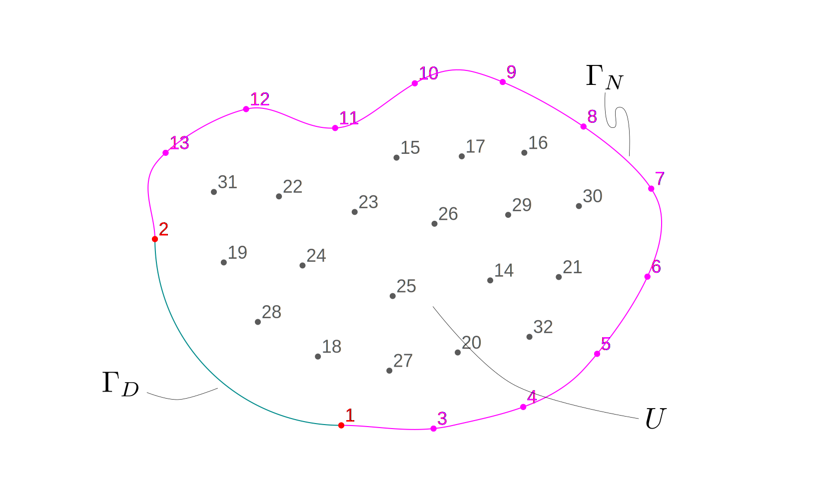
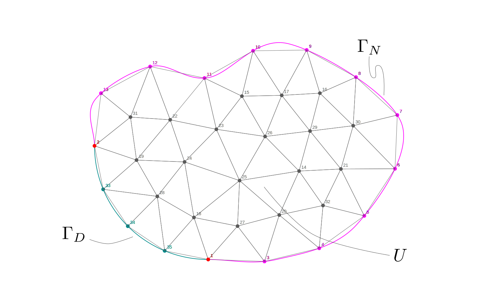

Here's my justification for setting the nodal values to $g(\mathbf{x})$.
There might be some details missing because this is an online answer and not a math paper.

Let's start with the homogeneous variational problem of finding $u \in V$ such that 

$$
a(u,v) = \mathcal{B}(v) \quad \forall \quad v \in V
$$
where $V$ is the space of $L_2$ functions that vanish at $\Gamma_D$.
Let's assume for simplicity the problem is 2D:

\ 

Then the Galerkin approximation involves writing both $u$ and $v$ as linear combinations of 32 shape functions $h_j(\mathbf{x})$ times the nodal values $u_j$ and $v_j$

$$
u(\mathbf{x}) = \sum_{j=1}^{32} h_j(\mathbf{x}) \cdot u_j = H \cdot \mathbf{u}
$$

$$
v(\mathbf{x}) = \sum_{j=1}^{32} h_j(\mathbf{x}) \cdot v_j = H \cdot \mathbf{v}
$$

for a matrix $H \in \mathbb{R}^{1 \times 32}$ such that the problem can be cast in matrix form as

$$
A \cdot \mathbf{u} = \mathbf{b}
$$
where the elements of the matrix $A$ are

$$
a_{i,j} = a(h_i,h_j)
$$
and the elements of vector $\mathbf{b}$ are

$$
b_i = \mathcal{B}(h_i)
$$

Note that since the $h_j(\mathbf{x})$ form a basis of $V$ they all vanish on $\Gamma_D$ so the solution $u(\mathbf{x})$ also vanishes on $\Gamma_D$.
This procedure is right but it is inconvenient because it is not easy to find the right shape functions that vanish on $\Gamma_D$.
We can simplify it by allowing nodes to exist on $\Gamma_D$

\ 

and "extending" the expansion of $u$ and $v$ with zeros for $j=33,34,35$:

$$
u_h(\mathbf{x}) = \sum_{j=1}^{32} h_j(\mathbf{x}) \cdot u_j + \sum_{j=33}^{35} h_j(\mathbf{x}) \cdot 0 = \tilde{H} \cdot \begin{bmatrix}\mathbf{u} \\ \mathbf{0}\end{bmatrix}
$$

$$
v(\mathbf{x}) = \sum_{j=1}^{32} h_j(\mathbf{x}) \cdot v_j + \sum_{j=33}^{35} h_j(\mathbf{x}) \cdot 0 = \tilde{H} \cdot \begin{bmatrix}\mathbf{v} \\ \mathbf{0}\end{bmatrix}
$$
for an extended matrix $\tilde{H} \in \mathbb{R}^{1 \times 35}$.

First, we note that these "extended" objects

$$
\tilde{\mathbf{v}} =
\begin{bmatrix}
\mathbf{v} \\
\mathbf{0}
\end{bmatrix}
\quad
\tilde{{A}} =
\begin{bmatrix}
{A} & {C} \\
{D} & {E} \\
\end{bmatrix}
\quad
\tilde{\mathbf{u}} =
\begin{bmatrix}
\mathbf{u} \\
\mathbf{0}
\end{bmatrix}
\quad
\tilde{\mathbf{b}} =
\begin{bmatrix}
\mathbf{b} \\
\mathbf{e}
\end{bmatrix}
$$
still represent the original Galerkin problem.
In effect,

$$
\begin{aligned}
\tilde{\mathbf{v}}^T \cdot \tilde{{A}} \cdot \tilde{\mathbf{u}}
&=
\tilde{\mathbf{v}}^T \cdot \tilde{\mathbf{b}} \\
\begin{bmatrix} \mathbf{v}^T & \mathbf{0}^T \end{bmatrix}
\cdot
\begin{bmatrix}
{A} & {C} \\
{D} & {E} \\
\end{bmatrix}
\cdot
\begin{bmatrix}
\mathbf{u} \\
\mathbf{0}
\end{bmatrix}
& =
\begin{bmatrix} \mathbf{v}^T & \mathbf{0}^T \end{bmatrix}
\begin{bmatrix}
\mathbf{b} \\
\mathbf{e}
\end{bmatrix}
\\
\begin{bmatrix} \mathbf{v}^T & \mathbf{0}^T \end{bmatrix}
\cdot
\begin{bmatrix}
{A} \cdot \mathbf{u} + {C} \cdot \mathbf{0} \\
{D} \cdot \mathbf{u} + {E} \cdot \mathbf{0} \\
\end{bmatrix}
&=
\begin{bmatrix} \mathbf{v}^T & \mathbf{0}^T \end{bmatrix}
\begin{bmatrix}
\mathbf{b} \\
\mathbf{e}
\end{bmatrix}
\\
\mathbf{v}^T \cdot {A} \cdot \mathbf{u} + \mathbf{0}^T \cdot {D} \cdot \mathbf{u}
&=
\mathbf{v}^T \cdot \mathbf{b} + \mathbf{0}^T \cdot \mathbf{e}\\
\mathbf{v}^T \cdot {A} \cdot \mathbf{u}
&=
\mathbf{v}^T \cdot \mathbf{b}\\
\end{aligned}
$$

Since this identity must hold $\forall \mathbf{v}$, then ${A} \cdot \mathbf{u} - \mathbf{b} = 0$, which is the original homogeneous problem.
We now need to prove that if we have

$$
{K} =
\begin{bmatrix}
{A} & {C} \\
{0} & {I} \\
\end{bmatrix}
\quad
\mathbf{f} =
\begin{bmatrix}
\mathbf{b} \\
\mathbf{0} \\
\end{bmatrix}
$$
such that ${A} \cdot \mathbf{u} = \mathbf{b}$, where ${I}$ is the identity matrix of size $3 \times 3$, 
then the vector $\mathbf{\varphi}$ such that ${K} \cdot \mathbf{\varphi} = \mathbf{f}$ is equal to

$$
\mathbf{\varphi}
 =
\begin{bmatrix}
\mathbf{u} \\
\mathbf{0} \\
\end{bmatrix}
$$

Indeed, let $\mathbf{\varphi} = \begin{bmatrix} \mathbf{\varphi}_1 & \mathbf{\varphi}_2 \end{bmatrix}^T$.
Then ${K} \cdot \mathbf{\varphi}$ is

$$
\begin{bmatrix}
{A} & {C} \\
{0} & {I}
\end{bmatrix}
\cdot
\begin{bmatrix}
\mathbf{\varphi}_1 \\
\mathbf{\varphi}_2 
\end{bmatrix}
=
\begin{bmatrix}
{A} \cdot \mathbf{\varphi}_1 + {C} \cdot \mathbf{\varphi}_2\\
{0} \cdot \mathbf{\varphi}_1 + {I} \cdot \mathbf{\varphi}_2
\end{bmatrix}
=
\begin{bmatrix}
\mathbf{b}\\
\mathbf{0}
\end{bmatrix}
$$

From the second row,  $\mathbf{\varphi}_2 = \mathbf{0}$.
Replacing this result in the first row, ${A} \cdot \mathbf{\varphi}_1 = \mathbf{b}$.
Therefore $\mathbf{\varphi}_1 = {A}^{-1} \cdot \mathbf{b} = \mathbf{u}$.

This part proves that putting a one in the diagonal of the stiffness matrix and a zero in the RHS vector in the rows corresponding to the nodes at $\Gamma_D$ is correct.

Now let's investigate non-homogeneous Dirichlet BCs.
The "lifting" procedure from textbooks translates into finding $u_h \in V$ such that

$$
a(u_h,v) = \mathcal{B}(v) - a(u_g,v) \quad \forall \quad v \in V
$$

where functions in $V$ vanish at $\Gamma_D$, and $u_g$ is a known function (i.e. a known lifting) that satisfies $u_g(\mathbf{x}) = g(\mathbf{x})$ for $\mathbf{x} \in \Gamma_D$.
Note that the right-hand side of the formulation contains known functions only.

Now, let's take back the $u_g$ into the left-hand side (we have already assumed $a$ was bi-linear) then we have to solve

$$
a(u_h+u_g,v) = \mathcal{B}(v)
$$

Let's first write the functions $u_h$ and $v$ over the whole set of nodes

$$
u_h(\mathbf{x}) = \sum_{j=1}^{32} h_j(\mathbf{x}) \cdot u_j + \sum_{j=33}^{35} h_j(\mathbf{x}) \cdot 0 = \tilde{H} \cdot \begin{bmatrix}\mathbf{u} \\ \mathbf{0}\end{bmatrix}
$$

$$
v(\mathbf{x}) = \sum_{j=1}^{32} h_j(\mathbf{x}) \cdot v_j + \sum_{j=33}^{35} h_j(\mathbf{x}) \cdot 0 = \tilde{H} \cdot \begin{bmatrix}\mathbf{v} \\ \mathbf{0}\end{bmatrix}
$$
for the "extended" matrix $\tilde{H}$ of size $1 \times 35$.

We then write the non-homogeneous part $u_g$ as

$$
u_h(\mathbf{x}) = \sum_{j=1}^{32} h_j(\mathbf{x}) \cdot 0 + \sum_{j=33}^{35} h_j(\mathbf{x}) \cdot g(\mathbf{x}_j) = \tilde{H} \cdot \begin{bmatrix}\mathbf{0} \\ \mathbf{g}\end{bmatrix}
$$
so the sum $u_h + u_g$ is

$$
u_h(\mathbf{x}) + u_g(\mathbf{x}) = \tilde{H} \cdot \begin{bmatrix}\mathbf{u} \\ \mathbf{g}\end{bmatrix}
$$

Now, the stiffness matrix of the first homogeneous problem was $A \in \mathbb{R}^{32 \times 32}$.
We then extend it to a new matrix of size $35 \times 35$

$$
\begin{bmatrix}
A & C \\
D & E
\end{bmatrix}
$$
such that the discretized problem is now

$$
\begin{aligned}
\begin{bmatrix}
\mathbf{v}^T & \mathbf{0}^T
\end{bmatrix}
\cdot
\begin{bmatrix}
A & C \\
D & E
\end{bmatrix}
\cdot
\begin{bmatrix}
\mathbf{u} \\
\mathbf{g}
\end{bmatrix}
&=
\begin{bmatrix}
\mathbf{v}^T & \mathbf{0}^T
\end{bmatrix}
\cdot
\begin{bmatrix}
\mathbf{b} \\ \mathbf{e}
\end{bmatrix} \\
\begin{bmatrix}
\mathbf{v}^T & \mathbf{0}^T
\end{bmatrix}
\cdot
\begin{bmatrix}
A \cdot \mathbf{u} + C \cdot \mathbf{g} \\
D \cdot \mathbf{u} + E \cdot \mathbf{g}
\end{bmatrix}
&=
\begin{bmatrix}
\mathbf{v}^T & \mathbf{0}^T
\end{bmatrix}
\cdot
\begin{bmatrix}
\mathbf{b} \\ \mathbf{e}
\end{bmatrix} \\
\mathbf{v}^T \cdot A \cdot \mathbf{u} + \mathbf{v}^T \cdot C \cdot \mathbf{g} &= \mathbf{v}^T \cdot \mathbf{b}
\end{aligned}
$$
for all $\mathbf{u} \in \mathbb{R}^J$. That is to say,

$$
A \cdot \mathbf{u} + C \cdot \mathbf{g} = \mathbf{b}
$$

Now you can prove as an exercise that if we have

$$
K =
\begin{bmatrix}
A & C \\
0 & I \\
\end{bmatrix}
\quad
\mathbf{f} =
\begin{bmatrix}
\mathbf{b} \\
\mathbf{g} \\
\end{bmatrix}
$$
such that $A \cdot \mathbf{u} + C \cdot \mathbf{g} = \mathbf{b}$, then the vector $\mathbf{\varphi}$ such that $K \cdot \mathbf{\varphi} = \mathbf{f}$ is equal to

$$
\mathbf{\varphi}
 =
\begin{bmatrix}
\mathbf{u} \\
\mathbf{g} \\
\end{bmatrix}
$$

