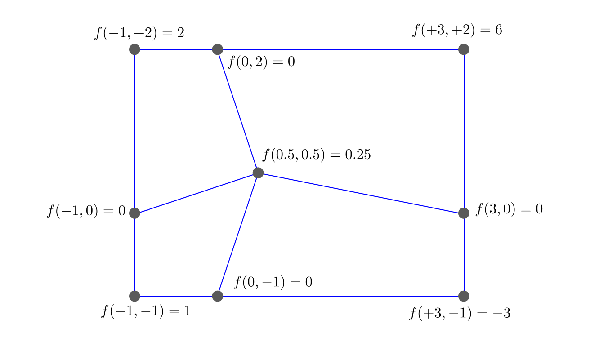

# Implementación computacional {#sec-implementacion}

::::: {lang=en-US}
::: {.chapterquote data-latex=""}
> C++ is a horrible language. It's made more horrible by the fact that a lot 
> of substandard programmers use it, to the point where it's much much 
> easier to generate total and utter crap with it. Quite frankly, even if 
> the choice of C were to do *nothing* but keep the C++ programmers out, 
> that in itself would be a huge reason to use C.
> 
> [...]
>
> C++ leads to really really bad design choices. You invariably start using 
> the "nice" library features of the language like STL and Boost and other 
> total and utter crap, that may "help" you program, but causes:
>
>  - infinite amounts of pain when they don't work [...]
>
>  - inefficient abstracted programming models where two years down the road 
>    you notice that some abstraction wasn't very efficient, but now all 
>    your code depends on all the nice object models around it, and you 
>    cannot fix it without rewriting your app.
>
> [...]
>
> So I'm sorry, but for something like git, where efficiency was a primary 
> objective, the "advantages" of C++ is just a huge mistake. The fact that 
> we also piss off people who cannot see that is just a big additional 
> advantage.
>
>
> _Linus Torvalds_, explaing why Git is written in C, 2007
:::

::: {.chapterquote data-latex=""}
> | C++ is a badly designed and ugly language.
> | It would be a shame to use it in Emacs.
>
>
> _Richard M. Stallmann_, explaining why Emacs is written in C, 2010
:::
:::::


Hay virtualmente infinitas maneras de diseñar un programa para que una computadora realice una determinada tarea.
Y otras infinitas maneras de implementarlo. La herramienta computacional desarrollada en esta tesis, denominada [FeenoX](https://www.seamplex.com/feenox/) (ver @sec-faq para una explicación del nombre), fue diseñada siguiendo un patrón frecuente en la industria de software:

 1. el "cliente" define un documento denominado [_Sofware Design Requirements_]{lang=en-US}, y
 2. el "proveedor" indica cómo cumplirá esos requerimientos en un [_Sofware Design Specifications_]{lang=en-US}. Una vez que ambas partes están de acuerdo, se comienza con el proyecto de ingeniería en sí con [_kick-off meetings_]{lang=en-US}, certificaciones de avance, órdenes de cambio, etc.

El SRS para FeenoX (@sec-srs) es ficticio pero plausible. Podríamos pensarlo como un llamado a licitación por parte de una empresa, entidad pública o laboratorio nacional, para que un contratista desarrolle una herramienta computacional que permita resolver problemas matemáticos con interés práctico en aplicaciones de ingeniería. En forma muy resumida, requiere

 a. buenas prácticas generales de desarrollo de software tales como
 
    * trazabilidad del código fuente
    * integración continua
    * posibilidad de reportar errores
    * portabilidad razonable
    * disponibilidad de dependencias adecuadas
    * documentación apropiada
 
 b. que la herramienta pueda ser ejecutada en la nube

    * a través de ejecución remota 
    * que provea mecanismos de reporte de estado
    * con posibilidad de paralelización en diferentes nodos computacionales
    
 c. que sea aplicable a problemas de ingeniería proveyendo
  
    * eficiencia computacional razonable
    * flexibilidad en la definición de problemas
    * verificación y validación
    * extensibilidad
    
::: {.remark}
El requerimiento de paralelización está relacionado con el tamaño de los problemas a resolver y no (tanto) con la performance.
Si bien está claro que, de tener la posibilidad, resolver ecuaciones en forma paralela es más eficiente en términos del tiempo de pared^[Del inglés [_wall time_]{lang=en-US}.] necesario para obtener un resultado, en el SRS la posibilidad de paralelizar el código se refiere principalmente a la capacidad de poder resolver problemas de tamaño arbitrario que no podrían ser resueltos en serie, principalmente por una limitación de la cantidad de memoria RAM.
:::

::: {.remark}
Si bien es cierto que en teoría un algoritmo implementado en un lenguaje Turing-completo podría resolver un sistema de ecuaciones algebraicas de tamaño arbitrario independientemente de la memoria RAM disponible (por ejemplo usando almacenamiento intermedio en dispositivos magnéticos o de estado sólido), prácticamente no es posible obtener un resultado útil en un tiempo razonable si no se dispone de suficiente memoria RAM para evitar tener que descargar el contenido de esta memoria de alta velocidad de acceso a medios alternativos ([out-of-core memory]{lang=en-US} como los mencionados en el paréntesis anterior) cuya velocidad de acceso es varios órdenes de magnitud más lenta.
:::

::: {.remark}
Este esquema de definir primero los requerimientos y luego indicar cómo se los satisface evita un sesgo común dentro de las empresas de software que implica hacer algo "fácil para el desarrollador" a costa de que el usuario tengo que hacer algo "más difícil".
Por ejemplo en la mayoría de los programas de elementos finitos para elasticidad lineal es necesario hacer un mapeo entre los grupos de elementos volumétricos y los materiales disponibles, tarea que tiene sentido siempre que haya más de un grupo de elementos volumétricos o más de un material disponible. Pero en los casos donde hay un único grupo de elementos volumétricos (usualmente porque se parte de un CAD con un único volumen) y un único juego de propiedades materiales (digamos un único valor $E$ de módulo de Young y un único $\nu$ para coeficiente de Poisson), el software requiere que el usuario tenga que hacer explícitamente el mapeo aún cuando éste es trivial. Un claro de ejemplo del sesgo "[developer-easy/user-hard]{lang=en-US}" que FeenoX no tiene, ya que el SRS pide que "problemas sencillos tengan [inputs]{lang=en-US} sencillos". En caso de que haya una única manera de asociar volúmenes geométricos a propiedades materiales, FeenoX hace la asociación implícitamente simplificando el archivo de entrada.
:::

Según el pliego, es mandatorio que el software desarrollado sea de código abierto según la definición de la _Open Source Initiative_.
El SDS (@sec-sds) comienza indicando que la herramienta FeenoX es

 * al software tradicional de ingeniería y
 * a las bibliotecas especializadas de elementos finitos
 
lo que Markdown es

 * a Word y
 * a LaTeX
 
respectivamente.

Y que no sólo es de código _abierto_ en el sentido de la OSI sino que también es _libre_ en el sentido de la _Free Software Foundation_ @faif.
La diferencia entre código abierto y software libre es más sutil que práctica, ya que las definiciones técnicas prácticamente coinciden.
El punto principal de que el código sea abierto es que permite obtener mejores resultados con mejor performance mientras más personas puedan estudiar el código, escrutarlo y eventualmente mejorarlo @cathedral. 
Por otro lado, el software libre persigue un fin ético relacionado con la libertad de poder ejecutar, distribuir, modificar y distribuir las modificaciones del software recibido [@gnu-manifesto; @hack-rms].

::: {.remark}
Ninguno de los dos conceptos, código abierto o software libre, se refiere a la idea de _precio_.
En Español no debería haber ninguna confusión. Pero en inglés, el sustantivo adjetivado [_free software_]{lang=en-US} se suele tomar como gratis en lugar de libre. Si bien es cierto que la mayoría de las veces la utilización de software libre y abierto no implica el pago de ninguna tarifa directa al autor del programa, el software libre puede tener otros costos indirectos asociados.^[El gerente de sistemas de una empresa de ingeniería y construcción me dijo que por un tema de costos ellos preferían usar un servidor SQL privativo antes que uno libre: "es más caro pagarle al que sabe dónde poner el punto y coma en el archivo de configuración que pagar la licencia y configurarlo con el [mouse]{lang=en-US}".] El concepto importante es _libertad_: la libertad de poder contratar a uno o más programadores que modifiquen el código para que el software se comporte como uno necesita.
:::


Tal como como Unix^[A principios de 1960, los Bell Labs en EEUU llegaron a desarrollar un sistema operativo que funcionaba bien, así que decidieron encarar MULTICS. Como terminó siendo una monstruosidad, empezaron UNIX que es lo que quedó bien.] @unix
y C^[A fines de 1960, también en los Bell Labs, llegaron a desarrollar un un lenguaje de programación A que funcionaba bien, así que decidieron encarar B. Como terminó siendo una monstruosidad, empezaron C que es lo que quedó bien.], FeenoX es un "efecto de tercer sistema"^[Del inglés [_third-system effect_]{lang=en-US}.] @raymond.
De hecho, esta diferencia entre el concepto de código abierto y software libre fue discutida en la referencia @enief-milonga-2014 durante el desarrollo de la segunda versión del sistema.

De las lecciones aprendidas en las dos primeras versiones, la primera un poco naïve pero funcional y la segunda más pretenciosa y compleja (apalancada en la funcionalidad de la primera), hemos convergido al diseño explicado en el SDS del @sec-sds donde definimos la filosofía de diseño del software y elegimos una de las infinitas formas de diseñar una herramienta computacional mencionadas al comienzo de este capítulo.
Gran parte de este diseño está basado en la filosofía de programación Unix @raymond.
En el @sec-sds damos ejemplos de cómo son las interfaces para definir un cierto problema y de cómo obtener los resultados.
Comparamos alternativas e indicamos por qué hemos decidido diseñar el software de la forma en la que fue diseñado.
Por otro lado, en este capítulo de la tesis nos centramos en la implementación, tratando de converger a una de las infinitas formas de implementar el diseño propuesto en el SDS. Comentamos muy superficialmente las ideas distintivas que tiene FeenoX con respecto a otros programas de elementos finitos desde el punto de vista técnico de programación.

Estas características son distintivas del diseño e implementación propuestos y no son comunes.
En la jerga de emprendedurismo, serían las [_unfair advantages_]{lang=en-US} del software con respecto a otras herramientas similares.

::: {.remark}
El código fuente de FeenoX está en Github en <https://github.com/seamplex/feenox/> bajo licencia GPLv3+.
Consiste en aproximadamente cuarenta y cinco mil líneas de código` organizadas según la estructura de directorios mostrada en la figura~\ref{fig:tree}`{=latex}.·
:::

```{=latex}
\begin{figure}
\begin{verbatim}
.
├── dist
├── doc
├── examples
├── src
│   ├── contrib
│   ├── flow
│   ├── io
│   ├── math
│   ├── mesh
│   │   └── elements
│   ├── parser
│   └── pdes
│       ├── laplace
│       ├── mechanical
│       ├── modal
│       ├── neutron_diffusion
│       ├── neutron_sn
│       └── thermal
└── tests
\end{verbatim}
\caption{\label{fig:tree} Estructura de directorios del código fuente de FeenoX.}
\end{figure}
```

## Arquitectura del código

Comencemos preguntándonos qué debemos tener en cuenta para implementar una herramienta computacional que permita resolver ecuaciones en derivadas parciales con aplicación en ingeniería utilizando el método de elementos finitos.
Por el momento enfoquémonos en problemas lineales^[Si el problema fuese no lineal o incluso transitorio, la discusión de esta sección sigue siendo válida para la construcción de la matriz jacobiana global.] como los analizados en los dos capítulos anteriores.
Las dos tareas principales son

 1. construir la matriz global de rigidez $\mat{K}$ y el vector $\vec{b}$ (o la matriz de masa $\mat{M}$), y
 2. resolver el sistema de ecuaciones $\mat{K} \cdot \vec{u} = \vec{b}$ (o $\mat{K} \cdot \vec{u} = \lambda \cdot \mat{M} \cdot \vec{u}$)

 
Haciendo énfasis en la filosofía Unix, tenemos que escribir un programa que haga bien una sola cosa^[[Do only one thing but do it well]{lang=en-US}.] que nadie más hace y que interactúe con otros que h7acen bien otras cosas (regla de composición).
En este sentido, nuestra herramienta se tiene que enfocar en el punto 1.
Pero tenemos que definir quién va a hacer el punto 2 para que sepamos cómo es que tenemos que construir $\mat{K}$ y $\vec{b}$.

Las bibliotecas PETSc [@petsc-user-ref;@petsc-efficient] junto con la extensión SLEPc [@slepc-manual;@slepc-toms] proveen exactamente lo que necesita una herramienta que satisfaga el SRS siguiendo la filosofía de diseño del SDS.
De hecho, en 2010 seleccioné PETSc para la segunda versión del solver neutrónico por la única razón de que era una dependencia necesaria para resolver el problema de criticidad con SLEPc [@milongabase2010;@milongaiaea2011].
Con el tiempo, resultó que PETSc proveía el resto de las herramientas necesarias para resolver numéricamente ecuaciones en derivadas parciales en forma portable y extensible.

Otra vez desde el punto de vista de la filosofía de programación Unix, la tarea 1 consiste en un cemento de contacto^[En el sentido del inglés [_glue layer_]{lang=en-US}.] entre la definición del problema a resolver por parte del ingeniero usuario y la biblioteca matemática para resolver problemas ralos^[Del inglés [_sparse_]{lang=en-US}.] PETSc. 
Cabe preguntarnos entonces cuál es el lenguaje de programación adecuado para implementar el diseño del SDS.
Aún cuando ya mencionamos que cualquier lenguaje Turing-completo es capaz de resolver un sistema de ecuaciones algebraicas, está claro que no todos son igualmente convenientes.
Por ejemplo Assembly o BrainFuck son interesantes en sí mismos (por diferentes razones) pero para nada útiles para la tarea que tenemos que realizar.
De la misma manera, en el otro lado de la distancia con respecto al hardware, lenguajes de alto nivel como Python también quedan fuera de la discusión por cuestiones de eficiencia computacional. A lo sumo, estos lenguajes interpretados podrían servir para proveer clientes finos^[Del inglés [_thin clients_]{lang=en-US}.] a través de APIs que puedan llegar a simplificar la definición del (o los) problema(s) que tenga que resolver FeenoX.
Para resumir una discusión mucho más compleja, los lenguajes candidatos para implementar la herramienta requerida por el SRS podrían ser

 a. Fortran
 b. C
 c. C++

Según la regla de representación de Unix, la implementación debería poner la complejidad en las estructuras de datos más que en la lógica. Sin embargo, en el área de mecánica computacional, paradigmas de programación demasiado orientados a objetos impactan negativamente en la performance. La tendencia es encontrar un balance, tal como persigue la filosofía desde hace más de dos mil quinientos años a través de la virtud de la prudencia, entre programación orientada a objetos y programación orientada a datos.

::: {.remark}
En los últimos años el lenguaje Rust se ha comenzado a posicionar como una alternativa a C para _system programming_^[No hay traducción de este término. En el año 2008, se propuso una materia en el IB con este nombre en inglés. El consejo académico decidió traducirla y nombrarla como "programación de sistemas". Ni el nombre elegido ni el ligeramente más correcto "programación del sistema" tienen la misma denotación que el concepto original [_system programming_]{lang=en-US}] debido al requerimiento intrínseco de que todos las referencias deben apuntar a una dirección de memoria virtual válida. A principios de 2023 aparecieron por primera vez líneas de código en Rust en el kernel de Linux. Pero desde el punto de vista de computación de alto rendimiento,^[Del inglés [_high-performance computing_]{lang=en-US} (HPC).] Rust (o incluso Go) no tienen nada nuevo que aportar con respecto a C.
:::


Tal como explican los autores de PETSc (y coincidentemente Eric Raymond en @raymond), C es el lenguaje que mejor se presta a este paradigma:
```{=latex}
\label{polymorphism}
```

::: {lang=en-US}
> Why is PETSc written in C, instead of Fortran or C++?
> 
> When this decision was made, in the early 1990s, C enabled us to build data structures for storing sparse matrices, solver information, etc. in ways that Fortran simply did not allow. ANSI C was a complete standard that all modern C compilers supported. The language was identical on all machines. C++ was still evolving and compilers on different machines were not identical. Using C function pointers to provide data encapsulation and polyRmorphism allowed us to get many of the advantages of C++ without using such a large and more complicated language. It would have been natural and reasonable to have coded PETSc in C++; we opted to use C instead.
:::

Fortran fue diseñado en la década de 1950 y en ese momento representó un salto cualitativo con respecto a la forma de programar las incipientes computadoras digitales @knuth-languages. Sin embargo, las suposiciones que se han tenido en cuenta con respecto al [hardware]{lang=en-US} y a los sistemas operativos sobre los cuales estos programas deberían ejecutarse ya no son válidas. Las revisiones posteriores como Fortran 90 son modificaciones y parches que no resuelven el problema de fondo.
En cambio, C fue diseñado a principios de la década 1970 suponiendo arquitecturas de hardware y de sistemas operativos que justamente son las que se emplean hoy en día, tales como

 * espacio de direcciones plano^[Del inglés [_flat address space_]{lang=en-US}.]
 * procesadores con registros de diferentes tamaños
 * llamadas al sistema^[Del inglés [_system calls_]{lang=en-US}.]
 * entrada y salida basada en archivos
 * etc.
 
para correr en entornos Unix, que justamente, es el sistema operativo de la vasta mayoría de los servidores de la nube pública, que justa y nuevamente, es lo que perseguimos en esta tesis.

Una vez más, en principio la misma tarea puede ser implementada en cualquier lenguaje: Fortran podría implementar programación con objetos y C++ podría ser utilizado con un paradigma orientado a datos.
Pero lo usual es que código escrito en Fortran sea procedural y basado en estructuras `COMMON`, resultando difícil de entender y depurar
El código escrito en C++ suele ser orientado a objetos y con varias capas de encapsulamiento, polimorfismo, métodos virtuales, redefinición de operadoras y contenedores enplantillados^[Del inglés [_templated_]{lang=en-US}.] resultando difícil de entender y depurar, tal como indica Linus Torvals en la cita del comienzo del capítulo.
De la misma manera que el lenguaje Fortran permite realizar ciertas prácticas que bien utilizadas agregan potencia y eficiencia pero cuyo abuso lleva a código ininteligible (por ejemplo el uso y abuso de bloques `COMMON`), C++ permite ciertas prácticas que bien utilizadas agregan potencia pero cuyo abuso lleva a código de baja calidad (por ejemplo el uso y abuso de `template`s, `shared_pointer`s, `bind`s, `move`s, lambdas, wrappers sobre wrappers, objetos sobre objetos, interfaz sobre interfaz, etc.), a veces en términos de eficiencia, a veces en términos del concepto de Unix _compactness_ @raymond:

::: {lang=en-US}
> Compactness is the property that a design can fit inside a human being's head. A good practical test for compactness is this: Does an experienced user normally need a manual? If not, then the design (or at least the subset of it that covers normal use) is compact.
:::
y usualmente en términos de la regla de simplicidad en la filosofía de Unix:

::: {lang=en-US}
> Add complexity only where you must.
:::


Justamente, Fortran y C++ hacen fácil agregar complejidad innecesaria.
En C, no es fácil agregar complejidad innecesaria.

---
comment: |
  **TODO**: feenox está en el medio y busca ser compacto:
  mapdl es un quilombo de commons y no se entiende nada
  reflex es un quilombo de visitors, interfaces, etc. y no se entiende nada
  feenox es lo más straightforward
...

### Construcción de los elementos globales

Habiendo decidido entonces construir la matriz $\mat{K}$ y el vector $\vec{b}$ como una [glue-layer]{lang=en-US} implementada en C utilizando una estructura de datos que PETSc pueda entender, preguntémonos ahora qué necesitamos para construir estos objetos.
Para simplificar el argumento, supongamos por ahora que queremos resolver la ecuación generalizada de Poisson de la @sec-poisson. La matriz global $\mat{K}$ proviene de ensamblar las matrices elementales $\mat{K}_i$ para todos los elementos volumétricos $e_i$ según la @def-Ki-poisson. De la misma manera, el vector global $\vec{b}_i$ proviene de ensamblar las contribuciones elementales $\vec{b}_i$ tanto de los elementos volumétricos (@def-bi-volumetrico-poisson) como de los elementos de superficie con condiciones de contorno naturales (@def-bi-superficial-poisson).


```{=latex}
\DontPrintSemicolon
\begin{algorithm}
\ForEach{ elemento volumétrico $e_i$}{ 
 $\mat{K}_i \leftarrow 0$\;
 $\mat{b}_i \leftarrow 0$\;
 \For{ cada punto de cuadratura $q = 1, \dots, Q_i$}{
  $\mat{J}_i(\symbf{\xi}_q) \leftarrow \mat{B}_c(\symbf{\xi}_q) \cdot \mat{C}_i$\;
  $\mat{B}_i(\symbf{\xi}_q) \leftarrow \mat{J}_i^{-T}(\symbf{\xi}_q) \cdot \mat{B}_c(\symbf{\xi}_q)$ \;
  $\vec{x}_q(\symbf{\xi}_q) \leftarrow \sum_{j=1}^{J_i} h_j(\symbf{\xi}_q) \cdot \vec{x}_j$\;
  $\mat{K}_i \leftarrow \mat{K}_i + \omega_q \cdot \Big|\det{\left[\mat{J}_i\left(\symbf{\xi}_q\right)\right]}\Big| \left\{ \mat{B}_i^T(\symbf{\xi}_q) \cdot k(\vec{x}_q) \cdot \mat{B}_i(\symbf{\xi}_q) \right\} $\; 
  $\vec{b}_i \leftarrow \vec{b}_i + \omega_q \cdot \Big|\det{\left[\mat{J}_i\left(\symbf{\xi}_q\right)\right]}\Big| \left\{\mat{H}_c^T(\symbf{\xi}_q) \cdot f(\vec{x}_q) \right\}$ \;
 }
 ensamblar $\mat{K}_i \rightarrow \mat{K}$\;
 ensamblar $\vec{b}_i \rightarrow \vec{b}$\;
}

\ForEach{ elemento superficial $e_i$ con condición de Neumann $p(\vec{x})$}{ 
 $\mat{b}_i \leftarrow 0$\;
 \For{ cada punto de cuadratura $q = 1, \dots, Q_i$}{
  $\vec{b}_i \leftarrow \vec{b}_i + \omega_q^{(D-1)} \cdot \Big|\det{\left[\mat{J}_i\left(\symbf{\xi}_q\right)\right]}\Big|  \cdot \left\{ \mat{H}_{c^\prime}^T(\symbf{\xi}_q) \cdot p(\vec{x}_q) \right\}$ \; 
 }
 ensamblar $\vec{b}_i \rightarrow \vec{b}$\;
}
\caption{\label{alg:poisson}Posible implementación de alto nivel de la construcción de $\mat{K}$ y $\vec{b}$ para el problema de Poisson generalizado de la sección \ref{sec-poisson}}
\end{algorithm}
```

```{=latex}
\DontPrintSemicolon
\begin{algorithm}
\ForEach{ elemento superficial $e_i$ con condición de Dirichlet $g(\vec{x})$}{ 
 \For{ cada nodo local $j = 1, \dots, J_i$}{
  calcular la fila global $k$ correspondiente al nodo local $j$ del elemento $e_i$\;
  hacer cero la fila $k$ de la matriz global $\mat{K}$\;
  poner un uno en la diagonal de la fila $k$ de la matriz global $\mat{K}$\;
  poner $g(\vec{x}_j)$ en la fila $k$ del vector global $\vec{b}$\;
 }
}
\caption{\label{alg:poisson-dirichlet1}Una forma de poner condiciones de Dirichlet en el problema discretizado, barriendo sobre elementos y calculando la fila global a partir del nodo local.}
\end{algorithm}
```

```{=latex}
\DontPrintSemicolon
\begin{algorithm}
\ForEach{ nodo global $j = 1, \dots J$}{ 
 \ForEach{ elemento $e_i$ al que pertenece el nodo global $j$}{
  \If{ el elemento $e_i$ tiene una condición de Dirichlet}{
    hacer cero la fila $j$ de la matriz global $\mat{K}$\;
    poner un uno en la diagonal de la fila $j$ de la matriz global $\mat{K}$\;
    poner $g(\vec{x}_j)$ en la fila $j$ del vector global $\vec{b}$\;
  }
 }
}
\caption{\label{alg:poisson-dirichlet2}Otra forma de poner condiciones de Dirichlet en el problema discretizado, barriendo sobre nodos globales y encontrando los elementos asociados.}
\end{algorithm}
```


Una posible implementación en pseudo código de alto nivel de esta construcción podría ser la ilustrada en el algoritmo \ref{alg:poisson}. La aplicación de las condiciones de contorno de Dirichlet según la discusión de la @sec-dirichlet-nh puede ser realizada con el algoritmo \ref{alg:poisson-dirichlet1} o con el algoritmo \ref{alg:poisson-dirichlet2}. En un caso barremos sobre elementos y tenemos que encontrar el índice global asociado a cada nodo local. En otro caso barremos sobre nodos globales pero tenemos que encontrar los elementos asociados al nodo global.

La primera conclusión que podemos extraer es que para problemas escalares, la ecuación a resolver está determinada por la expresión entre llaves de los términos evaluados en cada punto de Gauss para $\mat{K}_i$ y para $\vec{b}_i$.
Si el problema tuviese más de una incógnita por nodo y reemplazamos las matrices $\mat{H}_c$ y $\mat{B}_i$ por sus versiones $G$-aware $\mat{H}_{Gc}$ y $\mat{B}_{Gi}$, entonces otra vez la ecuación a resolver está completamente definida por la expresión entre llaves.

Por ejemplo, si quisiéramos resolver difusión de neutrones multigrupo tendríamos que hacer

$$
\mat{K}_i \leftarrow \mat{K}_i + \omega_q \cdot \Big|\det{\left[\mat{J}_i\left(\symbf{\xi}_q\right)\right]}\Big| \cdot \left\{ \mat{L}_i(\symbf{\xi}_q) + \mat{A}_i(\symbf{\xi}_q) - \mat{F}_i(\symbf{\xi}_q)\right\}
$$
con las matrices intermedias según la @eq-LAF

$$ \tag{\ref{eq-LAF}}
\begin{aligned}
\mat{L}_i &= \mat{B}_{Gi}^T(\symbf{\xi}_q) \cdot \mat{D}_D(\symbf{\xi}_q) \cdot \mat{B}_{Gi}(\symbf{\xi}_q)  \\
\mat{A}_i &= \mat{H}_{Gc}^T(\symbf{\xi}_q) \cdot \mat{R}(\symbf{\xi}_q) \cdot \mat{H}_{Gc}(\symbf{\xi}_q) \\
\mat{F}_i &= \mat{H}_{Gc}^T(\symbf{\xi}_q) \cdot \mat{X}(\symbf{\xi}_q) \cdot \mat{H}_{Gc}(\symbf{\xi}_q)
\end{aligned}
$$
más las contribuciones a la matriz de rigidez para condiciones de Robin.
Pero en principio podríamos escribir un algoritmo genérico (¿una cáscara?) que implemente el método de elementos finitos para resolver una cierta ecuación diferencial completamente definida por la expresión dentro de las llaves (¿pasadas como argumentos?).

La segunda conclusión proviene de preguntarnos qué es lo que necesitan los algoritmos \ref{alg:poisson}, \ref{alg:poisson-dirichlet1} y \ref{alg:poisson-dirichlet2} para construir la matriz de rigidez global $\mat{K}$ y el vector $\vec{b}$:

 i. los conjuntos de cuadraturas de gauss $\omega_q, \symbf{\xi}_q$ para el elemento $e_i$
 ii. las matrices canónicas $\mat{H}_{c}$, $\mat{B}_{c}$ y $\mat{H}_{Gc}$
 iii. las matrices elementales $\mat{C}_i$, $\mat{B}_{Gi}$,
 iv. poder evaluar en $\vec{x}_q$
     a. las conductividad $k(\vec{x})$ (o las secciones eficaces para construir $\mat{D}_D(\symbf{\xi}_q)$, $\mat{R}(\symbf{\xi}_q)$ y $\mat{X}(\symbf{\xi}_q)$)
     b. la fuente volumétrica $f(\vec{x})$ (o las fuentes independientes isotrópicas $s_{0,g}(\symbf{\xi}_q)$)
     c. las condiciones de contorno $p(\vec{x})$ y $g(\vec{x})$ (o las correspondientes a difusión de neutrones)

Los tres primeros puntos no dependen de la ecuación a resolver.
Lo único que se necesita para evaluarlos es tener disponible la topología de la malla no estructurada que discretiza el dominio $U \in \mathbb{R}^D$ a través la posición $\vec{x}_j \in \mathbb{R}^D$ de los nodos y la conectividad de cada uno de los elementos $e_i$.

El cuarto en principio sí depende de la ecuación, pero finalmente se reduce a la capacidad de evaluar

 1. propiedades de materiales
 2. condiciones de contorno
 
en una ubicación espacial arbitraria $\vec{x}$.

Para fijar ideas, supongamos que tenemos un problema de conducción de calor.
La conductividad $k(\vec{x})$^[Si la conductividad dependiera de la temperatura $T$ el problema sería no lineal. Pero en el paso $k$ e la iteración de Newton tendríamos $k(\vec{T}_k(\vec{x})=k_k(\vec{x})$ por lo que la discusión sigue siendo válida.] o en general, cualquier propiedad material puede depender de la posición $\vec{x}$ porque

```{=latex}
\label{dependencias}
```
 a. existen materiales con propiedades discontinuas en diferentes ubicaciones $\vec{x}$, y/o
 b. la propiedad depende continuamente de la posición aún para el mismo material.

De la misma manera, una condición de contorno (sea esencial o natural) puede depender discontinuamente con la superficie donde esté aplicada o continuamente dentro de la misma superficie a través de alguna dependencia con la posición $\vec{x}$.
 
Entonces, la segunda conclusión es que si nuestra herramienta fuese capaz de proveer un mecanismo para definir propiedades materiales y condiciones de contorno que puedan depender 

 a. discontinuamente según el volúmen o superficie al que pertenezca cada elemento (algunos elementos volumétricos pertenecerán al combustible y otros al moderador, algunos elementos superficiales pertenecerán a una condición de simetría y otros a una condición de vacío) y/o
 b. continuamente en el espacio según variaciones locales (por ejemplo cambios de temperatura y/o densidad, concentración de venenos, etc.)
 
entonces podríamos resolver ecuaciones diferenciales arbitrarias discretizadas espacialmente con el método de elementos finitos.

      
### Polimorfismo con apuntadores a función 

Según la discusión de la sección anterior, podemos diferenciar entre dos partes del código:

 1. Una que tendrá que realizar tareas "comunes"
   
    * en el sentido de que son las mismas para todas las PDEs tal como leer la malla y evaluar funciones en un punto $\vec{x}$ arbitrario del espacio
    
 2. Otra parte que tendrá que realizar tareas particulares para cada ecuación a resolver
 
    * por ejemplo evaluar las expresiones entre llaves en el $q$-ésimo punto de Gauss del elemento $i$-ésimo

::: {#def-framework}

## framework 

Llamamos [_framework_]{lang=en-US} a la parte del código que implementa las tareas comunes.
:::

Por diseño, el problema que FeenoX tiene que resolver tiene que estar completamente definido en el archivo de entrada.
Entonces éste debe justamente definir qué clase de ecuación se debe resolver.
Como el tipo de ecuación se lee en tiempo de ejecución, el framework debe poder ser capaz de llamar a una u otra (u otra) función que le provea la información particular que necesita: por ejemplo las expresiones entre llaves para la matriz de rigidez y para las condiciones de contorno.

Una posible implementación (ingenua) sería 

```{=latex}
\DontPrintSemicolon
\begin{algorithm}[H]
\uIf{ la PDE es poisson } { evaluar $\mat{B}_i^T \cdot k(\vec{x}_q) \cdot \mat{B}_i$\; }
\uElseIf{ la PDE es difusión } { evaluar $\mat{L}_i(\symbf{\xi}_q) + \mat{A}_i(\symbf{\xi}_q) + \mat{F}_i(\symbf{\xi}_q)$ \;}
\uElseIf{ la PDE es S$_N$ } { evaluar $\mat{L}_i(\symbf{\xi}_q) + \mat{A}_i(\symbf{\xi}_q) + \mat{F}_i(\symbf{\xi}_q)$\; }
\Else{ quejarse “no sé resolver esta PDE” \; }
\end{algorithm}
```

De la misma manera, necesitaríamos bloques `if` de este tipo para inicializar el problema, evaluar condiciones de contorno, calcular resultados derivados (por ejemplo flujos de calor a partir de las temperaturas, tensiones a partir de desplazamientos o corrientes a partir de flujos neutrónicos), etc.
Está claro que esto es 

 1. feo,
 2. ineficiente, y
 3. difícil de extender
 
En C++ esto se podría implementar mediante una jerarquía de clases donde las clases hijas implementarían métodos virtuales que el framework llamaría cada vez que necesite evaluar el término entre llaves.
Si bien C no tiene "métodos virtuales", sí tiene apuntadores a función (que es justamente lo que PETSc usa para implementar polimorfismo` como mencionamos en la página~\pageref{polymorphism}`{=latex}) por lo que podemos usar este mecanismo para lograr una implementación superior, que explicamos a continuación.

Por un lado, sí existe un lugar del código con un bloque `if` según el tipo de PDE requerida en tiempo de ejecución que consideramos feo, ineficiente y difícil de extender.
Pero,

 a. este _único_ bloque de condiciones `if` se ejecutan una sola vez en el momento de analizar gramaticalmente^[Del inglés [_parse_]{lang=en-US}.] el archivo de entrada y lo que hacen es resolver un apuntador a función a la dirección de memoria de una rutina de inicialización particular que el framework debe llamar antes de comenzar a construir $\mat{K}$ y $\vec{b}$:
 
    ```c
      if (strcasecmp(token, "laplace") == 0) {
        feenox.pde.init_parser_particular = feenox_problem_init_parser_laplace;
      } else if (strcasecmp(token, "mechanical") == 0) {
        feenox.pde.init_parser_particular = feenox_problem_init_parser_mechanical;
      } else if (strcasecmp(token, "modal") == 0) {
        feenox.pde.init_parser_particular = feenox_problem_init_parser_modal;
      } else if (strcasecmp(token, "neutron_diffusion") == 0) {
        feenox.pde.init_parser_particular = feenox_problem_init_parser_neutron_diffusion;
      } else if (strcasecmp(token, "neutron_sn") == 0) {
        feenox.pde.init_parser_particular = feenox_problem_init_parser_neutron_sn;
      } else if (strcasecmp(token, "thermal") == 0) {
        feenox.pde.init_parser_particular = feenox_problem_init_parser_thermal;
      } else {
        feenox_push_error_message("unknown problem type '%s'", token);
        return FEENOX_ERROR;
      }
    ```

    Estas funciones de inicialización a su vez resuelven los apuntadores a función particulares para evaluar contribuciones elementales volumétricas en puntos de Gauss, condiciones de contorno, post-procesamiento, etc.
    
 b. El bloque `if` mostrado en el punto anterior es generado programáticamente a partir de un script (regla de Unix de generación) que analiza (_parsea_) el árbol del código fuente y, para cada subdirectorio en [`src/pdes`](https://github.com/seamplex/feenox/tree/main/src/pdes), genera un bloque `if` automáticamente. 
 Es fácil ver el patrón que siguen cada una de las líneas del listado en el punto a y escribir un script o macro para generarlo programáticamente.
 
Entonces,

 1. Si bien ese bloque sigue siendo feo, es generado y compilado por una máquina que no tiene el mismo sentido estético que nosotros.
 
 2. Reemplazamos la evaluación de $n$ condiciones `if` para llamar a una dirección de memoria fija para cada punto de Gauss para cada elemento por una des-referencia de un apuntador a función en cada puntos de Gauss de cada elemento. En términos de eficiencia, esto es similar (tal vez más eficiente) que un método virtual de C++. Esta des-referencia dinámica no permite que el compilador pueda hacer un `inline` de la función llamada, pero el gasto extra^[Del inglés [_overhead_]{lang=en-US}.] es muy pequeño. En cualquier caso, el mismo script que parsea la estructura en `src/pdes` podría modificarse para generar un binario de FeenoX para cada PDE donde en lugar de llamar a un apuntador a función se llame directamente a las funciones propiamente dichas permitiendo optimización en tiempo de vinculación^[Del inglés [_link-time optimization_]{lang=en-US}.] que le permita al compilador hacer el `inline` de la función particular (ver @sec-performance).
 
 3. El script que parsea la estructura de `src/pdes` en busca de los tipos de PDEs disponibles es parte del paso `autogen.sh` (ver la discusión de la @sec-entry) dentro del esquema `configure` + `make` de Autotools. Las PDEs soportadas por FeenoX puede ser extendidas agregando un nuevo subdirectorio dentro de `src/pdes` donde ya existen
 
    * [`laplace`](https://github.com/seamplex/feenox/tree/main/src/pdes/laplace)
    * [`thermal`](https://github.com/seamplex/feenox/tree/main/src/pdes/thermal)
    * [`mechanical`](https://github.com/seamplex/feenox/tree/main/src/pdes/mechanical)
    * [`modal`](https://github.com/seamplex/feenox/tree/main/src/pdes/modal)
    * [`neutron_diffusion`](https://github.com/seamplex/feenox/tree/main/src/pdes/neutron_difussion)
    * [`neutron_sn`](https://github.com/seamplex/feenox/tree/main/src/pdes/neutron_sn)
 
    tomando uno de estos subdirectorios como plantilla.^[Del inglés [_template_]{lang=en-US}] De hecho también es posible eliminar completamente uno de estos directorios en el caso de no querer que FeenoX pueda resolver alguna PDE en particular.
    De esta forma, `autogen.sh` permitirá extender (o reducir) la funcionalidad del código, que es uno de los puntos solicitados en el SDS.
    Más aún, sería posible utilizar este mecanismo para cargar funciones particulares desde objetos compartidos^[Del inglés [_shared objects_]{lang=en-US}.] en tiempo de ejecución, incrementando aún más la extensibilidad de la herramienta.

    
### Definiciones e instrucciones


En el @sec-neutronica-phwr mencionamos (y en el @sec-sds explicamos en detalle) que la herramienta desarrollada es una especie de "función de transferencia" entre uno o más archivos de entrada y cero o más archivos de salida (incluyendo la salida estándar `stdout`):

```include
110-sds/transfer.md
```

Este archivo de entrada, que a su vez puede incluir otros archivos de entrada y/o hacer referencia a otros archivos de datos (incluyendo la malla en formato `.msh`) contiene palabras clave^[Del inglés [_keywords_]{lang=en-US}.] en inglés que, por decisión de diseño, deben 

 #. definir completamente el problema de resolver
 #. ser lo más auto-descriptivas posible
 #. permitir una expresión algebraica en cualquier lugar donde se necesite un valor numérico
 #. mantener una correspondencia uno a uno entre la definición "humana" del problema y el archivo de entrada
 #. hacer que el archivo de entrada de un problema simple sea simple
 
Estas keywords pueden ser
 
 a. definiciones (sustantivos)
 
    * qué PDE hay que resolver
    * propiedades materiales
    * condiciones de contorno
    * variables, vectores y/o funciones auxiliares
    * etc.
    
 b. instrucciones (verbos)
 
    * leer la malla
    * resolver problema
    * asignar valores a variables
    * calcular integrales o encontrar extremos sobre la malla
    * escribir resultados
    * etc.
 
Las definiciones se realizan a tiempo de parseo. Una vez que el FeenoX acepta que el archivo de entrada es válido, comienza la ejecución de las instrucciones en el orden indicado en el archivo de entrada.
De hecho, FeenoX tiene un apuntador a instrucción^[Del inglés [_instruction pointer_]{lang=en-US}.] que se incrementa a medida que avanza la ejecución de las instrucciones. Existen palabras clave `IF` y `WHILE` que permiten flujos de ejecución no triviales, especialmente en problemas iterativos, cuasi-estáticos o transitorios.

Por ejemplo, la lectura del archivo de malla es una instrucción y no una definición porque

 i. el nombre del archivo de la malla puede depender de alguna variable cuyo valor deba ser evaluado en tiempo de ejecución con una instrucción previa. Por ejemplo
 
    ```feenox
    INPUT_FILE surprise PATH nafems-le1%g.msh round(random(0,1))
    READ_MESH surprise
    PRINT cells
    ```
    
    ```terminal
    $ feenox surprise.fee 
    18700
    $ feenox surprise.fee 
    18700
    $ feenox surprise.fee 
    32492
    $ feenox surprise.fee 
    32492
    $ feenox surprise.fee 
    18700
    $ 
    ```
 
 ii. el archivo con la malla en sí puede ser creado internamente por FeenoX con una instrucción previa `WRITE_MESH` y/o modificada en tiempo de ejecución
 
    ```feenox
    READ_MESH square.msh SCALE 1e-3
    WRITE_MESH square_tmp.vtk
    
    INPUT_FILE tmp PATH square_tmp.vtk
    READ_MESH tmp
    ```
    
 iii. en problemas complejos puede ser necesario leer varias mallas antes de resolver la PDE en cuestión, por ejemplo leer una distribución de temperaturas en una malla gruesa de primer orden para utilizarla al evaluar las propiedades de los materiales de la PDE que se quiere resolver. Ver ejemplo **XXX** de non-conformal mesh mapping.

Comencemos con un problema sencillo para luego agregar complejidad en forma incremental.
A la luz de la discusión de este capítulo, preguntémonos ahora qué necesitamos para resolver un problema de conducción de calor estacionario sobre un dominio $U \mathbb{R}^D$ con un único material:

 1. definir que la PDE es conducción de calor en $D$ dimensiones
 2. leer la malla con el dominio $U \in \mathbb{R}^D$ discretizado
 3. definir la conductividad térmica $k(\vec{x})$ del material
 4. definir las condiciones de contorno del problema
 5. construir $\mat{K}$ y $\vec{b}$
 6. resolver $\mat{K} \cdot \vec{u} = \vec{b}$
 7. hacer algo con los resultados
    - calcular $T_\text{max}$
    - calcular $T_\text{mean}$
    - calcular el vector flujo de calor $q^{\prime \prime}(\vec{x}) = -k(\vec{x}) \cdot \nabla T$
    - comparar con soluciones analíticas
    - etc.
 8. escribir los resultados
 
El problema de conducción de calor más sencillo es un slab unidimensional en el intervalo $x \in [0,1]$ con conductividad uniforme y condiciones de Dirichlet $T(0)=0$ y $T(1)=1$ en ambos extremos. Por diseño, el archivo de entrada tiene que ser sencillo y tener una correspondencia uno a uno con la definición "humana" del problema:

```feenox
PROBLEM thermal 1D               # 1. definir que la PDE es calor 1D
READ_MESH slab.msh               # 2. leer la malla
k = 1                            # 3. definir conductividad uniforme igual a uno
BC left  T=0                     # 4. condiciones de contorno de Dirichlet
BC right T=1                     #    "left" y "right" son nombres en la malla
SOLVE_PROBLEM                    # 5. y 6. construir y resolver
PRINT T(0.5)                     # 7. y 8. escribir en stdout la temperatura en x=0.5
```

En este caso sencillo, la conductividad $k$ fue dada como una variable `k` con un valor igual a uno.
Estrictamente hablando, la asignación fue una instrucción. Pero en el momento de resolver el problema, las funciones particulares de la PDE de conducción de calor (dentro de `src/pdes/thermal`) buscan una variable llamada `k` y toman su valor para utilizarlo idénticamente en todos los puntos de Gauss de los elementos volumétricos al calcular el término $\mat{B}_i^T \cdot k \cdot \mat{B}_i$.

Si la conductividad no fuese uniforme sino que dependiera del espacio por ejemplo como

$$
k(x) = 1+x
$$
entonces el archivo de entrada sería

```feenox
PROBLEM thermal 1D
READ_MESH slab.msh
k(x) = 1+x                       # 3. conductividad dada por una función de x
BC left  T=0
BC right T=1
SOLVE_PROBLEM
PRINT T(1/2) log(1+1/2)/log(2)   # 7. y 8. imprimir el valor numérico y la solución analítica
```

En este caso, no hay una variable llamada `k` sino que hay una _función_ de $x$ con la expresión algebraica $1+x$.
Entonces la rutina particular dentro de `src/pde/thermal` que evalúa las contribuciones volumétricas elementales de la matriz de rigidez toma dicha función $k(x)$ como la propiedad "conductividad" y la evalúa como $\mat{B}_i^T(\symbf{x}_q) \cdot k(\symbf{x}_q) \cdot \mat{B}_i(\symbf{x}_q)$.
La salida, que por diseño está 100% definida por el archivo de entrada (reglas de Unix de silencio y de economía) consiste en la temperatura evaluada en $x=1/2$ junto con la solución analítica $\log(1+\frac{1}{2})/\log(2)$ en dicho punto.

Por completitud, mostramos que también la conductividad podría depender de la temperatura.
En este caso particular el problema queda no lineal y mencionamos algunas particularidades sin ahondar en detalles.
El parser algebraico de FeenoX sabe que $k$ depende de $T$, por lo que la rutina particular de inicialización de la PDE de conducción de calor marca que el problema debe ser resuelto por PETSc con un objeto SNES (en lugar de un KSP como para el caso lineal). FeenoX también calcula el jacobiano necesario para resolver el problema con un método de Newton iterativo:

```feenox
PROBLEM thermal 1D
READ_MESH slab.msh
k(x) = 1+T(x)                    # 3. la conductividad ahora depende de T(x)
BC left  T=0
BC right T=1
SOLVE_PROBLEM
PRINT T(1/2) sqrt(1+(3*0.5))-1
```

La ejecución de FeenoX sigue también las reglas tradicionales de Unix.
Se debe proveer la ruta al archivo de entrada como principal argumento luego del ejecutable.
Es un argumento y no como una opción ya que la funcionalidad del programa depende de que se indique un archivo de entrada, por lo que no es "opcional".
Sí se pueden agregar opciones siguiendo las reglas POSIX. Algunas opciones son para FeenoX (por ejemplo `--progress` o `--elements_info` y otras son pasadas a PETSc/SLEPc (por ejemplo `--ksp_view` o `--mg_levels_pc_type=sor`).
Al ejecutar los tres casos anteriores, obtenemos los resultados solicitados con la instrucción `PRINT` en la salida estándar:

```terminal
$ feenox thermal-1d-dirichlet-uniform-k.fee
0.5
$ feenox thermal-1d-dirichlet-space-k.fee
0.584945        0.584963
$ feenox thermal-1d-dirichlet-temperature-k.fee
0.581139        0.581139
$ 
```

Para el caso de conducción de calor estacionario solamente hay una única propiedad cuyo nombre debe ser `k` para que las rutinas particulares la detecten como la conductividad $k$ que debe aparecer en la contribución volumétrica.
Si el problema (es decir, la malla) tuviese dos materiales diferentes, digamos `A` y `B` hay dos maneras de definir sus propiedades materiales en FeenoX:

 1. agregando el sufijo `_A` y `_B` a la variable `k` o a la función `k(x)`, es decir
 
    ```feenox
    k_A = 1
    k_B = 2
    ```
    si $k_A = 1$ y $k_B=2$, o
    
    ```feenox
    k_A(x) = 1+2*x
    k_B(x) = 3+4*x
    ``` 
    si $k_A(x) = 1+2x$ y $k_B(x) = 3+4x$.
    
 2. utilizando una palabra clave `MATERIAL` (definición) para ´cada material, del siguiente modo
 
    ```feenox
    MATERIAL A k=1
    MATERIAL B k=2
    ```
    
    o
    
    ```feenox
    MATERIAL A k=1+2*x
    MATERIAL B k=3+4*x
    ```
    
De esta forma, el framework implementa las dos posibles dependencias de las propiedades de los materiales discutidas` en la página~\pageref{dependencias}`{=latex}:

 a. continua con el espacio a través de expresiones algebraicas que pueden involucrar funciones definidas por puntos en interpoladas como discutimos en la @sec-funciones, y
 b. discontinua según el material al que pertenece el elemento.
 
Con respecto a las condiciones de contorno, la lógica es similar pero ligeramente más complicada.
Mientras que a partir del nombre la propiedad las rutinas particulares pueden evaluar las contribuciones volumétricas, sean a la matriz de rigidez a través de la conductividad `k` o al vector $\vec{b}$ a través de la fuente de calor por unidad de volumen `q`, para las condiciones de contorno se necesita un poco más de información.
Supongamos que una superficie tiene una condición de "simetría" y que queremos que la línea del archivo de entrada que la defina sea

```feenox
BC left  symmetry
```
donde `left` es el nombre de la entidad superficial definida en la malla y `symmetry` es una palabra clave que indica qué tipo de condición de contorno tienen los elementos que pertenecen a `left`.
La forma de implementar numéricamente (e incluso el signficado físico) esta condición de contorno depende de la PDE que estamos resolviendo. No es lo mismo poner una condición de simetría en

 * poisson generalizada
 * elasticidad lineal
 * difusión de neutrones
 * transporte por S$_N$
 
Entonces, si bien las propiedades de materiales pueden ser parseadas por el framework y aplicadas por las rutinas particulares, las condiciones de contorno deben ser parseadas y aplicadas por las rutinas particulares.
De todas maneras, la lógica es similar: las rutinas particulares proveen puntos de entrada^[Del inglés [_entry points_]{lang=en-US}.] que el framework llama en los momentos pertinentes durante la ejecución de las instrucciones.

Para terminar de ilustrar la idea, consideremos el problema de Reed (discutido en detalle en la @sec-reed) que propone resolver con S$_N$ un slab uni-dimensional compuesto por varios materiales, algunos con una fuente independiente, otros sin fuente e incluso un material de vacío:

```feenox
#
#     |         |    |         |    |         |
#  m  | src= 50 | 0  |    0    | 1  |    0    |    v
#  i  |         |    |         |    |         |    a
#  r  | tot= 50 | 5  |    0    | 1  |    1    |    c
#  r  |         |    |         |    |         |    u
#  o  | scat=0  | 0  |    0    | 0.9|   0.9   |    u
#  r  |         |    |         |    |         |    m
#     |         |    |         |    |         |
#     |    1    | 2  |    3    | 4  |    5    |
#     |         |    |         |    |         |
#     +---------+----+---------+----+---------+-------> x
#    x=0       x=2  x=3       x=5  x=6       x=8   

PROBLEM neutron_sn DIM 1 GROUPS 1 SN $1

READ_MESH reed.msh
 
MATERIAL source_abs    S1=50 Sigma_t1=50 Sigma_s1.1=0
MATERIAL absorber      S1=0  Sigma_t1=5  Sigma_s1.1=0
MATERIAL void          S1=0  Sigma_t1=0  Sigma_s1.1=0
MATERIAL source_scat   S1=1  Sigma_t1=1  Sigma_s1.1=0.9
MATERIAL reflector     S1=0  Sigma_t1=1  Sigma_s1.1=0.9

BC left  mirror
BC right vacuum

SOLVE_PROBLEM

FUNCTION ref(x) FILE reed-ref.csv INTERPOLATION steffen
PRINT sqrt(integral((ref(x)-phi1(x))^2,x,0,8))/8
```

 * La primera línea es una definición (`PROBLEM` es un sustantivo) que le indica a FeenoX que debe resolver las ecuaciones S$_N$ en $D=1$ dimensión con $G=1$ grupo de energías y utilizando una discretrización angular $N$ dada por el primer argumento de la línea de comando luego del nombre del archivo de entrada. De esta manera se pueden probar diferentes discretizaciones con el mismo archivo de entrada, digamos `reed.fee`
 
   ```terminal
   $ feenox reed 2   # <- S2
   [...]
   $ feenox reed 4   # <- S4
   [...]
   ```
   
 * La segunda línea es una instrucción (el verbo `READ`) que indica que FeenoX debe leer la malla donde resolver problema del archivo `reed.msh`.
   Si el archivo de entrada se llamara `reed.fee`, esta línea podría haber sido `READ_MESH $0.msh`. En caso de leer varias mallas, la que define el domnio de la PDE es
   
     a. la primera de las instrucciones `READ_MESH`, o
     b. la definida explícitamente con la palabra clave `MAIN_MESH`
   
 * El bloque de palabras clave `MATERIAL` definen (con un sustantivo) las secciones eficaces macroscópicas (`Sigma`) y las fuentes independientes (`S`). En este caso todas las propiedades son uniformes dentro de cada material.
 
 * Las siguientes dos líneas definien las condiciones de contorno (`BC` quiere decir [_boundary condition_]{lang=en-US} que es un sustantivo adjetivado): la superficie `left` tiene una condición de simetría (o espejo) y la superficie `right` tiene una condición de vacío.
 
 * La instrucción `SOLVE_PROBLEM` le pide a FeenoX que
 
    #. construya la matriz global $\mat{K}$ y el vector $\vec{b}$ (pidiéndole a su vez a las rutinas específicas del subdirectorio `src/pdes/neutron_sn`)
    #. que le pida a su vez a PETSc que resuelva el problema $\mat{K} \cdot \vec{u} = \vec{b}$ (como hay fuentes independientes entonces la rutina de inicialización del problema `neutron_sn` sabe que debe resolver un problema lineal, si no hubiese fuentes y sí secciones eficaces de fisión se resolvería un problema de autovalores con la biblioteca SLEPc)
    #. que extraiga los valores nodales de la solución $\vec{u}$ y defina las funciones del espacio $\psi_{mg}(x)$ y $\phi_{g}(x)$. Si `$1` fuese `2` entonces las funciones con la solución serían
       - `psi1.1(x)`
       - `psi1.2(x)`
       - `phi1(x)`
       
       Si `$1` fuese `4` entonces serían
       - `psi1.1(x)`
       - `psi1.2(x)`
       - `psi1.3(x)`
       - `psi1.4(x)`
       - `phi1(x)`
      
       Estas funciones están disponibles para que instrucciones subsiguientes las utilicen como salida directamente con `WRITE_MESH, como parte de otras expresiones intermedias, etc.
    #. Si el problema fuese de criticidad, entonces esta instrucción también pondría el valor del factor de multiplicación efectivo $k_\text{eff}$ en una variable llamada `keff`.
    
 * La siguiente línea define una función auxiliar de la variable espacial $x$ a partir de un archivo de columnas de datos. Este archivo contiene una solución de referencia del problema de Reed. La función `ref(x)` puede ser evaluada en cualquier punto $x$ utilizando una interpolación monotónica cúbica de tipo `steffen` @steffen.
 
 * La última línea imprime en la salida estándar una representación ASCII (por defecto utilizando el formato `%g` de la instrucción `printf()` de C) del error $L_2$ cometido por la solución calculada con FeenoX con respecto a la solución de referencia, es decir

 $$
 \frac{1}{8} \cdot \sqrt{\int_0^8 \left[ \text{ref}(x) - \phi_1(x) \right]^2}
 $$

La ejecución de FeenoX con este archivo de entrada para S$_2$, S$_4$, S$_6$ y S$_8$ da como resultado
 
```terminal
$ feenox reed.fee 2
0.0505655
$ feenox reed.fee 4
0.0143718
$ feenox reed.fee 6
0.010242
$ feenox reed.fee 8
0.0102363
$ 
```

### Puntos de entrada {#sec-entry}

La compilación del código fuente usa el procedimiento recomendado por GNU donde el script `configure` genera los archivos de _make_^[Del inglés [_make files_]{lang=en-US}.] según

 a. la arquitectura del hardware (Intel, ARM, etc.)
 b. el sistema operativo (GNU/Linux, otras variantes, etc.)
 c. las dependencias disponibles (MPI, PETSc, SLEPc, GSL, etc.)
 
A su vez, para generar este script `configure` se suele utilizar el conjunto de herramientas conocidas como Autotools.
Estas herramientas generan, a partir de un conjunto de definiciones reducidas dadas en el lenguaje de macros M4, no sólo el script `configure` sino también otros archivos relacionados al proceso de compilación tales como los templates para los makefiles. Estas definiciones reducidas (que justamente definen las arquitecturas y sistemas operativos soportados, las dependencias, etc.) usualmente se dan en un archivo de texto llamado `configure.ac` y los templates que indican dónde están los archivos fuente que se deben compilar en archivos llamados `Makefile.am` ubicados en uno o más subdirectorios.
Éstos últimos se referencian desde `configure.ac` de forma tal que Autoconf y Automake trabajen en conjunto para generar el script `configure`, que forma parte de la distribución del código fuente de forma tal que un usuario arbitrario pueda ejecutarlo y luego compilar el código con el comando `make`, que lee el `Makefile` generado por `configure`.

Para poder implementar la idea de extensibilidad según la cual FeenoX podría resolver diferentes ecuaciones en derivadas parciales, le damos una vuelta más de tuerca a esta idea de generar archivos a partir de scripts.
Para ello empleamos la idea de _bootstrapping_ (@fig-bootstrap), en la cual el archivo `configure.ac` y/o las plantillas `Makefile.am` son generadas a partir de un script llamado `autogen.sh` (algunos autores prefieren llamarlo `bootstrap`).

{#fig-bootstrap width=35%}

Este script `autogen.sh` detecta qué subdirectorios hay dentro del directorio `src/pdes` y, para cada uno de ellos, agrega unas líneas a un archivo fuente llamado `src/pdes/parse.c` que hace apuntar un cierto apuntador a función a una de las funciones definidas dentro del subdirectorio. En forma resumida,

```bash
for pde in *; do
 if [ -d ${pde} ]; then
  if [ ${first} -eq 0 ]; then
    echo -n "  } else " >> parse.c
  else
    echo -n "  " >> parse.c
  fi
  cat << EOF >> parse.c
if (strcasecmp(token, "${pde}") == 0) {
  feenox.pde.parse_problem = feenox_problem_parse_problem_${pde};
    
EOF
    
  first=0
 fi
done
```

Esto generaría el bloque de `if`s feo que ya mencionamos en `parse.c`

```c
  if (strcasecmp(token, "laplace") == 0) {
    feenox.pde.parse_problem = feenox_problem_parse_problem_laplace;
  } else if (strcasecmp(token, "mechanical") == 0) {
    feenox.pde.parse_problem = feenox_problem_parse_problem_mechanical;
  } else if (strcasecmp(token, "modal") == 0) {
    feenox.pde.parse_problem = feenox_problem_parse_problem_modal;
  } else if (strcasecmp(token, "neutron_diffusion") == 0) {
    feenox.pde.parse_problem = feenox_problem_parse_problem_neutron_diffusion;
  } else if (strcasecmp(token, "neutron_sn") == 0) {
    feenox.pde.parse_problem = feenox_problem_parse_problem_neutron_sn;
  } else if (strcasecmp(token, "thermal") == 0) {
    feenox.pde.parse_problem = feenox_problem_parse_problem_thermal;
  } else {
    feenox_push_error_message("unknown problem type '%s'", token);
    return FEENOX_ERROR;
  }
```

que son llamadas desde el parser general luego de haber leído la definición `PROBLEM`.
Por ejemplo, si en el archivo de entrada se encuentra esta línea

```feenox
PROBLEM laplace
```

entonces el apuntador a función `feenox.pde.parse_problem` declarado en `feenox.h` como

```c
int (*parse_problem)(const char *token);
```

apuntaría a la función `feenox_problem_parse_problem_laplace()` declarada en `src/pdes/laplace/methods.h` y definida en `src/pdes/laplace/parser.c`.
De hecho, esta función es llamada con el parámetro `token` conteniendo cada una de las palabras que está a continuación del nombre del problema que el parser general no entienda.
En particular, para la línea

```feenox 
PROBLEM neutron_sn DIM 3 GROUPS 2 SN 8
```
lo que sucede en tiempo de parseo es

 #. La palabra clave primaria `PROBLEM` es leída (y entendida) por el parser general.
 
 #. El argumento `neutron_sn` es leído por el bloque generado por `autogen.sh`. El apuntador a la función global `feenox.pde.parse_problem` se hace apuntar entonces a `feenox_problem_parse_problem_neutron_sn()`.
 
 #. La palabra clave secundaria `DIM` es leída por el parser general. Como es una palabra clave secundaria asociada a la primaria `PROBLEM` y el parser general la entiende (ya que el framework tiene que saber la dimensión espacial de la ecuación diferencial en derivadas parciales que tiene que resolver). Entonces lee el siguiente argumento `3` y sabe que tiene que resolver una ecuación diferencial sobre tres dimensiones espaciales. Esto implica, por ejemplo, definir que las propiedades de los materiales y las soluciones serán funciones de tres argumentos: $x$, $y$ y $z$.
 
 #. La palabra clave secundaria `GROUPS` es leída por el parser general. Como no es una palabra clave secundaria asociada a la primara `PROBLEM`, entonces se llama a `feenox.pde.parse_problem` (que apunta a `feenox_problem_parse_problem_neutron_sn()`) con el argumento `token` apuntando a `GROUPS`.
 
 #. Como el parser particular dentro de `src/pdes/neutron_sn` sí entiende que la palabra clave `GROUPS` define la cantidad de grupos de energía, lee el siguiente token `2`, lo entiende como tal y lo alamacena en la estructura de datos particular de las rutinas correspondientes a `neutron_sn`.
 
 #. El control vuelve al parser principal que lee la siguiente palabra clave secundaria `SN`. Como tampoco la entiende, vuelve a llamar al parser particular que entiende que debe utilizar las direcciones y pesos de S$_8$. 
 
 #. Una vez más el control vuelve al parser principal, que llega al final de la línea. En este momento, vuelve a llamar al parser específico `feenox_problem_parse_problem_neutron_sn()` pero pasando `NULL` como argumento. En este punto, se considera que el parser específico ya tiene toda la información necesaria para inicializar (al menos una parte) de sus estructuras internas y de las variables o funciones que deben estar disponibles para otras palabras claves genéricas. Por ejemplo, si el problema es neutrónico entonces inmediatamente después de haber parseado completamente la línea `PROBLEM` debe definirse la variable `keff` y las funciones con los flujos escalares (y angulares si correspondiere) de forma tal que las siguientes líneas, que serán interpretadas por el parser genérico, entiendan que `keff` es una variable y que `phi1(x,y,z)`, `psi1.1(x,y,z)` y `psi8.2(x,y,z)` son expresiones válidas:
 
    ```feenox
    PRINT "keff = " keff
    PRINT " rho = " (1-keff)/keff
    PRINT psi1.1(0,0,0) psi8.2(0,0,0)
    profile(x) = phi1(x,x,0)
    PRINT_FUNCTION profile phi1(x,0,0) MIN 0 MAX 20 NSTEPS 100
    ```
    
Dentro de las inicializaciones en tiempo de parseo, cada implementación específica debe resolver el resto de los apuntadores a función que definen los puntos de entrada específicos que el framework principal necesita llamar para 

 i. parsear partes específicas del archivo de entrada
    
    a. condiciones de contorno
    b. la palabra clave `WRITE_RESULTS` que escribe "automáticamente" los resultados en un archivo de post-procesamiento en formato `.msh` o `.vtk`. Esto es necesario ya que las rutinas que escriben los resultados son parte del framework general pero dependiendo de la PDE a resolver e incluso de los detalles de la PDE (por ejemplo la cantidad de grupos de energía en un problema neutrónico o la cantidad de modos calculadas en un problema de análsis de modos naturales de oscilación mecánicos).
    
 ii. inicializar estructuras internas
 iii. solicitar la memoria virtual necesaria al sistema operativo^[Del inglés [_allocate_]{lang=en-US}.] y construir las matrices y los vectores globales
 iv. resolver las ecuaciones discretizadas con PETSc (o SLEPc) según el tipo de problema resultante:
 
      a. problema lineal en estado estacionario $\mat{K} \cdot \vec{u} = \vec{b}$ (PETSc KSP)
      b. problema generalizado de autovalores $\mat{K} \cdot \vec{u} = \lambda \cdot \mat{M} \cdot \vec{u}$ (SLEPc EPS)
      c. problema no lineal en estado estacinario $\vec{F}(\vec{u}) = 0$ (PETSc SNES)
      d. problema transitorio $\vec{G}(\vec{u}, \dot{\vec{u}}, t) = 0$ (PETSc TS)
      
 v. calcular campos secundarios a partir de los primarios (ver @sec-post), por ejemplo
 
     * flujos escalares a partir de flujos angulares
     * corrientes a partir de flujos neutrónicos
     * flujos de calor a partir de temperaturas
     * tensiones a partir de deformaciones
     * etc.

```c
// parse
int (*parse_problem)(const char *token);
int (*parse_write_results)(mesh_write_t *mesh_write, const char *token);
int (*parse_bc)(bc_data_t *bc_data, const char *lhs, char *rhs);

// init
int (*init_before_run)(void);
int (*setup_pc)(PC pc);
int (*setup_ksp)(KSP ksp);
int (*setup_eps)(EPS eps);
int (*setup_ts)(TS ksp);

// build·
int (*element_build_volumetric)(element_t *e);
int (*element_build_volumetric_at_gauss)(element_t *e, unsigned int q);

// solve
int (*solve)(void);

// post
int (*solve_post)(void);
int (*gradient_fill)(void);
int (*gradient_nodal_properties)(element_t *e, mesh_t *mesh);
int (*gradient_alloc_nodal_fluxes)(node_t *node);
int (*gradient_add_elemental_contribution_to_node)(node_t *node, element_t *e, unsigned int j, double rel_weight);
int (*gradient_fill_fluxes)(mesh_t *mesh, size_t j_global);
```

#### Parseo

Cuando se termina la línea de `PROBLEM`, el parser general llama a `parse_problem(NULL)` que debe

 1. terminar de rellenar los apuntadores específicos

    ```c
    // virtual methods
    feenox.pde.parse_bc = feenox_problem_bc_parse_neutron_diffusion;
    feenox.pde.parse_write_results = feenox_problem_parse_write_post_neutron_diffusion;

    feenox.pde.init_before_run = feenox_problem_init_runtime_neutron_diffusion;

    feenox.pde.setup_eps = feenox_problem_setup_eps_neutron_diffusion;
    feenox.pde.setup_ksp = feenox_problem_setup_ksp_neutron_diffusion;
    feenox.pde.setup_pc = feenox_problem_setup_pc_neutron_diffusion;

    feenox.pde.element_build_volumetric = feenox_problem_build_volumetric_neutron_diffusion;
    feenox.pde.element_build_volumetric_at_gauss = feenox_problem_build_volumetric_gauss_point_neutron_diffusion;

    feenox.pde.solve_post = feenox_problem_solve_post_neutron_diffusion;
    ```

 2. inicializar lo que necesita el parser para poder continuar leyendo el problema específico, incluyendo

    - la definición de variables especiales (por ejemplo los flujos escalares `phi_1`, `phi_2`, etc. y angulares `psi_1.1`, `psi_2.1`, \dots, `psi_12.2` y las variables `keff` y `sn_alpha`) para que estén disponibes para el parser algebraico (ver @sec-pemdas)

      ```c
      // the angular fluxes psi
      feenox_check_alloc(feenox.pde.unknown_name = calloc(feenox.pde.dofs, sizeof(char *)));
      for (int n = 0; n < neutron_sn.directions; n++) {
        for (int g = 0; g < neutron_sn.groups; g++) {
          feenox_check_minusone(asprintf(&feenox.pde.unknown_name[n * neutron_sn.groups + g], "psi%d.%d", n+1, g+1));
        }
      }
      feenox_call(feenox_problem_define_solutions());

      // the scalar fluxes psi
      feenox_check_alloc(neutron_sn.phi = calloc(neutron_sn.groups, sizeof(function_t *)));
      for (unsigned int g = 0; g < neutron_sn.groups; g++) {
        char *name = NULL;
        feenox_check_minusone(asprintf(&name, "phi%u", g+1));
        feenox_call(feenox_problem_define_solution_function(name, &neutron_sn.phi[g], FEENOX_SOLUTION_NOT_GRADIENT));
        feenox_free(name);
      }

      neutron_sn.keff = feenox_define_variable_get_ptr("keff");
      neutron_sn.sn_alpha = feenox_define_variable_get_ptr("sn_alpha");
      feenox_var_value(neutron_sn.sn_alpha) = 0.5;
      ```

    - el seteo de opciones por defecto (¿qué pasa si no hay keywords `GROUPS` o `SN`?)

      ```c
      // default is 1 group
      if (neutron_sn.groups == 0) {
        neutron_sn.groups = 1;
      }

      // default is N=2
      if (neutron_sn.N == 0) {
        neutron_sn.N = 2;
      }
      if (neutron_sn.N % 2 != 0) {
        feenox_push_error_message("number of ordinates N = %d has to be even", neutron_sn.N);
        return FEENOX_ERROR;
      }

      // stammler's eq 6.19
      switch(feenox.pde.dim) {
        case 1:
          neutron_sn.directions = neutron_sn.N;
          break;
        case 2:
          neutron_sn.directions = 0.5*neutron_sn.N*(neutron_sn.N+2);
          break;
        case 3:
          neutron_sn.directions = neutron_sn.N*(neutron_sn.N+2);
          break;
      }

      // dofs = number of directions * number of groups
      feenox.pde.dofs =  neutron_sn.directions * neutron_sn.groups;
      ```

    - la inicialización de direcciones $\omegaversor_m$ y pesos $w_m$ para S$_N$

Cuando una línea contiene la palabra clave princial `BC` tal como

```feenox
BC left  mirror
BC right vacuum
```

entonces el parser principal lee el token siguiente, `left` y `right` respectivamente, que intentará vincular con un grupo físico en la malla del problema. Los siguientes tokens, en este caso sólo uno para cada caso, son pasados al parser específico `feenox.pde.parse_bc` que sabe qué hacer con las palabras `mirror` y `vacuum`.
Este parser de condiciones de contorno a su vez resuelve uno de los dos apuntadores

```c
int (*set_essential)(bc_data_t *, element_t *, size_t j_global);
int (*set_natural)(bc_data_t *, element_t *, unsigned int q);
```

dentro de la estructura asociada a la condición de contorno según corresponda al tipo de condición.


#### Inicialización

Luego de que el parser lee completamente el archivo de entrada, FeenoX ejecuta las instrucciones en el orden adecuado posiblemente siguiendo lazos de control y bucles^[Del inglés [_loop_]{lang=en-US}].
Al llegar a la instrucción `SOLVE_PROBLEM`, llama al punto de entrada `init_before_run()` donde

 1. Se leen las expresiones que definen las propiedades de los materiales, que no estaban disponibles en el momento de la primera inicialización después de leer la línea `PROBLEM`. Estas propiedades de materiales en general y las secciones eficaces macroscópicas en particular pueden estar dadas por

     a. variables
     b. funciones del espacio
     c. la palabra clave `MATERIAL`

    En este momento de la ejecución todas las secciones eficaces deben estar definidas con nombres especiales.
    Por ejemplo,

     * $\Sigma_{tg} =$ `"Sigma_t%d"`
     * $\Sigma_{ag} =$ `"Sigma_a%d"`
     * $\nu\Sigma_{fg} =$ `"nuSigma_f%d"`
     * $\Sigma_{s_0 g \rightarrow g^\prime} =$ `"Sigma_s%d.%d"`
     * $\Sigma_{s_1 g \rightarrow g^\prime} =$ `"Sigma_s_one%d.%d"`
     * $S_g =$ `"S%d"`

 2. Dependiendo de si hay fuentes de fisión y/o fuentes independientes se determina si hay que resolver un problema lineal o un problema de autovalores generalizado. En el primer caso se hace
 
    ```c
    feenox.pde.math_type = math_type_linear;
    feenox.pde.solve     = feenox_problem_solve_petsc_linear;
    feenox.pde.has_mass  = 0;
    feenox.pde.has_rhs   = 1;
    ```
    
    y en el segundo
    
    ```c
    feenox.pde.math_type = math_type_eigen;
    feenox.pde.solve     = feenox_problem_solve_slepc_eigen;
    feenox.pde.has_mass  = 1;
    feenox.pde.has_rhs   = 0;
    ```
    
Luego de esta segunda inicialización, se llama al apuntador `feenox.pde.solve` que para neutrónica es o bien

 a. `feenox_problem_solve_petsc_linear()` que construye $\mat{K}$ y $\vec{b}$ y resuelve $\mat{K} \cdot \vec{u} = \vec{b}$, o
 b. `feenox_problem_solve_slepc_eigen()` que construye $\mat{K}$ y $\mat{M}$ y resuelve $\mat{K} \cdot \vec{u} = \lambda \cdot \mat{M} \cdot \vec{u}$.
 
Antes de construir y resolver las ecuaciones, se llama a su vez a los apuntadores a función que correspondan 
 
 * `feenox_pde.setup_pc(PC pc)`
 * `feenox.pde.setup_ksp(KSP kps)`
 * `feenox.pde.setup_eps(EPS eps)`

donde cada problema particular configura el precondicionador, el solver lineal y el solver de autovalores en caso de que el usuario no haya elegido algoritmos explícitamente en el archivo de entrada.
Si el operador diferencial es elíptico y simétrico (por ejemplo para conducción de calor o elasticidad lineal) tal vez convenga usar por defecto un solver iterativo basado en gradientes conjugados pre-condicionado con multi-grilla geométrica-algebraica^[Del inglés [_geometric algeraic multi-grid_]{lang=en-US}.] @baker2009. En cambio para un operador hiperbólico no simétrico (por ejemplo S$_N$ multigrupo) es necesario un solver más robusto como LU.


#### Construcción

Para construir las matrices globales $\mat{K}$ y/o $\mat{M}$ y/o el vector global $\vec{b}$ el framework general hace un loop sobre todos los elementos volumétricos (locales a cada proceso) y, para cada uno de ellos, primero llama al punto de entrada `feenox.pde.element_build_volumetric()` que toma un apuntador al elemento como único argumento.
Cada elemento es una estructura tipo `element_t` definida en `feenox.h` como

```c
struct element_t {
  size_t index;
  size_t tag;
  
  double quality;
  double volume;
  double area;
  double size;
  double gradient_weight;   // this weight is used to average the contribution of this element to nodal gradients
  double *w;                // weights of the gauss points time determinant of the jacobian
  double **x;               // coordinates fo the gauss points 
  double *normal;           // outward normal direction (only for 2d elements)
  
  // matrix with the coordinates (to compute the jacobian)
  gsl_matrix *C;
  
  element_type_t *type;                  // pointer to the element type
  physical_group_t *physical_group;      // pointer to the physical group this element belongs to
  node_t **node;                         // pointer to the nodes, node[j] points to the j-th local node
  cell_t *cell;                          // pointer to the associated cell (only for FVM)
};
```

Luego el framework general hace un sub-bucle sobre el índice $q$ de los puntos de Gauss y llama a `feenox.pde.element_build_volumetric_at_gauss()` que toma el apuntador al elemento y el índice $q$ como argumentos:


```c
// if the specific pde wants, it can loop over gauss point in the call
// or it can just do some things that are per-element only and then loop below
if (feenox.pde.element_build_volumetric) {
  feenox_call(feenox.pde.element_build_volumetric(this));
}

// or, if there's an entry point for gauss points, then we do the loop here
if (feenox.pde.element_build_volumetric_at_gauss != NULL) {
  int Q = this->type->gauss[feenox.pde.mesh->integration].Q;
  for (unsigned int q = 0; q < Q; q++) {
    feenox_call(feenox.pde.element_build_volumetric_at_gauss(this, q));
  }
}
```

Estos dos métodos son responsables de devolver los objetos elementales volumétricos $\mat{K}_i$, $\mat{M}_i$ como matrices densas en formato de la GNU Scientific Library `gsl_matrix` y el vector elemental $\vec{b}_i$ como `gsl_vector` almacenados en los apuntadores globales dentro de la estructura `feenox.fem`:

```c
// elemental (local) objects
gsl_matrix *Ki;               // elementary stiffness matrix
gsl_matrix *Mi;               // elementary mass matrix
gsl_matrix *JKi;              // elementary jacobian for stiffness matrix
gsl_matrix *Jbi;              // elementary jacobian for RHS vector
gsl_vector *bi;               // elementary right-hand side vector
```

::: {.remark}
Las matrices jacobianas son necesarias para problemas no lineales resueltos con SNES.
:::

Para el caso de difusión de neutrones, las dos funciones que construyen los objetos elementales son

```c
int feenox_problem_build_volumetric_neutron_diffusion(element_t *e) {
  if (neutron_diffusion.space_XS == 0) {
    feenox_call(feenox_problem_neutron_diffusion_eval_XS(feenox_fem_get_material(e), NULL));
  }
  return FEENOX_OK;
}

int feenox_problem_build_volumetric_gauss_point_neutron_diffusion(element_t *e, unsigned int q) {
  if (neutron_diffusion.space_XS != 0) {
    double *x = feenox_fem_compute_x_at_gauss(e, q, feenox.pde.mesh->integration);
    feenox_call(feenox_problem_neutron_diffusion_eval_XS(feenox_fem_get_material(e), x));
  }

  // elemental stiffness for the diffusion term B'*D*B
  double wdet = feenox_fem_compute_w_det_at_gauss(e, q, feenox.pde.mesh->integration);
  gsl_matrix *B = feenox_fem_compute_B_G_at_gauss(e, q, feenox.pde.mesh->integration);
  feenox_call(feenox_blas_BtCB(B, neutron_diffusion.D_G, neutron_diffusion.DB, wdet, neutron_diffusion.Li));

  // elemental scattering H'*A*H
  gsl_matrix *H = feenox_fem_compute_H_Gc_at_gauss(e, q, feenox.pde.mesh->integration);
  feenox_call(feenox_blas_BtCB(H, neutron_diffusion.R, neutron_diffusion.RH, wdet, neutron_diffusion.Ai));
  
  // elemental fission matrix
  if (neutron_diffusion.has_fission) {
    feenox_call(feenox_blas_BtCB(H, neutron_diffusion.X, neutron_diffusion.XH, wdet, neutron_diffusion.Fi));
  }
  
  if (neutron_diffusion.has_sources) {
    feenox_call(feenox_blas_Atb_accum(H, neutron_diffusion.s, wdet, feenox.fem.bi));
  }
  
  // for source-driven problems
  //   Ki = Li + Ai - Xi
  // for criticallity problems
  //   Ki = Li + Ai
  //   Mi = Xi
  feenox_call(gsl_matrix_add(neutron_diffusion.Li, neutron_diffusion.Ai));
  if (neutron_diffusion.has_fission) {
    if (neutron_diffusion.has_sources) {
      feenox_call(gsl_matrix_scale(neutron_diffusion.Fi, -1.0));
      feenox_call(gsl_matrix_add(neutron_diffusion.Li, neutron_diffusion.Fi));
    } else {
      feenox_call(gsl_matrix_add(feenox.fem.Mi, neutron_diffusion.Fi));
    }  
  }
  feenox_call(gsl_matrix_add(feenox.fem.Ki, neutron_diffusion.Li));
  
  return FEENOX_OK;
}
```

Luego de hacer el loop sobre cada punto de Gauss $q$ de cada elemento volumétrico $e_i$, el framework general se encarga de ensamblar los objetos globales $\mat{K}$, $\mat{M}$ y/o $\vec{b}$ en formato PETSc a partir de los objetos locales $\mat{K}_i$, $\mat{M}_i$ y/o $\vec{b}_i$ en formato GSL.
En forma análoga, el framework hace un loop sobre los elementos superficiales que contienen condiciones de borde naturales y llama al apuntador a función `set_natural()` que toma como argumentos

 1. un apuntador a una estructura `bc_data_t` definida como
 
    ```c
    struct bc_data_t {
      char *string;
    
      enum {
        bc_type_math_undefined,
        bc_type_math_dirichlet,
        bc_type_math_neumann,
        bc_type_math_robin,
        bc_type_math_multifreedom
      } type_math;
      
      int type_phys;     // problem-based flag that tells which type of BC this is
      
      // boolean flags
      int space_dependent;
      int nonlinear;
      int disabled;
      int fills_matrix;
      
      unsigned int dof;  // -1 means "all" dofs
      expr_t expr;
      expr_t condition;  // if it is not null the BC only applies if this evaluates to non-zero
      
      int (*set_essential)(bc_data_t *, element_t *, size_t j_global);
      int (*set_natural)(bc_data_t *, element_t *, unsigned int q);
      
      bc_data_t *prev, *next;   // doubly-linked list in ech bc_t
    };    
    ```
    
    que es "rellenada" por el parser específico de condiciones de contorno,
    
 2. un apuntador al elemento
 3. el índice $q$ del punto de Gauss


Por ejemplo, la condición de contorno natural tipo `vacuum` de difusión de neutrones es

```c
int feenox_problem_bc_set_neutron_diffusion_vacuum(bc_data_t *this, element_t *e, unsigned int q) {

  feenox_fem_compute_x_at_gauss_if_needed_and_update_var(e, q, feenox.pde.mesh->integration, this->space_dependent);
  double coeff = (this->expr.items != NULL) ? feenox_expression_eval(&this->expr) : 0.5;
  
  double wdet = feenox_fem_compute_w_det_at_gauss(e, q, feenox.pde.mesh->integration);
  gsl_matrix *H = feenox_fem_compute_H_Gc_at_gauss(e, q, feenox.pde.mesh->integration);
  feenox_call(feenox_blas_BtB_accum(H, wdet*coeff, feenox.fem.Ki));
  
  return FEENOX_OK;
}
```

::: {.remark}
La condición de contorno tipo `mirror` en difusión, tal como en la ecuación de Laplace o en conducción de calor, consiste en "no hacer nada".
:::

Las condiciones de contorno esenciales se ponen en el problema luego de haber ensamblado la matriz global $\mat{A}$ y transformarla en la matriz de rigidez $\mat{K}$ según el procedimiento discutido en la @sec-fem.
Para ello debemos hacer un loop sobre los nodos, bien con el algoritmo \ref{alg:poisson-dirichlet1} o con el algoritmo \ref{alg:poisson-dirichlet2}, y poner un uno en la diagonal de la matriz de rigidez y el valor de la condición de contorno en el nodo en el vector del miembro derecho, en la fila correspondiente al grado de libertad global.

::: {.remark}
En un problema de autovalores, sólo es posible poner condiciones de contorno homogéneas.
En este caso, se puede

 a. poner un uno en la diagonal de $\mat{K}$ y un cero en la diagonal de $\mat{M}$, ó
 b. poner un uno en la diagonal de $\mat{M}$ y un cero en la diagonal de $\mat{K}$
 
Cuál de las dos opciones es la más conveniente depende del algoritmo seleccionado para la transformación espectral del problema de autovalores a resolver.
:::

La forma de implementar esto en FeenoX para una PDE arbitraria es que para cada nodo que contiene una condición de Dirichlet, el framework llama al apuntador a función `set_essential()` que toma como argumentos

 1. un apuntador a la estructura `bc_data_t`
 2. un apuntador al elemento (estructura `element_t`)
 3. el índice $j$ global del nodo
 
Para difusión, la condición `null` se implementa sencillamente como

```c
int feenox_problem_bc_set_neutron_diffusion_null(bc_data_t *this, element_t *e, size_t j_global) {
  for (unsigned int g = 0; g < feenox.pde.dofs; g++) {
    feenox_call(feenox_problem_dirichlet_add(feenox.pde.mesh->node[j_global].index_dof[g], 0));
  }
  return FEENOX_OK;
}
```

En S$_N$, la condición `vacuum` es ligeramente más compleja ya que debemos verificar que la dirección sea entrante:

```c
int feenox_problem_bc_set_neutron_sn_vacuum(bc_data_t *this, element_t *e, size_t j_global) {

  double outward_normal[3];
  feenox_call(feenox_mesh_compute_outward_normal(e, outward_normal));
  for (unsigned m = 0; m < neutron_sn.directions; m++) {
    if (feenox_mesh_dot(neutron_sn.Omega[m], outward_normal) < 0) {
      // if the direction is inward set it to zero
      for (unsigned int g = 0; g < neutron_sn.groups; g++) {
        feenox_call(feenox_problem_dirichlet_add(
         feenox.pde.mesh->node[j_global].index_dof[sn_dof_index(m,g)], 0)
        );
      }
    }
  }
  
  return FEENOX_OK;
}
```

La condición de contorno `mirror` es más compleja aún porque implica condiciones multi-libertad^[Del inglés [_multi-freedom_]{lang=en-US}.], que deben ser puestas en la matriz de rigidez usando

 1. Eliminación directa
 2. Método de penalidad
 3. Multiplicadores de Lagrange

En su versión actual, FeenoX utiliza el método de penalidad @felippa. El framework provee una llamada genérica `feenox_problem_multifreedom_add()` donde las rutinas particulares deben "registrar" sus condiciones multi-libertad:

```c
int feenox_problem_bc_set_neutron_sn_mirror(bc_data_t *this, element_t *e, size_t j_global) {
  
  double outward_normal[3];
  double reflected[3];
  double Omega_dot_outward = 0;
  double eps = feenox_var_value(feenox.mesh.vars.eps);
  
  feenox_call(feenox_mesh_compute_outward_normal(e, outward_normal));
  for (unsigned m = 0; m < neutron_sn.directions; m++) {
    if ((Omega_dot_outward = feenox_mesh_dot(neutron_sn.Omega[m], outward_normal)) < 0) {
      // if the direction is inward then we have to reflect it
      // if Omega is the incident direction with respect to the outward normal then
      // reflected = Omega - 2*(Omega dot outward_normal) * outward_normal
      for (int d = 0; d < 3; d++) {
        reflected[d] = neutron_sn.Omega[m][d] - 2*Omega_dot_outward * outward_normal[d];
      }

      unsigned int m_prime = 0;
      for (m_prime = 0; m_prime < neutron_sn.directions; m_prime++) {
        if (fabs(reflected[0] - neutron_sn.Omega[m_prime][0]) < eps &&
            fabs(reflected[1] - neutron_sn.Omega[m_prime][1]) < eps &&
            fabs(reflected[2] - neutron_sn.Omega[m_prime][2]) < eps) {
          break;
        }
      }
      
      if (m_prime == neutron_sn.directions) {
        feenox_push_error_message("cannot find a reflected direction for m=%d (out of %d in S%d) for node %d", m, neutron_sn.directions, neutron_sn.N, feenox.pde.mesh->node[j_global].tag);
        return FEENOX_ERROR;
      }
      
      double *coefficients = NULL;
      feenox_check_alloc(coefficients = calloc(feenox.pde.dofs, sizeof(double)));
      
      for (unsigned int g = 0; g < neutron_sn.groups; g++) {
        coefficients[sn_dof_index(m,g)] = -1;
        coefficients[sn_dof_index(m_prime,g)] = +1;
      }
      feenox_call(feenox_problem_multifreedom_add(j_global, coefficients));
      feenox_free(coefficients);
    }
  }
      
  return FEENOX_OK;
}

```

#### Solución

Una vez construidos los objetos globales $\mat{K}$ y/o $\mat{M}$ y/o $\vec{b}$, el framework llama a `feenox.pde.solve()` que puede apuntar a 

 #. `feenox_problem_solve_petsc_linear()`
 #. `feenox_problem_solve_petsc_nonlinear()`
 #. `feenox_problem_solve_slepc_eigen()`
 #. `feenox_problem_solve_petsc_transient()`
 
según el inicializador particular de la PDE haya elegido.
Por ejemplo, si la variable `end_time` es diferente de cero, entonces en `thermal` se llama a `trasient()`.
De otra manera, si la conductividad $k$ depende de la temperatura $T$, se llama a `nonlinear()` y si no depende de $T$, se llama a `linear()`.
En el caso de neutrónica, tanto difusión como S$_N$, la lógica depende de si existen fuentes independientes o no:

```c
feenox.pde.math_type = neutron_diffusion.has_sources ? math_type_linear : math_type_eigen;
feenox.pde.solve     = neutron_diffusion.has_sources ? feenox_problem_solve_petsc_linear : feenox_problem_solve_slepc_eigen;
  
feenox.pde.has_stiffness = 1;
feenox.pde.has_mass = !neutron_diffusion.has_sources;
feenox.pde.has_rhs  =  neutron_diffusion.has_sources;
```


#### Post-procesamiento {#sec-post}

Luego de resolver el problema discretizado y encontrar el vector global solución $\vec{u}$, debemos dejar disponibles la solución para que las instrucciones que siguen a `SOLVE_PROBLEM` tales como `PRINT` o `WRITE_RESULTS` puedan operar sobre ellas.


::: {#def-campos-principales}

## campos principales

Las funciones del espacio que son solución de la ecuación a resolver y cuyos valores nodales provienen de los elementos del vector solución $\vec{u}$ se llaman _campos principales_.
:::


::: {#def-campos-secundarios}

## campos secundarios

Las funciones del espacio que dan información sobre la solución del problema cuyos valores nodales provienen de operar algebraica, diferencial o integralmente sobre el vector solución $\vec{u}$ se llaman _campos secundarios_.
:::


 Problema                       |  Campo principal    |  Campos secundarios
--------------------------------|---------------------|----------------------------------
Conducción de calor             |  Temperatura        |  Flujos de calor
Elasticidad (formulación $u$)   |  Desplazamientos    |  Tensiones y deformaciones
Difusión de neutrones           |  Flujos escalares   |  Corrientes
Ordenadas discretas             |  Flujos angulares   |  Flujos escalares y corrientes

: Campos principales y secundarios. {#tbl-campos}


La @tbl-campos lista los campos principales y secundarios de algunos tipos de problemas físicos.
Los campos principales son "rellenados" por el framework general mientras que los campos secundarios necesitan más puntos de entrada específicos para poder ser definidos.

En efecto, el framework sabe cómo "rellenar" las funciones solución a partir de $\vec{u}$ mediante los índices que mapean los grados de libertad de cada nodo espacial con los índices globales. En efecto, como ya vimos, cada inicializador debe "registrar" la cantidad y el nombre de las soluciones según la cantidad de grados de libertad por nodo dado en `feenox.pde.dofs`.

Por ejemplo, para un problema escalar como `thermal`, hay un único grado de libertad por nodo por lo que debe haber una única función solución de la ecuación que el inicializador "registró" en el framework como

```c
// thermal is a scalar problem
feenox.pde.dofs = 1;
feenox_check_alloc(feenox.pde.unknown_name = calloc(feenox.pde.dofs, sizeof(char *)));
feenox_check_alloc(feenox.pde.unknown_name[0] = strdup("T"));
```

En difusión de neutrones, la cantidad de grados de libertad por nodo es la cantidad $G$ de grupos de energía, leído por el parser específico en la palabra clave `GROUPS`. Las funciones solución son `phi1`, `phi2`, etc:

```c
// default is 1 group
if (neutron_diffusion.groups == 0) {
  neutron_diffusion.groups = 1;
}
// dofs = number of groups
feenox.pde.dofs = neutron_diffusion.groups;
  
feenox_check_alloc(feenox.pde.unknown_name = calloc(neutron_diffusion.groups, sizeof(char *)));
for (unsigned int g = 0; g < neutron_diffusion.groups; g++) {
  feenox_check_minusone(asprintf(&feenox.pde.unknown_name[g], "phi%u", g+1));
}
```

En S$_N$, es el producto entre $M$ y $G$. Las funciones son `psi1.1`, `psi1.2`, etc. donde el primer índice es $m$ y el segundo es $g$:

```c
// dofs = number of directions * number of groups
feenox.pde.dofs =  neutron_sn.directions * neutron_sn.groups;
  
// the angular fluxes psi
feenox_check_alloc(feenox.pde.unknown_name = calloc(feenox.pde.dofs, sizeof(char *)));
for (unsigned int m = 0; m < neutron_sn.directions; m++) {
  for (unsigned int g = 0; g < neutron_sn.groups; g++) {
    asprintf(&feenox.pde.unknown_name[m * neutron_sn.groups + g], "psi%d.%d", m+1, g+1);
  }
}

```


**TODO** flujos escalares  y corrientes en Sn

**TODO** corrientes en difusión


## Algoritmos auxiliares


### Expresiones algebraicas {#sec-pemdas}

Una característica distintiva de FeenoX es que en cada lugar del archivo de entrada donde se espere un valor numérico, desde la cantidad de grupos de energía después de la palabra clave `GROUPS` hasta las propiedades de los materiales, es posible escribir una expresión algebraica. Por ejemplo

```feenox
PROBLEM neutron_diffusion DIMENSIONS 1+2 GROUPS sqrt(4)
MATERIAL fuel nuSigma_f1=1+T(x,y,z)  nuSigma_f2=10-1e-2*(T(x,y,z)-T0)^2
```

Esto obedece a una de las primeras decisiones de diseño del código. Parafraseando la idea de Unix "todo es un archivo", para FeenoX "todo es una expresión".
La explicación se basa en la historia misma de por qué en algún momento de mi vida profesional es que decidí escribir la primera versión de este código, cuya tercera implementación es FeenoX @sec-history.
Luego de la tesis de grado @theler2007 y de la de maestría @theler2008, en el año 2009 busqué en StackOverflow cómo implementar un parser PEMDAS ([_Parenthesis Exponents Multiplication Division Addition Subtraction_]{lang=en-US}) en C.
Esa primera implementación solamente soportaba constantes numéricas, por lo que luego agregué la posibilidad de incorporar variables y funciones matemáticas estándar (trigonométricas, exponenciales, etc.) cuyos argumentos son, a su vez, expresiones algebraicas. Finalmente funciones definidas por el usuario (@sec-funciones) e incluso funcionales que devuelven un número real a partir de una expresión (implementadas con la GNU Scientific Library) como por ejemplo

 * derivación
 
   ```feenox
   VAR t'
   f'(t) = derivative(f(t'),t',t)
   ```
 
 * integración
 
   ```feenox
   # this integral is equal to 22/7-pi
   piapprox = 22/7-integral((x^4*(1-x)^4)/(1+x^2), x, 0, 1)
   ```
   
 * sumatoria
 
   ```feenox
   # the abraham sharp sum (twenty-one terms)
   piapprox = sum(2*(-1)^i * 3^(1/2-i)/(2*i+1), i, 0, 20)
   ```
 
 * búsqueda de extremos en un dimensión
 
   ```feenox
   PRINT %.7f func_min(cos(x)+1,x,0,6)
   ```
 
 * búsqueda de raíces en una dimensión
 
   ```feenox
   VECTOR kl[5]
   kl[i] = root(cosh(t)*cos(t)+1, t, 3*i-2,3*i+1)
   ```

La forma en la que FeenoX maneja expresiones es la siguiente:

 1. El parser toma una cadena de caracteres y la analiza (_parsea_, por eso es un _parser_) para generar un árbol de sintaxis abstracto^[Del inglés [_abstract syntax tree_]{lang=en-US}.] que consiste en una estructura `expr_t`
 
    ```c
    // algebraic expression
    struct expr_t {
      expr_item_t *items;
      double value;
      char *string;     // just in case we keep the original string
      
      // lists of which variables and functions this expression depends on
      var_ll_t *variables;
      function_ll_t *functions;
      
      expr_t *next;
    };
    ```
    que tiene una lista simplemente vinculada^[Del inglés [_single-linked list_]{lang=en-US}.] de estructuras `expr_item_t`
    
    ```c
    // individual item (factor) of an algebraic expression
    struct expr_item_t {
      size_t n_chars;
      int type;           // defines #EXPR_ because we need to operate with masks
      
      size_t level;       // hierarchical level
      size_t tmp_level;   // for partial sums
    
      size_t oper;        // number of the operator if applicable
      double constant;    // value of the numerical constant if applicable
      double value;       // current value
      
      // vector with (optional) auxiliary stuff (last value, integral accumulator, rng, etc)
      double *aux;
      
      builtin_function_t *builtin_function;
      builtin_vectorfunction_t *builtin_vectorfunction;
      builtin_functional_t *builtin_functional;
    
      var_t *variable;
      vector_t *vector;
      matrix_t *matrix;
      function_t *function;
    
      vector_t **vector_arg;
    
      var_t *functional_var_arg;
    
      // algebraic expression of the arguments of the function
      expr_t *arg;
      
      // lists of which variables and functions this item (and its daughters)
      var_ll_t *variables;
      function_ll_t *functions;
      
    
      expr_item_t *next;
    };
    ```
    
    que pueden ser 
    
     a. un operador algebraico (`+`, `-`, `*`, `/` o `^`)
     b. una constante numérica (`12.34` o `1.234e1`)
     c. una variable como por (`t` o `x`)
     d. un elemento de un vector (`v[1]` o `p[1+i]`)
     e. un elemento de una matriz (`A(1,1)` o `B(1+i,1+j)`)
     f. una función interna como por ejemplo (`sin(w*pi*t)` o `exp(-x)` o `atan2(y,x)`)
     g. un funcional interno como por ejemplo (`integral(x^2,x,0,1)` o `root(cos(x)-x,x,0,1)`)
     h. una función definida por el usuario (`f(x,y,z)` o `g(t)`)
    
 2. Cada vez que se necesita el valor numérico de la expresión, se recorre la lista `items` evaluando cada uno de los factores según su orden de procedencia jerárquica PEMDAS.
 
 
::: {.remark}
Algunas expresiones como por ejemplo la cantidad de grupos de energía deben poder evaluarse en tiempo de parseo.
Si bien FeenoX permite introducir expresiones en el archivo de entrada, éstas no deben depender de variables o de funciones ya que éstas necesitan estar en modo ejecución para tener valores diferentes de cero.
:::

::: {.remark}
Los índices de elementos de vectores o matrices y los argumentos de funciones y funcionales son expresiones, que deben ser evaluadas en forma recursiva al recorrer la lista de ítems de una expresión base.
:::

::: {.remark}
Los argumentos en la línea de comando `$1`, `$2`, etc. se reemplazan como si fuesen cadenas antes de parsear la expresión.
:::

Esta funcionalidad, entre otras cosas, permite comparar resultados numéricos con resultados analíticos.
Como muchas veces estas soluciones analíticas están dadas por series de potencias, el funcional `sum()` es muy útil para realizar esta comparación.
Por ejemplo, en conducción de calor transitoria:

```{.feenox include="050-implementacion/thermal-slab-transient.fee"}
```

```terminal
$ feenox thermal-slab-transient.fee 
1.0018730       0.0006274       0.0005100       0.0001174
1.0047112       0.0021005       0.0021442       -0.0000436
1.0072771       0.0036783       0.0037210       -0.0000427
1.0097632       0.0052402       0.0052551       -0.0000150
1.0131721       0.0073607       0.0073593       0.0000014
1.0192879       0.0111393       0.0111345       0.0000048
1.0315195       0.0186881       0.0186849       0.0000032
1.0500875       0.0301491       0.0301466       0.0000025
1.0872233       0.0530725       0.0530700       0.0000025
1.1614950       0.0989193       0.0989167       0.0000026
1.3100385       0.1906127       0.1906102       0.0000026
1.6071253       0.3739997       0.3739971       0.0000026
2.0000000       0.6165149       0.6165123       0.0000026
$
```

### Evaluación de funciones  {#sec-funciones}

Tal como las expresiones de la sección anterior, el concepto de _funciones_ es central para FeenoX como oposición y negación definitiva de la idea de "tabla" para dar dependencias no triviales de las secciones eficaces con respecto a

  i. temperaturas
  ii. quemados
  iii. concentración de venenos
  iv. etc.
  
según lo discutido en la referencia @enief-milonga-2014 sobre la segunda versión del código.

Una función está completamente definida por un nombre único $f$, por la cantidad $n$ de argumentos que toma y por la forma de evaluar el número real $f(\vec{x}) : \mathbb{R}^n \mapsto \mathbb{R}$ que corresponde a los argumentos $\vec{x} \in \mathbb{R}^n$. Las funciones en FeenoX pueden ser

 1. algebraicas, o
 2. definidas por puntos
 
#### Funciones definidas algebraicamente
    
En el caso de funciones algebraicas, los argumentos tienen que ser variables que luego aparecen en la expresión que define la función. El valor de la función proviene de asignar a las variables de los argumentos los valores numéricos de la invocación y luego evaluar la expresión algebraica que la define.
Por ejemplo
 
```feenox
f(x) = 1/2*x^2
PRINT f(1) f(2)
```
 
Al evaluar `f(1)` FeenoX pone el valor de la variable `x` igual a 1 y luego evalúa la expresión `1/2*x^2` dando como resultado `0.5`. En la segunda evaluación, `x` vale 2 y la función se evalúa como `2`.
 
Si en la expresión aparecen otras variables que no forman parte de los argumentos, la evaluación de la función dependerá del valor que tengan estas variables (que se toman como parámetros) al momento de la invocación. Por ejemplo,
 
```feenox
VAR v0
v(x0,t) = x0 + v0*t
PRINT v(1)
v0 = 1
PRINT v(1)
```
en la primera evaluación obtendremos `0` y en la segunda `1`.

#### Funciones definidas por puntos sin topología

Por otro lado, las funciones definidas por puntos pueden ser uni-dimensionales o multi-dimensionales.
Las multi-dimensionales pueden tener o no topología.
Y todas las funciones definidas por puntos pueden provenir de datos

 a. dentro del archivo de entrada
 b. de otro archivo de datos por columnas
 c. de archivos de mallas (`.msh` o `.vtk`)
 d. de vectores de FeenoX (posiblemente modificados en tiempo de ejecución)
    
De hecho aunque no provengan estrictamente de vectores (podrían hacerlo con la palabra clave `FUNCTION VECTOR`), FeenoX provee acceso a los vectores que contienen tanto los valores independientes (puntos de definición) como los valores dependientes (valores que toma la función). `En la página~\pageref{3cols} ilustramos este acceso.`{=latex}


Las funciones definidas por puntos que dependen de un único argumento tienen siempre una topología implícita.
FeenoX utiliza el framework de interpolación unidimensional `gsl_interp` de la GNU Scientific Library.
En principio, en este tipo de funciones el nombre de los argumentos no es importante.
Pero el siguiente ejemplo ilustra que no es lo mismo definir `f(x)` que `f(y)` ya que de otra manera la instrucción `PRINT_FUNCTION` daría idénticamente `sin(y)`, con el valor que tuviera la variable `y` al momento de ejecutar la instrucción `PRINT_FUNCTION` en lugar del perfil `sin(x)` que es lo que se busca:

```feenox
FUNCTION f(x) DATA {
0.2 sin(0.2)
0.4 sin(0.4)
0.6 sin(0.6)
0.8 sin(0.8)
}

PRINT_FUNCTION f sin(x) MIN 0.2 MAX 0.8 NSTEPS 100
```

Este pequeño archivo de entrada---que además muestra que una función definida por puntos puede usar expresiones algebraicas---fue usado para generar la @fig-sine.

::: {#fig-sine layout="[45,-10,45]"}

{#fig-sine}

{#fig-sine-error}

Dos figuras para ilustrar que el error cometido en una aproximación lineal de elementos finitos es mayor lejos de los nodos fabricada a partir de datos numéricos generados por FeenoX.
:::


Como mencionamos, las funciones definidas por puntos de varias dimensiones pueden tener o no una topología asociada.
Si no la tienen, la forma más naïve de interpolar una función de $k$ argumentos $f(\vec{x})$ con $\vec{x} \in \mathbb{R}^k$ de estas características es asignar al punto de evaluación $\vec{x} \in \mathbb{R}^k$ el valor $f_i$ del punto de definición $\vec{x}_i$ más cercano a $\vec{x}$.

::: {.remark}
La determinación de cuál es el punto de definición $\vec{x}_i$ más cercano a $\vec{x}$ se realiza en orden $O(\log N)$ con un árbol $k$-d^[Del inglés [$k$_-dimensional tree_]{lang=en-US}.] conteniendo todos los puntos de definición $\vec{x}_i \in \mathbb{R}^k$ para $i=1,\dots,N$.
La implementación del $k$-d [tree]{lang=en-US} no es parte de FeenoX sino una biblioteca externa libre y abierta.
:::


::: {.remark}
La noción de "punto más cercano" involucra una métrica del espacio de definición $\mathbb{R}^k$.
Si las $k$ componentes tienen las mismas unidades, se puede emplear la distancia euclideana usual.
Pero por ejemplo si una componente es una temperatura y otra una presión, la métrica euclideana depende de las unidades en la que se expresan las componentes por lo que deja de ser apropiada.
:::


Una segunda forma de evaluar la función es con una interpolación tipo Shepard @shepard, original o modificada. La primera consiste en realizar una suma pesada con alguna potencia $p$ de la distancia del punto de evaluación $\vec{x}$ a todos los $N$ puntos de definición de la función

$$
f(\vec{x}) = \frac{\sum_{i=1}^N w_i(\vec{x}) \cdot f_i}{w_i(\vec{x})}
$$
donde

$$
w_i(\vec{x}) = \frac{1}{|\vec{x} - \vec{x}_i|^p}
$$


La versión modificada consiste en sumar solamente las contribuciones correspondientes a los puntos de definición que se encuentren dentro de una hiper-bola de radio $R$ alrededor del punto de evaluación $\vec{x} \in \mathbb{R}^k$.

::: {.remark}
La determinación de qué puntos $\vec{x}_i$ están dentro de la hiper-bola de centro $\vec{x}$ y de radio $R$ también se realiza con un árbol $k$-d.
:::


#### Funciones definidas por puntos con topología implícita

Si los puntos de definición están en una grilla multidimensional estructurada rectangularmente (no necesariamente con incrementos uniformes), entonces FeenoX puede detectar la topología implícita y realizar una interpolación local a partir de los vértices del hiper-cubo que contiene el punto de evaluación $\vec{x} \in \mathbb{R}^n$. Esta interpolación local es similar a la explicada a continuación para el caso de topología explícita mediante una generalización de las funciones de forma para los elementos producto-tensor de primer orden a una dimensión arbitraria $k$.

Por ejemplo, si se tiene el siguiente archivo con tres columnas

 1. $x_i$
 2. $y_i$
 3. $f_i = f(x_i,y_i)$
 
```{=latex}
\label{3cols}
```
```
 -1 -1   -1
 -1  0    0
 -1 +2    2
  0 -1    0 
  0  0    0
  0 +2    0
 +3 -1   -3 
 +3  0    0
 +3 +2   +6
```

donde no hay una topología explícita pero sí una rectangular implícita, entonces podemos comparar las tres interpolaciones con el archivo de entrada

```feenox
FUNCTION f(x,y) FILE hyperbolic-paraboloid.dat INTERPOLATION nearest
FUNCTION g(x,y) FILE hyperbolic-paraboloid.dat INTERPOLATION shepard 
FUNCTION h(x,y) FILE hyperbolic-paraboloid.dat INTERPOLATION rectangular

PRINT_FUNCTION f g h MIN -1 -1 MAX 3 2 NSTEPS 40 30
```

para obtener la @fig-2dinterp.

::: {#fig-2dinterp layout="[38,-15,37]"}

{#fig-f1}

{#fig-f2}

{#fig-g1}

{#fig-f2}

{#fig-h1}

{#fig-h2}


Tres formas de interpolar funciones definidas por puntos a partir del mismo conjunto de datos con topología implícita.
:::

#### Funciones definidas por puntos con topología explícita

Otra forma de definir y evaluar funciones definidas por puntos es cuando existe una topología explícita.
Esto es, cuando los puntos de definición forman parte de una malla no estructurada con una conectividad conocida.
En este caso, dada una función $f(\vec{x})$, el procedimiento para evaluarla en $\vec{x} \in \mathbb{R}^2$ o $\vec{x} \in \mathbb{R}^3$ es el siguiente:

 1. Encontrar el elemento $e_i$ que contiene al punto $\vec{x}$
 2. Encontrar las coordenadas locales $\symbf{\xi}$ del punto $\vec{x}$ en $e_i$
 3. Evaluar las $J$ funciones de forma $h_j(\symbf{\xi})$ del elemento $e_i$ en el punto $\symbf{\xi}$
 4. Calcular $f(\vec{x})$ a partir de los $J$ valores nodales de definción $f_j$ como
 
    $$
    f(\vec{x}) = \sum_{j=1}^J h_j(\symbf{\xi}) \cdot f_j
    $$

La forma particular de implementar los puntos 1 y 2 (especialmente el 1) es crucial en términos de perfomance.
FeenoX busca el elemento $e_i$ con una combinación de un $k$-d [tree]{lang=en-US} para encontrar el nodo más cercano al punto $\vec{x}$ y una lista de elementos asociados a cada nodo. Una vez encontrado el elemento $e_i$, resolvemos un sistema de ecuaciones de tamaño $J$ para encontrar las coordenadas locales $\symbf{\xi}$.

De esta manera, si en lugar de tener los puntos de definición completamente estructurado` de la página~\pageref{3cols}`{=latex} tuviésemos la misma información pero en lugar de incluir el punto de definición $f(0,0)=0$ tuviésemos $f(0.5,0.5)=0.25$ pero con la topología asociada (@fig-2d-interpolation-topology).

```feenox
READ_MESH 2d-interpolation-topology.msh DIM 2 READ_FUNCTION f
PRINT_FUNCTION f MIN -1 -1 MAX 3 2 NSTEPS 40 30
```

{#fig-2d-interpolation-topology}

::: {#fig-2dinterp-topology layout="[38,-15,37]"}

{#fig-ft1}

{#fig-ft2}

Interpolación de una función definida por puntos con una topología explícita.
La función interpolada coincide con la $h(x,y,)$ de la @fig-2dinterp.
:::


Esta funcionalidad permite realizar lo que se conoce como "mapeo de mallas no conformes".
Es decir, utilizar una distribución de alguna propiedad espacial (digamos la temperatura) dada por valores nodales en una cierta malla (de un [solver]{lang=en-US} térmico) para evaluar propiedades de materiales (digamos la sección eficaz de fisión) en la malla de cálculo.
En este caso en particular, los puntos $\vec{x}$ donde se requiere evaluar la función definida en la otra malla de definición corresponden a los puntos de Gauss de los elementos de la malla de cálculo. En el caso de la @sec-non-conformal profundizamos este concepto.

::: {.remark}
Es importante remarcar que para todas las funciones definidas por puntos, FeenoX utiliza un esquema de memoria en la cual los datos numéricos tanto de la ubicación de los puntos de definición $\vec{x}_j$ como de los valores $f_j$ de definición están disponibles para lectura y/o escritura como vectores accesibles como expresiones en tiempo de ejecución. Esto quiere decir que esta herramienta puede leer la posición de los nodos de un archivo de malla fijo y los valores de definición de alguna otra fuente que provea un vector del tamaño adecuado, como por ejemplo un recurso de memoria compartida o un [socket TCP]{lang=en-US}. Por ejemplo, podemos modificar el valor de definición $f(0.5,0.5)=0.25$ a $f(0.5,0.5)=40$ en tiempo de ejecución como

```feenox
READ_MESH 2d-interpolation-topology.msh DIM 2 READ_FUNCTION f

# modificamos el valor de f(0.5,0.5) de 0.25 a 40
vec_f[5] = 40

PRINT_FUNCTION f MIN -1 -1 MAX 3 2 NSTEPS 40 30
```
para obtener la @fig-2dinterp-modified.
:::


::: {#fig-2dinterp-modified layout="[38,-15,37]"}

{#fig-fm1}

{#fig-fm2}

Ilustración de la modificación en tiempo de ejecución de los datos de definición de una función definida con puntos (en este caso, con topología explícita).
:::


## Otros aspectos


### Filosofía Unix

@sec-unix

@raymond @unix

 * Regla de composición
 * Regla de simplicidad
 * Regla de parsimonia
 * Regla de transparencia
 * Regla de generación
 * Regla de diversidad
 
Git

Bucles paramétricos a través de la línea de comandos


### Performance

Balance entre CPU y memoria

Hay un montón de cosas para hacer!

Comparar con LE10

Hay un repositorio para medir con google-benchmark

Investigar y medir

 - efecto de inlining
 - eficiencia de acceso a memoria (cache misses)
 - data-oriented design
 - dmplex para topología
 
 * have compile-time macros that will optimize for
   - speed
   - memory
   - something else
 * create FeenoX flavors with compile-time 
   - problem type (so we can avoid function pointers)
   - problem dimension (so we can hardcode sizes)
   - full or axi-symmetry
   - scalar size (float or double)
   - all elements are of the same type


### Escalabilidad

Paralelización 

 - MPI, no openmp
 - hay un montón para hacer
 - Metis: gmsh o dmplex


### Ejecución en la nube

No es sólo poder hacer `mpirun` por SSH!

GUIs

 - web
 - desktop
 - mobile
 
Client

 - python to do the auth + versioning + launch + follow the execution + get results

 

### Extensibildiad

 - `src/pdes/`
 - FVM
 - truss1d

### Integración continua

Github actions

TODO: code coverage?

### Documentación

Markdown 

Pandoc:

 - HTML
 - PDF (a través de LaTeX)
 - Github Markdown (READMEs)
 
SDS

SRS

Contributing

Code of conduct


