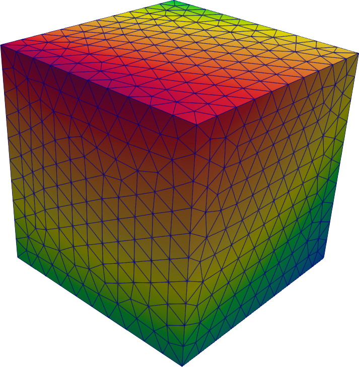
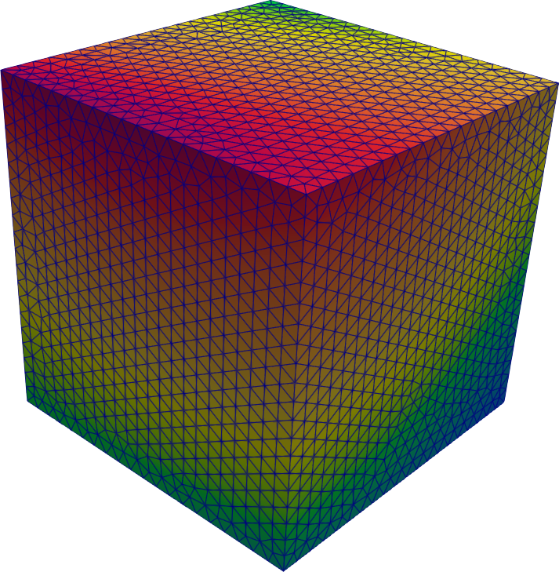

# Mapeo en mallas no conformes {#sec-non-conformal}

> **TL;DR:** Sobre la importancia de que FeenoX siga la filosofía Unix.

Este prime caso no resuelve ninguna PDE pero sirve para ilustrar...

 1. las ideas de la filosofía Unix [@raymond; @unix], en particular programas que...

    * hagan una cosa y que la hagan bien
    * trabajen juntos
    * manejen flujos^[Del inglés [_streams_]{lang=en-US}.] de texto porque esa es una interfaz universal.
    
 2. la capacidad de FeenoX de leer distribuciones espaciales definidas sobre los nodos de una cierta malla no estructurada y de evaluarla en posiciones $\vec{x}$ arbitrarias.
 
Una aplicación de esta segunda característica es leer una distribución espacial de temperaturas calculadas por un solver térmico (el mismo FeenoX podría servir) y utilizarlas para construir la matriz de rigidez de otro problema (por ejemplo elasticidad lineal para problemas termo-mecánicos o transporte o difusión de neutrones para neutrónica realimentada con termohidráulica). En este caso, los puntos de evaluación son los puntos de Gauss de los elementos de la segunda malla.

En este problema escribimos una función $f(x,y,z)$ definida algebraicamente en los nodos de un cubo unitario $[0,1]\times[0,1]\times[0,1]$ creado en Gmsh con la instrucción de OpenCASCADE:

```{.geo include="cube.geo"}
```

mallado con un algoritmo completamente no estructurado utilizando una cierta cantidad $n_1$ de elementos por lado. Luego, se lee esa malla de densidad $c_1$ con los valores nodales de $f(\vec{x})$ y los interpolamos en la posición de los nodos del mismo cubo mallado con otra densidad $n_2$. Como hemos partido de una función algebraica, podemos evaluar el error cometido en la interpolación en función de las densidades $n_1$ y $n_2$.

::: {.remark}
Este procedimiento no es exactamente el necesario para realizar cálculos acoplados ya que la evaluación en la segunda malla es sobre los nodos y no sobre los puntos de Gauss, pero el concepto es el mismo: interpolar valores nodales en puntos arbitrarios.
:::

::: {#fig-cube-interp layout="[45,-10,45]"}






Función $f(\vec{x})$ evaluada en el cubo unitario para dos diferentes números de elementos por lado.
:::

El script `run.sh` realiza una inicialización y tres pasos:

 0. Lee de la línea de comandos la función $f(x,y,z)$. Si no se provee ninguna, utiliza
 
    $$
    f(x,y,z) = 1 + x \cdot \sqrt{y} + 2 \cdot \log(1+y+z) + \cos(x z) \cdot e^{y \cdot z}
    $$

 1. Crea cinco mallas con $n=10, 20, 30, 40, 50$ elementos por lado a partir del cubo base.
   Cada una de estas cinco mallas `cube-n.msh` (donde `n` es 10, 20, 30, 40 o 50) es leída por FeenoX y se crea un archivo nuevo llamado `cube-n-src.msh` con un campo escalar `f` definido sobre los nodos según el argumento pasado por `run.sh` a FeenoX en `$1` (@fig-cube-interp):
 
    ```{.feenox include="create.fee"}
    ```
    
 2. Para cada combinación $n_1=10,\dots,50$ y $n_2=10,\dots,50$, lee la malla `cube-n1-src.msh` con el campo escalar `f` y define una función $f(x,y,z)$ definida por puntos en los nodos de la malla de entrada. Entonces escribe un archivo de salida VTK llamado `cube-n1-n2-dst.vtk` con dos campos escalares nodales:

    1. la función $f(x,y,z)$ de la malla de entrada interpolada en la malla de salida
    2. el valor absoluto de la diferencia entre la $f(x,y,z)$ interpolada y la expresión algebraica original de referencia:

    ```{.feenox include="interpolate.fee"}
    ```

 3. Finalmente, para cada archivo VTK, lee el campo escalar como `f_msh` y calcula el error $L_2$ como
 
    $$
    e_2 = \bigintss \sqrt{ \Big[f_\text{msh}(\vec{x}) - f(\vec{x})\Big]^2} \, d^3\vec{x} 
    $$
    
    y el error $L_\infty$ como
    
    $$
    e_\infty = \max \Big| f_\text{msh}(\vec{x}) - f(\vec{x})\Big|
    $$
    
    e imprime una línea con un formato adecuado para que el script `run.sh` pueda escribir una tabla Markdown que pueda ser incluida en un archivo de documentación con control de versiones Git, tal como esta tesis de doctorado.
    
 
    ```{.feenox include="interpolate.fee"}
    ```


    
La @tbl-010-generar muestra el tiempo necesario para generar lo datos.
La @#tbl-010-interpolar muestra los errores y el tiempo necesario para interpolar los datos.
 
 $n$ |    elementos   |     nodos      | tiempo de mallado [s] | tiempo de rellenado [s] 
:---:|:--------------:|:--------------:|:---------------------:|:-----------------------:
 10  |  4.979 | 1.201 | 0,09 | 0,01
 20  |  37.089 | 7.411 | 0,41 | 0,05
 30  |  123.264 | 22.992 | 1,19 | 0,26
 40  |  289.824 | 51.898 | 3,23 | 0,87
 50  |  560.473 | 98.243 | 7,04 | 1,85
 
: Tiempo necesario para generar los datos. {#tbl-010-generar}


 $n_1$ | $n_2$ | error $L_2$ | error $L_\infty$ | tiempo [s] 
:-----:|:-----:|:-------------:|:------------------:|:----------:
10 | 10 | $1.3 \times 10^{-2}$ | $6.2 \times 10^{-6}$ | 0.02
10 | 20 | $1.3 \times 10^{-2}$ | $9.0 \times 10^{-2}$ | 0.08
10 | 30 | $1.3 \times 10^{-2}$ | $9.6 \times 10^{-2}$ | 0.32
10 | 40 | $1.3 \times 10^{-2}$ | $9.4 \times 10^{-2}$ | 1.01
10 | 50 | $1.3 \times 10^{-2}$ | $9.8 \times 10^{-2}$ | 1.94
20 | 10 | $1.3 \times 10^{-2}$ | $4.1 \times 10^{-3}$ | 0.06
20 | 20 | $6.2 \times 10^{-3}$ | $6.9 \times 10^{-6}$ | 0.11
20 | 30 | $6.4 \times 10^{-3}$ | $6.4 \times 10^{-2}$ | 0.40
20 | 40 | $6.2 \times 10^{-3}$ | $6.7 \times 10^{-2}$ | 0.98
20 | 50 | $6.1 \times 10^{-3}$ | $6.7 \times 10^{-2}$ | 2.30
30 | 10 | $1.3 \times 10^{-2}$ | $1.7 \times 10^{-3}$ | 0.29
30 | 20 | $6.4 \times 10^{-3}$ | $6.4 \times 10^{-3}$ | 0.36
30 | 30 | $4.2 \times 10^{-3}$ | $7.1 \times 10^{-6}$ | 0.57
30 | 40 | $4.3 \times 10^{-3}$ | $4.7 \times 10^{-2}$ | 1.48
30 | 50 | $4.2 \times 10^{-3}$ | $5.3 \times 10^{-2}$ | 2.78
40 | 10 | $1.3 \times 10^{-2}$ | $1.2 \times 10^{-3}$ | 0.99
40 | 20 | $6.3 \times 10^{-3}$ | $5.3 \times 10^{-3}$ | 1.06
40 | 30 | $4.3 \times 10^{-3}$ | $1.3 \times 10^{-2}$ | 1.44
40 | 40 | $3.1 \times 10^{-3}$ | $7.4 \times 10^{-6}$ | 1.95
40 | 50 | $3.2 \times 10^{-3}$ | $3.6 \times 10^{-2}$ | 3.79
50 | 10 | $1.3 \times 10^{-2}$ | $6.0 \times 10^{-4}$ | 2.07
50 | 20 | $6.2 \times 10^{-3}$ | $2.1 \times 10^{-3}$ | 2.31
50 | 30 | $4.2 \times 10^{-3}$ | $3.9 \times 10^{-3}$ | 2.62
50 | 40 | $3.2 \times 10^{-3}$ | $2.4 \times 10^{-2}$ | 3.74
50 | 50 | $2.5 \times 10^{-3}$ | $7.3 \times 10^{-6}$ | 4.26

: Errores y tiempos necesarios para interpolar los datos. {#tbl-010-interpolar}

::: {.remark}
El cálculo del error $L_\infty$ se hace sobre los nodos y sobre los puntos de Gauss.
Recordar la @fig-sine.
:::

::: {.remark}
Si $f(\vec{x})$ fuese lineal o incluso polinómica, los errores serían mucho menores.
:::

Para finalizar, las tablas [-@tbl-50-100-ansys] y [-@tbl-100-50-ansys] muestran los errores y los tiempos necesarios para realizar el mismo mapeo entre FeenoX y una biblioteca que forma parte de una solución comercial vendida por unas de las empresas de software de elementos finitos con mayor participación el el mercado mundial.


                        |     Otro     |    FeenoX
:-----------------------|:------------:|:------------:
 Tiempo                 |  $33.4$ seg    |    $7.24$ seg
 Error $L_2$            |   $2.859 \times 10^{-5}$  |   $2.901 \times 10^{-5}$
 Dif. más negativa      |  $-2.509 \times 10^{-4}$  |  $-5.544 \times 10^{-3}$
 Dif. más positiva      |  $+1.477 \times 10^{-4}$  |  $+7.412 \times 10^{-4}$

: Mapeo de $n_1 = 50$ (98.243 nodos) a $n_2 = 100$ (nodos 41.243 nodos) {#tbl-50-100-ansys}


                        |     Otro     |    FeenoX
:-----------------------|:------------:|:------------:
 Tiempo                 |     $54.2$ seg    |    $1.63$ seg
 Error $L_2$            |   $6.937 \times 10^{-6}$  |   $6.797 \times 10^{-6}$
 Dif. más negativa      |  $-6.504 \times 10^{-5}$  |  $-5.164 \times 10^{-5}$
 Dif. más positiva      |  $+2.605 \times 10^{-5}$  |  $+3.196 \times 10^{-5}$

: Mapeo de $n_1 = 100$ (nodos 41.243 nodos) a $n_2 = 50$ (98.243 nodos) {#tbl-100-50-ansys}


En el repositorio <https://github.com/gtheler/feenox-non-conformal-mesh-interpolation> se pueden encontrar más detalles sobre el análisis del mapeo no conforme propuesto por FeenoX.
