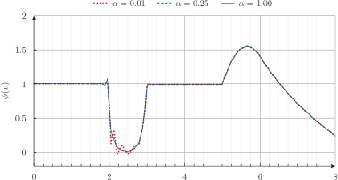
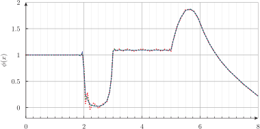
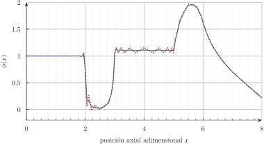

# El problema de Reed {#sec-reed}

> **TL;DR:** Este problema tiene curiosidad histórica, es uno de los problemas más sencillos no triviales que podemos encontrar y sirve para mostrar que para tener en cuenta regiones vacías no se puede utilizar una formulación de difusión.

Este caso, que data de 1971 @cite, es de los más sencillos que FeenoX puede resolver.
Por lo tanto, por base de diseño, el archivo de entrada también debe ser sencilo.
Aprovechamos, entonces, la sencillez de este primer problema para explicar en detalle cómo generar la malla con Gmsh y cómo preparar este archivo de entrada en forma apropiadada.


{#fig-reed-problem}

El problema de Reed consiste en una geometría tipo slab adimensional para $0 < x < 8$ con cinco zonas, cada una con secciones eficaces macroscópicas adimensionales uniformes (@fig-reed-problem):

 a. Source 1 en $0 < x < 2$
 b. Absorber en $2 < x < 3$
 c. Vacuum en $3 < x < 5$
 d. Source 2 en $5 < x < 6$
 e. Reflector en $6 < x < 8$

 * Las fuentes de neutrones son independientes y no hay materiales físiles (ni fisionables), por lo que el problema a resolver es un sistema lineal de ecuaciones (KSP) * El material "vaccum" tiene secciones eficaces nulas, lo que implica que no puede utilizarse la aproximación de difusión ya que el coeficiente $D(x)$ estaría mal definido.
 * Se espera que haya gradientes espaciales grandes en las interfaces entre materiales, por lo que vamos a refinar localizadamente alrededor de los puntos $x=2$, $x=3$, $x=5$ y $x=6$.
 * Como mencionamos en la @def-petrov-galerkin, la ecuación de transporte es hiperbólica y necesita un término de estabilización en el término convectivo. FeenoX implementa un método tipo SUPG controlado por un factor $\alpha$ que puede ser definido explícitamente en el archivo de entrada a través de la variable especial `sn_alpha`. Por defecto, $\alpha = 1/2$.
 * La condición de contorno en $x=0$ es tipo simetría, lo que implica que FeenoX utilice el método de penalidad para implementarla. Es posible elegir el peso en el archivo de entrada con la variable especial `penalty_weight`. Valores altos implican mayor precisión en la condición de contorno pero peor condicionamiento de la matriz global.
 * La condición de contorno en $x=8$ es vacío, lo que corresponde a una condición de Dirichlet para las direcciones entrantes.


Podemos generar la geometría del problema con el siguiente archivo de entrada de Gmsh:

```{.geo include="reed.geo"}
```
lo que da lugar a 81 nodos distribuidos como ilustramos en la @fig-reed-mesh.

{#fig-reed-mesh}

Estamos entonces en condiciones de preparar el archivo de entrada para FeenoX:

```{.feenox include="reed.fee"}
```

Este (sencillo) archivo de entrada tiene 6 secciones bien definidas:

 1. Definición (`PROBLEM` es un sustantivo) de
    a. el tipo de PDE a resolver (`neutron_sn`)
    b. la dimensión del dominio (`DIM 1`)
    c. la cantidad de grupos de energía (`GROUPS 1`)
    d. el orden $N$ en S$_N$ (`SN $1`) a leer como el primer argumento en la línea de comando de invocación del ejecutable `feenox` luego del archivo de entrada `reed.fee`
 2. Instrucción para leer la malla (`READ_MESH` es un verbo seguido de un sustantivo)
 3. Definición de los nombres y propiedades de los materiales (`MATERIAL` es un sustantivo). Si los nombres de los materiales en el archivo de entrada de FeenoX coinciden con el nombre de las entidades físicas cuya dimensión es la del problema (líneas físicas en este caso unidimensional) entonces éstas se asocian implícitamente a los materiales. En cualquier caso, se puede hacer una asociación explícita con tantas palabras clave `LABEL` como sea necesario para cada material.
 4. Definición de condiciones de contorno (`BC` quiere decir [_boundary condition_}{lang=en-US} que es un sustantivo adjetivado). De la misma manera, si el nombre de la condición de contorno coincide con el nombre de entidades físicas de dimensión menor a la dimensión del problema en la malla, la asociación se hace implícitamente. Igualmente, se pueden agregar palabras clave `LABEL`.
 5. Instrucción para indicar que FeenoX debe resolver el problema. En este caso sencillo esta instrucción debe venir luego de leer la malla y antes de escribir el resultado. En casos ligeramente más complejos como estudiamos a continuación donde cambiamos los valores por defecto de las variables `sn_alpha` y `penalty_weight`, la instrucción `SOLVE_PROBLEM` debe venir luego de las instrucciones de asignación.
 6. Instrucción para escribir en la salida estándar una columna con la posición de los nodos (en este caso un único valor para $x$) y el flujo escalar $\phi$ evaluado en $x$. Podríamos haber pedido los flujos angulares $\psi_{mg}$ a continuación para obtener más columnas de datos, pero dado que el parámetro $N$ se lee desde la línea de comandos no podemos saber al momento de preparar el archivo de entrada cuántos flujos angulares van a estar definidos. Por ejemplo, si `$1` es 2 entonces `psi1.1` y `psi2.1` están definidas pero `psi3.1` no lo estará por lo que la línea

     ```feenox
     PRINT_FUNCTION psi1 psi1.1 psi2.1 psi3.1 psi4.1
     ```
     dará un error de parseo si `$1` es 2 (pero funcionará bien si `$1` es 4).
     En problemas multidimensionales, la instrucción `WRITE_RESULTS` se hará cargo del problema porque escribirá automáticamente en el archivo de salida (en formato Gmsh o VTK) la cantidad correcta de flujos angulares definidos.
     Otra forma de tener como salida los flujos angulares es reemplazar la instrucción `PRINT_FUNCTION` por

     ```feenox
     INCLUDE print-$1.fee
     ```
     y preparar diferentes archivos `print-2.fee`, `print-4.fee`, `print-6.fee`, etc. cada uno conteniendo la instrucción `PRINT_FUNCTION` con la cantidad apropiada de argumentos para cada $N$.

La ejecución propiamente dicha de este problema involucra entonces invocar a Gmsh para generar la malla `reed.msh` a partir de `reed.geo` y luego invocar a FeenoX con el archivo de entrada `reed.fee` y el valor de $N$ deseado a continuación. Como queremos construir un gráfico con el perfil de flujo escalar, redireccionamos cada una de las salidas estándar de la diferentes ejecuciones de FeenoX a diferentes archivos ASCII:

```terminal
$ gmsh -1 reed.geo
Info    : Running 'gmsh -1 reed.geo' [Gmsh 4.12.0-git-01ed7170f, 1 node, max. 1 thread]
Info    : Started on Thu Oct 19 19:31:42 2023
Info    : Reading 'reed.geo'...
Info    : Done reading 'reed.geo'
Info    : Meshing 1D...
Info    : [  0%] Meshing curve 1 (Line)
Info    : [ 10%] Meshing curve 2 (Line)
Info    : [ 20%] Meshing curve 3 (Line)
Info    : [ 30%] Meshing curve 4 (Line)
Info    : [ 40%] Meshing curve 5 (Line)
Info    : [ 50%] Meshing curve 11 (Line)
Info    : [ 60%] Meshing curve 12 (Line)
Info    : [ 70%] Meshing curve 13 (Line)
Info    : [ 80%] Meshing curve 14 (Line)
Info    : [ 90%] Meshing curve 15 (Line)
Info    : Done meshing 1D (Wall 0.0142831s, CPU 0.010774s)
Info    : 81 nodes 91 elements
Info    : Writing 'reed.msh'...
Info    : Done writing 'reed.msh'
Info    : Stopped on Thu Oct 19 19:31:42 2023 (From start: Wall 0.0161955s, CPU 0.010992s)
$ feenox reed.fee 2 > reed-s2.csv
$ feenox reed.fee 4 > reed-s4.csv
$ feenox reed.fee 8 > reed-s8.csv
```

Podemos darle una vuelta de tuerca más a la filosofía Unix y remplazar las últimas tres llamadas explícitas a feenox por un bucle de Bash

```terminal
$ for N in 2 4 8; do feenox reed.fee $N > reed-s$N.csv; done
$
```

La @fig-reed-flux muestra el flujo escalar calculado por FeenoX y una comparación con resultados independientes obtenidos con una implementación de un solver 1D ad-hoc en una herramienta matemática privativa y [publicados en un blog académico](https://www.drryanmc.com/solutions-to-reeds-problem/).^[El autor de dicho blog está al tanto de la comparación con FeenoX.] Esta solución independiente utiliza una malla uniforme con la misma cantidad (81) de nodos que FeenoX.

{#fig-reed-flux}


## Efecto del factor de estabilización

Estudiemos brevemente el efecto de modificar el factor de estabilización $\alpha$ mediante la variable `sn_alpha`.
Para ello generamos una malla un poco más gruesa con la opción `-clscale` de Gmsh y reducimos el número de nodos de 81 a 53:

```terminal
$ gmsh -1 reed.geo -clscale 2 -o reed-coarse.msh
[...]
Info    : Done meshing 1D (Wall 0.0160784s, CPU 0.011781s)
Info    : 53 nodes 63 elements
Info    : Writing 'reed-coarse.msh'...
Info    : Done writing 'reed-coarse.msh'
Info    : Stopped on Thu Oct 19 20:20:01 2023 (From start: Wall 0.019359s, CPU 0.015746s)
$
```

Agregamos entonces la posibilidad de leer otro argumento en la línea de comandos `$2` y lo asignamos a dicha variable antes de pedir la instrucción `SOLVE_PROBLEM`. Además ahora le pedimos directamente a FeenoX que escriba la función $\phi_1(x)$ en un archivo de texto cuyo nombre es `$0-$1-$2.csv` donde `$0` es el nombre del archivo de entrada sin la extensión `.fee`:

```{.feenox include="reed-alpha.fee"}
```

Con dos bucles de Bash anidados probamos todas las combinaciones posibles de $N=2,4,8$ y $\alpha = 0.01,0.25,1$:

```terminal
$ for N in 2 4 8; do for alpha in 0.01 0.25 1; do feenox reed-alpha.fee $N $alpha; done; done
```
para obtener la @fig-reed-flux-alpha.


::: {#fig-reed-flux-alpha layout="[100]"}

{#fig-reed-flux-alpha-2}

{#fig-reed-flux-alpha-4}

{#fig-reed-flux-alpha-8}


Efecto del factor de estabilización $\alpha$
:::


::: {.remark}
Como veremos más adelante, el realizar estudios paramétricos sobre más de un parámetro la cantidad de resultados a analizar aumenta geométricamente. Debido a que FeenoX permite la flexibilidad de ser ejecutado en bucles y de pasar parámetros por líneas de comando, la generación de los resultados es extremadamente eficiente, lo que hace que sea relativamente mucho más difícil el análisis de dichos resultados que la generación de los datos en sí. Esto pone en relieve la importancia de la regla de economía de Unix: no sólo el costo relativo de la unidad de tiempo de CPU es al menos tres órdenes de magnitud menor al costo de la unidad de tiempo de un ingeniero sino que también el tiempo absoluto necesario para analizar resultados es mayor que para generarlos.
:::


## Efecto del factor de peso del método de penalidad


## Efecto del orden de los elementos

