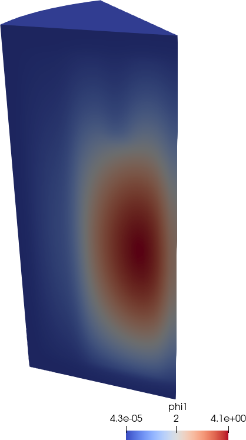

# IAEA PWR Benchmark {#sec-2dpwr}

> **TL;DR:** El problema original de 1976 propone resolver un cuarto de núcleo cuando en realidad la simetría es 1/8.

Este problema fue propuesto por [Argonne National Laboratory]{lang=en-US} @anl7416 y luego adoptado por la IAEA como un benchmark estándar para validar códigos de difusión. Está compuesto

 a. por un problema 2D que representa un cuarto de una geometría típica de PWR sobre el plano $x$-$y$ más un [buckling]{lang=en-US} geométrico para tener en cuenta las pérdidas en la dirección $z$, y
 b. un problema completamente tridimensional de un cuarto de núcleo

## Caso 2D original

La @fig-iaea-2dpwr-figure, preparada en su momento para la publicación @unstructured-stni, muestra la geometría del problema.
La @tbl-iaea-xs muestra las secciones eficaces macroscópicas a dos grupos de cada zona.
El problema pide calcular varios puntos, incluyendo

 * el factor de multiplicación efectivo $k_\text{eff}$
 * perfiles de flujo a lo largo de la diagonal
 * valores y ubicación de flujos máximos
 * potencias medias en cada canal


{#fig-iaea-2dpwr-figure}


::: {#tbl-iaea-xs}

Región | $D_1$ | $D_2$ | $\Sigma_{s1 \rightarrow 2}$ | $\Sigma_{a1}$ | $\Sigma_{a2}$ | $\nu\Sigma_{f2}$ | Material
:-----:|:-----:|:-----:|:-----:|:-----:|:-----:|:-----:|:-------------:
   1   |  1.5  |  0.4  | 0.02  | 0.01  | 0.08  | 0.135 | Fuel 1
   2   |  1.5  |  0.4  | 0.02  | 0.01  | 0.085 | 0.135 | Fuel 2
   3   |  1.5  |  0.4  | 0.02  | 0.01  | 0.13  | 0.135 | Fuel 2 + Rod
   4   |  2.0  |  0.3  | 0.04  |  0    | 0.01  |   0   | Reflector
   5   |  2.0  |  0.3  | 0.04  |  0    | 0.055 |   0   | Refl. + Rod

: Datos originales de @anl7416 {#tbl-iaea-xs2}

Secciones eficaces macroscópicas (uniformes por zonas) del benchmark PWR de IAEA. Al caso 2D se le debe sumar un término de [buckling]{lang=en-US} geométrico $B_g^2=0.8 \times 10^{-4}$.
 
:::


En la referencia @unstructured-stni hemos resuelto completamente el problema utilizando la segundo versión de la implementación (denominada milonga), incluso utilizando triángulos y cuadrángulos, diferentes algoritmos y densidades de mallado, etc. Más aún, esa versión era capaz de resolver la ecuación de difusión tanto con elementos como con volúmenes finitos tal como explicamos en la monografía @monografia, donde también resolvemos el problema.
En la presentación @milongaiaea2011 mostramos cómo habíamos resuelto el [benchmark]{lang=en-US} con la primera versión del código.

En esta sección calculamos solamente el factor de multiplicación y la distribución espacial de flujos.
En este caso vamos a prestar más atención al archivo de entrada de FeenoX que a la generación de la malla, que para este caso puede ser estructurada como mostramos en la @fig-iaea-2dpwr-quarter.

{#fig-iaea-2dpwr-quarter width=50%}

```{.feenox include="iaea-2dpwr.fee"}
```

::: {.remark}
Hay una relación bi-unívoca bastante clara entre la definición del problema en el reporte @anl7416 y el archivo de entrada necesario para resolverlo con FeenoX.
El lector experimentado podrá notar que esta característica (que es parte de la base de diseño del software) no es común en otros solvers, ni neutrónicos ni termo-mecánicos.
:::

::: {.remark}
Si bien las secciones eficaces son uniformes, la sección eficaz de absorción está dada por una expresión que es la suma de la sección eficaz base más el producto del coeficiente de difusión $D_g$ por el buckling geométrico $B_g$. En lugar de volver a escribir la constante numérica correspondiente al material, escribimos $D_g(x,y)$ para que FeenoX reemplace el valor apropiado del coeficiente de difusión del material en cuestión por nosotros.
:::

::: {.remark}
Tal como en el problema de Reed de la sección anterior donde teníamos elementos de tipo punto para definir condiciones de contorno, en este caso bi-dimensional la malla contiene elementos de dimensión uno (tipo líneas) donde se aplican las condiciones de contorno. Los elementos que discretizan las líneas $x=0$ e $y=0$ tienen asignado (en el archivo de entrada de Gmsh no mostrado) el nombre "[vacuum]{lang=en-US}" y los que discretizan el borde externo del reflector, el nombre "[mirror]{lang=en-US}". Estos dos nombres son usados en las dos instrucciones `BC` del archivo de entrada de FeenoX para indicar qué clase de condición de contorno hay que aplicarle a cada grupo de elementos de dimensión topológica menor a la del problema.
:::

```terminal
$ gmsh -2 iaea-2dpwr-quarter.geo
[...]
Info    : Done meshing 2D (Wall 0.0422971s, CPU 0.042152s)
Info    : 1033 nodes 1286 elements
Info    : Writing 'iaea-2dpwr-quarter.msh'...
Info    : Done writing 'iaea-2dpwr-quarter.msh'
Info    : Stopped on Fri Oct 20 15:55:03 2023 (From start: Wall 0.0522626s, CPU 0.060603s)
$ time feenox iaea-2dpwr.fee
grados de libertad =    2066
keff =  1.02985

real    0m0.696s
user    0m0.090s
sys     0m0.162s
$
```

## Caso 2D con simetría 1/8

Como deslizamos en el [capítulo @sec-introduccion], bien mirado el problema no tiene simetría 1/4 sino simetría 1/8.
Sucede que para poder explotar dicha simetría se necesita una malla no estructurada, que ni en 1976 ni en 2024 (excepto algunos casos puramente académicos como [@chaboncito; @park; @babcsany; @criekingen]) es una característica de los solvers neutrónicos de nivel de núcleo. De hecho el [paper]{lang=en-US} @unstructured-stni justamente ilustra el hecho de que las mallas no estructuradas permiten reducir la cantidad de grados de libertad necesarios para resolver un cierto problema.

{#fig-iaea-2dpwr-eighth width=50%}

Utilizando `eighth` como argumento `$1` podemos usar el mismo archivo de entrada pero con la malla de la @fig-iaea-2dpwr-eighth:

```terminal
$ gmsh -2 iaea-2dpwr-eighth.geo
[...]
Info    : 668 nodes 1430 elements
Info    : Writing 'iaea-2dpwr-eighth.msh'...
Info    : Done writing 'iaea-2dpwr-eighth.msh'
Info    : Stopped on Fri Oct 20 17:58:06 2023 (From start: Wall 0.0331908s, CPU 0.040327s)
$ time feenox iaea-2dpwr.fee eighth
grados de libertad =    1336
keff =  1.02974

real    0m0.681s
user    0m0.075s
sys     0m0.161s
$
```


{#fig-iaea-2dpwr-fluxes width=70%}

::: {.remark}
El tiempo de CPU reportado por `time`  es el mismo independiente de la cantidad de grados de libertad.
Esto indica que el tamaño del problema es muy pequeño y el tiempo necesario para construir las matrices y resolverlas es despreciable frente al [overhead]{lang=en-US} de cargar un ejecutable, inicializar bibliotecas compartidas, etc.
Podemos verificar esta afirmación analizando la salida de la opción `--log_view` que le indica a PETSc que agregue una salida con datos de performance:

```terminal
$ feenox iaea-2dpwr.fee eighth --log_view
grados de libertad =    1336
keff =  1.02974
[...]
Summary of Stages:   ----- Time ------  ----- Flop ------ 
                        Avg     %Total     Avg     %Total 
 0:      Main Stage: 2.0911e-03   7.7%  0.0000e+00   0.0% 
 1:            init: 2.1185e-04   0.8%  0.0000e+00   0.0% 
 2:           build: 9.7703e-03  36.1%  0.0000e+00   0.0% 
 3:           solve: 1.4487e-02  53.6%  1.9467e+07 100.0% 
 4:            post: 4.8677e-04   1.8%  0.0000e+00   0.0% 
[...]
$
```

En efecto, se necesitan menos de 10 milisegundos para construir las matrices del problema y menos de 15 para resolverlo.
:::

## Caso 2D con reflector circular

Mirando un poco más en detalle la geometría, hay un detalle que también puede ser considerado con mallas no estructuradas:
la superficie exterior del reflector.
En efecto, en una geometría tipo PWR cada uno de los canales proyecta un cuadrado en la sección transversal.
Pero el reflector sigue la forma del recipiente de presión que es un cilindro (@fig-pwr).
Con FeenoX es posible resolver fácilmente esta geometría con el mismo archivo de entrada con la malla de la @fig-iaea-2dpwr-eighth-circular que incluye una mezcla de

 a. zonas estructuradas y no estructuradas, y
 b. triángulos y cuadrángulos.

::: {#fig-pwr-tipico-circ layout="[50,50]"}
{#fig-pwr}

{#fig-iaea-2dpwr-eighth-circular}

Un reactor PWR real y un modelo matemático
:::


```terminal
$ gmsh -2 iaea-2dpwr-eighth-circular.geo
Info    : 524 nodes 680 elements
Info    : Writing 'iaea-2dpwr-eighth-circular.msh'...
Info    : Done writing 'iaea-2dpwr-eighth-circular.msh'
Info    : Stopped on Fri Oct 20 17:58:37 2023 (From start: Wall 0.0314288s, CPU 0.043231s)
$ time feenox iaea-2dpwr.fee eighth-circular
grados de libertad =    1048
keff =  1.02970

real    0m0.649s
user    0m0.048s
sys     0m0.156s
$
```

## Caso 3D con simetría 1/8, reflector circular resuelto con difusión

Pasemos ahora al caso tri-dimensional.
El problema original es una extensión sobre el eje $z$ de la geometría con simetría 1/4 y reflector no circular.
Como ya vimos en 2D, podemos tener simetría 1/8 y reflector cilíndrico.
Ya que estamos en 3D, podemos preparar la geometría con una herramienta tipo CAD como es usual en análisis de ingeniería tipo CAE.
En particular, usamos la plataforma CAD Onshape que corre en la nube y se utiliza directamente desde el navegador.^[La plataforma [CAEplex](https://www.caeplex.com) desarrollada por el autor de esta tesis que provee una interfaz web para una versión anterior de FeenoX corriendo en la nube está 100% integrada en Onshape para realizar cálculos termo-mecánicos.]
La @fig-iaea-3dpwr-onshape muestra la geometría continua, que luego de ser mallada con Gmsh con elementos de segundo orden arroja la malla de la @fig-iaea-3dpwr-eighth-circular-mesh.

{#fig-iaea-3dpwr-onshape}

::: {#fig-iaea-3dpwr-eighth-circular-mesh layout="[21.8,-3,21,-3,27]"}
{#fig-iaea-3dpwr-eighth-mesh1}

{#fig-iaea-3dpwr-eighth-mesh2}

{#fig-iaea-3dpwr-eighth-mesh3}


Malla para el problema 3D PWR IAEA con simetría 1/8 y reflector circular con elementos tet10 de segundo orden.
Cada color indica un material diferente de la @tbl-iaea-xs, incluyendo el material número 5 "barras de control en el reflector superior".
:::

El archivo de entrada sigue siendo relativamente sencillo, sólo que ahora agregamos un poco más de información a la salida:

```{.feenox include="iaea-3dpwr.fee"}
```

Como somos ingenieros y tenemos un trauma profesional con el tema de performance, debemos comparar la "ganancia" de usar simetría 1/8 con respecto al original de 1/4:

```terminal
$ feenox iaea-3dpwr.fee quarter
geometry = quarter
    keff = 1.02918
   nodes = 70779
    DOFs = 141558
[0/1 LIN54Z7SQ3]   memory = 2.3 Gb (local) 2.3 Gb (global)
    wall = 26.1 sec
$ feenox iaea-3dpwr.fee eighth
geometry = eighth
    keff = 1.02912
   nodes = 47798
    DOFs = 95596
[0/1 LIN54Z7SQ3]   memory = 1.2 Gb (local) 1.2 Gb (global)
    wall = 12.7 sec
$ feenox iaea-3dpwr.fee eighth-circular
geometry = eighth-circular
    keff = 1.08307
   nodes = 32039
    DOFs = 64078
[0/1 LIN54Z7SQ3]   memory = 0.8 Gb (local) 0.8 Gb (global)
    wall = 7.9 sec
$ 
```

La @fig-uno-dos muestra que ahora sí tenemos una ganancia significativa al reducir el tamaño del problema mediante la explotación de la simetría. El tiempo para construir la matriz pasó de 3.2 segundos a 2.0 (recordar que son elementos de segundo orden) y el tiempo necesario para resolver el problema bajó de 21 a 10 segundos.

{#fig-uno-dos width=80%}


::: {#fig-iaea-3dpwr-eighth-circular-flux layout="[1,1]"}
{#fig-iaea-3dpwr-eighth-flux1}

{#fig-iaea-3dpwr-eighth-flux2}

Flujos del benchmark de 3D PWR de IAEA con simetría 1/8 y reflector circular
:::

Podemos investigar un poco qué sucede si quisiéramos resolver el problema en paralelo:

```terminal
$ mpiexec -n 1 feenox iaea-3dpwr.fee quarter
geometry = quarter
    keff = 1.02918
   nodes = 70779
    DOFs = 141558
[0/1 LIN54Z7SQ3]   memory = 2.3 Gb (local) 2.3 Gb (global)
    wall = 26.2 sec
$ mpiexec -n 2 feenox iaea-3dpwr.fee quarter
geometry = quarter
    keff = 1.02918
   nodes = 70779
    DOFs = 141558
[0/2 LIN54Z7SQ3]   memory = 1.5 Gb (local) 3.0 Gb (global)
[1/2 LIN54Z7SQ3]   memory = 1.5 Gb (local) 3.0 Gb (global)
    wall = 17.0 sec
$ mpiexec -n 4 feenox iaea-3dpwr.fee quarter
geometry = quarter
    keff = 1.02918
   nodes = 70779
    DOFs = 141558
[0/4 LIN54Z7SQ3]   memory = 1.0 Gb (local) 3.9 Gb (global)
[1/4 LIN54Z7SQ3]   memory = 0.9 Gb (local) 3.9 Gb (global)
[2/4 LIN54Z7SQ3]   memory = 1.1 Gb (local) 3.9 Gb (global)
[3/4 LIN54Z7SQ3]   memory = 0.9 Gb (local) 3.9 Gb (global)
    wall = 13.0 sec
$ 
```

::: {.remark}
El tiempo real o "de pared" escala en forma relativamente lineal con la cantidad de procesos MPI.
:::


## Caso 3D con simetría 1/8, reflector circular resuelto con S$_4$ {#sec-iaea3d-s4}

Para finalizar el caso, mostramos que FeenoX puede resolver no sólo este problema con el método de difusión sino también con ordenadas discretas.
Este archivo de entrada calcula la distribución de flujos que ya hemos mostramos en la @fig-iaea-3dpwr-eighth-circular-flux-s4 del [capítulo @sec-introduccion].


```{.feenox include="iaea-3dpwr-s4.fee"}
```

```terminal
$ feenox iaea-3dpwr-s4.fee --eps_monitor
 nodes = 3258
[0/1 LIN54Z7SQ3] solving...
  1 EPS nconv=0 first unconverged value (error) 0.996623 (4.34362059e-05)
  2 EPS nconv=0 first unconverged value (error) 0.996626 (4.49580500e-08)
  3 EPS nconv=1 first unconverged value (error) 0.9353 (3.29379374e-08)
  DOFs = 156384
  keff = 0.99663
  wall = 197.9 sec
average memory = 13.6 Gb
 global memory = 13.6 Gb
$ mpiexec -n 4 feenox iaea-3dpwr-s4.fee --eps_monitor
 nodes = 3258
[0/4 LIN54Z7SQ3] solving...
[1/4 LIN54Z7SQ3] solving...
[2/4 LIN54Z7SQ3] solving...
[3/4 LIN54Z7SQ3] solving...
  1 EPS nconv=0 first unconverged value (error) 0.996625 (4.19395044e-05)
  2 EPS nconv=0 first unconverged value (error) 0.996626 (4.67480991e-08)
  3 EPS nconv=1 first unconverged value (error) 0.9353 (3.29361847e-08)
  DOFs = 156384
  keff = 0.99663
  wall = 99.5 sec
average memory = 4.7 Gb
 global memory = 19.0 Gb
$
```

Utilizando el mismo archivo de entrada pero modificando las opciones de la línea de comando es posible utilizar un solver iterativo para resolver el mismo problema.

```terminal
$ mpiexec -n 12 feenox iaea-3dpwr-s4.fee --eps_monitor --eps_converged_reason --eps_type=jd --st_type=precond  --st_ksp_type=gmres --st_pc_type=asm
 nodes = 3258
[0/12 LIN54Z7SQ3] solving...
[1/12 LIN54Z7SQ3] solving...
[2/12 LIN54Z7SQ3] solving...
[3/12 LIN54Z7SQ3] solving...
[4/12 LIN54Z7SQ3] solving...
[5/12 LIN54Z7SQ3] solving...
[6/12 LIN54Z7SQ3] solving...
[7/12 LIN54Z7SQ3] solving...
[8/12 LIN54Z7SQ3] solving...
[9/12 LIN54Z7SQ3] solving...
[10/12 LIN54Z7SQ3] solving...
[11/12 LIN54Z7SQ3] solving...
  1 EPS nconv=0 first unconverged value (error) 0.542411 (1.45272351e+02)
  2 EPS nconv=0 first unconverged value (error) 0.988282 (6.81535819e+00)
  3 EPS nconv=0 first unconverged value (error) 0.97111 (4.90651112e+00)
  4 EPS nconv=0 first unconverged value (error) 0.991935 (2.72069261e+00)
  5 EPS nconv=0 first unconverged value (error) 0.995226 (1.46652556e+00)
  6 EPS nconv=0 first unconverged value (error) 0.997734 (6.67104794e-01)
  7 EPS nconv=0 first unconverged value (error) 0.996109 (3.82428107e-01)
  8 EPS nconv=0 first unconverged value (error) 0.996941 (2.46293703e-01)
  9 EPS nconv=0 first unconverged value (error) 0.996638 (1.44292090e-01)
 10 EPS nconv=0 first unconverged value (error) 0.996653 (8.93529784e-02)
 11 EPS nconv=0 first unconverged value (error) 0.99657 (8.93529784e-02)
 12 EPS nconv=0 first unconverged value (error) 0.99657 (7.22756164e-02)
 13 EPS nconv=0 first unconverged value (error) 0.996607 (6.32159213e-02)
 14 EPS nconv=0 first unconverged value (error) 0.996704 (4.36139189e-02)
 15 EPS nconv=0 first unconverged value (error) 0.996642 (2.01286172e-02)
 16 EPS nconv=0 first unconverged value (error) 0.996617 (6.63384323e-03)
 17 EPS nconv=0 first unconverged value (error) 0.996629 (2.39149013e-03)
 Linear eigensolve converged (1 eigenpair) due to CONVERGED_TOL; iterations 18
  DOFs = 156384
  keff = 0.99663
  wall = 613.2 sec
average memory = 1.6 Gb
 global memory = 19.4 Gb
```


::: {.remark}
La malla es ligeramente más gruesa y de menor orden que en los casos resueltos con difusión en la sección anterior.
De todas maneras, la cantidad de grados de libertad es comparable al caso `quarter` de difusión.
Pero los recursos computacionales requeridos para resolver un problema de autovalores proveniente de una discretización de ordenadas discretas son significativamente mayores que para difusión.
:::

::: {.remark}
Este caso pone en relieve la importancia de la paralelización por MPI: reducir el tiempo de cálculo es un beneficio secundario (que aún debe optimizarse en FeenoX) en comparación con la reducción de la memoria por nodo necesaria para resolver un problema de autovalores con un solver lineal directo.
En el caso del solver iterativo, está claro que se intercambia velocidad por memoria.
:::
