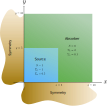
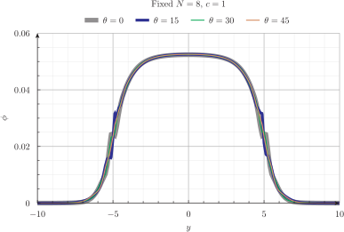

# El problema de Azmy {#sec-azmy}

> **TL;DR:** Este problema ilustra el "efecto rayo" de la formulación de ordenadas discretas en dos dimensiones.
> Para estudiar completamente el efecto se necesita rotar la geometría con respecto a las direcciones de S$_N$.

{#fig-azmy-figure}

Este problema adimensional fue introducido en 1988 en el artículo @azmy y re-visitado en la tesis de maestría @park.
Consiste en una geometría bi-dimensional muy sencilla, como ilustramos en la @fig-azmy-figure.
En el paper original, este cuadrado se divide en cuatro cuadrados de $5 \times 5$ donde se calculan los flujos medios, que es lo que hacemos en las dos secciones que siguen para comparar los resultados con las referencias.


## Malla estructurada uniforme de segundo orden

Aprovechando que la geometría es un cuadrado empezamos resolviendo el problema con una malla estructurada y uniforme de segundo orden (@fig-azmy-structured-mesh).
Mostramos el archivo de entrada de Gmsh para vincular los nombres de las entidades físicas con el archivo de entrada de FeenoX y cómo calculamos los valores medios de los flujos como pide el problema original:

{#fig-azmy-structured-mesh width=50%}

```{.geo include="azmy-structured.geo"}
```

El archivo de entrada de FeenoX es ligeramente más complicado que los anteriores ya que debemos agregar algunas instrucciones para calcular la integral del flujo sobre cada uno de los cuatro cuadrantes con la instrucción `INTEGRATE`:

```{.feenox include="azmy-structured.fee"}
```

La ejecución de Gmsh y FeenoX da

```terminal
$ gmsh -2 azmy-structured.geo 
[...]
Info    : 4225 nodes 1225 elements
Info    : Writing 'azmy-structured.msh'...
Info    : Done writing 'azmy-structured.msh'
Info    : Stopped on Sat Oct 21 14:30:23 2023 (From start: Wall 0.0222577s, CPU 0.019616s)
$ feenox azmy-structured.fee 2
LLQ = 1.653e+00 (ref 1.676e+0)
LRQ = 4.427e-02 (ref 4.159e-2)
URQ = 2.712e-03 (ref 1.992e-3)
16900 unknowns for S2, memory needed = 0.1 Gb
$ feenox azmy-structured.fee 4
LLQ = 1.676e+00 (ref 1.676e+0)
LRQ = 4.164e-02 (ref 4.159e-2)
URQ = 1.978e-03 (ref 1.992e-3)
50700 unknowns for S4, memory needed = 0.8 Gb
$ feenox azmy-structured.fee 6
LLQ = 1.680e+00 (ref 1.676e+0)
LRQ = 4.120e-02 (ref 4.159e-2)
URQ = 1.874e-03 (ref 1.992e-3)
101400 unknowns for S6, memory needed = 3.3 Gb
$ 
```


## Malla no estructurada localmente refinada de primer orden

Dado que es esperable que haya grandes gradientes en el flujo neutrónico en las interfaces entre la zona de la fuente y el reflector, podemos aprovechar la posibilidad de hacer un refinamiento local en mallas no estructuradas (@fig-azmy-mesh).
Para ilustrar la flexibilidad de FeenoX, ahora no asignamos una entidad física a cada cuadrante sino que integramos el flujo con el funcional `integrate` dando explícitamente el dominio de integración como función de $x$ e $y$.

```{.geo include="azmy.geo"}
```

```{.feenox include="azmy.fee"}
```

```terminal
$ gmsh -2 azmy.geo 
[...]
Info    : 3926 nodes 8049 elements
Info    : Writing 'azmy.msh'...
Info    : Done writing 'azmy.msh'
Info    : Stopped on Sat Oct 21 14:44:46 2023 (From start: Wall 0.129908s, CPU 0.127121s)
$ feenox azmy.fee 2
LLQ     1.653e+00       (ref 1.676e+0)
LRQ     4.427e-02       (ref 4.159e-2)
URQ     2.717e-03       (ref 1.992e-3)
15704 unknowns for S2, memory needed = 0.1 Gb
$ feenox azmy.fee 4
LLQ     1.676e+00       (ref 1.676e+0)
LRQ     4.160e-02       (ref 4.159e-2)
URQ     1.991e-03       (ref 1.992e-3)
47112 unknowns for S4, memory needed = 0.5 Gb
$ feenox azmy.fee 6
LLQ     1.680e+00       (ref 1.676e+0)
LRQ     4.115e-02       (ref 4.159e-2)
URQ     1.890e-03       (ref 1.992e-3)
94224 unknowns for S6, memory needed = 1.9 Gb
$ 
```


{#fig-azmy-mesh width=85%}

::: {#fig-azmy-phi layout="[33,33,33]"}
{#fig-azmy-4-00}

{#fig-azmy-6-00}

{#fig-azmy-8-00}


Flujo escalar $\phi(x,y)$ en el problema de Azmy resuelto con malla no estructurada.
:::


::: {#fig-azmy-psi layout="[33,33,33]"}
{#fig-azmy-4-01}

{#fig-azmy-4-02}

{#fig-azmy-4-03}

{#fig-azmy-4-04}

{#fig-azmy-4-05}

{#fig-azmy-4-06}

{#fig-azmy-4-07}

{#fig-azmy-4-08}

{#fig-azmy-4-09}

{#fig-azmy-4-10}

{#fig-azmy-4-11}

{#fig-azmy-4-12}

$1/2 \cdot 4 \cdot (4+2) = 12$ flujos angulares $\psi_g(x,y)$ en el problema de Azmy resuelto con malla no estructurada con S$_4$.

:::


## Estudio paramétrico para analizar el "efecto rayo"

En la ref. @park, el autor nota que este tipo de problemas es susceptible al artefacto numérico conocido como "efecto rayo" según el cual la discretización angular hace que algunas direcciones no estén bien representadas por el esquema de S$_N$.
Justamente en esa tesis se proponen formas para lidiar con este efecto. Incluso una de esas formas es discretizar la variable angular con funciones de forma similares a las usadas para discretizar el espacio @ray-effect.

Para ilustrar el efecto, se toman perfiles de flujo a lo largo de la dirección $y$ para diferentes valores constantes de $x$ sobre el reflector (donde el flujo es mucho menor que en la fuente como ilustramos en las figuras [-@fig-azmy-phi] y [-@fig-azmy-psi].
En particular, el autor investiga los siguientes tres valores de $x$
  
   a. $x=5.84375$
   b. $x=7.84375$
   c. $x=9.84375$
   
Para poder entender lo que está pasando, queremos estudiar qué sucede con estos perfiles cuando las direcciones de S$_N$ de alguna manera "rotan" con respecto a la geometría.
Como FeenoX usa cuadraturas de nivel simétrico, no podemos rotar las direcciones. Debemos rotar la geometría.
Pero si rotamos un ángulo arbitrario $\theta$ el cuadrado original no vamos a poder poner las condiciones de simetría ya que se necesita que tanto la dirección incidente como la reflejada estén en el conjunto de cuadraturas.
Por lo tanto necesitamos modelar la geometría completa de tamaño $20 \times 20$ con condiciones de contorno de vacío en los cuatro lados del cuadrado.

Además del ángulo $\theta \leq 45°$ de rotación de la geometría alrededor del eje $z$ saliendo de la pantalla (o papel si usted está leyendo esta tesis analógicamente), también queremos estudiar qué pasa si variamos la densidad de mallado espacial y angular.
Por eso recurrimos a un estudio paramétrico sobre
  
  i. el ángulo $\theta$
  ii. un factor $c$ de escala de malla
  iii. $N=4,6,8,10,12$
   
::: {.remark}
Este caso ilustra la explosión combinatoria de resultados a analizar al realizar estudios paramétricos.
:::

Para eso preparamos un archivo de entrada de Gmsh que

 a. toma un argumento `theta` y lo asigna a una variable `angle` para rotar la geometría,
 b. define el tamaño de la malla según el factor de escala pasado en la línea de comandos `-clscale`

```{.geo include="azmy-full.geo"}
```

Por otro lado, el archivo de entrada de FeenoX toma los tres parámetros a estudiar en la línea de comando.
Una vez resuelto el problema neutrónico, define tres funciones de una única variable igual a los perfiles de flujo pedidos en la geometría original con $\theta = 0$ y los escribe en un archivo de texto ASCII listos para ser graficados con herramientas como Gnuplot o Pyxplot:

```{.feenox include="azmy-full.fee"}
```

Finalmente necesitamos un script driver que llame sucesivamente a Gmsh y a FeenoX con las combinaciones de parámetros apropiados.
Podemos usar Bash para esto:


```{.bash include="azmy-full.sh"}
```

De los muchos archivos con resultados y de las muchas maneras de combinar los perfiles obtenidos, mostramos algunas de las figuras resultantes a continuación.
Comencemos con $\theta=0$ (es decir la geometría original) para $N=4$, $N=8$ y $N=12$ para ver como el perfil "mejora" (figuras [-@fig-azmy-full-1]--[-@fig-azmy-full-3]).
Ahora fijemos $c$ y veamos qué pasa para diferentes ángulos. Algunos valores de $\theta$ son "peores" que otros. Parecería que $\theta=45º$ da la "mejor" solución (figuras [-@fig-azmy-full-4]--[-@fig-azmy-full-7]).
Para un factor de refinamiento espacial fijo $c=1$ está claro que aumentar $N$ mejora los perfiles (figuras [-@fig-azmy-full-8]--[-@fig-azmy-full-10]).
Finalmente podemos ver cómo cambian los perfiles con el ángulo $\theta$ para las mallas más finas (figuras [-@fig-azmy-full-11]--[-@fig-azmy-full-12]).


{#fig-azmy-full-1}

{#fig-azmy-full-2}

{#fig-azmy-full-3}


{#fig-azmy-full-4}

{#fig-azmy-full-5}

{#fig-azmy-full-6}

{#fig-azmy-full-7}


{#fig-azmy-full-8}

{#fig-azmy-full-9}

{#fig-azmy-full-10}


{#fig-azmy-full-11}

{#fig-azmy-full-12}


::: {.remark}
El análisis detallado del efecto rayo en ordenadas discretas es un posible trabajo futuro derivado de esta tesis de doctorado.
:::
