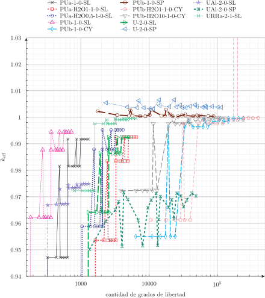

# Benchmarks de criticidad de Los Alamos {#sec-losalamos}

> **TL;DR:** Estos problemas proveen una manera de realizar una primera verificación del código con el método de soluciones exactas.

El proceso de verificación de un código numérico involucra justamente, verificar que las ecuaciones se estén resolviendo bien.^[Hay un juego de palabras en inglés que indica que verificación quiere decir ["are we solving the equations right?"]{lang=en-US} mientras que validación quiere decir ["are we solving the right equations?"]{lang=en-US}. En la @sec-mms-dif discutimos más en detalle este concepto.]
La forma estricta de realizarlo es comparar alguna medida del error cometido en la solución numérica con respecto a la solución exacta de la ecuación que estamos resolviendo y mostrar que éste tiende a cero con el orden teórico según el método numérico empleado @oberkampf.
En particular, la incógnita primaria de una ecuación en derivadas parciales discretizada con el método de elementos finitos debe ir a cero con un order superior en una unidad al orden de los elementos utilizados. Las incógnitas secundarias, con el mismo orden.
Es decir, los desplazamientos en elasticidad y las temperaturas en conducción de calor deben converger a cero como $h^3$ y las tensiones y los flujos de calor como $h^2$ si $h$ es el tamaño característico de los elementos de segundo orden utilizados para discretizar el dominio del problema.

Una de las dificultades de la verificación consiste en encontrar la solución de referencia con la cual calcular la medida del error numérico cometido. En la @sec-mms-dif proponemos una alternativa utilizando el método de soluciones fabricadas,^[Del inglés [_Method of Manufactured Solutions_]{lang=en-US}.] pero en esta sección tomamos algunos de los 75 casos resueltos en la referencia @losalamos que incluyen


 * problemas a uno, dos, tres y seis grupos de energía
 * scattering isotrópico y linealmente anisotrópico
 * geometrías
   - de medio infinito
   - de slab en 1D
   - de círculo en 2D
   - de esfera en 2D
 * dominios de uno o varios materiales

El informe provee

 a. el factor de multiplicación efectivo infinito $k_\infty$, o
 b. el tamaño crítico
 
de cada una de las 75 configuraciones de reactores en geometrías triviales para diferentes conjuntos de secciones eficaces macroscópicas uniformes a zonas. Cada una de ellas se identifica con una cadena que tiene la forma

\begin{center}
Material físil--Material reflector (espesor)---Grupos de energía--Orden de scattering--Geometría
\end{center}

Por ejemplo UD2O-H2O(10)-1-0-SL indica un reactor de uranio y D$_2$O con un reflector de H$_2$O de 10 caminos libres medios de espesor, un grupo de energías, scattering isotrópico en geometría tipo slab.


## Casos de medio infinito

Una forma de implementar un medio infinito en FeenoX es utilizar una geometría unidimensional tipo slab y poner condiciones de contorno de simetría en ambos extremos. Como el $k_\infty$ no depende ni de la cantidad de nodos espaciales ni de la cantidad de direcciones angulares, reportamos directamente la diferencia entre el $k_\text{eff}$ calculado por FeenoX con S$_2$ y el $k_\infty$ de la referencia:

Problema | Identificador                             | $k_\infty$               |  $k_\infty - k_\text{eff}$
:-------:|:------------------------------------------|:------------------------:|:------------------------:
 01      | PUa-1-0-IN                                |    2.612903              |   $+2.3 \times 10^{-7}$
 05      | PUb-1-0-IN                                |    2.290323              |   $+3.6 \times 10^{-7}$
 47      | U-2-0-IN                                  |    2.216349              |   $-4.6 \times 10^{-7}$
 50      | UAl-2-0-IN                                |    2.661745              |   $-4.2 \times 10^{-7}$
 70      | URRa-2-1-IN                               |    1.631452              |   $-2.5 \times 10^{-6}$
 74      | URR-3-0-IN                                |    1.60                  |   $+2.7 \times 10^{-15}$
 75      | URR6-6-0-IN                               |    1.60                  |   $+5.2 \times 10^{-14}$

: Factores de multiplicación de medio infinito con las cifras significativas reportadas en @losalamos y diferencia con respecto al $k_\text{eff}$ calculado con FeenoX con S$_2$. {#tbl-la-inf}
         
::: {.remark}
Está claro que la diferencia $k_\infty - k_\text{eff}$ es menor a la precisión del $k_\infty$ dado en la referencia y que los problemas 74 y 75 han sido "manufacturados" para que el factor infinito sea exactamente igual a 8/5.
:::

Para ilustrar cómo hemos obtenido la @tbl-la-inf mostramos a continuación el archivo de entrada del caso 74:

```{.feenox include="la-p74-URR-3-0-IN.fee"}
```

{#fig-xs3 width=85%}

Como las secciones eficaces son las mismas para varios problemas, cada material tiene un archivo separado que se incluye desde cada entrada principal. En este caso, a partir de los datos originales mostrados en la @fig-xs3, preparamos el archivo `URR.fee`:


```{.feenox include="URR.fee"}
```

::: {.remark}
La definición de los grupos en la referencia @losalamos es opuesta a la de la mayoría de la literatura: el grupo uno es el térmico y el de mayor energía es el de mayor índice $g$.
:::
 
## Casos de medio finito

La forma de "verificar" que FeenoX resuelve razonablemente bien problemas de transporte de neutrones con dependencia espacial es entonces
crear una malla con el tamaño indicado como crítico en cada problema y mostrar que el factor de multiplicación efectivo $k_\text{eff}$ obtenido se acerca a la unidad a medida que aumentamos el tamaño del problema discretizado, sea por refinar la malla espacial o por aumentar el número $N$ de ordenadas discretas. 

Para ello podemos crear un script de Bash que llame a cada uno de los archivos de entrada de cada problema, luego de haber creado mallas con diferente refinamiento, con valores de $N$ sucesivos:

```{.bash include="losalamos.sh"}
```

{#fig-losalamos}

La @fig-losalamos muestra, de forma poco rigurosa, que en general al aumentar el tamaño del problema resuelto por FeenoX, el factor de multiplicación efectivo se acerca a la unidad.
Esta no es una verificación según la definición industrial de ["code verification"]{lang=en-US} pero nos deja relativamente tranquilos de que nuestro solver hace las cosas razonablemente bien, incluso en casos con scattering anisotrópico y con más de dos grupos de energías.
