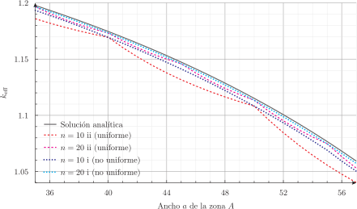
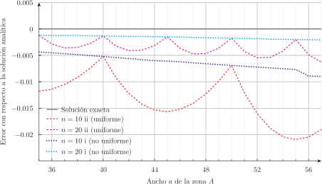

# Slab a dos zonas: efecto cúspide por dilución de XSs {#sec-slab}

> **TL;DR:** Este problema ilustra el error cometido al analizar casos multi-material con mallas estructuradas donde la interfaz no coincide con los nodos de la malla (y la flexibilidad de FeenoX para calcular y comparar soluciones analíticas con soluciones numéricas).

Richard Stallman dice en sus conferencias (incluso en castellano) "la mejor manera de resolver un problema es evitar tenerlo".
Como discutimos en la @sec-neutronica-phwr, los códigos neutrónicos de núcleo que usamos durante el completamiento de la Central Nuclear Atucha II solamente usaban mallas estructuradas. Además del inconveniente que esto supone para modelar barras de control invertidas, muy a menudo teníamos que lidiar con un efecto numérico denominado "cúspide por dilución de secciones eficaces". Este efecto aparece cuando la posición de una barra de control no coincide con la interfaz entre dos celdas de cálculo y hay que de alguna manera "diluir" las secciones eficaces de la barra absorbente entre las secciones eficaces del tubo guía vacío en forma proporcional a la posición geométrica de la barra en la celda de cálculo.

Es exactamente este efecto el que ilustramos en este ejemplo, pero en geometría tipo slab ya que dicho problema tiene solución analítica exacta (en difusión, que es lo que usaban los códigos en Atucha de cualquier manera).
Efectivamente, consideremos un reactor en geometría slab a dos zonas, como ilustramos en la @fig-two-zone-slab:

 a. La zona\ $A$ tiene\ $k_\infty < 1$ y ocupa el intervalo $0<x=a$, y
 b. La zona\ $B$ tiene\ $k_\infty > 1$ y ocupa el intervalo $a<x<b$.

{#fig-two-zone-slab width=50%}
 
Si 
 
 1. resolvemos el slab con un grupo de energías con aproximación de difusión,
 2. las dos zonas tienen secciones eficaces macroscópicas uniformes, y
 3. hacemos que el flujo escalar $\phi$ sea cero en ambos extremos $x=0$ y $x=b$,
 
entonces el factor efectivo de multiplicación $k_\text{eff}$ es tal que

$$
\begin{aligned}
\sqrt{D_A\cdot\left(\Sigma_{aA}- \frac{\nu\Sigma_{fA}}{k_\text{eff}}\right)} \cdot
 \tan\left[\sqrt{\frac{1}{D_B} \cdot\left( \frac{\nu\Sigma_{fB}}{k_\text{eff}}-\Sigma_{aB} \right) }\cdot (a-b) \right] \\
 - \sqrt{D_B\cdot\left(\frac{\nu\Sigma_{fB}}{k_\text{eff}}-\Sigma_{aB}\right)} \cdot
  \tanh\left[\sqrt{\frac{1}{D_A} \cdot\left( \Sigma_{aA}-\frac{\nu\Sigma_{fA}}{k_\text{eff}} \right)} \cdot b\right] = 0
\end{aligned}
$$ {#eq-two-zone}


::: {.remark}
Aunque no lo parezca, esta @eq-two-zone _es_ la solución analítica para $k_\text{eff}$.
Lo que hay que hacer para obtener su valor es resolver esta ecuación implícita, cosa que FeenoX puede hacer perfectamente como mostramos a continuación.
:::

::: {.remark}
Este problema no sólo tiene solución analítica para el factor $k_\text{eff}$ sino que también el flujo $\phi(x)$ tiene una expresión algebraica por trozos para $0 < x < a$ y para $a < x < b$.
De hecho una para $x<a$ y otra para $x>a$. Dicha solución no es relevante para este problema, pero por completitud dejamos comentadas las instrucciones de FeenoX para evaluarlo y escribirlo en un archivo de salida.
:::

Por otro lado, vamos a calcular $k_\text{eff}$ numéricamente de dos maneras diferentes, a saber:

  i. usando una malla no uniforme con $n$ elementos y $n+1$ nodos de forma tal que siempre haya un nodo _exactamente_ en la interfaz $x=a$ para cualquier valor arbitrario de $b$, y
  ii. con una malla uniforme con $n$ elementos de igual tamaño y $n+1$ nodos equi-espaciados para emular el comportamiento de los solvers que no pueden manejar el caso i. Si la interfaz coincide exactamente con uno de los nodos, entonces hay dos zonas bien definidas (@fig-dilucion2). Pero en general, esto no va a suceder (@fig-dilucion3). Entonces, al elemento que contiene la interfaz $x=a$ le asignamos un pseudo material $AB$ (@fig-dilucion4) cuyas secciones eficaces son un promedio pesado de las de $A$ y $B$ según la fracción geométrica que cada una de las zonas ocupa en el elemento. Es decir, si $b=100$ y $n=10$ entonces cada elemento tiene un ancho igual a 10. Si además $a=52$ entonces este material $AB$ tendrá un 20% del material $A$ y un 80% del material $B$.
  
::: {#fig-dilucion layout="[1,-0.05,1,-0.05,1]"}
{#fig-dilucion2}

{#fig-dilucion3}

{#fig-dilucion4}

Manejo de la interfaz en el caso ii de malla estructurada.
:::
 
Para ello, preparamos dos archivos de Gmsh. Primero `two-zone-slab-i.geo` para el caso no uniforme (que es más sencillo para Gmsh que el caso uniforme):

```{.geo include="two-zone-slab-i.geo"}
```

y luego el archivo `two-zone-slab-ii.geo`:

```{.geo include="two-zone-slab-ii.geo"}
```

Ambos necesitan un archivo `ab.geo` con la definición de las variables geométricas necesarias:

```geo
a = 55;
b = 100;
n = 10;
lc = b/n;
```

La @fig-two-zone-slab-msh muestra la diferencia entre los dos casos i (no uniforme) y ii (uniforme) para $n=10$.
Cuando $a=55$ (@fig-two-zone-slab-55), en la malla i hay cinco elementos en cada una de las dos zonas.
Los elementos de la zona $A$ son ligeramente más grandes que los de la zona $B$.
En la malla ii todos los elementos son iguales. Hay cinco elementos en la zona $A$, uno en la zona $AB$ y cuatro en la zona $B$.
Para $a=72$ (@fig-two-zone-slab-72), hay siete elementos a la izquierda de $x=a$ y tres a la derecha en el caso i.
En el caso ii, hay siete elementos en la zona $A$, uno en la zona $AB$ y dos en la zona $B$.

::: {#fig-two-zone-slab-msh layout="[1]"}
{#fig-two-zone-slab-55 width=100%}

{#fig-two-zone-slab-72 width=100%}

Mallas i (arriba, no uniforme con dos materiales) y ii (abajo, uniforme con tres materiales) para $n=10$.
:::

Ahora preparamos este archivo de entrada de FeenoX que es de los más complicados (pero a la vez de los más flexibles) que hemos visto hasta el momento:


```{.feenox include="two-zone-slab.fee"}
```

La ejecución necesita un argumento que puede ser `i` o `ii` según sea el punto que queremos resolver:


 i. malla no uniforme
 ii. malla uniforme
 
Cada uno de los dos puntos usa una malla diferente, que luego explicamos cómo generamos.
Luego incluimos el mismo archivo `ab.geo` con la información geométrica que ya incluyeron los archivos de entradas de Gmsh.
Como la sintaxis de asignación de variables es igual en Gmsh que en Feenox, podemos incluirlo directamente (el punto y coma al finalizar la línea es opcional en FeenoX).


A continuación definimos las secciones eficaces de los dos materiales asignando variables y finalmente calculamos las secciones eficaces del pseudo-material $AB$ utilizando las facilidades algebraicas que nos provee FeenoX.
Ponemos condiciones de contorno nulas, resolvemos el problema y tenemos en la variable especial `keff` el factor de multiplicación efectiva para una posición `a` de la interfaz en un slab de ancho `b` en el caso `i` (no uniforme) o `ii` (uniforme).

Lo que queremos ahora es comparar este `keff` numérico con el $k_\text{eff}$ analítico para cuantificar los errores producidos por los métodos `i` y `ii`.
Procedemos entonces a resolver (numéricamente) la @eq-two-zone con el funcional `root()` y almacenamos el resultado en la variable `k`, que luego podemos imprimir en la salida estándar y redireccionar a un archivo de texto para graficar estas diferencias.

::: {.remark}
Hemos necesitado resolver numéricamente la @eq-two-zone para obtener el $k_\text{eff}$, pero éste sigue siendo un valor analítico.
La búsqueda numérica de la raíz de la ecuación es un algoritmo que puede continuar hasta que el error cometido sea arbitrariamente pequeño, por lo que `k` es _analítico_ y `keff` _numérico_. 
:::
 
Nos falta un archivo más para completar el estudio, que es un script que haga el barrido de $a$ en un cierto intervalo, y llame a Gmsh y a FeenoX para los casos _i_ y _ii_:

```{.bash include="two-zone-slab.sh"}
```

Estamos entonces en condiciones de ejecutar este script para poder graficar los errores de ambos métodos:

::: {#fig-two-zone-slab-results layout="[100]"}
{#fig-two-zone-slab-keff}

{#fig-two-zone-slab-error}

Efecto "cúspide": comparación entre los $k_\text{eff}$ obtenidos en los puntos _i_ y _ii_ con respecto a la solución analítica.
:::


```terminal
$ ./two-zone-slab.sh 10
35      1.19332 1.19768 -0.00435617
35      1.18588 1.19768 -0.0117998
36      1.18882 1.19333 -0.0045144
[...]
56      1.0477  1.06819 -0.0204869
57      1.05031 1.05931 -0.00899971
57      1.04029 1.05931 -0.0190241
$ ./two-zone-slab.sh 20
35      1.19647 1.19768 -0.00120766
35      1.19647 1.19768 -0.00120766
36      1.19208 1.19333 -0.00125124
[...]
56      1.06328 1.06819 -0.00490434
57      1.05725 1.05931 -0.00206549
57      1.05303 1.05931 -0.00628299
$
```


La @fig-two-zone-slab-results ilustra cabalmente el punto de Richard Stallman: en lugar de lidiar con cómo corregir el efecto "cúspide" (por ejemplo modificando la posición de la barra de control artificialmente para reducirlo) es mucho más efectivo evitarlo en primer lugar.

