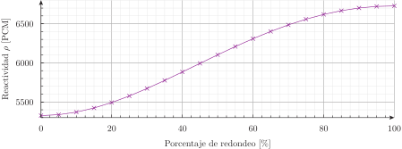

# Estudios paramétricos: el reactor cubo-esferoidal {#sec-cubesphere}

> **TL;DR:** Un "experimento pensado" para verificar que una esfera es más eficiente que un cubo. No es posible resolver una geometría con bordes curvos con una malla cartesiana estructurada, mientras que elementos curvos de segundo orden pueden discretizar superficies cónicas exactamente.

::: {#fig-cube-and-sphere layout="[1,-0.1,1]"}
{#fig-cubesphere-0 width=90%}

{#fig-cubesphere-100 width=90%}
 
Un octavo de dos reactores desnudos
:::

Todos sabemos que, a volumen constante, un reactor desnudo esférico tiene un factor de multiplicación efectivo mayor que un reactor cúbico (@fig-cube-and-sphere).
De hecho a un grupo de energía con aproximación de  difusión podemos calcular explícitamente dicho $k_\text{eff}$.


 
Pero, ¿qué pasa a medida que el cubo se va transformando en una esfera?
Es decir, ¿cómo cambia $k_\text{eff}$ a medida que redondeamos los bordes del cubo como en la @fig-cube-morph-sphere? Trabajo para Gmsh & FeenoX. Comencemos con el archivo de entrada de FeenoX, que es realmente sencillo:

::: {#fig-cube-morph-sphere layout="[1,-0.05,1,-0.05,1]"}
{#fig-cubesphere-25}

{#fig-cubesphere-50}

{#fig-cubesphere-75}
 
Transformación continua entre un cubo y una esfera
:::

```{.feenox include="cubesphere.fee"}
```

En efecto, la mayor complejidad está en generar la malla para una fracción $0 < f < 1$ de "esfericidad" (de forma que $f=0$ sea un cubo y $f=1$ sea una esfera) para un volumen $V$ constante.
Dado que hay cuestiones no triviales, como por ejemplo el hecho de que el kernel geométrico OpenCASCADE no permite hacer una operación tipo ["fillet"]{lang=en-US} de forma tal que se eliminen las caras planas originales (que es justamente lo que sucede para $f=1$) es mejor generar la malla usando la interfaz Python de Gmsh en lugar de un archivo de entrada:
 
```{.python include="cubesphere.py"}
```

Al ejecutar directamente este script de Python tenemos el $k_\text{eff}$ en función de $f$ (la última columna muestra el volumen de la malla para verificar que estamos manteniéndolo razonablemente constante para todos los valores de $f$) que graficamos en la @fig-cubesphere:

```terminal
$ python cubesphere.py | tee cubesphere.dat 
0       1.05626 5326.13 1e+06
5       1.05638 5337.54 999980
10      1.05675 5370.58 999980
15      1.05734 5423.19 999992
20      1.05812 5492.93 999995
25      1.05906 5576.95 999995
30      1.06013 5672.15 999996
35      1.06129 5775.31 999997
40      1.06251 5883.41 999998
45      1.06376 5993.39 999998
50      1.06499 6102.55 999998
55      1.06619 6208.37 999998
60      1.06733 6308.65 999998
65      1.06839 6401.41 999999
70      1.06935 6485.03 999998
75      1.07018 6557.96 999998
80      1.07088 6618.95 999998
85      1.07143 6666.98 999999
90      1.07183 6701.24 999999
95      1.07206 6721.33 999998
100     1.07213 6727.64 999999
$
```

{#fig-cubesphere}

