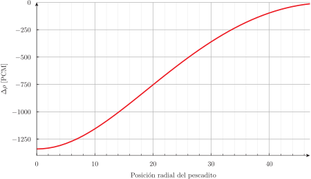

# Optimización: el problema de los pescaditos {#sec-pescaditos}

> **TL;DR:** Composición con una herramienta de optimización.

@enief2013-opt

::: {.remark}
Se podria usar simetria pero lo dejamos full para mostrar los tres pescaditos.
:::

## Un pescadito: teoría de perturbaciones lineales {#sec-un-pescadito}

```{.geo include="un-pescadito.geo"}
```

```{.feenox include="un-pescadito.fee"}
```

```{.bash include="un-pescadito.sh"}
```

```terminal
gtheler@chalmers:~/phd/thesis/060-resultados/080-pescaditos$ ./un-pescadito.sh 
0       -1347.45
5       -1298.54
10      -1163.78
15      -973.439
20      -760.964
25      -552.779
30      -367.19
35      -215.122
40      -103.214
45      -34.5701
gtheler@chalmers:~/phd/thesis/060-resultados/080-pescaditos$ 
```

{#fig-un-pescadito}

## Dos pescaditos: estudio paramétrico no lineal {#sec-dos-pescaditos}


## Tres pescadtos: optimización {#sec-tres-pescaditos}

```
jtheler@LIN54Z7SQ3:~/thesis/060-resultados/080-pescaditos$ ./tres.py 
 final_simplex: (array([[ 3.55380249, -1.15953827],
       [ 3.41708565, -1.71419764],
       [ 3.89513397, -1.83193016]]), array([1.29409226, 1.29409476, 1.294099  ]))
           fun: 1.29409226
       message: 'Optimization terminated successfully.'
          nfev: 37
           nit: 20
        status: 0
       success: True
             x: array([ 3.55380249, -1.15953827])
jtheler@LIN54Z7SQ3:~/thesis/060-resultados/080-pescaditos$ 
```


