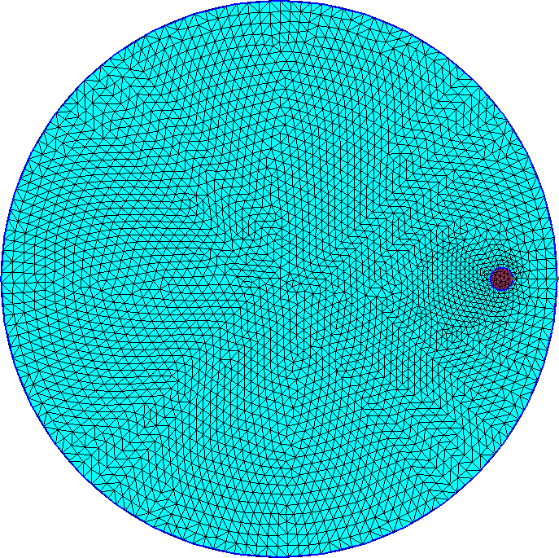
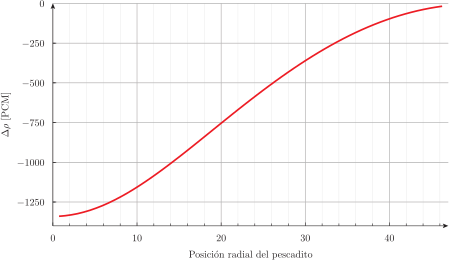
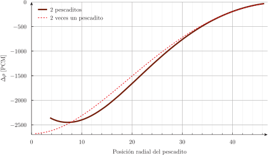

# Optimización: el problema de los pescaditos {#sec-pescaditos}

> **TL;DR:** Estudios paramétricos y de optimización al estilo Unix.

Este problema, inventado para escribir el artículo @enief2013-opt ilustra cómo generalizar las facilidades que provee FeenoX para realizar estudios paramétricos (tal como ya hemos hecho en casi todos los problemas anteriores) para dar un paso más allá y resolver un problema de optimización. Para eso comenzamos resolviendo numéricamente "el problema del pescadito^[Decidimos usar la palabra _pescadito_ en lugar de _pececito_ ya que es mucho más simpática. Además, es poco probable que un pez pueda sobrevivir nadando en un reactor líquido homogéneo de sales fundidas]", que es un clásico en la teoría de perturbaciones lineales.
Agregamos luego un segundo pescadito que nada en forma opuesta al primero donde mostramos cómo aparecen los dos efectos de apantallamiento y anti-apantallamiento según las posiciones relativas de ambos pescaditos.
Pasamos finalmente a dejar dos pescaditos fijos y resolver la pregunta: ¿dónde tenemos que poner un tercer pescadito para que la reactividad neta sea mínima?

::: {.remark}
En los dos primeros problemas podríamos explotar la simetría para reducir el tamaño del problema pero preferimos resolver la geometría completa para ilustrar mejor el problema. Ya hemos discutido la reducción del número total de grados de libertad en la @sec-2dpwr.
:::

## Un pescadito: teoría de perturbaciones lineales {#sec-un-pescadito}

Consideremos un reactor bi-dimensional circularde radio $A$ con centro en el origen del plano $x$-$y$ y con secciones eficaces macroscópicas homogéneas a un grupo de energías.
Supongamos que un pescadito circular absorbente de radio $a$ puede moverse a lo largo del eje $x$ positivo.
Un ejercicio clásico de análisis de reactores es dar la reactividad negativa introducida por el pescadito en función de la posición $x = r$ de su centro utilizando teoría de perturbaciones (es decir, suponiendo que $a \ll A$.

{#un-pescadito-geo width=60%}

En esta sección vamos a obtener con FeenoX la reactividad neta introducida por el pescadito variando paramétricamente la posición $x$ de su centro. Para eso, comenzamos con un script de Bash que genera un archivo de texto `vars.geo` (que es incluido desde `un-pescadito.geo` para ubicar el círculo pequeño correspondiente al pescadito), genera una malla con Gmsh y luego resuelve la ecuación de difusión con FeenoX para diferentes posiciones $r$ del pescadito. La @fig-un-pescadito-mesh muestra la malla resultante para dos valores de $r$.

::: {#fig-un-pescadito-mesh layout="[45,-10,45]"}
{#fig-un-pescadito-20}

{#fig-un-pescadito-40}
 
Mallas para un pescadito de radio $a=2$ nadando dos posiciones $x=r$, $y=0$ en un reactor de radio $A=50$.
:::


```{.bash include="un-pescadito.sh"}
```

::: {.remark}
Notar que a diferencia de los estudios paramétricos realizados hasta el momento que involucraban una serie creciente de valores, en este caso el bucle `for` de Bash se realiza sobre la salida del archivo de FeenoX `steps.fee` 

```{.feenox include="steps.fee"}
```
que genera una sucesión (determinística) de números cuasi-aleatorios que, eventualmente, llena densamente un hipercubo @sobol.
En los lazos paramétricos crecientes, si se desea aumentar la densidad del barrio hay que volver a calcular todo el intervalo nuevamente.
En una serie de números cuasi-aleatorios, es posible agregar nuevos puntos a los ya calculados dando un _offset_ inicial.
Por ejemplo, podemos barrer el intervalo $[0,1]$ con tres puntos con el archivo `steps.fee` como

```terminal
$ feenox steps.fee 0 1 3
0.5
0.75
0.25
$
```

Si luego del estudio quisiéramos agregar cuatro puntos más, comenzamos con el offset 3 para obtener 

```
$ feenox steps.fee 0 1 4 3
0.375
0.875
0.625
0.125
$ 
```
:::

El archivo de entrada de Gmsh genera dos círculos y asigna etiquetas para materiales y condiciones de contorno:

```{.geo include="un-pescadito.geo"}
```

El archivo de entrada de FeenoX es muy sencillo:

```{.feenox include="un-pescadito.fee"}
```

La única "complejidad" aparece al calcular el incremento negativo de reactividad con respecto al $k_\text{eff}$ analítico del círculo original. Para ello ponemos una condición de contorno de flujo nulo en la circunferencia dentro del archivo incluido `xs.fee`:

```{.feenox include="xs.fee"}
```

::: {.remark}
La constante 2.4048 que aparece en el archivo de entrada de FeenoX es una aproximación del primer cero de la función $J_0(\xi)$ de Bessel.
:::

Al ejecutar el script obtenemos la curva que mostramos en la @fig-un-pescadito: mientras más alejado del centro nade el pescadito, menor es la reactividad neta introducida.

```terminal
$ cat un-pescadito.csv 
0       -1340.47
1       -1338.43
[...]
46      -19.7905
47      -13.1464
$
```

{#fig-un-pescadito}

::: {.remark}
Se deja como ejercicio calcular la misma curva con teoría de perturbaciones.
:::

## Dos pescaditos: estudio paramétrico no lineal {#sec-dos-pescaditos}

{#fig-dos-pescaditos-geo width=60%}

Agregemos ahora otro pescadito nadando en forma diametralmente opuesta al primero (@fig-dos-pescaditos-geo).
El script de Bash, el archivo de entrada de Gmsh y el de FeenoX son muy similares a los de la sección anterior por lo que no los mostramos.
Ahora al graficar la curva de reactividad en función de $r$ y compararla con el doble de la reactividad introducida por un único pescadito calculada en la sección anterior (@fig-dos-pescaditos) vemos los dos efectos explicados en el capítulo 14 de la referencia clásica @lamarsh (@fig-lamarsh-14-5).
Si los pescaditos están lejos entre sí sus reactividades negativas son más efectivas porque se anti-apantallan. Pero al acercarse, se apantallan y la reactividad neta es menor que por separado.


::: {#fig-shadowing layout="[90]"}
{#fig-dos-pescaditos}

{#fig-lamarsh-14-5 width=75%}
 
Efecto de apantallamiento y anti-apantallamiento
:::


## Tres pescadtos: optimización {#sec-tres-pescaditos}

Supongamos ahora que agregamos un tercer pescadito. Por alguna razón, los primeros dos pescaditos están fijos en dos posiciones arbitrarias $[x_1,y_1]$ y $[x_2,y_2]$. Tenemos que poner el tercer pescadito en una posición $[x_3,y_3]$ de forma tal de hacer que la reactividad total sea lo menor posible.^[Reemplazar "pescadito" por "lanza de inyección de boro de emergencia" para pasar de un problema puramente académico a un problema de interés en ingeniería nuclear.]

Una forma de resolver este problema con FeenoX es proceder de la misma manera que en las secciones anteriores pero en lugar de variar la posición del tercer pescadito en forma paramétrica según una receta determinística ya conocida de antemano, utilizar un algoritmo de optimización que decida la nueva posición del tercer pescadito en función de la historia de posiciones y los valores de reactividad calculados por FeenoX en cada paso.

En particular, podemos usar la biblioteca de Python SciPy que provee acceso a algoritmos de optimización y permite con muy pocas líneas de Python implementar el bucle de optimización:

```{.python include="tres.py"}
```

La función `keff()` a optimizar es función de la posición $\vec{x}_3$ del tercer pescadito, cuyas dos componentes son pasadas como argumento al script de Bash que llama primero a Gmsh y luego a FeenoX para devolver el $k_\text{eff}(\vec{x}_3)$ para $\vec{x}_1$ y $\vec{x}_2$ fijos:

```{.bash include="tres.sh"}
```

```{.geo include="tres-pescaditos.geo"}
```

```{.feenox include="tres-pescaditos.fee"}
```

::: {.remark}
Si FeenoX, tal como Gmsh, tuviese una interfaz Python (tarea que está planificada e incluso tenida en cuenta en la base de diseño de FeenoX) entonces la función `keff(x3)` a minimizar sería más elegante que la propuesta, que involucra hacer un `fork()+exec()` para invocar a un script de Bash que hace otros dos `fork()+exec()` para ejecutar `gmsh` y `feenox`.
:::

La ejecución del script de optimización muestra la reacitvidad mínima en `fun` y la posición óptima del tercer pescadito en `x`:

```
$ ./tres.py 
 final_simplex: (array([[ 3.55380249, -1.15953827],
       [ 3.41708565, -1.71419764],
       [ 3.89513397, -1.83193016]]), array([1.29409226, 1.29409476, 1.294099  ]))
           fun: 1.29409226
       message: 'Optimization terminated successfully.'
          nfev: 37
           nit: 20
        status: 0
       success: True
             x: array([ 3.55380249, -1.15953827])
$ 
```

{#fig-tres-pescaditos}


::: {#fig-tres3d layout="[50,50]"}
{#fig-tres3d-1}

{#fig-tres3d-2}
 
Factor de multiplicación $k_\text{eff}$ en función de la posición $\vec{x}_3$ para los pasos intermedios.
:::
