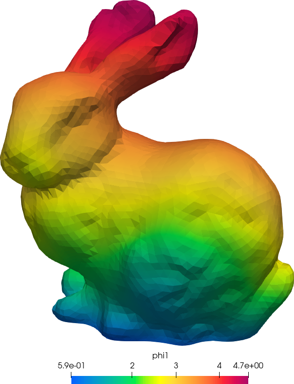
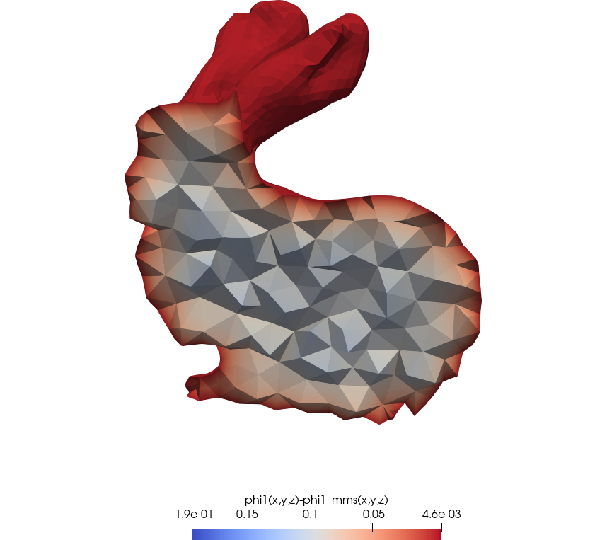

# Verificación con el método de soluciones fabricadas {#sec-mms-dif}

> **TL;DR:** Para verificar los métodos numéricos con el método de soluciones fabricadas se necesita un solver que permita definir propiedades materiales en función del espacio a través de expresiones algebraicas.


Como mencionamos brevemente en la @sec-los-alamos, la verificación de códigos de cálculo involucra mostrar que dicho código resuelve correctamente las ecuaciones que debe resolver.
La forma de hacerlo es calcular alguna medida del error cometidoor el método numérico implementado en el código, por ejemplo el error $L_2$

$$
e_2 = \sqrt{ \frac{\int \left[ \phi_\text{num}(\vec{x}) - \phi_\text{ref}(\vec{x}) \right]^2 \, d^D \vec{x}}{\int d^D \vec{x}}} 
$$ {#eq-mms-e2}

y mostrar que dicho error tiende a cero cuando el problema del problema discretizado tiene a infinito.
Según la referencia @roache,

::: {lang=en-US}
> “The code author defines precisely what continuum partial differential equations and continuum boundary conditions are being solved, and convincingly demonstrates that they are solved correctly, i.e., usually with some order of accuracy, and always consistently, so that as some measure of discretization (e.g. the mesh increments), the code produces a solution to the continuum equations; this is Verification.”
:::

Más aún, según la referencia @sandia dice

::: {lang=en-US}
> ... we recommend that, when possible, one should demonstrate that the equations are solved to the theoretical order-of-accuracy of the discretization method.
:::

Esto quiere decir, que la forma de tender a cero debe coincidir con el orden predicho por la teoría.
Para difusión de neutrones con elementos finitos, este orden es 2 para elementos de primer orden y 3 para elementos de segundo orden.
La forma de hacer esto es 

 1. Resolver el problema para un cierto tamaño característico $h$ de malla
 2. Calcular el error $e_2$ (o alguna otra medida del error) en función de $h$
 3. Verificar que la pendiente de $e_2$ vs. $h$ en un gráfico log-log es la predicha por la teoría

De todas maneras, para mostrar que el error tiende a cero, necesitamos tener una expresión algebraica para la solución exacta de la ecuación que queremos resolver. Es decir, necesitamos conocer $\phi_\text{ref}(\vec{x})$ en la @eq-mms-e2.
Está claro que si conociéramos esta expresión para un caso general, esta tesis no tendría razón de ser.
Y es razonable que esto sea así porque, de alguna manera, resolver la ecuación de difusión de neutrones involucra "integrar" dos veces la fuente de neutrones. 

El método de soluciones fabricadas (o MMS por sus siglas en inglés) propone recorrer el camino inverso: partir de una solución conocida (es decir, fabricada _ad hoc_) y preguntarnos cuál es la fuente necesaria para dar lugar a ese flujo. Este camino es mucho más sencillo ya que involucra "derivar" la fuente dos veces, y es el método que ilustramos en esta sección.

Por otro lado, @sandia también dice que hay que asegurarse "probar" todas las características del software, incluyendo

 * condiciones de contorno
 * tipos de elementos
 * solvers algebraicos
 * modelos de materials
 * etc.
 
lo que rápidamente da lugar a una explosión combinatoria de parámetros.
Siguen diciendo los autores de @sandia 
 
::: {lang=en-US}
> To ensure that all code options relevant to code Verification are tested, one must design a suite of coverage tests. Fortunately, this is not as daunting as it may seem at first. If a code has options, the number of coverage tests needed to verify the code is determined by the number of mutually exclusive options, i.e., there is no combinatorial explosion of tests to run. For example, suppose a code has two solver options and three constitutive relationship (CR) options. Then only three coverage tests are needed to check all options. Test\ (1): Solver\ 1 with CR1, Test\ (2): Solver\ 2 with CR2,Test (3): Solver\ 1 or\ 2 with CR3. One does not need to perform a test involving the combination, for example, Solver\ 1 and CR2 because Test\ 1 will ascertain whether of not Solver\ 1 is working correctly, while Test\ 2 will ascertain whether or not CR2 is working correctly. 
:::

En mi experiencia personal, la explosión combinatoria _sí_ existe.
La aplicación de este método al problema de conducción de calor es objeto de estudio de un informe técnico @mms-onscale y una presentación a un congreso @mms-techcon.
En las dos secciones que siguen lo aplicamos al problema de difusión de neutrones, primero a un grupo con secciones eficaces uniformes en tres dimensiones para introducir la idea. Luego en la @sec-mms-2d a dos grupos con secciones eficaces dependientes del espacio en dos dimensiones.

::: {.remark}
Para verificar un código con el método de MMS es condición necesaria que el código permita definir fuentes a través de expresiones algebraicas.
Es también recomendable que permita realizar estudios paramétricos con cierta facilidad y automatización razonable.
:::

## Stanford bunny a un grupo {#sec-mms-3d}

Consideremos un reactor con la forma del conejo de Stanford (@fig-bunny-orig) con secciones eficaces adimensionales uniformes $D=1$ y $\Sigma_a=0.05$.
La ecuación de difusión es entonces

{#fig-bunny-orig width=50%}

$$
-\text{div} \left[ D \cdot \text{grad} \phi \right] + \Sigma_a = S(x,y,z)
$$ {#eq-mms-dif}

Propongamos una solución fabricada para el flujo escalar, digamos

$$
\phi(x,y,z) = \log\left[ 1 + 10^{-2} \cdot z \cdot (y+50)\right] + 10 \cdot ( x + \sqrt{y+50})
$$ {#eq-mms-phi}

La fuente que necesitamos proviene de reemplazar la @eq-mms-phi en la @eq-mms-dif.
Siguiendo las reglas de generación y de composición de Unix lo que hacemos es usar Maxima para que haga las cuentas por nosotros.
En efecto, consideremos el siguiente archivo de entrada:


```{.feenox include="3d/neutron-bunny.fee"}
```

De hecho, dado que la sintaxis del parser algebraico de Maxima es (casi) la misma que la de FeenoX, podemos tomar la cadena con la solución fabricada del archivo de entrada de FeenoX, calcular la fuente con Maxima y generar un archivo válido de FeenoX que podemos incluir desde el archivo de entrada principal:

```bash
# primero leemos el flujo y las XSs del input de FeenoX
phi1_mms=$(grep "phi1_mms(x,y,z) =" neutron-bunny.fee | sed 's/=/:=/')
D1=$(grep "D1(x,y,z) =" neutron-bunny.fee | sed 's/=/:=/')
Sigma_a1=$(grep "Sigma_a1(x,y,z) =" neutron-bunny.fee | sed 's/=/:=/')

# y después le pedimos a maxima que haga las cuentas por nosotros
maxima --very-quiet << EOF > /dev/null
${phi1_mms};
${D1};
${Sigma_a1};
s1(x,y,z) := -(diff(D1(x,y,z) * diff(phi1_mms(x,y,z), x), x) + diff(D1(x,y,z) * diff(phi1_mms(x,y,z), y), y) + diff(D1(x,y,z) * diff(phi1_mms(x,y,z), z), z)) + Sigma_a1(x,y,z)*phi1_mms(x,y,z);
stringout("neutron-bunny-s1.txt", s1(x,y,z));
tex(s1(x,y,z), "neutron-bunny-s1.tex");
EOF
```

No sólo le pedimos a Maxima que nos genere el archivo de entrada de FeenoX sino que también le pedimos que nos dé los macros TeX para documentar la fuente en esta tesis:

$$
\begin{aligned}
S(x,y,z) =& 
0.05\,\left(\log \left(0.01\,\left(y+50\right)\,z+1\right)
+ 0.001\, \left(\sqrt{y+50}+ 
 x\right)\right)\\
& +{{1.0 \times 10^{-4}\,z^2}\over{
 \left(0.01\,\left(y+50\right)\,z+1\right)^2}}
+{{1.0 \times 10^{-4}\,
 \left(y+50\right)^2}\over{\left(0.01\,\left(y+50\right)\,z+1\right)^
 2}}
+{{2.5 \times 10^{-4}}\over{\left(y+50\right)^{{{3}\over{2}}}}}
\end{aligned}
$$

Lo siguiente es completar el script de Bash para generar las mallas apropiadas y graficar los resultados automáticamente.

::: {.remark}
Aún para mallas relativamente gruesas @fig-bunny-14, la diferencia entre el flujo numérico y la solución manufacturada es muy pequeña para ser observada a simple vista. Es necesario calcular la integral de los errores y ajustar el orden de convergencia para realmente verificar el código.
:::


::: {#fig-bunny-14 layout="[50,50]"}
{#fig-bunny-14-1}

{#fig-bunny-14-2}

Flujo y error en el conejo de Stanford para $c=14$
:::


## Cuadrado a dos grupos {#sec-mms-2d}


ver thermal-slab-transient-mms-capacity-of-T.fee  thermal-slab-transient-mms.fee
