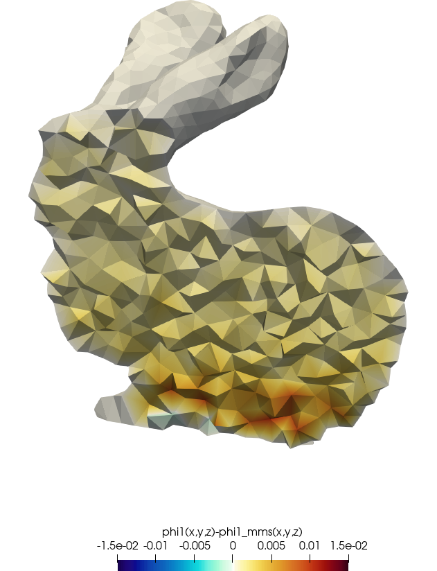

# Verificación con el método de soluciones fabricadas {#sec-mms-dif}

> **TL;DR:** Para verificar los métodos numéricos con el método de soluciones fabricadas se necesita un solver que permita definir propiedades materiales en función del espacio a través de expresiones algebraicas.


Como mencionamos brevemente en la @sec-losalamos, la verificación de códigos de cálculo involucra mostrar que dicho código resuelve correctamente las ecuaciones que debe resolver.
La forma de hacerlo es calcular alguna medida del error cometido por el método numérico implementado en el código, por ejemplo el error $L_2$

$$
e_2 =  \frac{\displaystyle \sqrt{ \int \Big[ \phi_\text{num}(\vec{x}) - \phi_\text{ref}(\vec{x}) \Big]^2 \, d^D \vec{x}]}}{\displaystyle \int d^D \vec{x}}
$$ {#eq-mms-e2}

y mostrar que dicho error tiende a cero cuando el tamaño del problema discretizado tiene a infinito.
Según la referencia @roache,

::: {lang=en-US}
> “The code author defines precisely what continuum partial differential equations and continuum boundary conditions are being solved, and convincingly demonstrates that they are solved correctly, i.e., usually with some order of accuracy, and always consistently, so that as some measure of discretization (e.g. the mesh increments), the code produces a solution to the continuum equations; this is Verification.”
:::

Más aún, según la referencia @sandia-mms dice

::: {lang=en-US}
> ... we recommend that, when possible, one should demonstrate that the equations are solved to the theoretical order-of-accuracy of the discretization method.
:::

Esto quiere decir que la forma de tender a cero debe coincidir con el orden predicho por la teoría.
Para difusión de neutrones con elementos finitos, este orden es 2 para elementos de primer orden y 3 para elementos de segundo orden.
La forma de hacer esto es 

 1. Resolver el problema para un cierto tamaño característico $h$ de malla.
 2. Calcular el error $e_2$ (o alguna otra medida del error) en función de $h$.
 3. Verificar que la pendiente de $e_2$ vs. $h$ en un gráfico log-log es la predicha por la teoría.

De todas maneras, para mostrar que el error tiende a cero necesitamos tener una expresión algebraica para la solución exacta de la ecuación que queremos resolver. Es decir, necesitamos conocer $\phi_\text{ref}(\vec{x})$ en la @eq-mms-e2.
Está claro que si conociéramos esta expresión para un caso general, esta tesis no tendría razón de ser.
Y es razonable que esto sea así porque, de alguna manera, resolver la ecuación de difusión de neutrones involucra "integrar" dos veces la fuente de neutrones. 

El método de soluciones fabricadas (o MMS por sus siglas en inglés) propone recorrer el camino inverso: partir de una solución conocida (es decir, fabricada _ad hoc_) y preguntarnos cuál es la fuente necesaria para dar lugar a ese flujo. Este camino es mucho más sencillo ya que involucra "derivar" la fuente dos veces, y es el método que ilustramos en esta sección.

Por otro lado, @sandia-mms también dice que hay que asegurarse "probar" todas las características del software, incluyendo

 * condiciones de contorno
 * tipos de elementos
 * solvers algebraicos
 * modelos de materiales
 * etc.
 
lo que rápidamente da lugar a una explosión combinatoria de parámetros.
Siguen diciendo los autores de @sandia-mms 
 
::: {lang=en-US}
> To ensure that all code options relevant to code Verification are tested, one must design a suite of coverage tests. Fortunately, this is not as daunting as it may seem at first. If a code has options, the number of coverage tests needed to verify the code is determined by the number of mutually exclusive options, i.e., there is no combinatorial explosion of tests to run. For example, suppose a code has two solver options and three constitutive relationship (CR) options. Then only three coverage tests are needed to check all options. Test\ (1): Solver\ 1 with CR1, Test\ (2): Solver\ 2 with CR2,Test (3): Solver\ 1 or\ 2 with CR3. One does not need to perform a test involving the combination, for example, Solver\ 1 and CR2 because Test\ 1 will ascertain whether of not Solver\ 1 is working correctly, while Test\ 2 will ascertain whether or not CR2 is working correctly. 
:::

En mi experiencia personal, la explosión combinatoria _sí_ existe.
La aplicación de este método al problema de conducción de calor es objeto de estudio de un informe técnico @mms-onscale y una presentación a un congreso @mms-techcon.
En las dos secciones que siguen lo aplicamos al problema de difusión de neutrones, primero a un grupo con secciones eficaces uniformes en tres dimensiones para introducir la idea. Luego en la @sec-mms-2d a dos grupos con secciones eficaces dependientes del espacio en dos dimensiones.

::: {.remark}
Para verificar un código con el método de MMS es condición necesaria que el código permita definir fuentes a través de expresiones algebraicas.
Es también recomendable que permita realizar estudios paramétricos con cierta facilidad y automatización razonable.
:::

## Stanford bunny a un grupo {#sec-mms-3d}

Consideremos un reactor con la forma del conejo de Stanford (@fig-bunny-orig) con secciones eficaces adimensionales uniformes $D=1$ y $\Sigma_a=0.05$.
La ecuación de difusión es entonces

{#fig-bunny-orig width=50%}

$$
-\text{div} \left[ D \cdot \text{grad}(\phi) \right] + \Sigma_a \cdot \phi(x,y,z) = S(x,y,z)
$$ {#eq-mms-dif}

Propongamos una solución fabricada para el flujo escalar, digamos

$$
\phi(x,y,z) = \log\left[ 1 + 10^{-2} \cdot z \cdot (y+50)\right] + 10 \cdot ( x + \sqrt{y+50})
$$ {#eq-mms-phi}

La fuente que necesitamos proviene de reemplazar la @eq-mms-phi en la @eq-mms-dif.
Siguiendo las reglas de generación y de composición de Unix lo que hacemos es usar Maxima, que es un sistema para la manipulación simbólica y numérica de expresiones libre, abierto y ameno a la filosofía Unix, para que haga las cuentas por nosotros.
En efecto, consideremos el siguiente archivo de entrada:


```{.feenox include="3d/neutron-bunny.fee"}
```

De hecho, dado que la sintaxis del parser algebraico de Maxima es (casi) la misma que la de FeenoX, podemos tomar la cadena con la solución fabricada del archivo de entrada de FeenoX, calcular la fuente con Maxima y generar un archivo válido de FeenoX que podemos incluir desde el archivo de entrada principal:

```bash
# primero leemos el flujo y las XSs del input de FeenoX
phi1_mms=$(grep "phi1_mms(x,y,z) =" neutron-bunny.fee | sed 's/=/:=/')
D1=$(grep "D1(x,y,z) =" neutron-bunny.fee | sed 's/=/:=/')
Sigma_a1=$(grep "Sigma_a1(x,y,z) =" neutron-bunny.fee | sed 's/=/:=/')

# y después le pedimos a maxima que haga las cuentas por nosotros
maxima --very-quiet << EOF > /dev/null
${phi1_mms};
${D1};
${Sigma_a1};
s1(x,y,z) := -(diff(D1(x,y,z) * diff(phi1_mms(x,y,z), x), x) + diff(D1(x,y,z) * diff(phi1_mms(x,y,z), y), y) + diff(D1(x,y,z) * diff(phi1_mms(x,y,z), z), z)) + Sigma_a1(x,y,z)*phi1_mms(x,y,z);
stringout("neutron-bunny-s1.txt", s1(x,y,z));
tex(s1(x,y,z), "neutron-bunny-s1.tex");
EOF
```

No sólo le pedimos a Maxima que nos genere el archivo de entrada de FeenoX sino que también le pedimos que nos dé los macros TeX @texbook para documentar la fuente en esta tesis:

$$
\begin{aligned}
S(x,y,z) =& 
0.05\,\left(\log \left(0.01\,\left(y+50\right)\,z+1\right)
+ 0.001\, \left(\sqrt{y+50}+ 
 x\right)\right)\\
& +{{1.0 \times 10^{-4}\,z^2}\over{
 \left(0.01\,\left(y+50\right)\,z+1\right)^2}}
+{{1.0 \times 10^{-4}\,
 \left(y+50\right)^2}\over{\left(0.01\,\left(y+50\right)\,z+1\right)^
 2}}
+{{2.5 \times 10^{-4}}\over{\left(y+50\right)^{{{3}\over{2}}}}}
\end{aligned}
$$

Lo siguiente es completar el script de Bash para generar las mallas apropiadas y graficar los resultados automáticamente.

```terminal
$ ./run.sh 
# manufactured solution (input)
phi1_mms(x,y,z) := log(1+1e-2*z*(y+50)) + 1e-3*(x+sqrt(y+50));
D1(x,y,z) := 1;
Sigma_a1(x,y,z) := 0.05;

# source term (output)
S1(x,y,z) = 0.05*(log(0.01*(y+50)*z+1)+0.001*(sqrt(y+50)+x))+(1.0E-4*z^2)/(0.01*(y+50)*z+1)^2+(1.0E-4*(y+50)^2)/(0.01*(y+50)*z+1)^2+2.5E-4/(y+50)^(3/2)
neutron_bunny_tet4
--------------------------------------------------------
0.882892        -2.913390       -11.628276      20      19682   4707    83.33   1.81
0.713751        -3.078327       -11.919410      24      32742   7373    92.86   2.49
0.566854        -3.515901       -12.236276      28      50921   10955   108.16  2.81
0.324435        -2.603344       -12.683721      36      105483  21355   146.90  5.16
0.224405        -3.864497       -12.850835      40      142438  28201   172.97  6.03
0.131075        -2.897239       -13.077100      44      188504  36661   204.51  7.86
0.045617        -2.848969       -13.264638      48      243633  46614   248.88  10.02
-0.068898       -3.793360       -13.505172      54      343580  64510   320.61  14.57
-0.172894       -3.198078       -13.685647      60      469441  86726   402.82  21.13
-0.236015       -3.197992       -13.823714      64      567349  103924  472.32  25.57
neutron_bunny_tet10
--------------------------------------------------------
1.089532        -4.742025       -13.429947      16      10558   17898   100.68  1.16
0.882892        -3.691744       -14.159585      20      19682   31819   132.57  1.80
0.713751        -5.421880       -14.599096      24      32742   51285   169.52  3.20
0.566854        -5.350408       -15.058052      28      50921   77891   223.38  3.79
0.439039        -6.402456       -15.381134      32      74757   112362  304.81  4.98
0.324435        -4.280207       -15.699625      36      105483  156399  393.84  7.43
0.224405        -5.660364       -15.980139      40      142438  208860  509.98  10.78
0.131075        -3.946231       -16.107267      44      188504  273940  646.90  13.82
0.045617        -3.738939       -16.333378      48      243633  351128  807.37  18.35
$ pyxplot neutron-bunny.ppl
$
```

::: {.remark}
Aún para mallas relativamente gruesas como la de la @fig-bunny-14, la diferencia entre el flujo numérico y la solución manufacturada es muy pequeña para ser observada a simple vista. Es necesario calcular la integral de los errores y ajustar el orden de convergencia para realmente verificar el código.
:::


::: {#fig-bunny-14 layout="[50,50]"}
{#fig-bunny-20-1}

{#fig-bunny-20-2}

{#fig-bunny-100-1}

{#fig-bunny-100-2}

Flujo y error en el conejo de Stanford para diferentes refinamientos (tet4)
:::


{#fig-neutron-bunny-e2}

::: {.remark]
La @fig-neutron-bunny-e2 ilustra por qué el tamaño del elemento $h$ no es una buena medida de la precisión de una discretización: obviamente, para un mismo tamaño de celda, la precisión obtenida por los elementos de mayor orden es, justamente, mucho mayor. Es por eso que es más apropiado hablar de la cantidad total de incógnitas, de grados de libertad o tamaño del problema.
:::


## Cuadrado a dos grupos {#sec-mms-2d}

Simplifiquemos un poco la geometría para poder introducir complejidades en la matemática.
Tomemos como geometría el cuadrado $[0:1] \times [0:1]$, pero estudiemos el problema a dos grupos con el siguiente juego de secciones eficaces:

```feenox
phi1_mms(x,y) = 1 + sin(2*x)^2 * cos(3*y)^2
D1(x,y) = 1 + 0.1*(x - 0.5*y)
Sigma_a1(x,y) = 1e-3*(1 + log(1+x) - 0.5*y^3)
Sigma_s1_2(x,y) = 1e-3*(1 - x + sqrt(0.5*y))

phi2_mms(x,y) = (1-0.5*tanh(-y))*log(1+x)
D2(x,y) = 1
Sigma_a2(x,y) = 1e-3
Sigma_s2_1(x,y) = 0
```

Como ahora la geometría es más sencilla, además de fijar solamente condiciones de Dirichlet en los cuadro lados del cuadrado vamos a poner dos condiciones de Dirichlet y dos de Neumann.
Necesitamos entonces, además de las dos fuentes volumétricas $S1(x,y)$ y $S2(x,y)$, que Maxima nos calcule las dos componentes de las dos corrientes para que las podamos usar como condiciones de contorno:

```bash
phi1_mms=$(grep "phi1_mms(x,y) =" neutron-square.fee | sed 's/=/:=/')
phi2_mms=$(grep "phi2_mms(x,y) =" neutron-square.fee | sed 's/=/:=/')

D1=$(grep "D1(x,y) =" neutron-square.fee | sed 's/=/:=/')
Sigma_a1=$(grep "Sigma_a1(x,y) =" neutron-square.fee | sed 's/=/:=/')
Sigma_s1_2=$(grep "Sigma_s1_2(x,y) =" neutron-square.fee | sed 's/=/:=/')

D2=$(grep "D2(x,y) =" neutron-square.fee | sed 's/=/:=/')
Sigma_a2=$(grep "Sigma_a2(x,y) =" neutron-square.fee | sed 's/=/:=/')
Sigma_s2_1=$(grep "Sigma_s2_1(x,y) =" neutron-square.fee | sed 's/=/:=/')

maxima --very-quiet << EOF > /dev/null
${phi1_mms};
${phi2_mms};
${D1};
${Sigma_a1};
${Sigma_s1_2};
${D2};
${Sigma_a2};
${Sigma_s2_1};
s1(x,y) := -(diff(D1(x,y) * diff(phi1_mms(x,y), x), x) + diff(D1(x,y) * diff(phi1_mms(x,y), y), y)) + Sigma_a1(x,y)*phi1_mms(x,y) - Sigma_s2_1(x,y)*phi2_mms(x,y);
s2(x,y) := -(diff(D2(x,y) * diff(phi2_mms(x,y), x), x) + diff(D2(x,y) * diff(phi2_mms(x,y), y), y)) + Sigma_a2(x,y)*phi2_mms(x,y) - Sigma_s1_2(x,y)*phi1_mms(x,y);
stringout("neutron-square-s1.txt", s1(x,y));
stringout("neutron-square-s2.txt", s2(x,y));
stringout("neutron-square-j1x.txt", -D1(x,y) * diff(phi1_mms(x,y),x));
stringout("neutron-square-j1y.txt", -D1(x,y) * diff(phi1_mms(x,y),y));
stringout("neutron-square-j2x.txt", -D2(x,y) * diff(phi2_mms(x,y),x));
stringout("neutron-square-j2y.txt", -D2(x,y) * diff(phi2_mms(x,y),y));
EOF
```
 
El archivo de entrada de FeenoX continúa de la siguiente manera

```feenox
READ_MESH square-$2-$3-$4.msh DIMENSIONS 2
PROBLEM neutron_diffusion GROUPS 2

DEFAULT_ARGUMENT_VALUE 1 dirichlet # BCs = dirichlet/neumann
DEFAULT_ARGUMENT_VALUE 2 tri3      # shape = tri3/tri6/quad4/quad8/quad9
DEFAULT_ARGUMENT_VALUE 3 struct    # algorithm = struct/frontal/delaunay
DEFAULT_ARGUMENT_VALUE 4 8         # refinement factor = 1/2/3/4...
DEFAULT_ARGUMENT_VALUE 5 0         # write vtk? = 0/1

# read the results of the symbolic derivatives
INCLUDE neutron-square-s.fee

# set the BCs (depending on $1)
INCLUDE neutron-square-bc-$1.fee

SOLVE_PROBLEM   # this line should be self-explanatory 
```
para terminar calculando el error $e_2$ (y el error $e_\infty$ que ni siquiera discutimos por falta de espacio-tiempo) en forma similar al caso del conejo.

Los dos archivos con condiciones de contorno son el ya conocido 100% Dirichlet:

```{.feenox include="2d/neutron-square-bc-dirichlet.fee"}
```
y el nuevo caso 50% Dirichlet 50% Neumann, donde en los lados `bottom` y `right` ponemos el producto interno de la corriente $\vec{J}_g(\vec{x})$ con la normal exterior $\hat{\vec{n}}(\vec{x})$:
 
```{.feenox include="2d/neutron-square-bc-neumann.fee"}
```

Como ahora nuestra geometría es más sencilla podemos utilizar algoritmos de mallado estructurados.
Incluso podemos estudiar qué sucede si usamos triángulos y cuadrángulos, de primer y segundo orden y completos (quad8) o incompletos (quad9), como someramente ilustramos en la @fig-square-14. Con los dos tipos de condiciones de contorno, que podrían ser muchas más combinaciones de porcentajes de Dirichlet y Neumann. ¡Bienvenida la explosión combinatoria!

El resto del trabajo consiste en ejecutar el script de Bash y dejar que Maxima haga la manipulación simbólica y luego obtener los resultados de la @fig-neutron-square-e2.

```terminal
$ ./run.sh 
# manufactured solution (input)
phi1_mms(x,y) := 1 + sin(2*x)^2 * cos(3*y)^2;
phi2_mms(x,y) := (1-0.5*tanh(-y))*log(1+x);
D1(x,y) := 1 + 0.1*(x - 0.5*y);
Sigma_a1(x,y) := 1e-3*(1 + log(1+x) - 0.5*y^3);
Sigma_s1_2(x,y) := 1e-3*(1 - x + sqrt(0.5*y));
D2(x,y) := 1;
Sigma_a2(x,y) := 1e-3;
Sigma_s2_1(x,y) := 0;

# source terms (output)
S1(x,y) = (-18*sin(2*x)^2*(0.1*(x-0.5*y)+1)*sin(3*y)^2)-0.3*sin(2*x)^2*cos(3*y)*sin(3*y)+0.001*((-0.5*y^3)+log(x+1)+1)*(sin(2*x)^2*cos(3*y)^2+1)+26*sin(2*x)^2*(0.1*(x-0.5*y)+1)*cos(3*y)^2-8*cos(2*x)^2*(0.1*(x-0.5*y)+1)*cos(3*y)^2-0.4*cos(2*x)*sin(2*x)*cos(3*y)^2
S2(x,y) = (-0.001*(0.7071067811865476*sqrt(y)-x+1)*(sin(2*x)^2*cos(3*y)^2+1))+1.0*log(x+1)*sech(y)^2*tanh(y)+0.001*log(x+1)*(0.5*tanh(y)+1)+(0.5*tanh(y)+1)/(x+1)^2
J1x(x,y) = 4*cos(2*x)*sin(2*x)*((-0.1*(x-0.5*y))-1)*cos(3*y)^2
J1y(x,y) = -6*sin(2*x)^2*((-0.1*(x-0.5*y))-1)*cos(3*y)*sin(3*y)
J2x(x,y) = -(0.5*tanh(y)+1)/(x+1)
J2y(x,y) = -0.5*log(x+1)*sech(y)^2
neutron_square_dirichlet_tri3_struct
--------------------------------------------------------
-1.732868	-1.940256	-2.857245	4	32	25	68.38	0.85
-1.956012	-2.294614	-3.245481	6	50	36	68.60	1.48
-2.426015	-3.135938	-4.117575	8	128	81	68.32	1.11
[...]
-2.079442	-6.417214	-7.519575	8	64	225	68.92	1.04
-2.302585	-6.909677	-8.086373	10	100	341	67.30	0.68
neutron_square_neumann_quad8_frontal
--------------------------------------------------------
-1.545521	-4.303977	-5.509111	4	22	83	66.53	1.30
-1.903331	-5.471960	-6.794112	6	45	160	70.89	0.92
-2.191013	-6.055953	-7.497523	8	80	273	69.48	1.55
-2.393746	-6.834924	-8.197128	10	120	401	69.51	1.19
$
```

::: {.remark}
La expresión para la componente $y$ de la corriente de grupo 2 involucra una secante hiperbólica que Feenox puede evaluar sin inconvenientes.
:::


::: {#fig-square-14 layout="[1,-0.04,1,-0.04,1,-0.04,1]"}
{#fig-square-14-tri-struct}

{#fig-square-14-quad-struct}

{#fig-square-14-tri-unstruct}

{#fig-square-14-quad-unstruct}

Flujos y diferencias en el cuadrado con cuatro tipos de mallas para el caso con condiciones de Neumann
:::


{#fig-neutron-square-e2}

