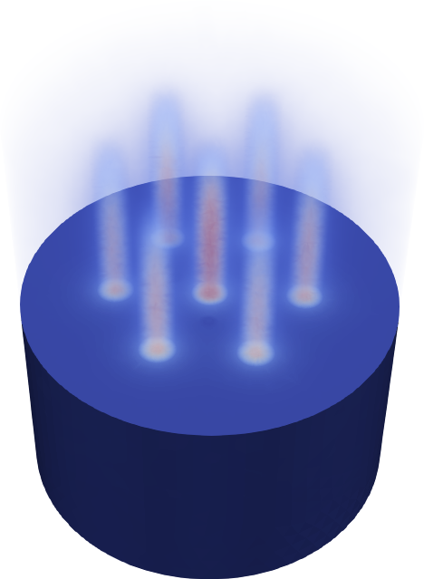
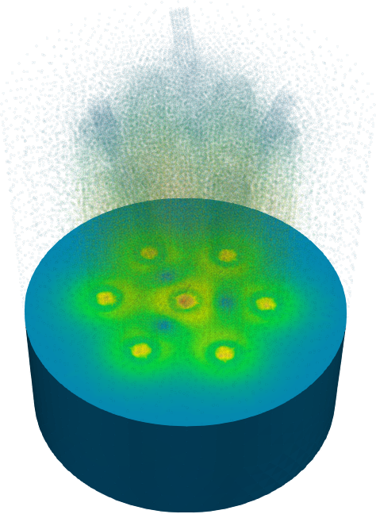

# PHWR de siete canales y tres barras de control inclinadas {#sec-phwr}

> **TL;DR:** Mallas no estructuradas, dependencias espaciales no triviales, escalabilidad en paralelo. Si el problema no "entra" en una computadora, lo podemos repartir entre varias.

En esta última sección del capítulo resolvemos un problema 100% inventado, desde la geometría (@fig-phwr-geo) hasta las secciones eficaces.
La geometría es adimensional "tipo" PHWR con siete canales verticales dentro de un tanque moderador y tres barras de control inclinadas.

::: {.remark}
La tesis de doctorado @haykel trata sobre el modelado de barras de control inclinadas, incluyendo cálculo a nivel de celda y a nivel de núcleo. En el nivel de celda se tiene en cuenta la geometría continua para calcular secciones eficaces macroscópicas. Pero luego estas secciones eficaces son usadas a nivel de núcleo en una malla estructurada obteniendo los mismos dibujos tipo "Lego" que mostramos en la @fig-mallaspce de la @sec-neutronica-phwr.
Este problema propone tener en cuenta la inclinación de las barras en el cálculo de núcleo.
Queda como trabajo futuro el análisis de la forma correcta de generar las secciones eficaces con cálculo a nivel de celda para garantizar la consistencia del esquema de cálculo multi-escala (@sec-multiescala).
:::

Luego, en esta sección las secciones eficaces son, tal como la geometría, 100% inventadas.
Más aún, para el moderador, el invento incluye una dependencia con un perfil (lineal) de la temperatura del moderador en función de la coordenada vertical:

```feenox
Tmod0 = 100
Tmod(z) = 100 + (200-100)*(z/400)
FUNCTION sigmat_mod(T) INTERPOLATION linear DATA {
90  0.108
100 0.112
110 0.116
130 0.118
180 0.120
200 0.122 }

MATERIAL moderator {
  Sigma_t1=0.068
  Sigma_t2=sigmat_mod(Tmod(z))
  Sigma_s1.1=0.06+1e-5*(Tmod(z)-Tmod0)
  Sigma_s1.2=0.002
  Sigma_s2.1=0
  Sigma_s2.2=sigmat_mod(Tmod(z))-0.005
  nuSigma_f1=0
  nuSigma_f2=0
}
```

::: {.remark}
De acuerdo con la idea de evitar complejidad innecesaria, las secciones eficaces de los canales combustibles son uniformes.
Pero en una aplicación real, éstas deberían depender de...

 * el quemado
 * la concentración de venenos
 * la temperatura del combustible
 * la temperatura del refrigerante
 * la densidad del refrigerante
 
Todas estas dependencias se pueden dar en forma similar a la dependencia de las XS del moderador con una mezcla de expresiones algebraicas (@sec-pemdas) e interpolación de funciones dadas por puntos de una o más variables (@sec-funciones).
Incluso se pueden diseñar esquemas de acople con códigos externos e intercambiar información a través de memoria compartida [@vitor;@enief-2013-cpl] o de mensajes MPI.
:::
 
::: {#fig-phwr-geo layout="[40,-15,40]"}
{#fig-phwr-geo1}

{#fig-phwr-geo-cad1}

{#fig-phwr-geo-cad2}

{#fig-phwr-geo-cad3}

Geometría de un PHWR inventado con 7 canales verticales y 3 barras de control
:::


## Difusión con elementos de segundo orden


::: {#fig-phwr-mesh layout="[50,-15,50]"}
{#fig-phwr-mesh1}

{#fig-phwr-mesh2}

{#fig-phwr-mesh3}

{#fig-phwr-mesh4}


Malla con elementos curvos tet10 para el PHWR inventado
:::

Resolvemos primero las ecuaciones de difusión a dos grupos sobre una malla con elementos curvos tipo tet10 (@fig-phwr-mesh).
El archivo de entrada de FeenoX, una vez que separamos la secciones eficaces (y hemos puesto toda la complejidad en la geometría y en la malla) es extremadamente sencillo:

```{.feenox include="phwr-dif.fee"}
```

A dos grupos, la malla de segundo orden resulta en poco más de 250 mil grados de libertad.
Veamos cómo escala FeenoX en términos de tiempo y memoria al resolver este problema con diferente cantidad de procesadores en una misma computadora:

```terminal
$ for i in 1 2 4 8 12; do mpirun -n $i feenox phwr-dif.fee; done
size = 256964   time = 94.6 s    memory = 6.5 Gb
[0/1 tux] local memory = 6.5 Gb
size = 256964   time = 61.5 s    memory = 7.9 Gb
[0/2 tux] local memory = 4.2 Gb
[1/2 tux] local memory = 3.7 Gb
size = 256964   time = 49.7 s    memory = 9.5 Gb
[0/4 tux] local memory = 2.3 Gb
[1/4 tux] local memory = 2.4 Gb
[2/4 tux] local memory = 2.4 Gb
[3/4 tux] local memory = 2.4 Gb
size = 256964   time = 46.2 s    memory = 12.9 Gb
[0/8 tux] local memory = 1.6 Gb
[1/8 tux] local memory = 1.6 Gb
[2/8 tux] local memory = 1.9 Gb
[3/8 tux] local memory = 1.5 Gb
[4/8 tux] local memory = 1.6 Gb
[5/8 tux] local memory = 1.5 Gb
[6/8 tux] local memory = 1.5 Gb
[7/8 tux] local memory = 1.7 Gb
size = 256964   time = 48.8 s    memory = 15.1 Gb
[0/12 tux] local memory = 1.3 Gb
[1/12 tux] local memory = 1.2 Gb
[2/12 tux] local memory = 1.1 Gb
[3/12 tux] local memory = 1.4 Gb
[4/12 tux] local memory = 1.5 Gb
[5/12 tux] local memory = 1.2 Gb
[6/12 tux] local memory = 1.1 Gb
[7/12 tux] local memory = 1.1 Gb
[8/12 tux] local memory = 1.2 Gb
[9/12 tux] local memory = 1.0 Gb
[10/12 tux] local memory = 1.6 Gb
[11/12 tux] local memory = 1.4 Gb
$ 
```

Si bien el tiempo de pared disminuye, no lo hace tanto como debería ya que todavía hay mucho lugar para optimización en FeenoX, especialmente en paralelización por MPI. Pero podemos observar que el comportamiento es esencialmente el esperado.
Más importante aún es el comportamiento de la memoria: a medida que usamos más procesos (o ["ranks"]{lang=en-US} en terminología de MPI), la memoria requerida en cada uno disminuye sensiblemente. Esto implica que FeenoX puede---en principio---resolver problemas arbitrariamente grandes si se dispone de suficientes computadoras que puedan ser interconectadas por MPI, que era una de las premisas de esta tesis.^[Quedan como trabajos futuros el análisis de convergencia de otros pre-condicionadores y el estudio de escalabilidad en paralelo de problemas tipo S_$N$ (@sec-trabajos-futuros}).]
La @fig-phwr-dif muestra la distribución de flujos rápido y térmico resultantes.


::: {#fig-phwr-dif layout="[25,25,25,25]"}
{#fig-phwr-dif-phi1-200}

{#fig-phwr-dif-phi1-300}

{#fig-phwr-dif-phi1-400}

{#fig-phwr-dif-phi1-500}


{#fig-phwr-dif-phi2-200}

{#fig-phwr-dif-phi2-300}

{#fig-phwr-dif-phi2-400}

{#fig-phwr-dif-phi2-500}

Flujos escalares rápido $\phi_1$ y térmico $\phi_2$ calculados con difusión. Todos los combustibles tienen el mismo quemado.
:::


## Ordenadas discretas con elementos de primer orden

Resolvamos ahora el mismo problema pero con ordenadas discretas.
Comenzamos por $S_2$, que involucra ocho direcciones por cada grupo de energías.
Para tener un tamaño de problema comparable utilizamos tetraedros de primer orden.
Estudiemos cómo cambia el tiempo de pared y la memoria con 1, 2, 4 y 8 procesos MPI:

```terminal
$ for i in 1 2 4 8; do mpirun -n $i feenox phwr-s2.fee; done
size = 257920   time = 409.7 s   memory = 20.1 Gb
[0/1 tux] local memory = 20.1 Gb
size = 257920   time = 286.3 s   memory = 25.5 Gb
[0/2 tux] local memory = 11.5 Gb
[1/2 tux] local memory = 14.1 Gb
size = 257920   time = 289.3 s   memory = 29.5 Gb
[0/4 tux] local memory = 7.6 Gb
[1/4 tux] local memory = 6.8 Gb
[2/4 tux] local memory = 7.2 Gb
[3/4 tux] local memory = 8.0 Gb
size = 257920   time = 182.7 s   memory = 33.9 Gb
[0/8 tux] local memory = 4.5 Gb
[1/8 tux] local memory = 4.4 Gb
[2/8 tux] local memory = 4.4 Gb
[3/8 tux] local memory = 4.6 Gb
[4/8 tux] local memory = 4.3 Gb
[5/8 tux] local memory = 4.1 Gb
[6/8 tux] local memory = 3.7 Gb
[7/8 tux] local memory = 4.0 Gb
$ 
``` 

Resolver un problema formulado en S$_N$ es computacionalmente mucho más demandante porque las matrices resultantes no son simétricas y tienen una estructura compleja.
Los requerimientos de memoria y CPU son mayores que para difusión. Incluso la escala de paralelización, aún cuando debemos notar nuevamente que hay mucho terreno para mejorar en FeenoX, es peor que en la sección anterior para un tamaño de problema similar.
El esfuerzo necesario es más marcado mientras mayor sea $N$.
De hecho para una malla más gruesa todavía, dando lugar a un tamaño de problema menor, obtenemos:

```terminal
$ mpiexec -n 1 feenox phwr-s4.fee
size = 159168   time = 390.1 s   memory = 20.0 Gb
[0/1 tux] local memory = 20.0 Gb
$ mpiexec -n 2 feenox phwr-s4.fee
size = 159168   time = 297.6 s   memory = 25.0 Gb
[0/2 tux] local memory = 12.5 Gb
[1/2 tux] local memory = 12.5 Gb
$ mpiexec -n 4 feenox phwr-s4.fee
size = 159168   time = 276.7 s   memory = 27.5 Gb
[0/4 tux] local memory = 7.7 Gb
[1/4 tux] local memory = 6.9 Gb
[2/4 tux] local memory = 6.2 Gb
[3/4 tux] local memory = 6.6 Gb
$ mpiexec -n 8 feenox phwr-s4.fee
size = 159168   time = 153.3 s   memory = 33.7 Gb
[0/8 tux] local memory = 5.0 Gb
[1/8 tux] local memory = 4.7 Gb
[2/8 tux] local memory = 3.2 Gb
[3/8 tux] local memory = 3.5 Gb
[4/8 tux] local memory = 3.5 Gb
[5/8 tux] local memory = 4.8 Gb
[6/8 tux] local memory = 4.8 Gb
[7/8 tux] local memory = 4.3 Gb
$
```

Esto es, para el mismo número de grados de libertad totales el tiempo y memoria necesario para resolver el problema con $S_4$ aumenta.
De todas maneras, lo que sí sigue siendo cierto, como mostramos en la @fig-mpi, es que a medida que aumentamos la cantidad de procesos de MPI la memoria local disminuye.

{#fig-mpi}

Para finalizar, debemos notar que al resolver problemas de criticidad lo que FeenoX hace es transformar la formulación numérica desarrollada en el [capítulo @sec-esquemas] en un problema de auto-valores y auto-vectores generalizado como explicamos en la @sec-multiplicativo-sin-fuente.
Para resolver este tipo de problemas se necesita un [solver]{lang=en-US} lineal que pueda "invertir"^[En el sentido de resolver un problema lineal, no de calcular explícitamente la inversa densa de una matriz rala.] la matriz de fisiones.
Los algoritmos para resolver problemas de  autovalores provistos en la biblioteca SLEPc funcionan significativamente mejor si este [solver]{lang=en-US} lineal es directo. Es conocido que los solvers directos son robustos pero no son escalables. Por lo tanto, los problemas resueltos con FeenoX (usando las opciones por defecto) suelen ser robustos pero no escalan bien (de hecho en la @sec-iaea3d-s4 hemos resuelto un problema de criticidad con un [solver]{lang=en-US} lineal usando opciones en la línea de comandos).
Es por eso también que los problemas sin fuentes independientes son más intensivos computacionalmente que los problemas con fuentes, que pueden ser resueltos como un sistema de ecuaciones lineales (o eventualmente no lineales con un esquema tipo Newton-Raphson).

::: {#tbl-mpi}
Formulación         |   DOFs    |   Problema   |   Build     |   Solve     |   Total     |   Mem.
:-------------------|:---------:|:------------:|------------:|------------:|------------:|------------:
Difusión            |   257k    |   KSP        |     3.5 s   |     5.4 s   |    10.6 s   |    0.6 Gb
                    |           |   EPS        |     6.9 s   |    66.3 s   |    74.7 s   |    6.4 Gb
S$_2$               |   258k    |   KSP        |    30.4 s   |   228.1 s   |   260.0 s   |   17.7 Gb
                    |           |   EPS        |    63.2 s   |   368.6 s   |   432.9 s   |   19.8 Gb
S$_4$               |   159k    |   KSP        |    64.7 s   |   449.1 s   |   514.6 s   |   23.3 Gb
                    |           |   EPS        |   138.9 s   |   598.8 s   |   738.3 s   |   27.0 Gb

: {#tbl-mpi2}

Tiempos necesarios para construir y resolver diferentes formulaciones para casos con fuentes (KSP) o de criticidad (EPS)
:::


En efecto, como vemos en la @tbl-mpi, en el caso de difusión con fuentes independientes, la matriz de rigidez es simétrica y el operador es elíptico.
Esto hace que sea muy eficiente usar un pre-condicionador geométrico-algebraico multi-grilla (GAMG) combinado con un [solver]{lang=en-US} de Krylov tipo gradientes conjugados, tanto en términos de CPU como de memoria. Justamente esa combinación es el _default_ para problemas tipo `neutron_diffusion` en FeenoX.
Por otro lado, al resolver `neutron_sn`, aún para problemas con fuente se necesita un [solver]{lang=en-US} directo ya que de otra manera la convergencia es muy lenta con un impacto directo en la cantidad de memoria necesaria.


::: {.remark}
En la @sec-mms-dif hemos verificado solamente la primera fila de la @tbl-mpi.
:::
