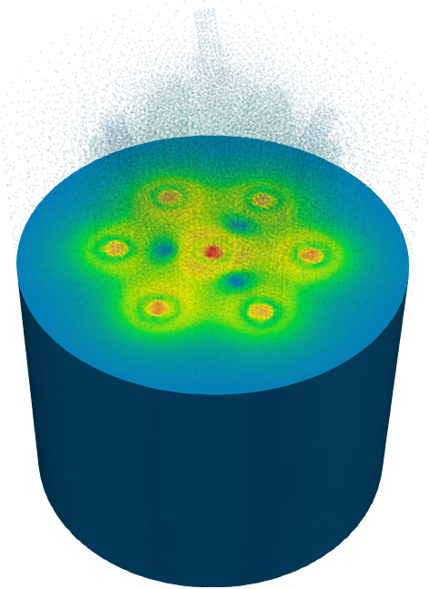
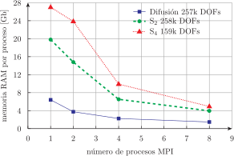

# PHWR de siete canales y tres barras de control inclinadas {#sec-phwr}

> **TL;DR:** Mallas no estructuradas, dependencias espaciales no triviales, escalabilidad en paralelo. Si el problema no "entra" en una computadora, lo podemos repartir entre varias.

En esta último sección del capítulo resolvemos un problema 100% inventado, desde la geometría (@fig-phwr-geo) hasta las secciones eficaces.
La geometría es adimensional "tipo" PHWR con siete canales verticales dentro de un tanque moderador y tres barras de control inclinadas.
De la misma manera, las secciones eficaces con inventandas.
Por ejemplo, para el moderador el invento incluye una dependencia con un perfil (lineal) de la temperatura del moderador en función de la coordenada vertical:

```feenox
Tmod0 = 100
Tmod(z) = 100 + (200-100)*(z/400)
FUNCTION sigmat_mod(T) INTERPOLATION linear DATA {
90  0.108
100 0.112
110 0.116
130 0.118
180 0.120
200 0.122 }

MATERIAL moderator {
  Sigma_t1=0.068
  Sigma_t2=sigmat_mod(Tmod(z))
  Sigma_s1.1=0.06+1e-5*(Tmod(z)-Tmod0)
  Sigma_s1.2=0.002
  Sigma_s2.1=0
  Sigma_s2.2=sigmat_mod(Tmod(z))-0.005
  nuSigma_f1=0
  nuSigma_f2=0
}
```
 
::: {#fig-phwr-geo layout="[40,-15,40]"}
{#fig-phwr-geo1}

{#fig-phwr-geo-cad1}

{#fig-phwr-geo-cad2}

{#fig-phwr-geo-cad3}

Geometría de un PHWR inventado con 7 canales verticales y 3 barras de control.
:::


## Difusión con elementos de segundo orden


::: {#fig-phwr-mesh layout="[50,-15,50]"}
{#fig-phwr-mesh1}

{#fig-phwr-mesh2}

{#fig-phwr-mesh3}

{#fig-phwr-mesh4}


Malla con elementos curvos tet10 para el PHWR inventado
:::

Resolvemos primero las ecuaciones de difusión a dos grupos sobre una malla con elementos curvos tet10 (@fig-phwr-mesh).
El archivo de entrada de FeenoX, una vez que separamos la secciones eficaces (y hemos puesta toda la complejidad en la geometría y en la malla) es extremadamente sencillo:

```{.feenox include="phwr-dif.fee"}
```

A dos grupos, la malla de segundo orden da un poco más de 250k grados de libertad.
Veámos cómo escala FeenoX en términos de tiempo y memoria al resolver este problem con diferente cantidad de procesadores en una misma computadora:

```terminal
$ for i in 1 2 4 8 12; do mpirun -n $i feenox phwr-dif.fee; done
size = 256964   time = 94.6 s    memory = 6.5 Gb
[0/1 LIN54Z7SQ3] local memory = 6.5 Gb
size = 256964   time = 61.5 s    memory = 7.9 Gb
[0/2 LIN54Z7SQ3] local memory = 4.2 Gb
[1/2 LIN54Z7SQ3] local memory = 3.7 Gb
size = 256964   time = 49.7 s    memory = 9.5 Gb
[0/4 LIN54Z7SQ3] local memory = 2.3 Gb
[1/4 LIN54Z7SQ3] local memory = 2.4 Gb
[2/4 LIN54Z7SQ3] local memory = 2.4 Gb
[3/4 LIN54Z7SQ3] local memory = 2.4 Gb
size = 256964   time = 46.2 s    memory = 12.9 Gb
[0/8 LIN54Z7SQ3] local memory = 1.6 Gb
[1/8 LIN54Z7SQ3] local memory = 1.6 Gb
[2/8 LIN54Z7SQ3] local memory = 1.9 Gb
[3/8 LIN54Z7SQ3] local memory = 1.5 Gb
[4/8 LIN54Z7SQ3] local memory = 1.6 Gb
[5/8 LIN54Z7SQ3] local memory = 1.5 Gb
[6/8 LIN54Z7SQ3] local memory = 1.5 Gb
[7/8 LIN54Z7SQ3] local memory = 1.7 Gb
size = 256964   time = 48.8 s    memory = 15.1 Gb
[0/12 LIN54Z7SQ3] local memory = 1.3 Gb
[1/12 LIN54Z7SQ3] local memory = 1.2 Gb
[2/12 LIN54Z7SQ3] local memory = 1.1 Gb
[3/12 LIN54Z7SQ3] local memory = 1.4 Gb
[4/12 LIN54Z7SQ3] local memory = 1.5 Gb
[5/12 LIN54Z7SQ3] local memory = 1.2 Gb
[6/12 LIN54Z7SQ3] local memory = 1.1 Gb
[7/12 LIN54Z7SQ3] local memory = 1.1 Gb
[8/12 LIN54Z7SQ3] local memory = 1.2 Gb
[9/12 LIN54Z7SQ3] local memory = 1.0 Gb
[10/12 LIN54Z7SQ3] local memory = 1.6 Gb
[11/12 LIN54Z7SQ3] local memory = 1.4 Gb
$ 
```

Si bien el "tiempo de pared" disminuye, no lo hace tanto como debería ya que todavía hay mucho lugar para optimización en FeenoX, especialmente en paralelización por MPI. Pero las características básicas están.
Más importante aún es el comportamiento de la memoria: a medida que usamos más procesos (o "ranks" en terminología de MPI), la memoria requerida en cada rank disminuye sensiblemente. Esto implica que FeenoX puede, en principio, resolver problemas arbitrariamente grandes si se dispone de sufientes computadoras que puedan ser interconectadas por MPI, que era una de las premisas de esta tesis.
La @fig-phwr-dif muestra la distribución de flujos rápido y térmico resultantes.


::: {#fig-phwr-dif layout="[25,25,25,25]"}
{#fig-phwr-dif-phi1-200}

{#fig-phwr-dif-phi1-300}

{#fig-phwr-dif-phi1-400}

{#fig-phwr-dif-phi1-500}


{#fig-phwr-dif-phi2-200}

{#fig-phwr-dif-phi2-300}

{#fig-phwr-dif-phi2-400}

{#fig-phwr-dif-phi2-500}

Flujos escalares rápido $\phi_1$ y térmico $\phi_2$ calculados con difusión
:::


## Ordenadas discretas con elementos de primer orden

Resolvamos ahora el mismo problema pero con ordenadas discretas.
Comenzamos por $S_2$, que involucra ocho direcciones por cada grupo de energías.
Para tener un tamaño de problema comparable utilizamos tetrahedros de primer orden.
Estudiemos cómo cambia el tiempo de pared y la memoria con 1, 2, 4 y 8 procesos MPI:

```terminal
$ for i in 1 2 4 8; do mpirun -n $i feenox phwr-s2.fee; done
size = 257920   time = 409.7 s   memory = 20.1 Gb
[0/1 LIN54Z7SQ3] local memory = 20.1 Gb
size = 257920   time = 286.3 s   memory = 25.5 Gb
[0/2 LIN54Z7SQ3] local memory = 11.5 Gb
[1/2 LIN54Z7SQ3] local memory = 14.1 Gb
size = 257920   time = 289.3 s   memory = 29.5 Gb
[0/4 LIN54Z7SQ3] local memory = 7.6 Gb
[1/4 LIN54Z7SQ3] local memory = 6.8 Gb
[2/4 LIN54Z7SQ3] local memory = 7.2 Gb
[3/4 LIN54Z7SQ3] local memory = 8.0 Gb
size = 257920   time = 182.7 s   memory = 33.9 Gb
[0/8 LIN54Z7SQ3] local memory = 4.5 Gb
[1/8 LIN54Z7SQ3] local memory = 4.4 Gb
[2/8 LIN54Z7SQ3] local memory = 4.4 Gb
[3/8 LIN54Z7SQ3] local memory = 4.6 Gb
[4/8 LIN54Z7SQ3] local memory = 4.3 Gb
[5/8 LIN54Z7SQ3] local memory = 4.1 Gb
[6/8 LIN54Z7SQ3] local memory = 3.7 Gb
[7/8 LIN54Z7SQ3] local memory = 4.0 Gb
$ 
``` 

Resolver un problema formulado en S$_N$ es computacionalmente mucho más demandante porque las matrices resultantes no son simétricas y tienen una estructura compleja.
Los requerimientos de memoria y CPU son mayores que para difusión. Incluso la escala de paralelización, aún cuando debemos notar nuevamente que hay mucho terreno para mejorar en FeenoX, es peor que en la sección anterior para un tamaño de problema similar.
El esfuerzo necesario es más marcado para $N$ superiores.
De hecho para una malla más gruesa todavía, dando lugar a un tamaño de problema menor, el tiempo y memoria necesario para resolver el problema con $S_4$ aumenta:

```terminal
$ mpiexec -n 1 feenox phwr-s4.fee
size = 159168	time = 391.0 s	 memory = 20.0 Gb
[0/1 LIN54Z7SQ3] local memory = 20.0 Gb
$ mpiexec -n 2 feenox phwr-s4.fee
size = 159168	time = 337.8 s	 memory = 25.1 Gb
[0/2 LIN54Z7SQ3] local memory = 12.5 Gb
[1/2 LIN54Z7SQ3] local memory = 12.5 Gb
$ mpiexec -n 4 feenox phwr-s4.fee
size = 159168	time = 282.2 s	 memory = 27.5 Gb
[0/4 LIN54Z7SQ3] local memory = 7.7 Gb
[1/4 LIN54Z7SQ3] local memory = 6.9 Gb
[2/4 LIN54Z7SQ3] local memory = 6.1 Gb
[3/4 LIN54Z7SQ3] local memory = 6.8 Gb
$
```

Lo que sí sigue siendo cierto, como mostramos en la @fig-mpi, es que a medida que aumentamos la cantidad de procesos de MPI la memoria local disminuye.

{#fig-mpi}

Para finalizar, debemos notar que al resolver problemas de critidad lo que FeenoX hace es transformar la formulación numérica desarrollada en el @sec-esquemas en un problema de auto-valores y auto-vectores generalizado como explicamos en la @sec-multiplicativo-sin-fuente.
Para resolver este tipo de problemas se necesita un solver lineal que pueda "invertir" la matriz de fisiones.
Por un tema numérico, los algoritmos para resolver problemas de  autovalores provistos en la biblioteca SLEPc funcionan mejor si este solver linea es directo. Es conocido que los solvers directos son robustos pero no escalan bien. Por lo tanto, los problemas resueltos con FeenoX (usando las opciones por defecto) suelen ser robustos pero no escalan bien (de hecho en la @sec-iaea3d-s4 hemos resuelto un problema de criticidad con un solver lineal usando opciones en la línea de comandos).
Es por eso también que los problemas sin fuentes independientes son más intensivos computacionalmente que los problemas con fuentes, que pueden ser resueltos como un sistema de ecuaciones lineales.

::: {#tbl-mpi}
Formulación     |  DOFs   | Problema  |   Build   |   Solve   |   Total   |   Mem.
:---------------|:-------:|:---------:|----------:|----------:|----------:|----------:
Difusión        |  257k   |   KSP     |     3.2   |     7.9   |    12.5   |    0.7
                |         |   EPS     |     6.3   |    87.4   |    95.2   |    6.5
S$_2$           |  257k   |   KSP     |    24.8   |   219.3   |   246.3   |   18.0
                |         |   EPS     |    30.6   |   256.3   |   290.9   |   18.0
S$_4$           |  256k   |   KSP     |    54.3   |   171.8   |   227.1   |   16.3
                |         |   EPS     |           |           |           |     

: {#tbl-mpi2}

Tiempos para construir y resolver diferentes formulaciones para casos con fuentes (KSP) o de criticidad (EPS)
:::


En efecto, en el caso de difusión con fuentes independientes, la matriz de rigidez es simétrica y el operador es elíptico.
Esto hace que sea muy eficiente usar un precondicionador geométrico-algebraico multi-grilla (GAMG) combinado con un solver de Krylov tipo gradientes conjugados, tanto en términos de CPU como de memoria. Justamente esa combinación es el _default_ para problemas tipo `neutron_diffusion` en FeenoX.
Por otro lado, al resolver `neutron_sn`, aún para problemas con fuente se necesita un solver directo ya que de otra manera la convergencia es muy lenta.


::: {.remark}
En la @sec-mms-dif hemos verificado solamente la primera fila de la tabla @tbl-mpi.
:::
