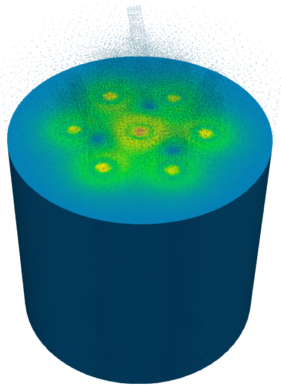

# PHWR de siete canales y tres barras de control inclinadas {#sec-phwr}

> **TL;DR:** Mallas no estructuradas, dependencias espaciales no triviales, escalabilidad en paralelo. Si el problema no "entra" en una computadora, lo podemos repartir entre varias.

En esta último sección del capítulo resolvemos un problema 100% inventado, desde la geometría (@fig-phwr-geo) hasta las secciones eficaces.
La geometría es adimensional "tipo" PHWR con siete canales verticales dentro de un tanque moderador y tres barras de control inclinadas.
De la misma manera, las secciones eficaces con inventandas.
Por ejemplo, para el moderador el invento incluye una dependencia con un perfil (lineal) de la temperatura del moderador en función de la coordenada vertical:

```feenox
Tmod0 = 100
Tmod(z) = 100 + (200-100)*(z/400)
FUNCTION sigmat_mod(T) INTERPOLATION linear DATA {
90  0.108
100 0.112
110 0.116
130 0.118
180 0.120
200 0.122 }

MATERIAL moderator {
  Sigma_t1=0.068
  Sigma_t2=sigmat_mod(Tmod(z))
  Sigma_s1.1=0.06+1e-5*(Tmod(z)-Tmod0)
  Sigma_s1.2=0.002
  Sigma_s2.1=0
  Sigma_s2.2=sigmat_mod(Tmod(z))-0.005
  nuSigma_f1=0
  nuSigma_f2=0
}
```
 
::: {#fig-phwr-geo layout="[40,-15,40]"}
{#fig-phwr-geo1}

{#fig-phwr-geo-cad1}

{#fig-phwr-geo-cad2}

{#fig-phwr-geo-cad3}

Geometría de un PHWR inventado con 7 canales verticales y 3 barras de control.
:::


## Difusión con elementos de segundo orden


::: {#fig-phwr-mesh layout="[50,-15,50]"}
{#fig-phwr-mesh1}

{#fig-phwr-mesh2}

{#fig-phwr-mesh3}

{#fig-phwr-mesh4}


Malla con elementos curvos tet10 para el PHWR inventado
:::

Resolvemos primero las ecuaciones de difusión a dos grupos sobre una malla con elementos curvos tet10 (@fig-phwr-mesh).
El archivo de entrada de FeenoX, una vez que separamos la secciones eficaces (y hemos puesta toda la complejidad en la geometría y en la malla) es extremadamente sencillo:

```{.feenox include="phwr-dif.fee"}
```

A dos grupos, la malla de segundo orden da un poco más de 250k grados de libertad.
Veámos cómo escala FeenoX en términos de tiempo y memoria al resolver este problem con diferente cantidad de procesadores en una misma computadora:

```
$ for i in 1 2 4 8 12; do mpirun -n $i feenox phwr-dif.fee; done
size = 256964   time = 138.8 s   memory = 6.5 Gb
[0/1 LIN54Z7SQ3] local memory = 6.5 Gb
size = 256964   time = 91.1 s    memory = 7.8 Gb
[0/2 LIN54Z7SQ3] local memory = 4.3 Gb
[1/2 LIN54Z7SQ3] local memory = 3.6 Gb
size = 256964   time = 70.6 s    memory = 9.9 Gb
[0/4 LIN54Z7SQ3] local memory = 3.0 Gb
[1/4 LIN54Z7SQ3] local memory = 2.4 Gb
[2/4 LIN54Z7SQ3] local memory = 2.2 Gb
[3/4 LIN54Z7SQ3] local memory = 2.2 Gb
size = 256964   time = 76.1 s    memory = 12.8 Gb
[0/8 LIN54Z7SQ3] local memory = 1.6 Gb
[1/8 LIN54Z7SQ3] local memory = 1.9 Gb
[2/8 LIN54Z7SQ3] local memory = 1.6 Gb
[3/8 LIN54Z7SQ3] local memory = 1.6 Gb
[4/8 LIN54Z7SQ3] local memory = 1.5 Gb
[5/8 LIN54Z7SQ3] local memory = 1.6 Gb
[6/8 LIN54Z7SQ3] local memory = 1.6 Gb
[7/8 LIN54Z7SQ3] local memory = 1.4 Gb
size = 256964   time = 67.4 s    memory = 14.9 Gb
[0/12 LIN54Z7SQ3] local memory = 1.5 Gb
[1/12 LIN54Z7SQ3] local memory = 1.3 Gb
[2/12 LIN54Z7SQ3] local memory = 1.2 Gb
[3/12 LIN54Z7SQ3] local memory = 1.3 Gb
[4/12 LIN54Z7SQ3] local memory = 1.3 Gb
[5/12 LIN54Z7SQ3] local memory = 1.1 Gb
[6/12 LIN54Z7SQ3] local memory = 1.1 Gb
[7/12 LIN54Z7SQ3] local memory = 1.1 Gb
[8/12 LIN54Z7SQ3] local memory = 1.0 Gb
[9/12 LIN54Z7SQ3] local memory = 1.1 Gb
[10/12 LIN54Z7SQ3] local memory = 1.4 Gb
[11/12 LIN54Z7SQ3] local memory = 1.6 Gb
$ 
```

Si bien el "tiempo de pared" disminuye, no lo hace tanto como debería ya que todavía hay mucho lugar para optimización en FeenoX, especialmente en paralelización por MPI. Pero las características básicas están.
Más importante aún es el comportamiento de la memoria: a medida que usamos más procesos (o "ranks" en terminología de MPI), la memoria requerida en cada rank disminuye sensiblemente. Esto implica que FeenoX puede, en principio, resolver problemas arbitrariamente grandes si se dispone de sufientes computadoras que puedan ser interconectadas por MPI, que era una de las premisas de esta tesis.
La @fig-phwr-dif muestra la distribución de flujos rápido y térmico resultantes.


::: {#fig-phwr-dif layout="[25,25,25,25]"}
{#fig-phwr-dif-phi1-200}

{#fig-phwr-dif-phi1-300}

{#fig-phwr-dif-phi1-400}

{#fig-phwr-dif-phi1-500}


{#fig-phwr-dif-phi2-200}

{#fig-phwr-dif-phi2-300}

{#fig-phwr-dif-phi2-400}

{#fig-phwr-dif-phi2-500}

Flujos escalares rápido $\phi_1$ y térmico $\phi_2$ calculados con difusión
:::


## Ordenadas discretas con elementos de primer orden

s2 primer orden
```
Info    : Done meshing 3D (Wall 0.376522s, CPU 0.372091s)
Info    : 16120 nodes 109387 elements
Info    : Writing 'phwr.msh'...
Info    : Done writing 'phwr.msh'
Info    : Stopped on Tue Oct 24 19:45:11 2023 (From start: Wall 0.691222s, CPU 0.684064s)
$ feenox phwr-sn.fee --progress
...........................^Cpid 28350: signal #2 caught, finnishing...
$ for i in 1 2 4 8; do mpirun -n $i feenox phwr-s2.fee; done
size = 257920   time = 415.6 s   memory = 20.1 Gb
[0/1 LIN54Z7SQ3] local memory = 20.1 Gb
size = 257920   time = 294.6 s   memory = 25.6 Gb
[0/2 LIN54Z7SQ3] local memory = 11.4 Gb
[1/2 LIN54Z7SQ3] local memory = 14.1 Gb
size = 257920   time = 295.8 s   memory = 27.7 Gb
[0/4 LIN54Z7SQ3] local memory = 7.5 Gb
[1/4 LIN54Z7SQ3] local memory = 6.4 Gb
[2/4 LIN54Z7SQ3] local memory = 6.9 Gb
[3/4 LIN54Z7SQ3] local memory = 6.9 Gb
size = 257920   time = 208.9 s   memory = 36.6 Gb
[0/8 LIN54Z7SQ3] local memory = 6.0 Gb
[1/8 LIN54Z7SQ3] local memory = 4.9 Gb
[2/8 LIN54Z7SQ3] local memory = 4.5 Gb
[3/8 LIN54Z7SQ3] local memory = 4.0 Gb
[4/8 LIN54Z7SQ3] local memory = 3.7 Gb
[5/8 LIN54Z7SQ3] local memory = 4.3 Gb
[6/8 LIN54Z7SQ3] local memory = 4.4 Gb
[7/8 LIN54Z7SQ3] local memory = 4.8 Gb
$ 
``` 


```
Info    : 3147 nodes 21982 elements
Info    : Writing 'phwr0.msh'...
Info    : Done writing 'phwr0.msh'
Info    : Stopped on Tue Oct 24 20:07:35 2023 (From start: Wall 0.38859s, CPU 0.393357s)
$ Qt: Session management error: networkIdsList argument is NULL
bg
bash: bg: job 1 already in background
$ for i in 1 2 4; do mpirun -n $i feenox phwr-s4.fee; done
```


mostrar que KSP es mucho más barato que EPS
