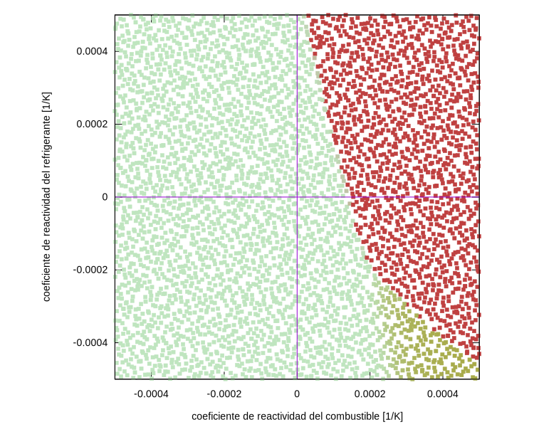

# [Bonus track]{lang=en-US}: cinética puntual* {#sec-cinetica-puntual}

> **TL;DR:** Ilustración del hecho de que FeenoX puede resolver ecuaciones diferenciales ordinarias además de en derivadas parciales.

Además de ecuaciones en derivadas parciales, FeenoX puede resolver sistemas de ecuaciones diferenciales ordinarias y de ecuaciones algebraicas-diferenciales.
En esta sección extra ilustramos rápidamente las funcionalidades, aplicadas a las ecuaciones de cinética puntual de reactores.
Todos los casos usan los siguientes parámetros cinéticos, definido en un archivo `parameters.fee` e incluido en los inputs de cada una de las secciones que siguen:

```{.feenox include="parameters.fee"}
```


## Cinética puntual directa con reactividad vs. tiempo

Este primer ejemplo resuelve cinética puntual con una reactividad $\rho(t)$ dada por una "tabla",^[Recordar que uno de los puntos centrales de la filosofía de diseño de FeenoX es evitar el ambiguo y anacrónico concepto de "tabla" en favor de "función definida por puntos".] es decir, una función de un único argumento (el tiempo $t$) definida por pares de puntos $[t,\rho(t)]$ e interpolada linealmente:

```{.feenox include="reactivity-from-table.fee"}
```

La @fig-reactivity-from-table muestra el nivel de flujo $\phi(t)$ y la reactividad $\rho(t)$ tal como la utilizó FeenoX para resolver el sistema dinámico definido con la palabra clave `PHASE_SPACE` (que es un sustantivo).


{#fig-reactivity-from-table}


## Cinética inversa

Ahora tomamos la salida $\phi(t)$ del caso anterior y resolvemos cinética inversa de dos maneras diferentes:

 1. Con la fórmula integral de la literatura clásica @duderstadt
 
    ```{.feenox include="inverse-integral.fee"}
    ```
    
 2. Resolviendo el mismo sistema de DAEs pero leyendo $\phi(t)$ en lugar de $\rho(t)$

    ```{.feenox include="inverse-dae.fee"}
    ```

Obtenemos entonces la @fig-inverse. El caso 2 es "adaptativo" en el sentido de que dependiendo del error tolerado y de las derivadas temporales de las variables del espacio de las fases en función de $t$, el esfuerzo computacional se adapta automáticamente a través del paso de tiempo $\Delta t$ con el que se resuelve el sistema DAE. Por defecto, el método es Adams-Bashforth de orden variable (implementado por la biblioteca SUNDIALS @sundials), donde justamente el orden de integración se ajusta dinámicamente también dependiendo del error.
    
::: {#fig-inverse layout="[1]"}
![$t \in [0,100]$](inverse.svg){#fig-inverse1}

![$t \in [9.75,10.25]$](inverse-zoom.svg){#fig-inverse2}

Reactividad calculada mediante cinética inversa de dos maneras diferentes
:::
    


## Control de inestabilidades de xenón

Ahora introducimos un poco más de complejidad.
A las ecuaciones de cinética puntual le agregamos cinética de xenón 135. Como el sistema resultante es inestable ante cambios de flujo, la reactividad es ahora una función de la posición de una barra de control ficticia cuya importancia está dada por una interpolación tipo Steffen de su posición adimensional $z$.
Una lógica de control PI (con una banda muerta del 0.3%) "mueve" dicha barra de control de forma tal de forzar al reactor a bajar la potencia del 100% al 80% en mil segundos, mantenerse durante tres mil segundos a esa potencia y volver al 100% en cinco mil:

```{.feenox include="xenon.fee"}
```

La @fig-xenon muestra el flujo y la posición de la barra de control. Se puede observar que la dinámica no es trivial, pero puede ser modelada en forma relativamente sencilla con FeenoX.

{#fig-xenon}


## Mapas de diseño

Finalizamos recuperando unos resultados derivados de mi tesis de maestría @theler2008 publicados en 2010 @stability-nucengdes.
Consiste en cinética puntual de un reactor de investigación con retroalimentación termohidráulica por temperatura del refrigerante y del combustible escrita como modelos de capacitancia concentrada^[Del inglés [_lumped capacitance_]{lang=en-US}.] cero-dimensionales.
El estudio consiste en barrer paramétricamente el espacio de coeficientes de reactividad $[\alpha_c, \alpha_f]$, perturbar el estado del sistema dinámico ($\Delta T_f = 2~\text{ºC}$) y marcar con un color la potencia luego de un minuto para obtener mapas de estabilidad tipo Lyapunov.

```{.feenox include="point.fee"}
```

Para barrer el espacio de parámetros usamos series de números cuasi-aleatorios @halton de forma tal de poder realizar ejecuciones sucesivas que van llenando densamente dicho espacio como ilustramos en la @fig-map:

```{.bash include="point.sh"}
```

```terminal
$ ./point.sh 0 2048
$ ./point.sh 2048 4096
$
```


::: {#fig-map-stability layout-ncol=1}
{#fig-map}

{#fig-ned}

Mapas de estabilidad de cinética puntual con realimentación termohidráulica
:::
