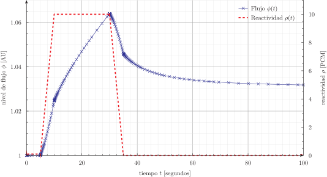
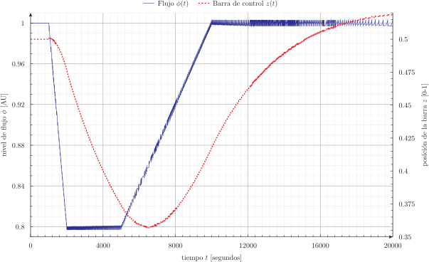
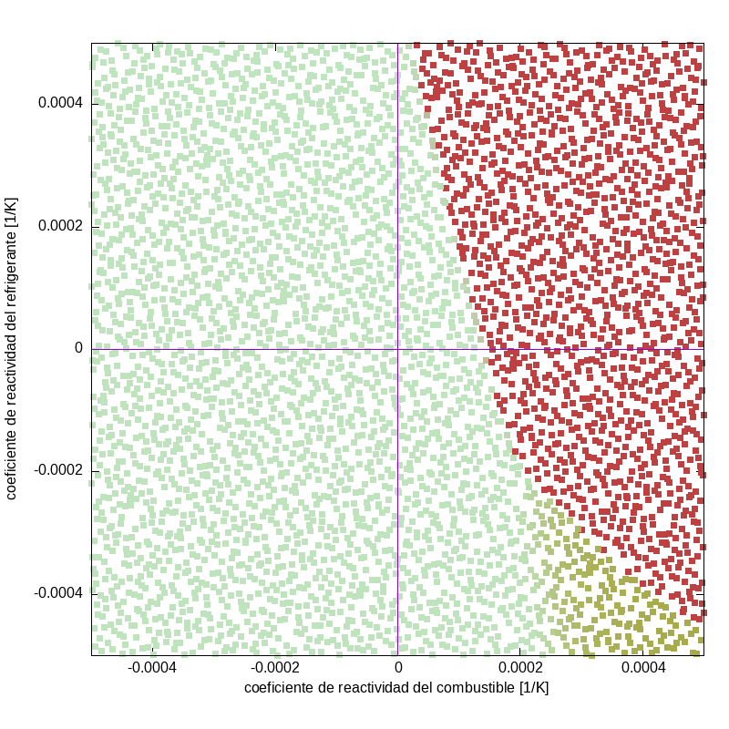

# [Bonus track]{lang=en-US}: cinética puntual* {#sec-cinetica-puntual}

> **TL;DR:** Ilustración del hecho de que FeneoX puede resolver ecuaciones diferenciales ordinarias además de en derivadas parciales.

Además de ecuaciones en derivadas parciales, FeenoX puede resolver sistemas de ecuaciones diferenciales ordinarias y de ecuaciones algebraicas-diferenciales.
En esta sección extra ilustramos rápidamente las funcionalidades.
Todos los casos usan los siguientes parámetros cinéticos:

```{.feenox include="parameters.fee"}
```


## Cinética puntual directa con reactividad vs. tiempo

Este primer ejemplo resuelve cinética puntual con una reactividad $\rho(t)$ dada por una "tabla" (@fig-reactivity-from-table):

```{.feenox include="reactivity-from-table.fee"}
```

{#fig-reactivity-from-table}


## Cinética inversa

Ahora tomamos la salida $\phi(t)$ del caso anterior y resolvemos cinética inversa de dos maneras diferentes:

 1. Con la fórmula integral de la literatura clásica @duderstadt
 
    ```{.feenox include="inverse-integral.fee"}
    ```
    
 2. Resolviendo el mismo sistema de DAEs pero leyendo $\phi(t)$ en lugar de $\rho(t)$

    ```{.feenox include="inverse-dae.fee"}
    ```
    
::: {#fig-inverse layout="[1]"}
![$t \in [0,100]$](inverse.svg){#fig-inverse1}

![$t \in [9.75,10.25]$](inverse-zoom.svg){#fig-inverse2}

Reactividad calculada mediante cinética inversa de dos maneras diferentes
:::
    
    

## Control de inestabilidades de xenón

Ahora introducimos un poco más de complejidad.
A las ecuaciones de cinética puntual le agregamos cinética de xenón 135. Como el sistema resultante es inestable ante cambios de flujo, la reactividad es ahora una función de la posición de una barra de control ficticia cuya importancia está dada por una interpolación tipo Steffen de su posición adimensional $z$.
Una lógica de control PI (con una banda muerta del 0.3%) "mueve" dicha barra de control de forma tal de forzar al reactor a bajar la potencia del 100% al 80% en mil segundos, mantenerse durante tres mil segundos a esa potencia y volver al 100% en cinco mil:

```{.feenox include="xenon.fee"}
```

La @fig-xenon muestra el flujo y la posición de la barra de control. Se puede observar que la dinámica no es trivial, pero puede ser modelada en forma relativamente sencilla con FeenoX.

{#fig-xenon}


## Mapas de diseño

Finalizamos recuperando unos resultados derivados de mi tesis de maestría @theler2008 publicados en 2010 @stability-nucengdes.
Consiste en cinética puntual de un reactor de investigación con retroalimentación termohidráulica por temperatura del refrigerante y del combustible escruta como modelos de capacitancia concentrada^[Del inglés [_lumped capacitance_]{lang=en-US}.] 0-dimensionales.
El estudio de consiste en barrer paramétricamente el espacio de coeficientes de reactividad $[\alpha_c, \alpha_f]$, perturbar el estado del sistema dinámico ($\Delta T_f = 2~\text{ºC}$) y marcar con un color la potencia luego de un minuto para obtener mapas de estabilidad tipo Lyapunov.

```{.feenox include="point.fee"}
```

Para barrer el espacio de parámetros usamos series de números cuasi-aleatorios @halton de forma tal de poder realizar ejecuciones sucesivas que van llenando densamente dicho espacio como ilustramos en la @fig-map:

```{.bash include="point.sh"}
```

```terminal
$ ./point.sh 0 2048
$ ./point.sh 2048 4096
$
```

{#fig-map}


