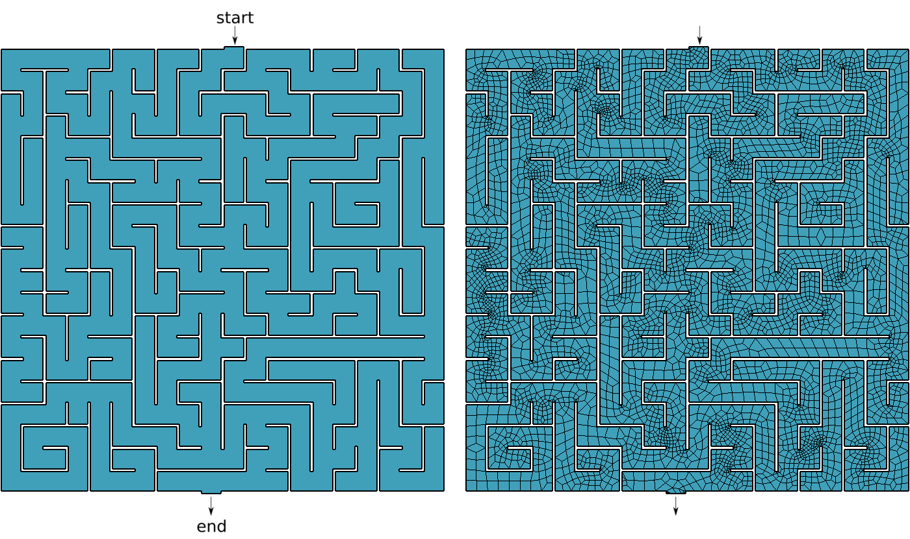
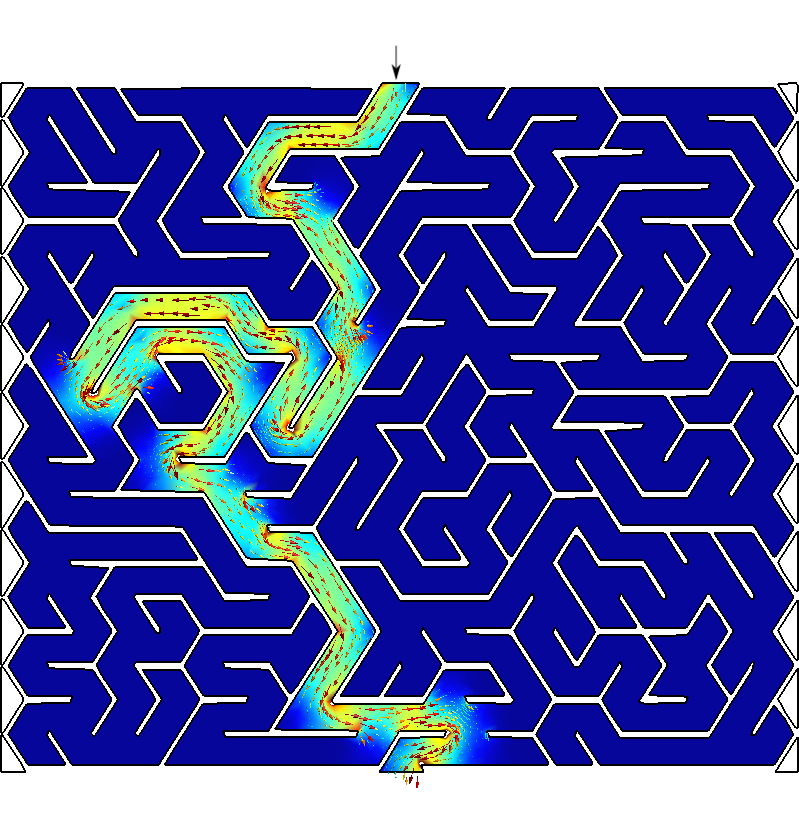
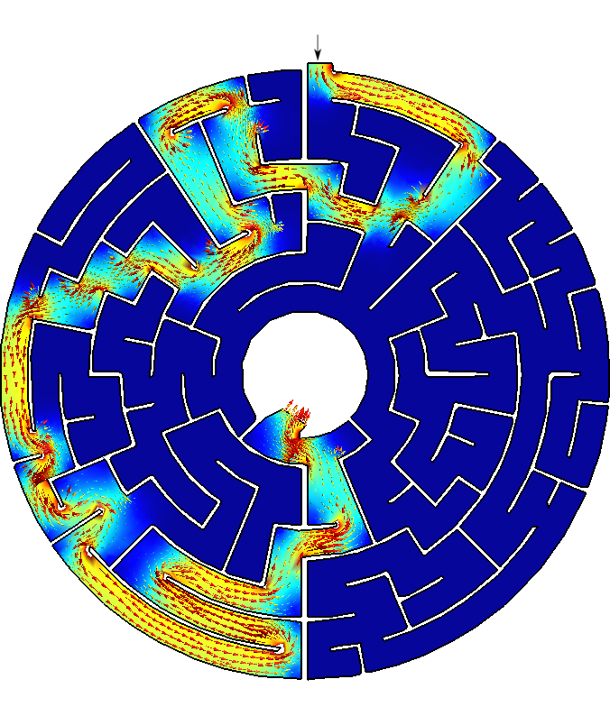
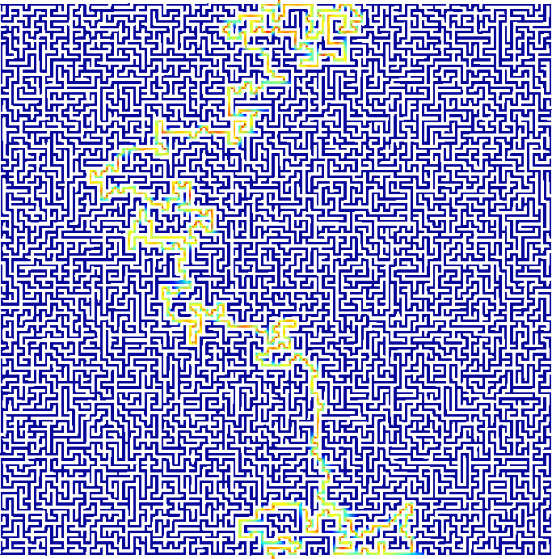

```{=latex}
\label{placemat}
```

{#fig-maze-homer}

Say you are [Homer J. Simpson](https://en.wikipedia.org/wiki/Homer_Simpson) and you want to [solve a maze drawn in a restaurant's placemat while driving to your wife's aunt funeral](https://en.wikipedia.org/wiki/Selma%27s_Choice).
One where both the start and end points are known beforehand as show in @fig-maze-homer. In order to avoid falling into the alligator's mouth, you can exploit the ellipticity of the Laplacian operator to solve any maze (even a hand-drawn one) without needing any fancy AI or ML algorithm. Just FeenoX and a bunch of standard open source tools to convert a bitmapped picture of the maze into an unstructured mesh.


::: {#fig-maze123 layout-ncol=2}
{#fig-maze12 width_html=100% width_latex=95%}

{#fig-maze3 width_html=100% width_latex=47.5%}

Bitmapped, meshed and solved mazes.
:::

1. Go to <http://www.mazegenerator.net/>

 2. Create a maze
 
 3. Download it in PNG (@fig-maze12)
 
 4. Perform some conversions
     - PNG $\rightarrow$ PNM $\rightarrow$ SVG $\rightarrow$ DXF $\rightarrow$ GEO
 
    ```terminal
    $ wget http://www.mazegenerator.net/static/orthogonal_maze_with_20_by_20_cells.png
    $ convert orthogonal_maze_with_20_by_20_cells.png -negate maze.png
    $ potrace maze.pnm --alphamax 0  --opttolerance 0 -b -o maze
    $ .2dxf maze maze.dxf
    $ ./dxf2geo maze.dxf 0.1
    ```
    
 5. Open it with Gmsh 
 
    {width_html=100% width_latex=40%}\ 
 
    - Add a surface
    - Set physical curves for "start" and "end"
    
 6. Mesh it (@fig-maze12)
 
    ```terminal
    gmsh -2 maze.geo
    ```

 7. Solve $\nabla^2 \phi = 0$ with BCs

    $$
    \begin{cases}
    \phi=0 & \text{at “start”} \\
    \phi=1 & \text{at “end”} \\
    \nabla \phi \cdot \hat{\vec{n}} = 0 & \text{everywhere else} \\
    \end{cases}
    $$

    ```{.feenox include="maze.fee"}
    ```
   
    ```terminal
    $ feenox maze.fee
    $
    ```
 
 8. Open `maze-solved.msh`, go to start and follow the gradient\ $\nabla \phi$!


::: {#fig-mazes}

{width=45%}
{width=45%}

{width=45%}
{width=45%}

Any arbitrary maze (even hand-drawn) can be solved with FeenoX
:::


