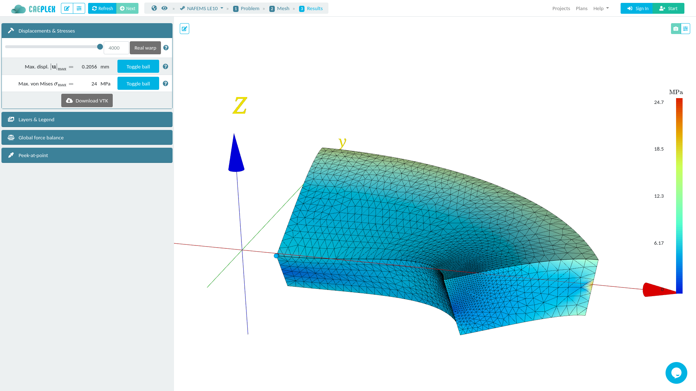

Let us solve the linear elasticity benchmark problem [NAFEMS\ LE10 “Thick plate pressure.”](https://www.seamplex.com/feenox/examples/mechanical.html#nafems-le10-thick-plate-pressure-benchmark) with FeenoX.
Note the one-to-one correspondence between the human-friendly problem statement from [figure @sec-nafems-le10-problem-input] and the FeenoX input file:

{#fig-nafems-le10-problem-input width_html=100% width_latex=100% width_texinfo=15cm} 


```{.feenox include="nafems-le10.fee"}
```

Here, "one-to-one" means that the input file does not need any extra definition which is not part of the problem formulation.
Of course the cognizant engineer _can_ give further definitions such as 

 * the linear solver and pre-conditioner
 * the tolerances for iterative solvers
 * options for computing stresses out of displacements
 * etc.
 
However, she _is not obliged to_ as--at least for simple problems---the defaults are reasonable.
This is akin to writing a text in Markdown where one does not need to care if the page is A4 or letter (as, in most cases, the output will not be printed but rendered in a web browser).

The problem asks for the normal stress in the\ $y$ direction $\sigma_y$ at point\ “D,” which is what FeenoX writes (and nothing else, *rule of economy*):

```terminal
$ feenox nafems-le10.fee 
sigma_y @ D =   -5.38016        MPa
$ 
```

Also note that since there is only one material, there is no need to do an explicit link between material properties and physical volumes in the mesh (*rule of simplicity*).
And since the properties are uniform and isotropic, a single global scalar for\ $E$ and a global single scalar for\ $\nu$ are enough.

{#fig-nafems-le10-sigmay width_html=100% width_latex=70% width_texinfo=12cm}

For the sake of visual completeness, post-processing data with the scalar distribution of $\sigma_y$ and the vector field of displacements $[u,v,w]$ can be created by adding one line to the input file:

```feenox
WRITE_MESH nafems-le10.vtk sigmay VECTOR u v w
```

This VTK file can then be post-processed to create interactive 3D views, still screenshots, browser and mobile-friendly webGL models, etc. In particular, using [Paraview](https://www.paraview.org) one can get a colorful bitmapped PNG (the displacements are far more interesting than the stresses in this problem).

{#fig-nafems-le10-caeplex width_html=100% width_latex=70% width_texinfo=12cm}

